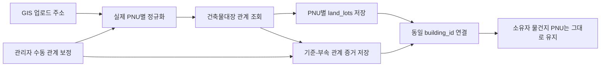

# 건축물대장 기준·부속지번 GIS 자동·수동 연결 설계

- 상태: 구현 준비안 (코드·DB 미변경, 독립 리뷰 완료)
- 작성일: 2026-07-14
- 적용 시점: 조합 시스템관리자의 GIS 정보 업로드
- 구현 범위: `tonghari-api` 수집·연결 로직, `tonghari-web` DB migration·관리자 결과 표시
- 대체 명세: workspace `../docs/superpowers/specs/2026-04-16-building-merge-auto-detect-design.md`
- 코드 대조 리뷰: 17절 참조 (2026-07-14, 운영 DB 제약·migration 이력·과소필지 상호작용 검증 및 수동 보정 흐름 반영)

## 1. 결론

건축물대장의 기준지번과 부속지번은 하나의 PNU로 병합하지 않는다. 건축물대장 API가 실제 부속지번을 누락하거나 잘못 반환한 경우에는 시스템관리자가 GIS 업로드 결과에서 관계를 수동 보정할 수 있으며, 이 보정도 자동 처리와 동일한 비파괴 필지 저장·관계 증거·건물 projection 흐름을 사용한다.

각 실제 필지는 다음과 같이 독립적으로 유지한다.

- `land_lots`: 실제 PNU별 한 행
- `property_units.pnu`: 소유자의 실제 물건지 PNU 유지
- `property_ownerships`: 이동·비활성화하지 않음
- `building_registry_land_lot_relations`: 건축물대장 API 기준·부속 관계의 원천 증거
- `building_land_lot_manual_overrides`: API 누락·오류를 보정한 관리자 판단과 근거
- `building_land_lots`: 기준·부속 PNU를 같은 `building_id`에 연결한 운영 projection

기존 수동 지번 병합 함수는 `property_units.pnu` 변경, 소유관계 이동·비활성화, 물건지 soft delete까지 수행하므로 자동 연결 경로에서 호출하지 않는다.

GIS 화면의 일반적인 "필지 병합"은 실제 합필이 아니라 **기준·부속지번 수동 연결**로 재정의한다. 두 PNU와 소유관계는 그대로 유지하고, 관리자 근거를 관계 테이블에 저장한 뒤 자동 처리와 같은 RPC로 동일 건물에 연결한다. 지적공부상 실제 합필·폐지·PNU 정정은 이번 범위에서 제외하고 별도 후속 명세와 신규 구현으로 분리한다.

현재 `buildings`, `building_external_refs`, `building_land_lots`는 `union_id`가 없는 전역 물리 건물 모델이고 `building_land_lots.pnu`는 전역 unique이다. 이번 기능은 이 모델을 유지한다. 관계 관측과 `land_lots`는 조합별로 격리하지만, 검증된 건물 projection은 전역 물리 사실로 공유한다. 조합별로 다른 건물 매핑이 필요해지는 경우에는 `union_building_land_lots` 도입을 별도 모델 개편으로 다룬다.



## 2. 요구사항과 판정

### 2.1 Source of truth

이번 설계는 다음 근거를 함께 적용한다.

1. Obsidian의 최신 추정분담금·소유자 모델
   - 감정평가 데이터의 물건지 식별 기준은 실제 지번 주소이다.
   - 대표 PNU 재사용으로 발생한 중복은 실제 중복이 아니다.
   - 물건지 식별은 PNU 하나만이 아니라 실제 지번 주소와 동·호 정보를 함께 보존해야 한다.
2. 현재 운영 코드와 DB
   - GIS 업로드는 쉼표로 묶인 지번 셀의 첫 PNU만 저장한다.
   - 조합원 업로드는 누락된 부속 PNU를 대표 PNU로 치환한다.
   - 현재 수동 병합은 건물 연결을 넘어 물건지와 소유관계까지 변경한다.
3. 국토교통부 건축물대장정보 서비스
   - `getBrAtchJibunInfo`가 기준지번과 부속지번을 명시적으로 제공한다.
   - `getBrTitleInfo.bylotCnt`는 외필지수이므로 직접 조회 게이트로 사용할 수 있다.
   - 공공 API 누락·정정 지연 가능성에 대비해, 시스템관리자의 근거 있는 수동 관계를 별도 provenance로 보존해야 한다.

### 2.2 기존 명세와의 충돌 판정

기존 `2026-04-16-building-merge-auto-detect-design.md`는 건물명이 같으면 LLM이 같은 건물로 판단하고 모든 물건지 PNU를 대표 PNU로 변경하도록 설계되어 있다. 이 방식은 다음 이유로 폐기한다.

- retired된 `user_property_units` 모델을 기준으로 한다.
- 공식 관계가 아닌 건물명·본번 유사도로 추정한다.
- 실제 물건지 PNU와 주소를 서로 다르게 만든다.
- 소유권 이동과 물건지 비활성화를 자동 수행한다.
- 현재 추정분담금의 실제 물건지 단위 요구사항과 충돌한다.

새 설계가 기존 자동병합 명세와 조합 임포트의 해당 단계를 대체한다.

## 3. 현재 문제의 정확한 경로

현재 데이터가 대표 PNU로 접히는 과정은 다음과 같다.

1. GIS 엑셀의 `749-36, 749-5` 같은 셀을 하나의 주소 문자열로 API에 전달한다.
2. 주소 파서는 문자열의 첫 지번만 읽어 `749-36` PNU를 만든다.
3. `land_lots`에는 기준 PNU 한 행만 생성되고 주소에는 여러 지번 문자열이 남는다.
4. 조합원 엑셀은 같은 셀을 지번별로 분리하므로 `749-5` 물건지를 별도로 만든다.
5. `749-5` PNU가 `land_lots`에 없으면 `resolveMergedPnu`가 주소 문자열을 검색해 `749-36`으로 치환한다.
6. 결과적으로 `property_address_jibun`은 `749-5`인데 `property_units.pnu`는 `749-36`인 행이 생긴다.

삼양동 운영 데이터에서 확인한 현재 상태는 다음과 같다.

- 쉼표로 합쳐진 기준 필지 그룹: 8개
- 해당 그룹의 부속 PNU: 14개
- DB에 존재하는 부속 `land_lots`: 0개
- 활성 `property_units` 중 `previous_pnu`가 있는 행: 228개
- 알려진 8개 그룹에서 실제 주소 PNU와 저장 PNU가 다른 행: 164개
- `previous_pnu`도 실제 주소와 일치하지 않는 사례가 있어 일괄 복원 기준으로 사용할 수 없음

이 8개/14개는 현재 쉼표 주소에서 추출한 legacy 후보 수치이며 아직 공식 API dry-run으로 확정한 관계 수는 아니다.

따라서 자동 연결은 관계 테이블만 추가하는 것으로 끝나지 않는다. GIS 입력을 실제 PNU별로 펼치고 부속 `land_lots`를 개별 생성하며, 신규 업로드에서 대표 PNU 치환을 중단해야 한다.

## 4. 설계 불변조건

자동 연결의 모든 구현은 다음 조건을 지켜야 한다.

1. 한 실제 필지에는 한 실제 PNU가 유지된다.
2. 기준지번과 부속지번은 같은 건물에 연결될 수 있지만 같은 필지가 되지는 않는다.
3. 자동 연결은 `property_units.pnu`, `previous_pnu`, `property_ownerships`를 변경하지 않는다.
4. 자동 연결은 물건지를 비활성화하거나 soft delete하지 않는다.
5. 건물명, 같은 본번, 인접 번호만으로 관계를 추정하지 않는다.
6. 공식 API가 완전하게 반환한 관계, 이미 저장된 공식 관계 또는 시스템관리자가 근거와 함께 확정한 수동 관계만 사용한다.
7. 부분 응답과 API 실패에서는 기존 관계를 삭제하거나 비활성화하지 않는다.
8. 수동 매핑과 기존 다른 건물 매핑은 자동으로 덮어쓰지 않는다.
9. 관계 관측과 필지 데이터는 `union_id` 범위에서 처리한다. 전역 건물 projection은 공식 근거가 완전하거나 관리자 수동 근거가 확정됐고, 모든 조합의 활성 evidence와 기존 전역 매핑에 충돌이 없을 때만 적용한다.
10. 동일 GIS 작업과 재실행은 멱등적이어야 한다.
11. 수동 보정도 자동 처리와 동일하게 각 PNU를 개별 `land_lots`로 유지하고 `property_units.pnu`, `previous_pnu`, `property_ownerships`를 변경하지 않는다.
12. API의 미관측만으로 수동 관계를 stale 처리하거나 해제하지 않는다. API와 수동 관계가 충돌하면 어느 쪽도 자동 덮어쓰지 않고 시스템관리자 검토로 전환한다.

## 5. 외부 API 계약

공식 서비스: [국토교통부 건축물대장정보 서비스](https://www.data.go.kr/data/15134735/openapi.do)

### 5.1 사용 API

| API | 용도 | 핵심 필드 |
| --- | --- | --- |
| `getBrTitleInfo` | 표제부와 외필지수 확인 | `mgmBldrgstPk`, `bylotCnt`, 기준 지번 필드 |
| `getBrAtchJibunInfo` | 기준·부속지번 관계 조회 | 기준 지번 필드, `atch*` 부속 지번 필드, `mgmBldrgstPk` |
| `getBrExposInfo` | canonical 건물의 전유부 조회 | `mgmBldrgstPk`, 동·호, 면적 |

`getBrAtchJibunInfo`의 요청 검색조건에는 `atchBun`, `atchJi`가 없다. 따라서 기준지번을 알면 직접 조회할 수 있지만 부속지번만 입력된 경우에는 직접 역조회할 수 없다.

### 5.2 PNU 변환

건축물대장 API의 `platGbCd`와 PNU의 토지구분 숫자는 그대로 연결되지 않는다.

| 건축물대장 `platGbCd` | 의미 | PNU 토지구분 |
| --- | --- | --- |
| `0` | 대지 | `1` |
| `1` | 산 | `2` |
| `2` | 블록 | 일반 지적 PNU 생성 불가, 검토 처리 |

기준 PNU와 부속 PNU는 다음 필드를 각각 사용해 19자리로 만든다.

- 기준: `sigunguCd + bjdongCd + platGbCd 변환값 + bun + ji`
- 부속: `atchSigunguCd + atchBjdongCd + atchPlatGbCd 변환값 + atchBun + atchJi`

19자리 숫자, 기준과 부속이 서로 다름, 법정동 코드 유효성을 검증한다.

### 5.3 공통 API 클라이언트 규칙

- HTTPS 사용 (기존 `getBrTitleInfo`·`getBrExposInfo`는 현재 `http`이므로 함께 정리 — 17절 R4)
- `getBrTitleInfo`, `getBrExposInfo`, `getBrAtchJibunInfo` 모든 요청에 PNU 토지구분 `1/2`를 API `platGbCd 0/1`로 변환해 전달
- 요청 timeout 15초
- 최대 3회 재시도, exponential backoff와 jitter 적용
- timeout, 408, 429, 5xx만 재시도
- 인증키·파라미터 오류는 즉시 실패
- `items.item`의 단일 객체/배열 응답을 배열로 정규화
- `totalCount`까지 모든 페이지를 확인
- 정상 0건과 장애로 인한 빈 결과를 구분
- 반환 상태: `SUCCESS`, `EMPTY`, `PARTIAL`, `RETRYABLE_ERROR`, `PERMANENT_ERROR`

## 6. 데이터 모델

### 6.1 API 관계 원천 테이블

`building_registry_land_lot_relations`를 신규 생성한다. 건축물대장 API에서 실제로 관측한 기준 PNU 하나, 부속 PNU 하나, 관리번호 하나를 증거 한 행으로 저장한다. API 관측은 stale 수명주기를 가지므로 관리자 판단과 같은 행에 섞지 않는다.

핵심 컬럼은 `id uuid PRIMARY KEY`, `union_id`, `base_pnu`, `attached_pnu`, 필수 `mgm_bldrgst_pk`, `observation_status`, `projection_status`, `is_active`, 최초·최근 관측 시각, 완전 조회 시각, stale count, 마지막 GIS 작업, 응답 snapshot metadata, `created_at`, `updated_at`이다.

```text
UNIQUE (union_id, base_pnu, attached_pnu, mgm_bldrgst_pk)
CHECK (base_pnu ~ '^[0-9]{19}$')
CHECK (attached_pnu ~ '^[0-9]{19}$')
CHECK (base_pnu <> attached_pnu)
FK (base_pnu, union_id) -> land_lots (pnu, union_id)
FK (attached_pnu, union_id) -> land_lots (pnu, union_id)
FK (last_seen_sync_job_id) -> sync_jobs (id)
INDEX (union_id, attached_pnu) WHERE is_active
```

`observation_status`는 `OBSERVED`, `STALE_CANDIDATE`, `INACTIVE`, `projection_status`는 `PENDING`, `LINKED`, `CONFLICT`, `STALE_REVIEW`로 분리한다. 같은 부속 PNU가 서로 다른 활성 기준 PNU에 관측되면 어느 하나를 선택하지 않고 evidence를 보존한 채 `CONFLICT`로 기록한다.

> FK 대상 검증(2026-07-14, 운영 DB): `land_lots` PK가 `(pnu, union_id)`이므로 위 두 FK는 유효하다. 토대 스키마 생성 이력은 운영 migration history와 Git 과거 이력에 존재하지만, 현재 canonical `supabase/migrations`에서 삭제·누락되어 clean replay가 불가능하다. 17절 R1.

### 6.2 관리자 수동 보정 테이블

`building_land_lot_manual_overrides`를 신규 생성한다. API가 관계를 누락·오류 반환했을 때 시스템관리자가 공급한 판단과 근거를 저장한다. API 미관측으로 자동 stale 처리하지 않으며, 생성과 해제 이력을 삭제하지 않는다.

| 컬럼 | 설명 |
| --- | --- |
| `id` | `uuid PRIMARY KEY`, `gen_random_uuid()` |
| `union_id`, `base_pnu`, `attached_pnu` | 조합 범위의 기준·부속 PNU |
| `override_status` | `ACTIVE`, `REVOKED` |
| `api_alignment_status` | `REVERIFY_PENDING`, `CONFIRMED`, `OMITTED`, `CONTRADICTED` |
| `projection_status` | `PENDING`, `LINKED`, `CONFLICT`, `STALE_REVIEW` |
| `reason_code`, `reason_text` | `API_OMISSION`, `API_ERROR`, `REGISTER_CORRECTION_DELAY`, `OTHER`와 상세 사유 |
| `evidence` | 대장 사본, 현장 확인, 지자체 회신 등 근거 metadata |
| `created_by_user_id`, `confirmed_at` | 등록한 시스템관리자와 확정 시각 |
| `revoked_by_user_id`, `revoked_at`, `revocation_reason` | 명시적 해제 감사정보 |
| `source_sync_job_id`, `last_reverified_at` | 시작 GIS 작업과 마지막 API 재관측 시각 |
| `created_at`, `updated_at` | 생성·상태 갱신 시각 |

```text
CREATE UNIQUE INDEX ...
  ON building_land_lot_manual_overrides (union_id, base_pnu, attached_pnu)
  WHERE override_status = 'ACTIVE';
CHECK (base_pnu <> attached_pnu)
CHECK (reason_text IS NOT NULL AND evidence IS NOT NULL)
FK (base_pnu, union_id) -> land_lots (pnu, union_id)
FK (attached_pnu, union_id) -> land_lots (pnu, union_id)
FK (created_by_user_id) -> users (id)
FK (revoked_by_user_id) -> users (id)
FK (source_sync_job_id) -> sync_jobs (id)
```

`users.id`는 UUID가 아니라 `varchar`이므로 행위자 컬럼도 그 계약을 따른다. 동일 부속 PNU를 서로 다른 기준 PNU에 동시에 수동 등록할 수 있으므로, RPC는 충돌 조회 전에 기준·부속 PNU 전체를 정렬한 전역 advisory lock을 잡는다. 충돌 입력도 감사 evidence로 보존하되 effective projection에는 사용하지 않는다.

### 6.3 projection 감사 이벤트

`building_land_lot_projection_events`를 append-only로 둔다. API 관계 또는 수동 override가 전역 `building_land_lots`에 영향을 준 모든 시도를 기록한다.

- `id uuid PRIMARY KEY`
- `relation_id` 또는 `manual_override_id`
- `union_id`, `pnu`, `action`(`LINK`, `CONFIRM`, `CONFLICT`, `REVOKE`, `STALE_REVIEW`)
- `before_building_id`, `after_building_id`
- `actor_user_id`, `reason`, `sync_job_id` 또는 `request_id`
- `created_at`

`CHECK ((relation_id IS NOT NULL) <> (manual_override_id IS NOT NULL))`, 각 source FK와 actor FK를 적용하고 source row 삭제는 `ON DELETE RESTRICT`로 막는다. `service_role`에도 일반 UPDATE·DELETE 경로를 제공하지 않고 append 전용 RPC만 노출하며, 필요하면 UPDATE·DELETE 방지 trigger를 둔다. 수동 관계 해제나 API 불일치에서도 event만 추가하고 과거 event를 수정·삭제하지 않는다.

### 6.4 건물 연결 provenance

`building_land_lots`는 전역 실제 PNU→물리 건물 projection으로 계속 사용하되 `mapping_source`를 `GIS_DIRECT`, `BUILDING_REGISTER_ATTACHED`, `MANUAL_RELATION`, `LEGACY`로 구분하고 `support_status`(`SUPPORTED`, `CONFLICT`, `STALE_REVIEW`), `last_verified_at`, `last_sync_job_id`를 추가한다.

운영 DB에서 `building_land_lots.pnu`는 `UNIQUE (pnu)`이므로 `ON CONFLICT (pnu)`를 conflict target으로 사용할 수 있다. 이는 SQL conflict target의 유효성만 뜻하며 수동·legacy·다른 건물 충돌 guard를 생략해도 된다는 의미는 아니다(17절 R1).

`mapping_source`는 최초 생성 원인이 아니라 **현재 유효 support**를 나타내고 최초·과거 근거는 projection event가 보존한다. 우선순위는 `BUILDING_REGISTER_ATTACHED > MANUAL_RELATION > GIS_DIRECT > LEGACY`다. 따라서 수동 관계를 API가 나중에 확인하면 `BUILDING_REGISTER_ATTACHED`로 전환하고, 수동 override를 해제해도 동일 API evidence가 남아 있으면 공식 source를 유지한다. 유효 support가 0이면 `building_id`와 마지막 `mapping_source`는 보존하되 `support_status=STALE_REVIEW`로 전환한다.

우선순위가 자동 덮어쓰기를 허용하지는 않는다. 다른 건물을 가리키는 활성 evidence가 있으면 기존 projection을 고정하고 `CONFLICT`로 보낸다. provenance가 없는 기존 행은 보수적으로 `LEGACY`로 backfill한다.

### 6.5 RLS와 권한

- 신규 public 테이블에 RLS를 활성화하고 `anon`의 모든 권한을 회수한다.
- `authenticated` 조회가 필요하면 시스템관리자 SELECT policy와 `GRANT SELECT`를 모두 명시한다.
- 쓰기와 reconcile RPC 실행은 `service_role`만 허용하고 `PUBLIC`, `anon`, `authenticated` EXECUTE를 회수한다.
- 수동 보정 요청은 별도 systemAdmin 서버 경계에서 JWT `auth.uid()` → `user_auth_links` → `users`를 검증해 `SYSTEM_ADMIN`, 미차단 상태, 요청 조합 범위를 확인한다.
- `created_by_user_id`는 클라이언트 입력을 신뢰하지 않고 검증된 서버 세션에서 파생한다.
- 기존 `building_land_lots` 브라우저 직접 쓰기와 service-role 기반 기존 병합 Server Action을 일반 GIS 화면에서 서버 수준으로 차단한다.
- 현재 RLS가 꺼진 `building_external_refs`의 소비자를 점검한 뒤 RLS를 활성화하고 `anon/authenticated` 쓰기 권한을 회수한다.
- FK와 역조회 인덱스를 함께 생성한다.

## 7. GIS 업로드 처리 흐름

현재 주소별로 조회와 저장을 즉시 수행하는 단일 반복문을 다음 단계로 분리한다. API 자동 발견과 관리자 수동 보정은 관계 발견 방식만 다르고, PNU별 필지 수집과 건물 projection은 같은 Phase D·E를 사용한다.

### Phase A. `DISCOVER_PNU`

1. 업로드 셀을 실제 지번 단위로 정규화한다.
2. `749-36, 749-5`처럼 명시된 지번은 주소 접두어를 보존하면서 각각 분리한다.
3. `838-0 외 3필지`처럼 번호가 생략된 값은 기준지번과 기대 외필지수만 기록한다.
4. 각 주소를 PNU로 변환하고 PNU 기준으로 중복 제거한다.
5. 원본 셀, 정규화 주소, PNU, 발견 출처를 작업 항목에 보존한다.

이 단계부터 `land_lots.address`에는 쉼표로 합친 문자열이 아니라 해당 PNU의 단일 지번 주소만 저장한다.

### Phase B. `DISCOVER_ATTACHED_LOTS`

각 고유 PNU에 대해 다음 순서로 관계를 찾는다.

1. 기존 활성 API relation과 manual override를 `base_pnu`와 `attached_pnu` 양방향으로 조회한다.
2. `getBrTitleInfo`의 전체 페이지를 조회해 관리번호별 표제부 snapshot을 만든다.
3. `bylotCnt > 0`인 기준 PNU만 `getBrAtchJibunInfo`로 직접 조회한다.
4. 모든 페이지가 성공하면 `(base_pnu, attached_pnu, mgmBldrgstPk)` relation candidate를 만들고 중복 제거한다. 영속 upsert는 Phase D 이후 공통 PNU lock 안에서 수행한다.
5. `mgmBldrgstPk`별 `bylotCnt`와 같은 관리번호의 distinct 부속 PNU 수를 비교한다.
6. 완전한 관계에서 발견한 기준·부속 PNU를 작업 대상에 추가한다.

완전한 표제부 snapshot에서 이전 관리번호가 사라졌거나 기존 관리번호의 `bylotCnt`가 0으로 바뀌면 해당 관리번호의 부속관계를 “완전한 0건 관측”으로 reconcile한다. 표제부가 부분응답 또는 실패이면 기존 관계의 miss count를 변경하지 않는다.

API가 새 부속 PNU를 반환하면 법정동 코드 역매핑과 지번 필드로 단일 지번 주소를 만든다. PNU와 주소가 검증되면 경계·면적·가격이 아직 없어도 최소 식별 행을 먼저 만들 수 있다. 주소를 검증하지 못하면 임의 placeholder를 만들지 않고 `UNRESOLVED_ATTACHED_PNU`로 남긴다.

발견 깊이는 1로 제한하고 PNU `Set`으로 재귀 호출과 중복 수집을 방지한다.

### Phase C. 부속 PNU만 입력된 역조회

부속지번 요청 파라미터가 없으므로 기준 PNU를 모르는 역조회는 완전성을 보장할 수 없다. `platGbCd`도 기준지번 필터이고, 기준과 부속의 법정동 코드가 다를 수 있다. 최초 구현은 무제한 법정동 sweep을 실행하지 않고 다음 안전 정책을 사용한다.

1. 저장된 활성 관계를 먼저 역조회한다.
2. 관계가 없고 표제부도 없는 PNU만 역조회 대상으로 분류한다.
3. 저장 관계가 없으면 추정 연결하지 않고 `REVERSE_LOOKUP_PENDING`으로 남긴다.
4. 기준지번 또는 형제지번이 같은 업로드에 있어 직접 관계가 확인되면 그 결과로 해소한다.

저장된 evidence가 이후 작업의 positive cache 역할을 한다. 부속 단독 입력을 신규로 역해결해야 한다면 별도 단계에서 시군구 단위 인덱스 또는 공급자 전체 데이터 캐시를 구축한다. 그 단계는 최대 페이지, API 호출 수, 실행시간, 30일 TTL, 중단·재개 checkpoint를 먼저 정의한 뒤 활성화한다.

### Phase C-2. `MANUAL_RELATION_CORRECTION`

API가 실제 부속지번을 누락하거나 잘못 반환하면 시스템관리자는 GIS 업로드 결과 화면에서 **기준·부속지번 수동 연결**을 실행할 수 있다. `REVERSE_LOOKUP_PENDING`, `UNRESOLVED_ATTACHED_PNU`, `CONFLICT`뿐 아니라 API가 잘못 `bylotCnt=0`을 반환해 정상 완료된 필지에도 이 액션을 제공한다. 화면에서 관행적으로 "필지 병합"이라고 부르더라도 다음 동작은 PNU 병합이 아니라 관계 보정이다.

1. 기준 PNU와 하나 이상의 부속 PNU를 선택한다. 아직 `land_lots`에 없는 부속지번도 주소 또는 19자리 PNU로 입력할 수 있다.
2. API 누락·오류 사유와 확인 근거를 필수 입력하고 별도 systemAdmin 서버 경계에서 시스템관리자 권한과 요청 조합을 검증한다. 행위자는 서버 세션에서 파생한다.
3. 원래 GIS 작업을 참조하는 별도 correction run을 만들고 Phase A·D를 재사용해 주소/PNU를 검증한다. 누락된 부속지번은 같은 `union_id`의 `land_lots`에 개별 identity row로 먼저 저장한다.
4. commit 직전에 해당 기준 PNU의 표제부·부속지번 전체 페이지를 다시 조회해 최신 API snapshot과 `api_alignment_status`를 기록한다. 모든 페이지가 `SUCCESS`일 때만 `CONFIRMED`, `OMITTED`, `CONTRADICTED`를 판정하고 `PARTIAL`, timeout, 파싱 오류는 모두 `REVERIFY_PENDING`으로 분류한다.
5. 정렬된 기준·부속 PNU에 advisory lock을 잡고 모든 조합의 활성 API relation·manual override와 전역 `building_land_lots`를 조회한다.
6. 재조회가 `CONFIRMED`이면 API relation을 upsert하고 수동 요청 시도만 감사 event로 남긴다. 별도 ACTIVE override는 만들지 않는다.
7. `OMITTED` 또는 `REVERIFY_PENDING`이면 `building_land_lot_manual_overrides`에 ACTIVE override를 저장한다. `CONTRADICTED`이거나 다른 조합·전역 건물 주장과 충돌하면 override evidence는 보존하되 `projection_status=CONFLICT`로 기록한다.
8. 충돌 없이 effective한 API relation 또는 override만 Phase E 입력으로 넘겨 같은 canonical `building_id`에 연결한다.
9. 이 과정에서 `property_units.pnu`, `previous_pnu`, `property_ownerships`, `land_lots.is_active`를 변경하지 않는다.

API가 이후 다시 조회될 때의 reconciliation은 다음과 같다.

- API가 수동 관계와 일치: API relation을 추가하고 override의 `api_alignment_status=CONFIRMED`로 갱신한다. 수동 감사 이력은 보존하고 projection은 멱등적으로 유지한다.
- API가 해당 관계를 계속 누락: override를 유지하고 `api_alignment_status=OMITTED`만 갱신한다. API relation의 `stale_miss_count`와는 분리한다.
- API가 다른 기준·부속 관계를 반환: 양쪽 evidence를 보존하고 override를 `CONTRADICTED`, projection을 `CONFLICT`로 표시한다. 기존 전역 projection은 검토가 끝날 때까지 고정한다.
- 수동 관계 해제: 시스템관리자의 명시적 해제 사유·행위자·시각을 기록해 `REVOKED`로 만든다. 모든 조합의 남은 supporting evidence를 재평가하고, 동일 API 또는 다른 유효 evidence가 남아 있으면 `mapping_source`를 재계산해 `SUPPORTED`를 유지한다. 유효 support가 0일 때만 건물 projection을 자동 원복하지 않은 채 `STALE_REVIEW`로 보낸다. 기존 `undoMergeForPnu`는 호출하지 않는다.

예시: API가 기준 `749-36`에 대해 `bylotCnt=0`을 반환했지만 관리자가 건축물대장 사본으로 `749-5`가 실제 부속지번임을 확인한 경우, correction run은 `749-36`과 `749-5`를 각각 `land_lots`로 유지하고 manual override를 저장한 뒤 두 PNU만 같은 `building_id`에 연결한다. `749-5` 물건지의 PNU·주소·소유관계는 `749-36`으로 이동하지 않는다.

### Phase D. `COLLECT_LAND_DATA`

명시 입력, API 발견 및 관리자 수동 보정 PNU 모두를 대상으로 다음 데이터를 PNU별로 수집한다.

- 필지 경계
- 토지대장 면적·지목·소유자 수
- 개별공시지가
- 단일 지번 주소와 도로명 주소

`land_lots`는 `(pnu, union_id)`로 각각 upsert한다. 일부 보조 데이터가 실패해도 PNU와 단일 지번 주소가 검증됐으면 nullable 필드는 비워 두고 identity row를 저장하며, 실패 항목은 작업 결과에 남긴다.

### Phase E. `MATERIALIZE_BUILDING_LINKS`

모든 필지 저장이 끝난 뒤 완전한 공식 API 그룹 또는 충돌 없이 확정된 관리자 수동 그룹만 한 번에 투영한다.

1. API 관계는 관리번호별 완전성을 확인하고, 수동 관계는 관리자 근거·행위자·대상 PNU와 충돌 여부를 확인한 뒤 canonical `building_id`를 결정한다.
2. API 관리번호가 하나이면 기준 PNU의 건물을 canonical로 선택하거나 생성한다.
3. 복수 관리번호가 있으면 관리번호별 완전 응답의 정규화된 기준·부속 PNU 집합이 모두 동일한지 확인한다.
4. API 집합이 동일하고 기존 external ref가 서로 다른 내부 건물을 가리키지 않으면 기준 PNU의 canonical 건물 하나를 생성·재사용하고 모든 관리번호를 그 건물의 external ref로 연결한다.
5. 수동 그룹은 기준·부속 PNU의 기존 `building_land_lots`와 최신 기준 PNU 표제부를 조회한다. 기존 canonical 후보가 정확히 1개면 재사용한다. 후보가 0개면 최신 표제부 또는 기존 `GIS_DIRECT` snapshot으로 기준 건물 하나가 식별될 때만 생성하고, 식별 근거가 없으면 `PENDING` 검토로 남긴다. 후보가 2개 이상이거나 부속 PNU에 다른 건물·호실이 이미 연결돼 있으면 호실을 이동하지 않고 `CONFLICT`로 남긴다.
6. API 집합이 다르거나 기존 external ref가 서로 다른 내부 건물을 가리키면 자동 projection하지 않는다.
7. API 관계는 `mgmBldrgstPk`별 표제부·전유부를 canonical 건물에 저장한다. 수동 관계는 API에 없는 건축물 상세를 추정 생성하지 않는다.
8. relation/override 영속화와 projection 직전에 정렬된 PNU 전역 lock 아래 모든 조합의 활성 API relation·manual override와 기존 `building_land_lots`를 다시 확인한다. 다른 관계나 건물이 있으면 현재 조합 evidence만 `CONFLICT`로 기록하고 전역 projection을 변경하지 않는다.
9. 기준과 모든 부속 PNU의 `building_land_lots`를 같은 `building_id`로 upsert한다. API 관계는 `BUILDING_REGISTER_ATTACHED`, 수동 관계는 `MANUAL_RELATION` provenance를 기록한다.
10. source evidence의 영속 upsert, `projection_status=LINKED`, `building_land_lots` upsert와 append-only projection event를 같은 DB transaction에서 원자적으로 기록한다.
11. 기존 매핑이 다른 건물을 가리키면 자동 재배치하지 않고 `CONFLICT`로 남긴다.
12. 필요하면 기존 `linkPropertyUnitsToBuildingUnits`에 `unionId` 인자를 추가하고 쿼리에 `.eq('union_id', unionId)`를 적용한 뒤 동일 건물의 동·호를 연결한다. PNU와 소유권은 변경하지 않는다.

신규 업로드에서는 관계 발견을 건물 저장보다 먼저 수행하므로, 부속 PNU마다 중복 `buildings`가 생성되지 않는다.

관계 upsert는 조합 범위, 건물 projection은 전역 물리 PNU 범위의 원자적 DB RPC로 처리한다. 자동 API relation과 수동 override 모두 요청 조합에 각 PNU의 `land_lots`가 존재하는지 확인한 뒤 같은 정렬 순서로 PNU 전역 advisory lock을 획득하고, evidence 재조회 → source 영속화 → projection → event 기록 순서를 한 transaction에서 수행한다. 웹의 `parcelActions` 병합 함수를 import하거나 복제하지 않는다.

## 8. 멱등성·부분응답·충돌 정책

### 8.1 관계 upsert

API relation은 `(union_id, base_pnu, attached_pnu, mgm_bldrgst_pk)`로 upsert한다. 관리자 override는 활성 `(union_id, base_pnu, attached_pnu)` partial unique index를 사용하며, 같은 pair 재등록은 기존 ACTIVE 행을 반환하고 REVOKED 이력은 보존한다.

- `first_seen_at`은 보존
- `last_seen_at`은 `greatest(existing, excluded)`
- 같은 API 관계는 `is_active=true`로 재확인
- RPC 입력 `run_started_at`이 저장된 `last_applied_run_started_at`보다 과거면 상태·miss count를 변경하지 않음
- API의 `(union_id, base_pnu, mgm_bldrgst_pk)` lock은 페이지 snapshot과 stale 계산을 직렬화하는 보조 lock으로만 사용
- effective relation·override·projection에 영향을 주는 자동·수동 쓰기는 모두 같은 정렬 PNU 전역 lock을 획득
- 공통 lock 안에서 모든 조합 evidence 재조회 → relation/override upsert → projection/event 원자 commit 순서를 적용
- 수동 등록은 lock 안에서 모든 조합의 같은 `attached_pnu` 활성 evidence와 전역 `building_land_lots`를 다시 조회한 뒤 insert

### 8.2 비활성화

같은 `(union_id, base_pnu, mgm_bldrgst_pk)`의 모든 페이지가 성공한 완전 조회에서만 이번에 보이지 않은 기존 API evidence를 stale 후보로 만든다. `building_land_lot_manual_overrides`는 API stale 계산 대상에서 제외한다.

- 부분 응답·timeout·파싱 오류에서는 비활성화 금지
- 1회 누락 즉시 비활성화하지 않음
- 완전 조회 누락마다 `stale_miss_count` 증가
- 첫 누락에서 `stale_candidate_at` 설정
- 2회 연속 완전 조회 누락이고 `stale_candidate_at` 후 7일이 지난 경우에만 비활성화
- 다시 관측되면 `stale_miss_count=0`, `stale_candidate_at=null`, `deactivated_at=null`
- 물건지나 수동 매핑이 연결된 관계는 자동 해제하지 않고 검토 전환

비활성화된 공식 evidence는 child-only positive cache에서 제외한다. 같은 관계를 지지하는 ACTIVE manual override가 있으면 API relation만 `INACTIVE/STALE_REVIEW`로 바꾸고, manual override와 전역 projection은 `LINKED/SUPPORTED`로 유지하며 `mapping_source=MANUAL_RELATION`로 전환한다. 모든 조합에서 유효한 supporting evidence가 0일 때만 전역 projection을 자동 원복하지 않은 채 `support_status=STALE_REVIEW`로 보내 시스템관리자 검토 대상으로 만든다.

### 8.3 건물 충돌

다음은 자동 연결하지 않고 `CONFLICT`로 기록한다.

- 같은 부속 PNU가 여러 기준 PNU에 연결됨
- 복수 `mgmBldrgstPk`가 서로 다른 내부 `building_id`에 매핑되어 canonical 건물을 하나로 증명할 수 없음
- 기존 `MANUAL_RELATION` 매핑이 다른 건물을 가리킴
- 활성 수동 관계와 API가 서로 다른 기준·부속 관계를 주장함
- 기존 `LEGACY` 매핑과 공식 관계의 canonical 건물이 다름
- 관리번호별 외필지수와 같은 관리번호의 완전 응답 distinct 부속 수가 다름
- 블록 지번처럼 PNU를 만들 수 없음

## 9. 기존 병합과 조합원 업로드 처리

### 9.1 자동 경로에서 금지할 함수

- `mergeCurrentPnuIntoLinkedParcel`
- `mergeCurrentPnuIntoBuilding`
- `mergeBuildingIntoPnu`
- `mergeMultiplePnusIntoPnu`
- `mergeDuplicatePropertyUnits`
- `undoMergeForPnu`를 자동 연결의 보상 트랜잭션으로 사용하는 방식
- `useBuildingMatch` 등의 브라우저 `building_land_lots` 직접 upsert

일반 GIS 화면에서는 위 Server Action·hook을 UI에서 숨기는 것만으로 끝내지 않고 이번 release에서 서버 수준으로 호출을 차단한다. 이 함수들은 지적공부상 합필을 검증하는 구현이 아니므로 실제 합필 기능에도 재사용하지 않는다.

### 9.2 수동 UI의 역할 변경

현재 “건물 매칭/지번 병합” UI는 다음처럼 분리한다.

- **기준·부속지번 수동 연결**: 모든 GIS 업로드 결과와 필지 상세에서 실행할 수 있다. API 누락·오류·역조회 대기뿐 아니라 정상 0건 결과에서도 기준 PNU, 부속 PNU 또는 부속지번 주소, 사유, 근거를 입력하고 Phase C-2 → D → E의 공통 RPC를 호출한다.
- **건축물대장 관계 검토**: API 관계, 수동 관계, 충돌 상태와 이력을 조회하고 일치·불일치를 확인한다.
- **건물 직접 매칭**: 이번 release에서 제공하지 않는다. 임의 건물 선택이 필요한 운영 사례는 별도 명세에서 권한·근거·전역 충돌 정책을 정한 뒤 신규 구현한다.
- **실제 합필·폐지·잘못된 PNU 정정**: 이번 release 범위에서 제공하지 않는다. 지적공부 변경 확인, 신규·폐지 PNU, 소유관계 전이와 복구 정책을 별도 명세로 설계하고 신규 구현한다. 기존 병합 함수를 재사용하지 않는다.

따라서 사용자가 일반적으로 말하는 “필지 병합”은 기본 화면에서 기준·부속지번 수동 연결을 뜻한다. 이 기능은 기존 `mergeCurrentPnuIntoLinkedParcel` 또는 `mergeMultiplePnusIntoPnu`를 호출하지 않는다.

### 9.3 `resolveMergedPnu` 폐기

신규 member upload는 주소에서 만든 실제 PNU를 유지한다.

- exact `land_lots`가 없으면 대표 PNU로 치환하지 않음
- 누락 PNU를 `MISSING_LAND_LOT`로 보고하고 GIS 재수집 대상으로 등록
- 건축물 관계는 같은 건물·호실 탐색에만 사용
- 새 자동 연결 출시와 동시에 `resolveMergedPnu`를 제거하거나 feature flag를 끔. 부분실패 때 다시 대표 PNU로 접히는 기간을 허용하지 않음

## 10. 보안 선행조건

현재 웹 Server Action은 JWT를 보내지만 `POST /api/gis/sync`에는 `authMiddleware`가 적용되어 있지 않다. `authMiddleware`는 현재 JWT의 `userId`, `unionId`만 검증하고 역할은 확인하지 않는다. service role로 관계와 건물 projection을 자동 생성하기 전에 다음을 선행한다.

1. `POST /api/gis/sync`, `GET /api/gis/status/:jobId`, 신규 `POST /api/gis/land-lot-relations/manual`, `POST /api/gis/land-lot-relations/:id/revoke`에 `authMiddleware` 적용
2. service-role 조회로 `user_auth_links.auth_user_id = JWT userId`를 따라 `users`를 찾음
3. `users.role = 'SYSTEM_ADMIN'`, `is_blocked IS NOT TRUE`를 확인함
4. 요청 `unionId`가 실제 조합인지 확인하고 JWT `unionId`가 `system` 또는 요청 조합인지 검증함
5. 수동 해제는 body의 `unionId`를 신뢰하지 않고 path의 override `id`로 행을 먼저 조회한 뒤 해당 행의 실제 `union_id`를 권한 범위와 비교함
6. 상태 조회는 메모리 map만 신뢰하지 않고 `sync_jobs.id`, `sync_jobs.union_id`를 조회한 뒤 동일 권한을 적용함
7. 작업의 모든 발견 PNU가 업로드 입력, 공식 API 관계 또는 인증된 수동 입력에서 파생됐는지 감사 정보 보존

GIS 관리 화면은 현재 systemAdmin 전용이므로 최초 구현 권한은 `SYSTEM_ADMIN`으로 제한한다. 조합 관리자에게 직접 개방할 필요가 생기면 `get_user_role_in_union(union_id)`와 동등한 서버 권한 계약을 별도로 추가한다.

## 11. 작업 결과와 관리자 UI

기존 `sync_jobs.status`는 우선 `COMPLETED`, `FAILED`를 유지하고 관계 단계의 부분 성공은 `preview_data.attachedLotSync.status`로 표현한다.

```json
{
  "attachedLotSync": {
    "status": "COMPLETED",
    "relationGroupCount": 8,
    "relationCount": 14,
    "discoveredParcelCount": 14,
    "linkedParcelCount": 22,
    "alreadyLinkedCount": 0,
    "manualRelationCount": 0,
    "manualLinkedCount": 0,
    "manualConflictCount": 0,
    "apiDisagreementCount": 0,
    "reverificationPendingCount": 0,
    "conflictCount": 0,
    "reverseLookupPendingCount": 0,
    "partialGroupCount": 0,
    "apiFailureCount": 0
  }
}
```

`PARTIAL`이어도 정상 저장된 GIS 필지를 실패 처리하지 않는다. 관리자 UI에는 완료 토스트와 함께 자동 연결, 관리자 수동 확정, 신규 발견, 충돌, 역조회 대기, API 실패 건수를 표시한다. 오류·대기 행뿐 아니라 정상 완료 행과 필지 상세에도 “기준·부속지번 수동 연결” 액션을 노출한다.

구조화 로그에는 최소한 다음 필드를 남긴다.

```text
jobId, parentJobId, unionId, phase, scope, relationSource,
relationId, manualOverrideId, basePnu, attachedPnu, mgmBldrgstPk,
action, actorUserId, manualReasonCode, beforeBuildingId, afterBuildingId,
page, attempt, result, errorCode
```

## 12. 구현 범위와 파일

### `tonghari-api`

- `src/services/gis.service.ts`
  - 공통 건축물대장 클라이언트
  - `getBrAtchJibunInfo` 전체 페이지 조회
  - PNU↔`platGbCd` 변환과 응답 정규화
- `src/services/gis.queue.service.ts`
  - 단계별 GIS job
  - 입력 PNU dedupe, API·수동 관계 발견, 대상 확장, 최종 reconcile
- `src/services/supabase.service.ts`
  - 관계 batch upsert와 원자적 projection RPC 호출
- `src/routes/gis.ts`
  - 인증과 조합 권한 검증
- `src/types/gis.types.ts`
  - 단계별 결과, 관계, 오류 코드 타입
- `tests/`
  - API 파서·페이지·큐·멱등성 테스트

### `tonghari-web`

- `supabase/migrations/` (구현 전 migration governance와 로컬·운영 version 정합성 확정 — 17절 R2)
  - 관계 테이블, provenance, RLS, RPC
  - 운영 migration history·Git 과거 이력 기반 토대 baseline 복원과 clean replay 선행 — 17절 R1
- `app/_lib/shared/type/database.types.ts`
  - DB 타입 재생성
- `app/systemAdmin/gis/page.tsx`
  - 자동 연결 결과와 충돌 요약
  - API 누락·오류·역조회 대기의 기준·부속지번 수동 연결 UI
- `app/_lib/features/gis/actions/parcelActions.ts`
  - 일반 “필지 병합”을 비파괴 수동 관계 RPC로 전환
  - 기존 destructive 병합 handler의 일반 GIS 호출 서버 차단
  - 실제 합필·폐지 기능은 별도 후속 명세·신규 구현으로 분리
- `app/_lib/features/gis/api/useBuildingMatch.ts`
  - 브라우저 `building_land_lots` 직접 upsert 제거와 신규 서버 API 호출 전환
- `app/_lib/features/gis/components/ParcelDetailModal.tsx`
  - “흡수·이동” 안내를 “두 필지를 유지하고 동일 건물에 연결”로 변경
- `app/_lib/features/gis/model/parcelMergePreview.ts`
  - 파괴적 이동 preview 제거와 비파괴 변경·불변 항목 preview 추가
- 관련 GIS action·hook·preview 테스트
  - 구 destructive 경로 차단과 신규 수동 relation/override RPC 호출 검증
- `app/systemAdmin/gis/members/`
  - 대표 PNU 치환 제거에 맞춘 누락 필지 보고

## 13. 테스트 설계

### 13.1 단위 테스트

- API `platGbCd 0→PNU 1`, `1→2`, `2→검토` 변환
- PNU 토지구분 `1→API 0`, `2→API 1`을 title/expos/attached 요청 모두에 전달
- `items.item` 단일 객체와 배열 정규화
- `totalCount` 전체 페이지 순회
- `bylotCnt=0`일 때 부속 API 미호출
- `mgmBldrgstPk`별 `bylotCnt`와 distinct 부속 수 비교
- 중복 응답 pair dedupe
- API retry와 오류 분류
- 부분 응답에서 stale 비활성화 금지
- API 미관측이 수동 관계의 stale count를 변경하지 않음
- 수동 관계의 필수 사유·행위자·확정 시각 검증
- API `bylotCnt=0` 정상 응답에서도 수동 보정 preview·commit 가능
- 수동 commit 직전 API 재조회 상태 `CONFIRMED`·`OMITTED`·`CONTRADICTED`·`REVERIFY_PENDING` 분류
- 같은 job 재실행의 upsert 멱등성

### 13.2 통합 테스트

- 기준만 입력과 기준·부속 혼합 입력의 결과 동일
- 부속만 입력은 저장된 공식 관계가 있으면 동일 결과, 관계가 없으면 안전하게 `REVERSE_LOOKUP_PENDING`
- 입력 순서가 바뀌어도 같은 결과
- 각 PNU의 `land_lots` 개별 행 유지
- canonical 내부 건물이 하나로 증명된 그룹의 모든 PNU가 같은 `building_id`에 연결
- 복수 관리번호가 서로 다른 내부 건물을 가리키면 관계만 저장하고 projection은 충돌 처리
- `property_units.pnu`, `previous_pnu`, 활성 소유권 수 불변
- 관계 테이블은 조합별 `land_lots`가 없는 PNU의 생성 차단
- 전역 건물 projection은 다른 조합의 `property_units`를 변경하지 않음
- 수동·legacy 매핑 충돌 시 자동 덮어쓰기 금지
- API 누락 관계를 수동 확정하면 Phase D·E를 거쳐 각 PNU는 유지되고 동일 `building_id`에 연결
- 이후 API가 수동 관계와 일치하면 API evidence만 추가되고 relation/building 중복 없음
- 이후 API가 수동 관계를 계속 누락하면 수동 relation과 projection 유지
- 이후 API가 수동 관계와 다른 관계를 반환하면 자동 재배치 없이 `CONFLICT`
- 수동 관계 해제 시 물건지·소유권·projection 자동 원복 금지, 남은 support가 있으면 `SUPPORTED` 유지하고 0이면 `STALE_REVIEW` 전환
- 다른 조합의 활성 evidence가 같은 PNU에 다른 관계·건물을 주장하면 현재 조합의 전역 projection 금지
- 같은 부속 PNU에 다른 기준 PNU를 동시에 수동 등록해도 전역 lock 안에서 하나로 투영되지 않고 충돌 evidence 보존
- 비시스템관리자·차단 사용자·변조된 `union_id` 수동 요청 거부 및 actor 서버 파생
- 다른 조합의 override `id`와 허용된 조합 `unionId`를 조합한 해제 요청 거부
- projection event UPDATE·DELETE 거부와 source row 삭제 제한
- manual 관계를 API가 확인하면 `mapping_source`가 `BUILDING_REGISTER_ATTACHED`로 전환되고 감사 event는 유지
- API relation이 stale이어도 같은 관계의 ACTIVE manual override가 남으면 projection `SUPPORTED` 유지
- 신규 수동 보정에서 기존 merge Server Action·브라우저 직접 upsert·`undoMergeForPnu` 미호출
- 동일 작업 재실행 시 relation/building/unit 중복 없음

### 13.3 삼양동 회귀 fixture

| 기준지번 | 부속지번 | 관계 수 |
| --- | --- | ---: |
| 749-36 | 749-5 | 1 |
| 760-116 | 760-48, 760-49 | 2 |
| 791-2008 | 791-2009, 791-2770, 791-3706, 791-3713 | 4 |
| 791-2012 | 791-4696 | 1 |
| 791-2121 | 839-329 | 1 |
| 791-3489 | 791-3582 | 1 |
| 791-4143 | 791-3588 | 1 |
| 836-75 | 836-77, 836-78, 836-79 | 3 |

이 표는 legacy 후보 fixture다. 공식 API dry-run이 모두 확인하면 기대 결과는 8개 관계 후보, 14개 기준·부속 pair, 22개 실제 `land_lots`이다. 내부 `buildings` 수는 `mgmBldrgstPk` cardinality와 canonical 판정 후 확정한다.

반례 fixture:

- `745-1`, `745-2`, `745-3`에 공식 또는 관리자 확정 관계가 없으면 세 필지를 독립 유지한다.
- 동일 건물명이나 같은 본번만으로 연결하지 않는다.
- 두 번째 페이지 timeout이면 미조회 관계를 삭제하지 않는다.
- `839-329`만 입력했을 때 기존 relation이 있으면 `791-2121`을 찾고, 없으면 `REVERSE_LOOKUP_PENDING`으로 남긴다.

## 14. 기존 삼양동 데이터 보정

자동 연결 배포와 기존 데이터 복원은 같은 작업에서 암묵적으로 실행하지 않는다.

### Backfill A. 관계와 필지

1. 공식 API dry-run으로 8개 알려진 그룹과 `외 N필지` 그룹을 검증한다.
2. 부속 PNU별 단일 주소와 최소 `land_lots`를 만든다.
3. 공식 evidence를 저장하고 canonical 내부 건물이 하나로 증명된 그룹만 같은 건물에 연결한다. API 누락 관계를 수동 확정해야 하면 자동 backfill과 섞지 않고 건별 근거·행위자·승인을 기록한다.
4. 기준 `land_lots.address`의 쉼표 결합 문자열을 단일 지번으로 정규화한다.
5. 이전 원본 문자열은 migration audit 결과에 보존한다.

### Backfill B. 물건지 PNU

별도 dry-run과 승인을 거쳐 처리한다.

1. `property_address_jibun`에서 실제 PNU를 다시 산출한다.
2. 공식 관계 안의 주소인지 확인한다.
3. unique 충돌, 소유자, 지분, 활성 ownership 수를 검증한다.
4. 검증된 행만 실제 PNU로 정규화한다.
5. `previous_pnu`를 정답으로 일괄 적용하지 않는다.
6. 알려진 164개 관계 mismatch와 나머지 24개 이상 징후를 분리한다.

이 backfill은 추정분담금 템플릿의 “소유자별 실제 물건지” 행을 정상화하기 위한 별도 데이터 교정이다. 관계 자동 연결 자체가 템플릿 행을 합치거나 나누지는 않는다.

## 15. 구현 단계

아래 Phase는 개발 순서다. Phase 1의 identity 보호, Phase 2의 건물 projection, 직접 쓰기 권한 회수와 기존 수동 UI 전환은 하나의 production release gate로 배포한다. 어느 하나만 먼저 운영에 반영하지 않는다.

### Phase 1. 비파괴 기반

- 인증 보강
- 관계 테이블과 RLS
- 건축물대장 API 파서·페이지 처리
- GIS 입력 PNU 정규화와 관계 발견
- `land_lots` 개별 생성
- 관계 upsert와 작업 결과 지표
- 관리자 수동 관계 evidence와 자동 pipeline 재진입 RPC
- `resolveMergedPnu` 비활성화·제거
- 누락 PNU를 GIS 재수집으로 보내는 오류 계약
- 기존 destructive 수동 handler 서버 차단. 실제 합필 기능으로 재사용하지 않음

### Phase 2. 건물 projection

- `building_land_lots` provenance
- canonical building 생성·재사용 RPC
- canonical 내부 건물이 하나로 증명된 공식 API 그룹과 충돌 없는 관리자 확정 그룹을 같은 `building_id`에 연결
- 안전한 시스템관리자 수동 relation RPC와 기존 수동 UI 호출 전환
- `building_land_lots` 브라우저 직접 쓰기 권한 회수
- 충돌 UI와 관리자 결과 표시

### Phase 3. 운영 안정화

- 부속 단독 역조회가 필요할 때 범위 인덱스·TTL cache·checkpoint 추가

### Phase 4. 삼양동 backfill

- 공식 관계 dry-run
- 부속 14개 이상 필지 개별 적재
- 기존 228개 `previous_pnu` 행을 실제 주소 기준으로 분류
- 검증된 물건지만 별도 보정
- 추정분담금 템플릿 행과 권리가액 매칭 재검증

## 16. Acceptance checklist

### 요구사항

- [ ] GIS 업로드 중 건축물대장 API로 기준·부속지번을 자동 발견한다.
- [ ] 명시 입력과 API 발견 부속지번을 실제 PNU별 `land_lots`로 저장한다.
- [ ] canonical 내부 건물이 하나로 증명된 공식 API 그룹 또는 충돌 없는 관리자 확정 그룹의 모든 PNU를 같은 `building_id`에 연결한다.
- [ ] API 누락·오류 관계는 오류 상태뿐 아니라 `bylotCnt=0` 정상 완료를 포함한 모든 GIS 결과에서 시스템관리자가 근거와 함께 수동 확정하고 자동 처리와 동일한 Phase D·E로 연결할 수 있다.
- [ ] 소유자의 물건지 PNU와 실제 지번 주소를 유지한다.
- [ ] `745-1`, `745-2`, `745-3` 같은 비관계 필지를 추정 연결하지 않는다.

### 안전성

- [ ] 자동 경로가 기존 merge 함수를 호출하지 않는다.
- [ ] 일반 “필지 병합” UI가 기존 destructive merge 함수 대신 비파괴 수동 관계 RPC를 호출한다.
- [ ] `property_units`, `property_ownerships`의 행·활성 상태·PNU가 변하지 않는다.
- [ ] 수동·legacy 충돌을 덮어쓰지 않고 관리자 검토로 보낸다.
- [ ] API 누락만으로 수동 관계를 stale 처리하지 않고, API와 수동 관계 불일치는 `CONFLICT`로 보낸다.
- [ ] 조합별 수동 evidence가 다른 조합의 활성 evidence와 충돌하면 전역 `building_land_lots`를 변경하지 않는다.
- [ ] 수동 보정의 행위자는 서버에서 인증된 SYSTEM_ADMIN으로 파생하고 비권한·차단·조합 변조 요청을 거부한다.
- [ ] API 부분응답에서 기존 관계를 비활성화하지 않는다.
- [ ] 관계·필지 쓰기는 인증된 조합 범위, 전역 건물 projection은 service-role RPC와 완전한 공식 근거 또는 확정된 관리자 근거 안에서 수행된다.

### 품질

- [ ] 전체 페이지, 단일 객체 응답, retry, timeout을 테스트한다.
- [ ] 재실행과 입력 순서 변경에도 결과가 동일하다.
- [ ] 삼양동 legacy 후보 8그룹/14 pair/22필지는 공식 API dry-run으로 확인된 항목만 fixture로 확정해 통과한다.
- [ ] 조합 관계 격리, 전역 projection, 수동 관계 등록·재관측·해제·충돌 테스트가 통과한다.
- [ ] 같은 부속 PNU에 대한 동시 수동 등록과 API 재관측 경쟁 테스트가 통과한다.
- [ ] 작업 결과에서 성공·부분·충돌·역조회 대기를 구분할 수 있다.

### 완료 기준

- [ ] API·DB migration·웹 타입·관리자 UI 테스트가 모두 통과한다.
- [ ] 작업 브랜치에 최신 기본 브랜치를 merge한 뒤 회귀 테스트를 다시 통과한다.
- [ ] 신규 GIS 업로드에서 대표 PNU 치환이 더 이상 발생하지 않는다.
- [ ] 삼양동 기존 데이터 보정은 별도 dry-run 보고와 승인 후 실행한다.

## 17. 코드 대조 리뷰 반영 (2026-07-14)

이 절은 설계를 현재 `tonghari-api`·`tonghari-web` 코드와 `tonghari_prod` 운영 DB에 대조한 결과와, 구현 착수 전 반영할 항목을 기록한다.

### 17.1 근거 주장 검증 (코드 확인 완료)

설계가 근거로 삼은 아래 사실은 모두 코드에서 확인했다.

| 주장 | 위치 |
| --- | --- |
| `POST /api/gis/sync` 무인증 (형제 sync 라우트는 `authMiddleware` 적용) | `tonghari-api/src/routes/gis.ts:14` |
| 관련 병합·건물 이동·복원 함수 6종 존재 | `tonghari-web/.../gis/actions/parcelActions.ts` `mergeDuplicatePropertyUnits`(116), `mergeCurrentPnuIntoLinkedParcel`(842), `mergeCurrentPnuIntoBuilding`(957), `mergeBuildingIntoPnu`(1046), `mergeMultiplePnusIntoPnu`(1218), `undoMergeForPnu`(1344) |
| `resolveMergedPnu`의 대표 PNU 치환 | `tonghari-api/src/services/member.queue.service.ts:991` |
| `linkPropertyUnitsToBuildingUnits` | `tonghari-api/src/services/supabase.service.ts:1076` |
| `getBrTitleInfo`·`getBrExposInfo` 기구현, `getBrAtchJibunInfo` 신규 | `tonghari-api/src/services/gis.service.ts:770,798` |
| `building_land_lots`는 `union_id` 없는 전역 모델 (`building_id`, `pnu`, `note`, `previous_building_id`) | `database.types.ts` |

### 17.2 R1. 토대 테이블 제약 — 운영 DML 전제 확인, clean replay 미해결

현재 canonical `supabase/migrations/`에는 `buildings`, `building_land_lots`, `building_external_refs`의 토대 CREATE가 없지만 운영 `supabase_migrations.schema_migrations`에는 `create_buildings_table`(20260102050450), `create_building_land_lots`(20260112023915), `merge_union_land_lots_into_land_lots_v2`(20260113075344), `create_building_external_refs`(20260504054553) 이력이 남아 있고, 각 레코드의 `statements` 컬럼에 실제 적용 DDL이 그대로 보존돼 있다. 파일 관점에서는 `building_external_refs`만 과거 `081_create_building_external_refs.sql`로 커밋됐다가 제거됐고, `buildings`·`building_land_lots`·`merge_union_land_lots` 3건은 MCP `apply_migration`으로 직접 적용돼 리포에 파일로 커밋된 적이 없다. 즉 “운영 DB에만 존재(RLS 헬퍼 함수와 동일한 미버전관리)”가 아니라, 정식 이력·DDL은 있으나 현재 canonical checkout에 baseline 파일이 부재한 상태다. 운영 DB `pg_constraint` 조회 결과:

| 테이블 | 제약 | 정의 |
| --- | --- | --- |
| `building_land_lots` | `building_land_lots_pnu_unique` | `UNIQUE (pnu)` |
| `land_lots` | `land_lots_pkey` | `PRIMARY KEY (pnu, union_id)` |
| `building_external_refs` | `building_external_refs_source_external_pnu_key` | `UNIQUE (source, external_id, pnu)` |
| `buildings` | `buildings_pkey` | `PRIMARY KEY (id)` |

판정:

- Phase E의 `building_land_lots` `ON CONFLICT (pnu)` conflict target 전제(전역 pnu unique)는 **성립한다**. 의미적 안전성은 수동·legacy·다른 건물 충돌 guard와 advisory lock을 별도로 통과해야 한다.
- 6.1절 FK `(base_pnu, union_id) → land_lots(pnu, union_id)`는 `land_lots` PK를 참조하므로 **유효하다**.
- 잔여 구현 blocker: 현재 checkout은 토대 baseline이 없어 `supabase db reset`으로 재현되지 않아 신규 관계 테이블 FK가 로컬/CI에서 실패한다. 손으로 쓴 `CREATE TABLE IF NOT EXISTS`는 기존 컬럼·제약·RLS 차이를 조용히 스킵해 로컬만 divergent해지므로 금지한다. 권장 복구: `schema_migrations.statements`의 실제 DDL을 동일 version token으로 추출(또는 `supabase db pull`)해 canonical 파일로 커밋하고 신규 관계 마이그레이션보다 먼저 적용한다. 착수 차단 등급 상세는 [18절 B2] 참조.

### 17.3 R2. 마이그레이션 governance — 구현 전 확정 필요

`.claude/rules/migrations.md`는 `NNN_` 형식을 규정하고 날짜 prefix를 금지하지만, 현재 `supabase/migrations/`에는 `NNN_` 44개와 timestamp 29개가 혼재한다. 최근 migration도 숫자·timestamp가 섞여 있으며, MCP `apply_migration`으로 적용된 운영 version은 로컬 파일 timestamp와 일치하지 않는 사례가 확인됐다.

따라서 신규 migration 형식을 이 문서에서 임의로 확정하지 않는다. 구현 전에 다음 중 하나를 선택하고 저장소 규칙과 검증 절차를 함께 갱신한다.

1. Supabase 표준 timestamp migration과 `db push`를 사용해 로컬 파일 version과 운영 `schema_migrations.version`을 일치시킨다.
2. MCP `apply_migration`을 유지하되 적용 후 운영 version과 로컬 history를 동기화하고 migration parity를 검증하는 절차를 정의한다.

현재 checkout에는 Supabase CLI와 `supabase/config.toml`도 없으므로 baseline 복원과 함께 clean reset/list 검증 환경을 먼저 마련한다.

### 17.4 R3. 운영 중인 `minor-parcel-phase1`(과소필지)과의 상호작용

`minor-parcel-phase1` 관련 마이그레이션은 이미 기본 브랜치와 운영 DB에 반영돼 있다. `building_land_lots` projection만으로 과소필지 판정이 바뀌지는 않지만, Phase E가 선택적으로 `linkPropertyUnitsToBuildingUnits`를 호출해 `property_units.building_unit_id`를 재연결하면 `evaluate_minor_parcel_phase1_json`의 건축물 상태가 `CONFIRMED_NONE`에서 `PRESENT`로, 대상 판정이 `CANDIDATE`에서 `NOT_REVIEW_TARGET`으로 바뀔 수 있다.

연결 함수(`supabase.service.ts:1076`)는 현재 `.in('pnu', pnus).eq('is_deleted', false)`로만 조회하고 `.eq('id', row.id)`로 갱신해 `union_id` 스코프가 전혀 없다. tonghari-api는 Service Role로 RLS를 우회하고 운영 DB에 이미 복수 조합이 공유하는 PNU가 존재하므로, 기존 APT-PRICE 경로(`gis.queue.service.ts:870`)까지 포함한 실재 cross-union 오염 위험이다(착수 차단 등급, [18절 B3] 참조). `union_id` 범위를 필수로 추가하고 다음 전이를 통합 테스트로 고정한다.

- 유효한 공식 또는 관리자 확정 연결이고 다른 검토 사유가 없으면 `CONFIRMED_NONE/CANDIDATE → PRESENT/NOT_REVIEW_TARGET`
- 공동소유·다물건·미확정 권리가액 등 다른 검토 사유는 `REVIEW_NEEDED` 유지
- 관계 없는 토지 물건지와 다른 조합의 `property_units`는 불변

### 17.5 R4. 기존 건축물대장 호출 HTTP → HTTPS 정리

5.3절의 HTTPS 규칙과 달리 기존 `getBrTitleInfo`·`getBrExposInfo` 호출은 `http://apis.data.go.kr/...`을 사용한다(`gis.service.ts:770,798`). 신규 `getBrAtchJibunInfo`를 HTTPS로 추가하면서 기존 두 호출도 HTTPS로 통일한다. `apis.data.go.kr`(BldRgstHubService 포함)은 HTTPS를 지원하므로 세 호출 전환에 기술적 제약은 없다.

## 18. 설계 재검토 결과 — Blocker/High (2026-07-14, 다차원 리뷰)

17절 R1~R4가 이 문서 반영의 사실 오류를 교정한 것이라면, 이 절은 설계 **내용 자체**를 데이터모델·동시성/멱등·보안RLS·마이그레이션/배포·외부API·크로스도메인 6개 축으로 병렬 재검토한 결과다(각 항목 운영 DB·코드 대조).

**판정: 수정 필요.** 아래 BLOCKER 3건은 착수 전 설계 보완 없이 구현하면 멀티테넌시 격리 위반·중복 건물·로컬/CI 재현 불가를 초래한다.

### 18.1 BLOCKER (착수 차단)

**B1 — 동시성: projection 잠금이 기존 무잠금 `upsertBuilding`(GIS_DIRECT)를 직렬화하지 못함**
Phase E 관계 projection RPC는 정렬 PNU에 advisory lock을 걸지만, 기존 GIS_DIRECT 경로(`saveBuildingWithUnits → upsertBuilding`, `supabase.service.ts:432-514`)는 잠금 없이 `building_land_lots(pnu)` 읽기→`buildings` INSERT→`ON CONFLICT(pnu)` upsert를 수행한다. advisory lock은 모든 writer가 획득해야 배타성이 성립하므로, 무잠금 writer가 잠금 RPC와 같은 PNU를 경합하면 양쪽이 각각 `buildings`를 INSERT(무작위 uuid PK, 충돌 없음)한 뒤 하나만 매핑에 남고 나머지가 고아가 된다. 큐는 concurrency:2에 조합별 직렬화·in-flight dedup이 없다(`gis.queue.service.ts:93`, `routes/gis.ts:14`). 운영 DB에 이미 고아 building 20/1770건, 복수 조합 공유 PNU 1079개. 불변식 10(멱등)은 실제로 성립하지 않는다.
→ `buildings`/`building_land_lots`의 **모든 쓰기**(GIS_DIRECT 포함)를 단일 잠금 RPC로 통합하거나 `upsertBuilding`도 동일 `pg_advisory_xact_lock(hashtext(pnu))`를 read-check-create 트랜잭션 내에서 획득. §7에 "잠금 RPC 밖에서 두 테이블을 쓰는 경로 없음" 명문화.

**B2 — 마이그레이션: 토대 baseline 부재로 신규 FK가 `db reset`/CI에서 실패**
canonical `supabase/migrations`에 `land_lots`(v2)·`buildings`·`building_land_lots`·`building_external_refs` CREATE가 없어, 신규 관계 마이그레이션의 FK가 fresh reset에서 "relation ... does not exist"로 전체 실패한다 → §16 완료 게이트(마이그레이션 테스트 통과)를 로컬에서 충족 불가. 문서가 한때 제안한 손수 `CREATE TABLE IF NOT EXISTS` 부트스트랩은 R1이 확인한 안티패턴(운영과 drift 시 조용히 스킵 → 로컬만 divergent).
→ `schema_migrations.statements`의 실제 DDL을 동일 version token으로 canonical 복원(또는 `supabase db pull`)해 신규 관계 마이그레이션보다 먼저 커밋. **Phase 1 하드 선행조건**(§12·§17.2 반영, "선행 검토" 아님).

**B3 — 크로스도메인/멀티테넌시: Phase E step 10이 `union_id` 스코프 없이 타 조합 `property_units`를 갱신**
step 10이 재사용하는 `linkPropertyUnitsToBuildingUnits`(`supabase.service.ts:1084-1088,1114-1117`)는 `.in('pnu', pnus).eq('is_deleted', false)`로만 조회하고 `.eq('id', row.id)`로 갱신한다. 전역 building PNU를 공유하는 **모든 조합**의 `property_units.building_unit_id/dong/ho`를 교차 기록 → §4 불변식 9 위반. `evaluate_minor_parcel_phase1_json`이 `building_unit_id`를 읽으므로 타 조합 과소필지 판정까지 뒤바뀐다. 운영 확인: PNU `1130510100107450062`가 2개 조합에 존재. **이 경로는 기존 APT-PRICE(`gis.queue.service.ts:870`)로 이미 라이브**이며 Phase E가 표면을 넓힌다.
→ step 10의 "필요하면" 삭제 → `unionId` 필수화, 모든 호출자(`supabase.service.ts:1175,1499`, `gis.queue.service.ts:870`)에 스레드. 통합 테스트에 "A조합 실행이 B조합 `property_units` 불변" assert(기존 버그도 이 릴리스에서 함께 닫음).

### 18.2 HIGH

| # | 축 | 결함 | 조치 |
| --- | --- | --- | --- |
| H1 | 데이터모델 | 전역 `building_land_lots` `ON CONFLICT(pnu)`에 cross-union/동일우선순위 guard 없음 → 한 조합 실행이 타 조합 projection을 조용히 재지정(building_id·provenance churn). 공유 PNU 행 753/1765. | auto-vs-auto에서 기존 `building_id`와 다르고 어느 쪽도 MANUAL이 아니면 덮어쓰지 말고 `CONFLICT`(MANUAL/LEGACY guard 확장). |
| H2 | 동시성 | projection lock 키는 전역 `pnu`-only여야 하나 §8.1 문서화 lock은 `union_id` 포함 → 그대로 복사 시 두 조합이 다른 lock을 잡아 중복 건물 레이스. | projection은 `pg_advisory_xact_lock(hashtext(pnu))`(union 무관), 관계 upsert만 union 범위 lock으로 명시 구분. |
| H3 | 보안 | §10 인증이 `/sync`·`/status`만 커버. 형제 `/add-address`(gis.ts:284)·`/manual-add`(gis.ts:407)는 무인증 service-role 쓰기 → 임의 조합 `land_lots` 오염(신규 관계 FK 앵커). | 모든 변경 gis 라우트로 `authMiddleware`+SYSTEM_ADMIN+unionId 일치 확대. |
| H4 | 보안 | §6.5 잠금 대상이 `building_land_lots`·`building_external_refs`뿐인데 `buildings`·`building_units`도 any-union-ADMIN 정책+동일 브라우저 훅(`useBuildingMatch.ts`)에서 씀. `building_external_refs`는 **현재 RLS OFF+anon DML(지금 anon 쓰기 가능)**. | `building_*` 패밀리 일괄 잠금 + `useBuildingMatch.ts`(199 upsert/306 delete) RPC 이관. `building_external_refs` RLS 활성화·anon 회수. |
| H5 | 외부API | §5.3 SUCCESS/EMPTY가 HTTP status 기준. data.go.kr은 오류를 HTTP 200+`resultCode`로 반환 → throttle(22)를 "정상 0건"으로 오독 → §8.2 오비활성화(자기유발 데이터 손실). | `header.resultCode` 파싱을 1차 성공 신호로: `00`+items=SUCCESS, `03`/무items=EMPTY, `22`=RETRYABLE, `20/30/31/32`=PERMANENT. §8.2 "완전 조회"를 "모든 페이지 resultCode 00"으로 재정의. |
| H6 | 배포 | §15 "단일 릴리스 게이트"가 실제로는 독립배포 2개 repo+공유 prod DB 수동 적용 → 원자적 불가. RLS 활성화·직접쓰기 REVOKE(되돌리기 어려움)를 양 repo 전환 전 적용하면 관리자 GIS 쓰기 중단. | 적용 순서 명시: ① additive 마이그레이션 → ② api RPC 배포 → ③ web RPC 경로 전환 → ④ 최후 RLS/REVOKE. |
| H7 | 크로스도메인 | "property_units 불변" 주장 불완전 — step 10이 `building_unit_id/dong/ho`를 실제 변경(과소필지 판정 입력)하는데 §4 불변식·§13.2·§16은 `pnu/previous_pnu/ownership`만 검사 → 잘못된 building_unit_id 회귀가 테스트를 통과. | 세 컬럼을 불변식·테스트에 추가(타 조합 불변 + dong/ho 매칭으로만 변경). §16 "property_units 불변" 문구 수정. |

### 18.3 MEDIUM/LOW (요약)

- **positive-cache 누수(M)**: 역조회/캐시가 `WHERE is_active`만 사용 → `CONFLICT`/`STALE_REVIEW` 행이 `is_active`로 남으면 자동 해소에 누수. predicate를 `is_active AND status NOT IN (CONFLICT,STALE_REVIEW)`로.
- **UNRESOLVED 저장 불가(M)**: 부속 FK 때문에 land_lots 없는 미해소 부속 관계를 관계 테이블에 넣을 수 없어 positive cache 불완전 → 미해소 관계 저장소/nullable soft ref 분리, mermaid 병렬 저장 순서 정정.
- **projection 단조 guard 부재(M)**: §8.1 `run_started_at` guard가 관계에만 적용 → 지연/재시도 job이 projection `last_verified_at`을 역행. projection upsert에도 GREATEST 적용.
- **stale vs 200-OK 0건(M)**: totalCount가 이전 nonzero→0으로 떨어진 경우 의심 처리(독립 스캔 재확인, projection 백킹 관계는 더 긴 윈도우). deactivation/reconcile도 §8.1 advisory lock 하에서.
- **bylotCnt 게이트 false-zero(M)**: bylotCnt null/누락 시 부속 API 미호출로 실관계 누락. 명시 숫자 0만 skip, null은 호출. distinct 비교는 블록/self 제외.
- **역조회 완결성 구멍(M)**: 자체 표제부를 가진 부속-only PNU가 독립 base로 분류돼 signal 없이 누락. `REVERSE_LOOKUP_PENDING`/검토 flag 유지.
- **platGbCd 요청동작 변화(L)**: 기존 호출은 platGbCd 미전송 → 명시 전송으로 대지 결과가 바뀔 수 있어 회귀 확인. 신규 클라이언트에 408 재시도 포함(기존 `isRetryableVworldError`는 408 제외).
- **service_role EXECUTE(L)**: §6.5 REVOKE 후 `GRANT EXECUTE ... TO service_role` 미기재 시 RPC 호출 불가. SECURITY INVOKER 유지.
- **link_status/mapping_source CHECK 부재(L)**: enum CHECK 추가로 오타 무음 저장 방지.
- **resolveMergedPnu 제거 타이밍(M)**: §9.3가 fallback 없이 Phase 1에서 제거하나 보상 land_lots는 Phase 4 backfill(승인 게이트)에서 생성 → 그 사이 재업로드가 land_lots 없는 real PNU 물건지를 만들어 추정분담금 join 공백. 조합별 GIS 재수집을 같은 릴리스에 선행하거나 `MISSING_LAND_LOT` 게이트.

### 18.4 착수 조건

B1·B2·B3(잠금 통합, 토대 baseline 복원, `union_id` 필수화)과 H3·H4·H5를 설계에 명문화한 뒤 Phase 1을 시작한다. 나머지 HIGH/MEDIUM은 구현 중 반영하되 §13 테스트에 회귀로 고정한다.
