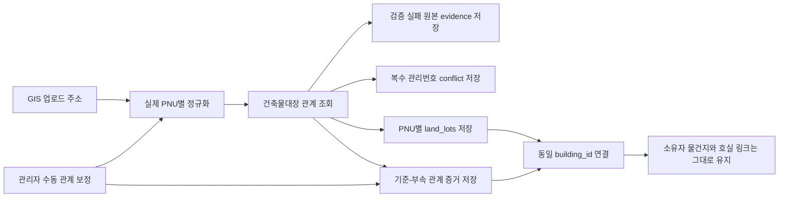

# 건축물대장 기준·부속지번 GIS 자동·수동 연결 설계

- 상태: 구현 가능 설계 확정, Phase 0부터 순차 착수 가능 (코드·DB 미변경)
- 작성일: 2026-07-14
- 적용 시점: 조합 시스템관리자의 GIS 정보 업로드
- 구현 범위: `tonghari-api` 수집·연결 로직, `tonghari-web` DB migration·관리자 결과 표시
- 대체 명세: workspace `../docs/superpowers/specs/2026-04-16-building-merge-auto-detect-design.md`
- 코드 대조 리뷰: 17~19절 참조 (2026-07-14, 운영 DB·migration·동시성·RLS·건물/호실 identity 재검토와 최종 교정 반영)

## 1. 결론

건축물대장의 기준지번과 부속지번은 하나의 PNU로 병합하지 않는다. 건축물대장 API가 실제 부속지번을 누락하거나 잘못 반환한 경우에는 시스템관리자가 GIS 업로드 결과에서 관계를 수동 보정할 수 있으며, 이 보정도 자동 처리와 동일한 비파괴 필지 저장·관계 증거·건물 projection 흐름을 사용한다.

최초 릴리스의 projection은 자동·수동 관계 모두 **공식 관리번호(`mgmBldrgstPk`)가 정확히 1개이고 canonical 충돌이 없는 경우**에 한정한다. 같은 PNU 집합에서 관리번호가 둘 이상이면 동일 물리 건물로 추정하지 않고 `MULTI_BUILDING_ON_PARCEL` evidence를 저장한다. 이미 단일 관리번호 근거로 projection된 component에서 나중에 두 번째 관리번호가 발견된 경우에만 기존 mapping을 재지정·삭제하지 않은 채 quarantine을 추가해 effective-support read에서 제외한다. 관리번호가 0개인 수동 관계도 기존 `GIS_DIRECT` 건물을 근거로 투영하지 않고 `INSUFFICIENT_CANONICAL_EVIDENCE`로 남긴다. 한 필지의 복수 물리 건물은 현재 `building_land_lots.pnu UNIQUE` 모델로 표현할 수 없으므로 별도 `building_group → registry_building → unit` 모델 개편 전에는 자동 투영하지 않는다.

기준·부속지번 관계는 물리 관계일 뿐 소유자의 전유부 소유 증거가 아니다. 따라서 최초 릴리스는 `property_units.building_unit_id`, `dong`, `ho`를 변경하지 않으며 과소필지 판정도 이 기능만으로 바꾸지 않는다. 호실 연결은 안정적인 unit identity, 명시적인 동·호, 독립된 소유물건 근거, 원자적 CAS와 감사 이벤트가 모두 준비된 후 별도 Phase F write 승인으로 활성화한다.

각 실제 필지는 다음과 같이 독립적으로 유지한다.

- `land_lots`: 실제 PNU별 한 행
- `property_units.pnu`: 소유자의 실제 물건지 PNU 유지
- `property_ownerships`: 이동·비활성화하지 않음
- `building_registry_land_lot_relations`: 건축물대장 API 기준·부속 관계의 원천 증거
- `building_land_lot_manual_overrides`: API 누락·오류를 보정한 관리자 판단과 근거
- `building_land_lots`: 기준·부속 PNU를 같은 `building_id`에 연결한 운영 projection

기존 수동 지번 병합 함수는 `property_units.pnu` 변경, 소유관계 이동·비활성화, 물건지 soft delete까지 수행하므로 자동 연결 경로에서 호출하지 않는다.

GIS 화면의 일반적인 "필지 병합"은 실제 합필이 아니라 **기준·부속지번 수동 연결**로 재정의한다. 두 PNU와 소유관계는 그대로 유지하고, 관리자 근거를 관계 테이블에 저장한 뒤 자동 처리와 같은 RPC로 동일 건물에 연결한다. 지적공부상 실제 합필·폐지·PNU 정정은 이번 범위에서 제외하고 별도 후속 명세와 신규 구현으로 분리한다.

현재 `buildings`, `building_external_refs`, `building_land_lots`는 `union_id`가 없고 `building_land_lots.pnu`가 전역 unique인 운영 projection이다. 이번 릴리스는 이 제약을 유지하되 이를 현실의 모든 “물리 건물”을 완전하게 표현하는 모델이라고 주장하지 않는다. 단일 관리번호로 증명된 관계만 전역 projection으로 공유하며, 복수 관리번호·복수 물리 건물·조합 간 상충은 evidence와 conflict로 보존한다. 해당 사례를 자동화하려면 `building_group → registry_building → building_unit` 계층과 다대다 필지 관계를 별도 개편한다.



## 2. 요구사항과 판정

### 2.1 Source of truth

이번 설계는 다음 근거를 함께 적용한다.

1. Obsidian의 최신 추정분담금·소유자 모델
   - 감정평가 데이터의 물건지 식별 기준은 실제 지번 주소이다.
   - 대표 PNU 재사용으로 발생한 중복은 실제 중복이 아니다.
   - 물건지 식별은 PNU 하나만이 아니라 실제 지번 주소와 동·호 정보를 함께 보존해야 한다.
2. 현재 운영 코드와 DB
   - GIS 업로드는 쉼표로 묶인 지번 셀의 첫 PNU만 저장한다.
   - 조합원 업로드는 누락된 부속 PNU를 대표 PNU로 치환한다.
   - 현재 수동 병합은 건물 연결을 넘어 물건지와 소유관계까지 변경한다.
3. 국토교통부 건축물대장정보 서비스
   - `getBrAtchJibunInfo`가 기준지번과 부속지번을 명시적으로 제공한다.
   - `getBrTitleInfo.bylotCnt`는 외필지수이므로 직접 조회 게이트로 사용할 수 있다.
   - 공공 API 누락·정정 지연 가능성에 대비해, 시스템관리자의 근거 있는 수동 관계를 별도 provenance로 보존해야 한다.
   - 공식 계약: [공공데이터포털 건축물대장정보 서비스](https://www.data.go.kr/data/15134735/openapi.do)
4. Supabase 공식 운영 계약
   - public schema의 GRANT와 RLS는 별도 계층이므로 둘 다 명시하고 함수 기본 EXECUTE를 회수한다.
   - 2026-04-28 이후 신규 public 테이블은 Data API에 자동 노출되지 않을 수 있으므로 노출 여부와 GRANT를 명시적으로 결정한다.
   - migration history repair는 schema parity를 먼저 증명한 뒤 승인된 절차로만 수행한다.
   - 공식 문서: [Securing your API](https://supabase.com/docs/guides/api/securing-your-api), [supabase migration repair](https://supabase.com/docs/reference/cli/supabase-migration-repair)

### 2.2 기존 명세와의 충돌 판정

기존 `2026-04-16-building-merge-auto-detect-design.md`는 건물명이 같으면 LLM이 같은 건물로 판단하고 모든 물건지 PNU를 대표 PNU로 변경하도록 설계되어 있다. 이 방식은 다음 이유로 폐기한다.

- retired된 `user_property_units` 모델을 기준으로 한다.
- 공식 관계가 아닌 건물명·본번 유사도로 추정한다.
- 실제 물건지 PNU와 주소를 서로 다르게 만든다.
- 소유권 이동과 물건지 비활성화를 자동 수행한다.
- 현재 추정분담금의 실제 물건지 단위 요구사항과 충돌한다.

새 설계가 기존 자동병합 명세와 조합 임포트의 해당 단계를 대체한다.

## 3. 현재 문제의 정확한 경로

현재 데이터가 대표 PNU로 접히는 과정은 다음과 같다.

1. GIS 엑셀의 `749-36, 749-5` 같은 셀을 하나의 주소 문자열로 API에 전달한다.
2. 주소 파서는 문자열의 첫 지번만 읽어 `749-36` PNU를 만든다.
3. `land_lots`에는 기준 PNU 한 행만 생성되고 주소에는 여러 지번 문자열이 남는다.
4. 조합원 엑셀은 같은 셀을 지번별로 분리하므로 `749-5` 물건지를 별도로 만든다.
5. `749-5` PNU가 `land_lots`에 없으면 `resolveMergedPnu`가 주소 문자열을 검색해 `749-36`으로 치환한다.
6. 결과적으로 `property_address_jibun`은 `749-5`인데 `property_units.pnu`는 `749-36`인 행이 생긴다.

삼양동 운영 데이터에서 확인한 현재 상태는 다음과 같다.

- 쉼표로 합쳐진 기준 필지 그룹: 8개
- 해당 그룹의 부속 PNU: 14개
- DB에 존재하는 부속 `land_lots`: 0개
- 활성 `property_units` 중 `previous_pnu`가 있는 행: 228개
- 알려진 8개 그룹에서 실제 주소 PNU와 저장 PNU가 다른 행: 164개
- `previous_pnu`도 실제 주소와 일치하지 않는 사례가 있어 일괄 복원 기준으로 사용할 수 없음

이 8개/14개는 현재 쉼표 주소에서 추출한 legacy 후보 수치이며 아직 공식 API dry-run으로 확정한 관계 수는 아니다.

따라서 자동 연결은 관계 테이블만 추가하는 것으로 끝나지 않는다. GIS 입력을 실제 PNU별로 펼치고 부속 `land_lots`를 개별 생성하며, 신규 업로드에서 대표 PNU 치환을 중단해야 한다.

## 4. 설계 불변조건

자동 연결의 모든 구현은 다음 조건을 지켜야 한다.

1. 한 실제 필지에는 한 실제 PNU가 유지된다.
2. 기준지번과 부속지번은 같은 건물에 연결될 수 있지만 같은 필지가 되지는 않는다.
3. 최초 릴리스의 자동 연결은 `property_units`의 모든 컬럼(`building_unit_id`, `pnu`, `previous_pnu`, `dong`, `ho`, 주소·면적·감정가, `updated_at` 포함), 물건지 행·활성 상태와 `property_ownerships`를 변경하지 않는다.
4. 자동 연결은 물건지를 비활성화하거나 soft delete하지 않는다.
5. 건물명, 같은 본번, 인접 번호만으로 관계를 추정하지 않는다.
6. 공식 API가 완전하게 반환한 관계, 이미 저장된 공식 관계 또는 시스템관리자가 근거와 함께 확정한 수동 관계만 사용한다.
7. 부분 응답과 API 실패에서는 기존 관계를 삭제하거나 비활성화하지 않는다.
8. 수동 매핑과 기존 다른 건물 매핑은 자동으로 덮어쓰지 않는다.
9. 관계 관측과 필지 데이터는 `union_id` 범위에서 처리한다. 전역 건물 projection은 공식 근거가 완전하거나 관리자 수동 근거가 확정됐고, 모든 조합의 활성 evidence와 기존 전역 매핑에 충돌이 없을 때만 적용한다.
10. 동일 GIS 작업과 재실행은 멱등적이어야 한다.
11. 수동 보정도 자동 처리와 동일하게 각 PNU를 개별 `land_lots`로 유지하고 `property_units.pnu`, `previous_pnu`, `property_ownerships`를 변경하지 않는다.
12. API의 미관측만으로 수동 관계를 stale 처리하거나 해제하지 않는다. API와 수동 관계가 충돌하면 어느 쪽도 자동 덮어쓰지 않고 시스템관리자 검토로 전환한다.
13. `buildings`, `building_units`, `building_land_lots`, `building_external_refs`의 생성·갱신·연결은 모두 하나의 DB RPC 경계 안에서 수행한다. 잠금 RPC 밖에서 이 테이블을 직접 쓰는 경로를 허용하지 않는다.
14. 건물 projection에 영향을 주는 자동·수동·GIS_DIRECT 경로는 namespace가 분리된 `PNU → external identity → canonical building_id → relation 보조 lock`의 동일한 advisory lock 순서를 사용한다. projection PNU namespace key에는 `union_id`를 넣지 않는다.
15. 같은 PNU의 기존 `building_id`와 신규 canonical `building_id`가 다르면 provenance 우선순위와 무관하게 자동 덮어쓰지 않고 `CONFLICT`로 보낸다. auto-vs-auto도 예외가 아니다.
16. A조합 작업은 B조합의 `property_units` 어떤 필드도 변경하지 않는다.
17. `resolveMergedPnu`는 모든 대상 조합에서 실제 PNU `land_lots`가 준비되고 `MISSING_LAND_LOT` 차단 경로가 활성화된 뒤에만 제거한다.
18. 관리번호가 둘 이상인 PNU 그룹은 동일 PNU 집합·건물명·첫 표제부만으로 하나의 `building_id`에 합치지 않는다. 최초 릴리스에서는 항상 `MULTI_BUILDING_ON_PARCEL`로 투영을 차단한다.
19. canonical RPC는 조합 범위에서 생성·변경할 `scope_pnus`와 전역 직렬화를 위한 `lock_pnus`를 분리한다. `(pnu, union_id)` `land_lots` 존재 조건은 `scope_pnus`에만 적용한다.
20. 신규 `ACTIVE` `building_units`는 필수 `identity_key`를 사용한다. identity를 만들 수 없는 응답은 unit 행을 추정 생성하지 않고 unresolved evidence로 보내며, 기존 미식별 행은 `LEGACY_UNRESOLVED` 또는 `REVIEW_REQUIRED`로 보존한다.
21. 지연 작업 방지는 호출자가 전달한 시각이 아니라 DB에 한 번 기록된 immutable operation epoch를 사용하고, 건물·호실·external ref의 필드별 source 소유권과 관측시각에도 적용한다.
22. building 패밀리와 신규 evidence 테이블은 브라우저에서 직접 읽거나 쓰지 않는다. `anon`·`authenticated`의 테이블 권한과 canonical RPC 실행권한을 회수하고, 서버가 조합 권한을 검증한 scope API만 제공한다.
23. API 0건·누락 판정은 append-only scan observation의 서로 다른 DB operation만 독립 관측으로 인정한다. 같은 operation의 HTTP/page retry와 재호출은 miss count를 두 번 증가시키지 않는다.

## 5. 외부 API 계약

공식 서비스: [국토교통부 건축물대장정보 서비스](https://www.data.go.kr/data/15134735/openapi.do)

### 5.1 사용 API

| API | 용도 | 핵심 필드 |
| --- | --- | --- |
| `getBrTitleInfo` | 표제부와 외필지수 확인 | `mgmBldrgstPk`, `bylotCnt`, 기준 지번 필드 |
| `getBrAtchJibunInfo` | 기준·부속지번 관계 조회 | 기준 지번 필드, `atch*` 부속 지번 필드, `mgmBldrgstPk` |
| `getBrExposInfo` | canonical 건물의 전유부 identity 조회 | `mgmBldrgstPk`, 동·호, 층. `area` source로 사용하지 않음 |
| `getBrExposPubuseAreaInfo` | 전유·공용면적 조회 | 관리번호, 동·호, 전유공용구분, 면적. unit 면적은 이 응답만 사용 |

`getBrAtchJibunInfo`의 요청 검색조건에는 `atchBun`, `atchJi`가 없다. 따라서 기준지번을 알면 직접 조회할 수 있지만 부속지번만 입력된 경우에는 직접 역조회할 수 없다.

### 5.2 PNU 변환

건축물대장 API의 `platGbCd`와 PNU의 토지구분 숫자는 그대로 연결되지 않는다.

| 건축물대장 `platGbCd` | 의미 | PNU 토지구분 |
| --- | --- | --- |
| `0` | 대지 | `1` |
| `1` | 산 | `2` |
| `2` | 블록 | 일반 지적 PNU 생성 불가, 검토 처리 |

기준 PNU와 부속 PNU는 다음 필드를 각각 사용해 19자리로 만든다.

- 기준: `sigunguCd + bjdongCd + platGbCd 변환값 + bun + ji`
- 부속: `atchSigunguCd + atchBjdongCd + atchPlatGbCd 변환값 + atchBun + atchJi`

19자리 숫자, 기준과 부속이 서로 다름, 법정동 코드 유효성을 검증한다.

### 5.3 공통 API 클라이언트 규칙

- HTTPS 사용 (기존 `getBrTitleInfo`·`getBrExposInfo`는 현재 `http`이므로 함께 정리 — 17절 R4)
- `getBrTitleInfo`, `getBrExposInfo`, `getBrExposPubuseAreaInfo`, `getBrAtchJibunInfo` 모든 요청에 PNU 토지구분 `1/2`를 API `platGbCd 0/1`로 변환해 전달
- 요청 timeout 15초
- 최대 3회 재시도, exponential backoff와 jitter 적용
- HTTP timeout, 408, 429, 5xx와 응답 `resultCode`의 재시도 가능 오류를 재시도. 408·429에 `Retry-After`가 있으면 우선 적용
- HTTP 200이어도 `response.header.resultCode`를 1차 성공 신호로 판정
- `00`은 정상 응답, `03`은 정상 데이터 없음으로 분류
- `01`, `02`, `04`, `05`, `21`, `22`, `99`는 재시도 가능 오류로 분류하고 빈 결과로 취급하지 않음
- `10`, `11`, `12`, `20`, `30`, `31`, `32`, `33`은 영구 오류로 분류하고 즉시 실패
- `items.item`의 단일 객체/배열 응답을 배열로 정규화
- `response.header` 누락, HTML/XML 오류 본문, JSON 파싱 실패, 알 수 없는 non-`00` 코드는 `PROTOCOL_ERROR`로 fail-closed 처리하고 `EMPTY`나 stale miss로 변환하지 않음
- `00 + totalCount>0`인데 items가 없거나 페이지 중 하나라도 오류이면 전체 결과를 `PARTIAL`로 처리
- `totalCount`까지 모든 페이지를 확인
- 모든 페이지가 `resultCode=00`이고 `totalCount`·페이지 수가 일치할 때만 완전한 positive scan으로 인정
- `resultCode=03` 또는 `00 + totalCount=0`은 `EMPTY`로 구분하되, 기존 nonzero 관계의 stale 근거로 사용할 때는 독립 재조회가 필요
- `bylotCnt`가 명시적인 숫자 `0`일 때만 부속 API를 생략하고 null·누락·파싱 실패이면 `getBrAtchJibunInfo`를 조회
- `getBrExposInfo` 응답에 없는 `area`를 읽지 않는다. 면적은 `getBrExposPubuseAreaInfo`의 전유·공용 구분을 보존한 전체 페이지 응답에서만 계산하며, 일부 페이지 실패 시 기존 면적을 유지한다.
- 반환 상태: `SUCCESS`, `EMPTY`, `PARTIAL`, `RETRYABLE_ERROR`, `PERMANENT_ERROR`, `PROTOCOL_ERROR`

## 6. 데이터 모델

### 6.1 API 관계 원천 테이블

`building_registry_land_lot_relations`를 신규 생성한다. 건축물대장 API에서 실제로 관측한 기준 PNU 하나, 부속 PNU 하나, 관리번호 하나를 증거 한 행으로 저장한다. API 관측은 stale 수명주기를 가지므로 관리자 판단과 같은 행에 섞지 않는다.

핵심 컬럼은 `id uuid PRIMARY KEY`, `union_id`, `base_pnu`, `attached_pnu`, 필수 `mgm_bldrgst_pk`, `observation_status`, `projection_status`, `projection_reason_code`, `is_active`, 최초·최근 관측 시각, 완전 조회 시각, stale count, 마지막 GIS 작업, 응답 snapshot metadata, `created_at`, `updated_at`이다.

```text
UNIQUE (union_id, base_pnu, attached_pnu, mgm_bldrgst_pk)
CHECK (base_pnu ~ '^[0-9]{19}$')
CHECK (attached_pnu ~ '^[0-9]{19}$')
CHECK (base_pnu <> attached_pnu)
FK (base_pnu, union_id) -> land_lots (pnu, union_id)
FK (attached_pnu, union_id) -> land_lots (pnu, union_id)
FK (last_seen_sync_job_id, union_id) -> sync_jobs (id, union_id)
CREATE INDEX building_registry_relations_active_attached_idx
  ON building_registry_land_lot_relations(union_id, attached_pnu) WHERE is_active
```

`observation_status`는 `OBSERVED`, `STALE_CANDIDATE`, `INACTIVE`, `projection_status`는 `PENDING`, `LINKED`, `REVIEW_REQUIRED`, `CONFLICT`, `STALE_REVIEW`로 분리한다. 같은 부속 PNU가 서로 다른 활성 기준 PNU에 관측되면 어느 하나를 선택하지 않고 evidence를 보존한 채 `CONFLICT`로 기록한다. 복수 관리번호처럼 증거가 서로 모순되지는 않지만 현재 projection 모델이 표현할 수 없는 경우는 `REVIEW_REQUIRED`와 `projection_reason_code`에 기록한다.

DB에는 `observation_status`, `projection_status` 각각에 위 허용값만 받는 `CHECK`를 둔다. relation의 `projection_reason_code`는 `MULTI_BUILDING_ON_PARCEL`, `CANONICAL_BUILDING_CONFLICT`, `EXTERNAL_IDENTITY_CONFLICT`, `INSUFFICIENT_CANONICAL_EVIDENCE`, `MANUAL_API_CONTRADICTION`만 허용하고 `REVIEW_REQUIRED` 또는 `CONFLICT`일 때 필수다. unit identity·field patch 문제는 relation 상태에 섞지 않고 별도 `unit_outcome`·identity conflict/event로 기록한다. `INACTIVE`이면 `is_active=false`와 `deactivated_at IS NOT NULL`을 강제한다. positive cache는 중앙 predicate `is_active=true AND observation_status='OBSERVED' AND projection_status IN ('PENDING', 'LINKED')`를 RPC 또는 `security_invoker` view 한 곳에 정의해 사용한다.

> FK 대상 검증(2026-07-14, 운영 DB): `land_lots` PK가 `(pnu, union_id)`이므로 위 두 FK는 유효하다. 토대 스키마 생성 이력은 운영 migration history와 Git 과거 이력에 존재하지만, 현재 canonical `supabase/migrations`에서 삭제·누락되어 clean replay가 불가능하다. 17절 R1.

#### 6.1.1 미해소 API 관측 저장소

API가 부속지번을 반환했지만 PNU·주소를 검증하지 못한 경우에는 FK가 있는 relation 테이블에 억지로 저장하지 않는다. `building_registry_land_lot_unresolved_observations`에 다음 원본 evidence를 저장한다.

- `union_id`, 필수 `mgm_bldrgst_pk`, 기준 PNU 또는 기준 지번 필드
- `atchSigunguCd`, `atchBjdongCd`, `atchPlatGbCd`, `atchBun`, `atchJi` 원문
- 생성 가능한 candidate PNU와 실패 사유
- 원본 응답의 canonical hash인 `evidence_hash`, `first_seen_at`, `last_seen_at`, `attempt_count`
- `resolution_status`(`OPEN`, `RESOLVED`, `IGNORED`), `source_sync_job_id`, `resolved_relation_id`, 응답 snapshot, 생성·해결 시각

`mgm_bldrgst_pk`는 `NOT NULL`이다. 응답에 관리번호 자체가 없으면 이 테이블이 아니라 protocol 오류용 `building_source_unresolved_observations`에 저장한다. `UNIQUE (union_id, mgm_bldrgst_pk, evidence_hash)`로 같은 원본 관측을 멱등 upsert하고, 재관측 때 행을 늘리는 대신 `last_seen_at`과 `attempt_count`만 전진시킨다. 이 테이블은 아직 존재하지 않는 `land_lots`에 FK를 걸지 않는다. 주소·PNU가 검증되고 Phase D에서 `(pnu, union_id)` identity row가 생성되면 원 transaction에서 정식 relation으로 승격하고 `resolved_relation_id`를 채운 뒤 `RESOLVED` 처리한다. 미해소 행 자체는 positive cache나 건물 projection의 근거로 사용하지 않는다. `resolution_status`에는 CHECK를 둔다.

`source_sync_job_id`는 `(source_sync_job_id, union_id) → sync_jobs(id, union_id)`, `resolved_relation_id`는 `(resolved_relation_id, union_id) → building_registry_land_lot_relations(id, union_id)` 복합 FK와 `ON DELETE RESTRICT`를 사용한다. 이를 위해 relation에 `UNIQUE(id, union_id)`를 둔다.

#### 6.1.2 완전 조회 관측 원장

`building_registry_scan_observations`와 pair·group state를 생성해 “독립된 다음 완전 조회”를 DB에서 식별한다. HTTP 재시도 횟수나 프로세스 메모리를 stale 근거로 사용하지 않는다. API adapter는 HTTP/page retry를 모두 끝낸 최종 snapshot 한 개만 canonical RPC에 전달한다.

| 컬럼 | 계약 |
| --- | --- |
| `id` | `uuid PRIMARY KEY` |
| `union_id`, `base_pnu`, `mgm_bldrgst_pk` | stale 판정 대상 관계 그룹 |
| `operation_id`, `operation_epoch` | DB 발급 operation과 단조 epoch |
| `scan_status` | `COMPLETE_NONZERO`, `COMPLETE_ZERO`, `EMPTY_NOT_FOUND`, `PARTIAL`, `RETRYABLE_ERROR`, `PERMANENT_ERROR`, `PROTOCOL_ERROR` |
| `result_code`, `bylot_count`, `total_count`, `page_count` | 프로토콜 판정 근거 |
| `response_hash`, `raw_snapshot` | canonical 응답 fingerprint와 원문 |
| `observed_at`, `created_at` | DB 관측 시각 |

```text
UNIQUE (id, union_id)
UNIQUE (operation_id, union_id, base_pnu, mgm_bldrgst_pk)
FK (operation_id, union_id) -> building_write_operations (id, union_id)
```

`building_registry_scan_observation_pairs`는 `(observation_id, attached_pnu)`를 PK로 하고 observation과 `union_id`를 복합 FK로 참조한다. 응답 pair 하나라도 PNU 검증에 실패하면 scan 전체를 `PARTIAL`로 분류하고 미해소 저장소에도 원문을 남긴다.

`building_registry_relation_group_states`는 `(union_id, base_pnu, mgm_bldrgst_pk)` PK, `last_applied_observation_id`, `last_applied_operation_epoch`, `zero_candidate_observation_id`, `zero_candidate_at`을 가진다. 두 observation id는 `(observation_id, union_id)` 복합 FK와 `ON DELETE RESTRICT`를 사용한다. relation에는 `last_seen_observation_id`, `last_miss_observation_id`, `last_applied_operation_epoch`를 추가하고 observation FK도 같은 복합 형태로 둔다.

같은 operation/group 재호출에서 hash가 같으면 기존 observation을 반환하고 `REPLAYED`, hash가 다르면 원행을 덮지 않고 `OBSERVATION_REPLAY_MISMATCH`로 무변경 종료한다. 독립 재조회는 새 sync job과 더 큰 operation epoch가 필수다. 첫 `COMPLETE_ZERO`는 `ZERO_COUNT_REVERIFY_PENDING`만 설정한다. 이후 서로 다른 operation의 zero 관측으로 miss를 전진시키고 `stale_miss_count >= 2`이면서 최초 candidate 후 7일이 지난 경우에만 비활성화한다. `COMPLETE_NONZERO`는 관측 pair의 pending·miss를 해제한다. `EMPTY_NOT_FOUND`(`resultCode=03`), partial, protocol/API 오류는 감사행만 저장하고 stale 상태를 변경하지 않는다.

### 6.2 관리자 수동 보정 테이블

`building_land_lot_manual_overrides`를 신규 생성한다. API가 관계를 누락·오류 반환했을 때 시스템관리자가 공급한 판단과 근거를 저장한다. API 미관측으로 자동 stale 처리하지 않으며, 생성과 해제 이력을 삭제하지 않는다. 수동 근거도 복수 관리번호 차단을 우회하지 못하며 이 경우 `REVIEW_REQUIRED/MULTI_BUILDING_ON_PARCEL`로 남긴다.

| 컬럼 | 설명 |
| --- | --- |
| `id` | `uuid PRIMARY KEY`, `gen_random_uuid()` |
| `union_id`, `base_pnu`, `attached_pnu` | 조합 범위의 기준·부속 PNU |
| `override_status` | `ACTIVE`, `REVOKED` |
| `api_alignment_status` | `REVERIFY_PENDING`, `CONFIRMED`, `OMITTED`, `CONTRADICTED` |
| `projection_status` | `PENDING`, `LINKED`, `REVIEW_REQUIRED`, `CONFLICT`, `STALE_REVIEW` |
| `projection_reason_code` | 현재 모델 표현 불가 또는 충돌 사유 |
| `reason_code`, `reason_text` | `API_OMISSION`, `API_ERROR`, `REGISTER_CORRECTION_DELAY`, `OTHER`와 상세 사유 |
| `evidence` | 대장 사본, 현장 확인, 지자체 회신 등 근거 metadata |
| `created_by_user_id`, `confirmed_at` | 등록한 시스템관리자와 확정 시각 |
| `revoked_by_user_id`, `revoked_at`, `revocation_reason` | 명시적 해제 감사정보 |
| `source_sync_job_id`, `last_reverified_at` | 시작 GIS 작업과 마지막 API 재관측 시각 |
| `created_at`, `updated_at` | 생성·상태 갱신 시각 |

```text
CREATE UNIQUE INDEX ...
  ON building_land_lot_manual_overrides (union_id, base_pnu, attached_pnu)
  WHERE override_status = 'ACTIVE';
UNIQUE (id, union_id)
CHECK (base_pnu <> attached_pnu)
CHECK (reason_text IS NOT NULL AND evidence IS NOT NULL)
FK (base_pnu, union_id) -> land_lots (pnu, union_id)
FK (attached_pnu, union_id) -> land_lots (pnu, union_id)
FK (created_by_user_id) -> users (id)
FK (revoked_by_user_id) -> users (id)
FK (source_sync_job_id, union_id) -> sync_jobs (id, union_id) ON DELETE RESTRICT
```

`users.id`는 UUID가 아니라 `varchar`이므로 행위자 컬럼도 그 계약을 따른다. 동일 부속 PNU를 서로 다른 기준 PNU에 동시에 수동 등록할 수 있으므로, RPC는 충돌 조회 전에 기준·부속 PNU 전체를 정렬한 전역 advisory lock을 잡는다. 충돌 입력도 감사 evidence로 보존하되 effective projection에는 사용하지 않는다.

`override_status`, `api_alignment_status`, `projection_status`, `reason_code`에는 문서에 정의한 문자열만 허용하는 `CHECK`를 둔다. `REVOKED`이면 `revoked_by_user_id`, `revoked_at`, `revocation_reason`을 필수로 하고, `ACTIVE`이면 세 revoke 필드를 null로 유지하는 상태 일관성 CHECK도 적용한다.

수동 관계의 positive-cache predicate는 `override_status='ACTIVE' AND projection_status IN ('PENDING', 'LINKED')`로 중앙 정의한다. Phase 4 evidence-only에서 생성된 `ACTIVE/PENDING` 관계도 다음 작업의 기준·부속 역조회에는 사용할 수 있지만 building projection 근거로 사용할 때는 현재 rollout flag와 canonical evidence를 다시 검증한다. `REVIEW_REQUIRED`, `CONFLICT`, `STALE_REVIEW`, `REVOKED`는 positive cache에서 제외한다.

### 6.3 projection 감사 이벤트

`building_projection_events`를 append-only canonical writer 감사 로그로 둔다. API 관계·수동 override·GIS_DIRECT·건축물대장·공시가격·공식명 갱신·관리자 작업이 building 패밀리에 영향을 준 모든 시도를 기록한다. 조합원 import와 property 재무 편집은 building family mutation이 아니므로 이 로그가 아니라 property 원장과 Phase F shadow event를 사용한다.

- `id uuid PRIMARY KEY`, deterministic `event_key text UNIQUE NOT NULL`
- `source_kind`(`API_RELATION`, `MANUAL_OVERRIDE`, `GIS_DIRECT`, `BUILDING_REGISTER`, `APART_HOUSING_PRICE`, `INDIVIDUAL_HOUSING_PRICE`, `OFFICIAL_NAME`, `ADMIN_OPERATION`)
- `field_source`(`BUILDING_REGISTER_TITLE`, `BUILDING_REGISTER_UNIT`, `BUILDING_REGISTER_AREA`, `APART_HOUSING_PRICE`, `INDIVIDUAL_HOUSING_PRICE`, `ROAD_ADDRESS`, `NONE`)
- `relation_id` 또는 `manual_override_id`
- `union_id`, `pnu`, `entity_type`(`BUILDING`, `BUILDING_UNIT`, `EXTERNAL_REF`, `LOT_MAPPING`, `RELATION`, `QUARANTINE`), `entity_key`, `action`(`CREATE`, `REUSE`, `LINK`, `CONFIRM`, `METADATA_UPDATE`, `REVIEW_REQUIRED`, `CONFLICT`, `REVOKE`, `STALE_REVIEW`, `QUARANTINE`, `ROLLBACK_QUARANTINE`, `QUARANTINE_RESOLVE`)
- `result_code`(`CREATED`, `REUSED`, `APPLIED`, `NO_CHANGE`, `PROJECTION_DISABLED`, `INSUFFICIENT_CANONICAL_EVIDENCE`, `MULTI_BUILDING_ON_PARCEL`, `CANONICAL_BUILDING_CONFLICT`, `EXTERNAL_IDENTITY_CONFLICT`, `STALE_OPERATION`, `PRICE_UNIT_UNRESOLVED`, `PRICE_UNIT_AMBIGUOUS`, `SOURCE_FIELD_REJECTED`, `ROLLED_BACK`, `ALREADY_QUARANTINED`, `QUARANTINE_RESOLVED`)와 선택 `reason_code`
- `before_building_id`, `after_building_id`
- `actor_user_id`, `reason`, 필수 `operation_id`, `command_id`
- `changed_fields`, `before_values`, `after_values`, `source_observed_at`
- `created_at`

`source_kind='API_RELATION'`이면 `relation_id`만, `MANUAL_OVERRIDE`이면 `manual_override_id`만 필수로 한다. 그 외 canonical writer source는 두 source FK를 null로 둔다. job/manual 식별은 필수 operation이 가진 `sync_job_id` 또는 `idempotency_key`에서만 읽어 중복 저장하지 않는다. `entity_key`는 entity 종류별 stable key를 사용한다: building id, unit identity key, canonical external identity key, mapping PNU, relation/override id, quarantine `pnu:claim_key`다. `event_key`는 `operation_id + command_key + source_kind + entity_type + entity_key + action + result_code`의 canonical SHA-256이며 같은 key 재호출은 기존 event를 반환한다. 따라서 같은 command/PNU에서 여러 unit을 갱신해도 각각 독립 event가 되고, 한 entity의 before/after diff는 한 event JSON에 집계한다. 다른 payload에 같은 operation/command를 쓰면 root 또는 command hash 검증에서 replay mismatch로 먼저 차단한다.

`action`·`source_kind`·`field_source`·`entity_type`·`result_code`는 위 finite allowlist CHECK를 둔다. `entity_key`는 non-empty이고 entity 종류와 맞아야 한다. `result_code IN ('CREATED','REUSED','APPLIED','NO_CHANGE')`이면 `reason_code`는 null, 나머지는 non-empty를 강제한다. `(command_id, operation_id, union_id)`, `(relation_id, union_id)`, `(manual_override_id, union_id)` 복합 FK와 actor FK를 적용하고 source row 삭제는 `ON DELETE RESTRICT`로 막는다. `service_role`에도 일반 UPDATE·DELETE 경로를 제공하지 않고 append 전용 RPC만 노출하며 UPDATE·DELETE 방지 trigger를 둔다. `MEMBER_FINANCIAL_EDIT`는 property 원장에만 기록할 수 있고 `building_units.official_price`를 변경할 수 없다. 수동 관계 해제나 API 불일치에서도 event만 추가하고 과거 event를 수정·삭제하지 않는다.

### 6.4 건물 연결 provenance

`building_land_lots`는 전역 실제 PNU→canonical 운영 건물 projection으로 계속 사용하되 `mapping_source`를 `GIS_DIRECT`, `BUILDING_REGISTER_ATTACHED`, `MANUAL_RELATION`, `LEGACY`로 구분하고 `support_status`(`SUPPORTED`, `CONFLICT`, `STALE_REVIEW`), `last_verified_at`, `last_sync_job_id`, `last_applied_operation_id`를 추가한다.

운영 DB에서 `building_land_lots.pnu`는 `UNIQUE (pnu)`이므로 `ON CONFLICT (pnu)`를 conflict target으로 사용할 수 있다. 이는 SQL conflict target의 유효성만 뜻하며 수동·legacy·다른 건물 충돌 guard를 생략해도 된다는 의미는 아니다(17절 R1).

`mapping_source`는 최초 생성 원인이 아니라 **현재 유효 support**를 나타내고 최초·과거 근거는 projection event가 보존한다. 우선순위는 `BUILDING_REGISTER_ATTACHED > MANUAL_RELATION > GIS_DIRECT > LEGACY`다. 따라서 수동 관계를 API가 나중에 확인하면 `BUILDING_REGISTER_ATTACHED`로 전환하고, 수동 override를 해제해도 동일 API evidence가 남아 있으면 공식 source를 유지한다. 유효 support가 0이면 `building_id`와 마지막 `mapping_source`는 보존하되 `support_status=STALE_REVIEW`로 전환한다.

기존 `building_land_lots`의 provenance도 legacy writer 호환을 포함해 단계 적용한다. W3P는 기존 행을 `mapping_source='LEGACY'`, `support_status='SUPPORTED'`로 snapshot backfill하고 두 컬럼에 같은 임시 DB default와 NOT NULL/CHECK를 둔다. 따라서 A0b 배포 전 legacy INSERT도 의미 있는 값으로 저장되고 null mapping이 생기지 않는다. `last_verified_at`, `last_sync_job_id`, `last_applied_operation_id`는 nullable이다. A0b/W4-prep bridge와 rollback 후보는 이후 모든 INSERT/UPDATE에 명시적 source/support를 dual-write한다. W3F는 admission OFF·drain 뒤 null/invalid/delta 0과 legacy bridge smoke를 확인하고 **임시 default만 제거**해 canonical writer가 provenance를 반드시 명시하도록 한다. 기존 `LEGACY` 값 자체는 자동 승격하지 않는다.

우선순위가 자동 덮어쓰기를 허용하지는 않는다. 다른 건물을 가리키는 활성 evidence가 있으면 기존 projection을 고정하고 `CONFLICT`로 보낸다. provenance가 없는 기존 행은 보수적으로 `LEGACY`로 backfill한다.

`mapping_source`, `support_status`에 `CHECK`를 둔다. 관리번호가 둘 이상이면 동일 PNU 집합이어도 이 projection에 신규 건물을 만들지 않는다. 기존 external ref가 우연히 한 `building_id`를 가리키더라도 최초 릴리스의 자동 근거로 승격하지 않고 `MULTI_BUILDING_ON_PARCEL` 검토로 보낸다. 기존 운영 매핑은 모든 컬럼을 그대로 유지하고 relation의 `REVIEW_REQUIRED`와 append-only event만 남긴다.

#### 6.4.1 DB 발급 쓰기 operation

`building_write_operations`를 생성해 모든 building writer job/request의 순서를 DB에서 한 번만 발급한다. root `operation_kind`는 한 sync job 또는 HTTP idempotency 요청의 수명주기이고 `GIS_SYNC`, `APART_HOUSING_PRICE_SYNC`, `INDIVIDUAL_HOUSING_PRICE_SYNC`, `MANUAL_REQUEST`, `ADMIN_REQUEST`, `MEMBER_IMPORT_SHADOW`만 허용한다. 한 GIS sync job은 root `GIS_SYNC` 하나 아래 relation 관측, 건축물대장 patch, GIS fallback command를 여러 개 가질 수 있다. building mutation이 없는 `MEMBER_IMPORT_SHADOW`도 Phase F event의 멱등 root로만 operation을 사용한다.

```text
id uuid PRIMARY KEY DEFAULT gen_random_uuid()
operation_epoch bigint GENERATED ALWAYS AS IDENTITY UNIQUE NOT NULL
union_id uuid NOT NULL
operation_kind text NOT NULL
execution_mode text NOT NULL CHECK (... 'STANDARD','RELATION_OBSERVATION_ONLY')
source_deployment_version text NOT NULL
writer_contract_version text NOT NULL
source_release_sha text NULL
sync_job_id uuid NULL
idempotency_key text NULL
request_hash text NOT NULL
request_manifest jsonb NOT NULL
actor_user_id varchar NULL
started_at timestamptz NOT NULL DEFAULT clock_timestamp()
created_at timestamptz NOT NULL DEFAULT clock_timestamp()
UNIQUE (id, union_id)
CREATE UNIQUE INDEX building_write_operations_sync_job_uq
  ON building_write_operations(sync_job_id) WHERE sync_job_id IS NOT NULL
CREATE UNIQUE INDEX building_write_operations_idempotency_uq
  ON building_write_operations(union_id, idempotency_key) WHERE idempotency_key IS NOT NULL
CHECK (num_nonnulls(sync_job_id, idempotency_key) = 1)
CHECK (idempotency_key IS NULL OR length(idempotency_key) BETWEEN 16 AND 200)
FK (union_id) -> unions (id) ON DELETE RESTRICT
FK (actor_user_id) -> users (id) ON DELETE RESTRICT
FK (sync_job_id, union_id) -> sync_jobs (id, union_id) ON DELETE RESTRICT
CREATE INDEX building_write_operations_deployment_epoch_idx
  ON building_write_operations(source_deployment_version, operation_epoch)
```

`request_manifest`는 operation kind, union, `execution_mode`, `source_deployment_version`, `writer_contract_version`, 선택 release SHA, 원본 파일/body fingerprint와 순서가 고정된 `explicit_input_tokens`만 담는 개인정보 최소 canonical JSON이다. 개별 API 발견 PNU나 재시도 lock은 넣지 않는다. `create_building_write_operation` RPC가 manifest를 canonicalize해 `request_hash=SHA-256(manifest)`를 DB에서 계산하며 caller가 hash만 따로 지정할 수 없다. `RELATION_OBSERVATION_ONLY`는 `GIS_SYNC`에만 허용하고 DB validation이 `GIS_RELATION_SYNC` 외 command insert를 거부한다. queue 재실행은 같은 `sync_job_id`의 operation을, 수동 HTTP 재시도는 원문 `Idempotency-Key`를 그대로 사용한 operation을 재사용한다. 같은 job/key와 DB 계산 hash가 같으면 기존 operation을 반환하고 다르면 어떤 쓰기도 하지 않고 `OPERATION_REPLAY_MISMATCH`로 종료한다. RPC 호출자는 시각이나 epoch를 전달하지 않고 `operation_id`만 전달한다. canonical RPC는 mutation 전에 operation root의 contract와 admission row를 함께 검증한다. operation·manifest 행은 UPDATE·DELETE 권한을 회수하고 방지 trigger도 적용한다. 최신성은 `operation_epoch`로 비교하고 `last_verified_at`은 operation의 DB 시각으로만 전진시킨다.

Phase A에서 원본 입력 token을 PNU로 해소한 결과는 append-only `building_write_operation_input_pnus`에 저장한다.

```text
operation_id uuid NOT NULL
union_id uuid NOT NULL
pnu varchar NOT NULL CHECK (pnu ~ '^[0-9]{19}$')
input_token_hash text NOT NULL
resolution_evidence_hash text NOT NULL
normalized_input text NOT NULL
created_at timestamptz NOT NULL DEFAULT clock_timestamp()
PRIMARY KEY (operation_id, pnu)
FK (operation_id, union_id) -> building_write_operations(id, union_id) ON DELETE RESTRICT
```

전용 append RPC는 `input_token_hash`가 DB root `request_manifest.explicit_input_tokens`에 존재하는지, resolution evidence가 같은 token/PNU를 가리키는지 검증한다. API relation에서만 발견된 PNU는 이 원장에 넣지 않고 scan pair에만 둔다. canonical RPC는 `explicit_scope_pnus`가 이 원장의 해당 operation PNU subset과 exact match인지 검증하고, command 분할 시 command에 선언되지 않은 나머지 원본 PNU가 있어도 허용하되 **원장에 없는 PNU 하나라도 explicit로 제출하면 전체 요청을 거부**한다. 따라서 caller boolean이나 adapter 관례가 아니라 DB evidence가 standalone BUILDING_REGISTER/GIS_DIRECT 허용 경계다.

한 root job이 여러 PNU/group 명령을 실행하므로 `building_write_operation_commands`를 별도로 둔다. `command_kind`는 `GIS_RELATION_SYNC`, `MANUAL_RELATION`, `GIS_DIRECT`, `BUILDING_REGISTER`, `APART_HOUSING_PRICE`, `INDIVIDUAL_HOUSING_PRICE`, `OFFICIAL_NAME`, `IDENTITY_PROMOTION`, `MEMBER_IMPORT_SHADOW`, `ADMIN_OPERATION`만 허용한다. `command_status`는 `PENDING`, `RETRYABLE`, `COMPLETED`, `FAILED`만 허용한다.

root/command 조합은 다음 matrix로 고정하고 command insert RPC의 DB validation 함수에서 강제한다. 호출자가 임의 조합으로 command row를 직접 INSERT할 권한은 없다.

| root `operation_kind` | 허용 `command_kind` |
| --- | --- |
| `GIS_SYNC` | `GIS_RELATION_SYNC`, `BUILDING_REGISTER`, `GIS_DIRECT`, `OFFICIAL_NAME` |
| `APART_HOUSING_PRICE_SYNC` | `APART_HOUSING_PRICE`, `OFFICIAL_NAME` |
| `INDIVIDUAL_HOUSING_PRICE_SYNC` | `INDIVIDUAL_HOUSING_PRICE`, `OFFICIAL_NAME` |
| `MANUAL_REQUEST` | `MANUAL_RELATION` |
| `ADMIN_REQUEST` | `ADMIN_OPERATION`, `IDENTITY_PROMOTION` |
| `MEMBER_IMPORT_SHADOW` | `MEMBER_IMPORT_SHADOW` |

위 표는 `execution_mode='STANDARD'` 기준이다. `GIS_SYNC/RELATION_OBSERVATION_ONLY`에서는 `GIS_RELATION_SYNC`만 허용하고 `BUILDING_REGISTER`, `GIS_DIRECT`, `OFFICIAL_NAME` command를 만들지 않는다.

terminal `result_status`도 command kind별로 고정한다.

| `command_kind` | 허용 terminal result |
| --- | --- |
| `GIS_RELATION_SYNC`, `MANUAL_RELATION` | `CREATED`, `REUSED`, `NO_CHANGE`, `OBSERVATION_DISABLED`, `PROJECTION_DISABLED`, `INSUFFICIENT_CANONICAL_EVIDENCE`, `MULTI_BUILDING_ON_PARCEL`, `CONFLICT` |
| `BUILDING_REGISTER` | `CREATED`, `REUSED`, `APPLIED`, `NO_CHANGE`, `INSUFFICIENT_CANONICAL_EVIDENCE`, `MULTI_BUILDING_ON_PARCEL`, `CONFLICT`, `UNIT_IDENTITY_CONFLICT`, `SOURCE_FIELD_REJECTED` |
| `GIS_DIRECT` | `CREATED`, `REUSED`, `NO_CHANGE`, `MULTI_BUILDING_ON_PARCEL`, `CONFLICT`, `SOURCE_FIELD_REJECTED` |
| `APART_HOUSING_PRICE`, `INDIVIDUAL_HOUSING_PRICE` | `APPLIED`, `NO_CHANGE`, `PRICE_UNIT_UNRESOLVED`, `PRICE_UNIT_AMBIGUOUS`, `SOURCE_FIELD_REJECTED` |
| `OFFICIAL_NAME` | `APPLIED`, `NO_CHANGE`, `SOURCE_FIELD_REJECTED` |
| `IDENTITY_PROMOTION` | `IDENTITY_PROMOTED`, `IDENTITY_PROMOTION_SKIPPED`, `UNIT_IDENTITY_CONFLICT`, `NO_CHANGE` |
| `MEMBER_IMPORT_SHADOW` | `APPLIED`, `NO_CHANGE` |
| `ADMIN_OPERATION` | `ROLLBACK_DRY_RUN_READY`, `ROLLED_BACK`, `ALREADY_QUARANTINED`, `QUARANTINE_RESOLVED`, `BUILDING_WRITES_PAUSED`, `NO_CHANGE`, `CONFLICT` |

PNU/identity lock을 쓰는 command에는 위 행 결과와 함께 `MISSING_SCOPE_LAND_LOT`, `STALE_OPERATION`, `LOCK_SET_UNSTABLE`을 허용하고, building-family mutation branch에는 `BUILDING_WRITES_PAUSED`를 허용한다. `RETRY_REQUIRED`는 아래의 유일한 nonterminal result다. `OPERATION_REPLAY_MISMATCH`는 command insert 전, `COMMAND_REPLAY_MISMATCH`는 기존 command 변경 전에 반환하므로 둘 다 새 terminal result로 저장하지 않는다. DB validation 함수는 root/command 조합과 이 result matrix를 함께 검사한다.

```text
id uuid PRIMARY KEY DEFAULT gen_random_uuid()
union_id uuid NOT NULL
operation_id uuid NOT NULL
command_key text NOT NULL
command_hash text NOT NULL
command_kind text NOT NULL
command_status text NOT NULL DEFAULT 'PENDING'
attempt_count integer NOT NULL DEFAULT 0
result_status text NULL
result_payload jsonb NULL
completed_at timestamptz NULL
created_at timestamptz NOT NULL DEFAULT clock_timestamp()
UNIQUE (id, union_id)
UNIQUE (id, operation_id, union_id)
UNIQUE (operation_id, command_key)
FK (operation_id, union_id) -> building_write_operations (id, union_id) ON DELETE RESTRICT
```

`command_key`는 `phase:adapter:base_pnu:mgm_or_manual_id`처럼 같은 root request에서 안정적인 논리 명령 key이고, `command_hash`는 정렬된 `scope_pnus`, `explicit_scope_pnus`, **source_external_identities**, typed payload와 source evidence id의 canonical SHA-256이다. source payload가 아닌 재시도용 `lock_pnus`, `lock_external_identity_keys`, `lock_attempt`, 요청 순서와 시각은 hash에서 제외한다. canonical RPC는 `operation_id`, `command_key`, `command_hash`를 필수로 받는다. 동일 key/hash의 terminal `COMPLETED/FAILED` 명령은 저장된 result를 반환하고 event를 다시 추가하지 않는다. 동일 key에 다른 hash면 `COMMAND_REPLAY_MISMATCH`로 무변경 종료한다.

상태 CHECK는 `PENDING → result_status/completed_at NULL`, `RETRYABLE → result_status='RETRY_REQUIRED' AND completed_at NULL`, `COMPLETED → 위 matrix의 terminal result AND completed_at NOT NULL`, `FAILED → result_status='LOCK_SET_UNSTABLE' AND completed_at NOT NULL`을 강제한다. `RETRY_REQUIRED`에서는 source/building/projection/event를 쓰지 않고 `attempt_count+1`과 최신 required lock payload만 저장한다. 확장 lock-only 배열 재호출은 같은 command key/hash로 실행할 수 있다. terminal command 결과 저장은 source/projection/event와 같은 transaction에서 수행한다.

`sync_jobs`에는 사전 검증 후 `union_id SET NOT NULL`, `UNIQUE(id, union_id)`, archive 감사 컬럼을 추가한다. GIS queue는 `sync_jobs`와 operation의 영속화가 모두 성공한 뒤에만 admission한다. 둘 중 하나라도 실패하면 memory job을 제거하고 `SYNC_JOB_PERSIST_FAILED`로 fail-closed한다. `resetGisData`는 참조된 job을 DELETE하지 않고 `archived_at`, `archived_by_user_id`, `archive_reason`을 기록한다.

현재 코드의 `PRE_REGISTER`, `SYNC_PROPERTIES`는 DB `sync_job_type_enum`에 없다. `PRE_REGISTER`는 DB에는 기존 `MEMBER_UPLOAD`로 기록하고 `preview_data.memberOperation='PRE_REGISTER'`로 구분한다. `SYNC_PROPERTIES`는 현재 목적 자체가 building unit 생성과 `property_units.building_unit_id` 갱신이므로 최초 릴리스에서 route/job admission을 `FEATURE_DISABLED_PHASE_F`로 차단하고 queue에 넣지 않는다. Phase F shadow UI가 필요해지면 별도 `MEMBER_UPLOAD + memberOperation='SYNC_PROPERTIES_SHADOW'` 계약과 event-only 테스트를 추가한 뒤 활성화한다. TypeScript job type도 DB enum과 `memberOperation`을 분리하고 DB 타입을 재생성한다. GIS·가격·member·consent를 포함한 모든 `sync_jobs` producer는 INSERT 반환 error와 반환 id/union을 확인한 뒤에만 queue/jobs map에 추가하며, fault injection 테스트에서 한 건도 fail-open하지 않아야 한다.

#### 6.4.2 단일 건물 쓰기 RPC

`upsert_canonical_building_with_lots`를 `buildings`, `building_units`, `building_land_lots`, `building_external_refs`의 유일한 애플리케이션 쓰기 경계로 사용한다. generic JSON 전체 덮어쓰기는 받지 않고 command kind별 typed patch를 받는다. 입력은 `union_id`, `scope_pnus`, `explicit_scope_pnus`, `lock_pnus`, `source_external_identities`, `lock_external_identity_keys`, 관리번호 배열, 요청 building/external-ref/unit patch, source relation 또는 override id, `operation_id`, `command_key`, `command_hash`, `writer_contract_version`, `lock_attempt`이다. `explicit_scope_pnus`는 원본 GIS 입력에서 직접 해소된 PNU이고 command hash에 포함되며 relation/API로 새로 발견한 PNU를 넣을 수 없다.

1. `scope_pnus`, `explicit_scope_pnus`, `lock_pnus`를 19자리로 검증하고 각각 정렬·중복 제거한다. `explicit_scope_pnus ⊆ scope_pnus ⊆ lock_pnus`가 아니면 거부한다.
2. 요청 조합의 `scope_pnus`에만 `(pnu, union_id)` `land_lots` 존재를 요구한다. 누락 시 어떤 변경도 하지 않고 `MISSING_SCOPE_LAND_LOT(missing_scope_pnus)`를 반환한다. 전역 closure인 `lock_pnus`에는 조합 `land_lots` 존재를 요구하지 않는다.
3. `operation_id`를 조회해 요청 `union_id`·root operation kind·DB 발급 epoch와 root `request_hash`가 일치하는지 검증하고 위 matrix에 맞는 command kind/key/hash를 insert-or-read한다. root 또는 command replay hash가 다르면 각각 `OPERATION_REPLAY_MISMATCH`, `COMMAND_REPLAY_MISMATCH`로 무변경 종료한다. 호출자가 `run_started_at`을 제출하는 계약은 제거한다.
4. `command_kind IN ('GIS_RELATION_SYNC','MANUAL_RELATION')`일 때만 같은 transaction에서 `building_registry_rollout_states`를 읽는다. 행 없음·조회 실패·`observation_enabled=false`는 어떤 evidence도 쓰지 않고 `OBSERVATION_DISABLED`로 종료한다. observation은 true이나 `projection_enabled=false`이면 evidence-only mode로 표시하고 잠금·재검증 뒤 13번에서 처리한다. evidence-only relation/scan/manual 기록은 기존 building family를 쓰지 않으므로 global admission이 `legacy-v1`이거나 writes paused여도 허용한다. 같은 `GIS_SYNC` root 아래 있더라도 `BUILDING_REGISTER`, `GIS_DIRECT`, `OFFICIAL_NAME` command에는 relation rollout flag를 적용하지 않고 각 command의 admission/source 계약을 적용한다. 가격 command도 마찬가지며 member import는 이 RPC로 building을 쓰지 않는다.
5. advisory lock은 `pg_advisory_xact_lock(namespace, hashtext(normalized_key))`을 사용한다. namespace는 PNU=1001, external identity=1002, building=1003, relation=1004로 고정하고 각 namespace 내부 키를 정렬·중복 제거한다. `source_external_identities`에서 계산한 key는 반드시 `lock_external_identity_keys`에 포함되어야 한다.
6. PNU namespace에서 `lock_pnus`를 조합과 무관하게 모두 잠근 뒤 `lock_external_identity_keys` → canonical building → relation 보조 lock 순서로 획득한다.
7. relation/building/GIS_DIRECT command는 lock 안에서 현재 command의 전체 scan pairs와 모든 조합의 활성 relation·manual override, 기존 `building_land_lots`, 같은 external identity와 canonical building의 전체 PNU를 합쳐 connected component와 distinct 관리번호를 DB+현재 snapshot에서 계산한다. 가격·공식명·identity promotion은 요청 entity에서 기존 building과 current effective mapped PNU closure만 계산하고 관리번호 cardinality로 분기하지 않는다. rollout row `FOR SHARE`는 step 4의 relation/manual command에서만 유지한다.
8. 새로 발견한 전역 PNU 또는 canonical external identity key가 입력 lock 집합에 없으면 어떤 source/building/unit/projection/event도 쓰지 않고 `RETRY_REQUIRED(required_lock_pnus, required_lock_external_identity_keys)`를 반환한다. `required_lock_pnus`에는 타 조합에만 존재하는 필지도 포함될 수 있다. source payload와 command hash는 그대로이고 lock-only 두 배열만 확장한다.
9. adapter는 반환된 전체 전역 lock 집합으로 새 transaction을 최대 3회 재호출한다. 계속 변하면 `LOCK_SET_UNSTABLE`로 무변경 종료한다.
9-A. `GIS_DIRECT`, `BUILDING_REGISTER`, 가격·공식명·identity promotion 또는 relation의 `projection_enabled=true` branch처럼 building/unit/external-ref/mapping/quarantine을 변경할 수 있는 경우에만 `building_write_admission`을 `FOR SHARE`로 잡고 `writes_enabled=true`, `required_contract_version=writer_contract_version='canonical-v1'`을 검증한다. 실패하면 source evidence 외 building-family mutation 없이 `BUILDING_WRITES_PAUSED`로 종료한다.
10. **관계 branch — `GIS_RELATION_SYNC`, `MANUAL_RELATION`**: relation/scan/override evidence와 허용된 building-register patch를 하나의 component command에 준비한다. locked component 관리번호가 0개면 projection ON에서 `INSUFFICIENT_CANONICAL_EVIDENCE`, 둘 이상이면 `MULTI_BUILDING_ON_PARCEL`이며 ON일 때 기존 mapped PNU에 quarantine만 추가한다. 정확히 1개이고 projection ON일 때만 canonical 후보 0개는 building 하나를 생성, 1개는 재사용하고 component PNU와 대장 external ref/안정 identity unit patch를 원자 반영한다. 기존 mapping이 다른 building이거나 후보가 둘 이상이면 생성·재지정 없이 `CONFLICT`다. projection OFF이면 cardinality reason을 evidence에 보존하고 building-family mutation 0건 `PROJECTION_DISABLED`로 끝낸다.
11. **공식 대장 branch — `BUILDING_REGISTER`**: source와 locked component의 distinct 관리번호가 모두 정확히 1개이고 같아야 한다. 0개는 `INSUFFICIENT_CANONICAL_EVIDENCE`, 둘 이상은 신규 mutation 없이 `MULTI_BUILDING_ON_PARCEL`이며 기존 mapped PNU를 quarantine한다. current scan 또는 DB에 active relation edge가 있는 component에서는 신규 building/mapping을 만들지 않고 step 10 command로만 처리한다. 이미 effective-supported canonical building이 있으면 허용 field patch만 가능하고, 없으면 `SOURCE_FIELD_REJECTED/RELATION_COMPONENT_REQUIRES_RELATION_COMMAND`다. relation edge가 없는 singleton에서만 canonical 후보를 생성/재사용하고 대장 external ref와 안정 identity unit patch를 적용한다. 후보 0개에서 building을 새로 만들려면 DB input 원장으로 검증된 `explicit_scope_pnus=scope_pnus`가 정확히 1개여야 하며, 0개면 orphan을 만들지 않고 `SOURCE_FIELD_REJECTED/EXPLICIT_MAPPING_REQUIRED`다.
12. **GIS fallback branch — `GIS_DIRECT`**: 한 command의 `scope_pnus=explicit_scope_pnus`는 정확히 1개여야 한다. current scan 또는 DB에 active relation edge가 있으면 신규 building/mapping을 만들지 않고 `SOURCE_FIELD_REJECTED/RELATION_COMPONENT_REQUIRES_RELATION_COMMAND`로 끝낸다. relation edge 없는 singleton이고 source/locked component 관리번호가 0개일 때만 기존 mapping을 재사용하거나 PNU 기본 building과 mapping 하나를 생성하며 unit/external ref/공식 필드는 만들지 않는다. 관리번호가 1개면 `SOURCE_FIELD_REJECTED/OFFICIAL_IDENTITY_REQUIRES_BUILDING_REGISTER`, 둘 이상이면 `MULTI_BUILDING_ON_PARCEL` quarantine만 허용한다. 이 GIS_DIRECT building은 이후 관리번호 0 관계 projection의 canonical 근거로 사용하지 않는다.
13. **기존 entity patch branch — `APART_HOUSING_PRICE`, `INDIVIDUAL_HOUSING_PRICE`, `OFFICIAL_NAME`, `IDENTITY_PROMOTION`**: current effective-supported mapping에서 exact building/unit을 해소해야 하며 building, lot mapping, external ref를 생성·재지정하지 않는다. 가격은 기존 ACTIVE unit, 공식명은 기존 building, identity promotion은 §6.4.3 safe candidate만 갱신한다. relation rollout flag와 관리번호 cardinality는 보지 않는다.
14. 각 branch의 typed patch는 6.4.4 source matrix와 operation epoch를 통과한 필드만 적용한다. 오래된 patch는 `STALE_OPERATION` event만 남기고 데이터는 변경하지 않는다. 어떤 branch도 기존 mapping과 다른 canonical 요청을 덮어쓰거나 후보 확인 전에 building을 생성하지 않는다.
15. branch별 허용 relation/override, building, resolved unit, external ref, lot projection, event와 terminal command 결과를 한 transaction으로 커밋한다. `ADMIN_OPERATION` rollback은 §6.4.6의 전용 RPC, `MEMBER_IMPORT_SHADOW`는 event-only RPC를 사용한다. 최초 릴리스에서는 어느 branch도 `property_units`를 포함하거나 변경하지 않는다.
16. command 결과는 6.4.1 result matrix를 사용한다. unit patch 결과는 별도 `unit_outcome`(`NOT_REQUESTED`, `APPLIED`, `SKIPPED_NO_IDENTITY`, `UNIT_IDENTITY_CONFLICT`, `STALE_UNIT_PATCH`)으로 반환해 unit 충돌이 필지 relation projection을 rollback하거나 `REVIEW_REQUIRED`로 바꾸지 않게 한다. `operation_epoch`, `projection_changed`, `quarantine_changed`, `evidence_changed`, `required_lock_pnus`, `required_lock_external_identity_keys`, `missing_scope_pnus`, `conflict_code`도 분리 반환한다.

기존 `upsertBuilding`, `saveBuildingWithUnits`, `upsertBuildingUnits`, `upsertBuildingExternalRef(s)`, `adoptOfficialBuildingNameIfStable`, 가격 writer, 웹의 `parcelActions`·`useBuildingMatch`·`resetGisData`·`property-financials`는 이 RPC의 명시적 command adapter로 바꾸거나 직접 쓰기 기능을 제거한다. 조합원 import의 building/unit/mapping 생성은 adapter로 옮기지 않고 삭제한다. API·웹·브라우저 어느 곳에도 이 RPC 밖의 building 패밀리 DML을 남기지 않는다.

#### 6.4.3 `building_units` identity와 Phase F

운영의 일반 `UNIQUE(building_id, dong, ho)`는 NULL을 서로 다른 값으로 취급하므로 멱등 key로 사용하지 않는다. 다음 컬럼을 additive로 추가한다.

```text
identity_method text NOT NULL
identity_key text NULL
identity_version smallint NOT NULL DEFAULT 1
identity_status text NOT NULL
identity_source text NULL
identity_source_version text NULL
dong_normalized text NULL
ho_normalized text NULL
identity_observed_at timestamptz NULL
superseded_by_unit_id uuid NULL REFERENCES building_units(id)
field_provenance jsonb NOT NULL DEFAULT '{}'
last_applied_operation_id uuid NULL
CREATE UNIQUE INDEX ... ON building_units(building_id, identity_key)
  WHERE identity_status = 'ACTIVE';
CREATE UNIQUE INDEX ... ON building_units(identity_source, identity_source_version, registry_external_id)
  WHERE identity_status = 'ACTIVE' AND identity_method = 'REGISTRY_PK';
CREATE UNIQUE INDEX ... ON building_units(building_id)
  WHERE identity_status = 'ACTIVE' AND identity_method = 'BUILDING_SINGLETON';
CHECK (
  (identity_status = 'ACTIVE' AND identity_key IS NOT NULL)
  OR identity_status IN ('LEGACY_UNRESOLVED', 'REVIEW_REQUIRED', 'SUPERSEDED')
)
```

위 코드는 canonical cutover가 끝난 뒤의 최종 상태다. 이를 한 번에 적용하지 않고 prepare/finalize로 나눈다.

- **W3P prepare**: `identity_method`·`identity_status`와 기존 테이블의 신규 provenance 컬럼을 nullable로 추가한다. 당시 존재하는 행만 `LEGACY_UNRESOLVED`로 snapshot backfill하고, 향후 `ACTIVE` 행에 적용될 final partial unique index와 `NOT VALID` CHECK를 만든다. legacy-v1 writer가 아직 실행되므로 `SET NOT NULL`, 전체 행 대상 unique, null 차단 trigger는 두지 않는다.
- **A0b/W4-prep transition**: 모든 legacy server writer와 rollback 후보가 신규 unit을 만들 때 두 identity 상태 컬럼과 필수 provenance를 명시적으로 `LEGACY_UNRESOLVED`로 dual-write한다. 브라우저 직접 writer는 제거한다. transition 시작 전후 null delta를 운영 지표로 남긴다.
- **W3F finalize**: C0에서 admission OFF와 queue/in-flight 0을 확인한 뒤 delta backfill과 conflict preflight를 다시 수행한다. `identity_method/status` null·CHECK 위반·활성 identity 중복이 0일 때만 CHECK를 validate하고 두 상태 컬럼을 `SET NOT NULL`한다. W3P partial unique index는 `pg_index.indisvalid=true`와 고정 정의를 대조할 뿐 `VALIDATE CONSTRAINT`나 중복 생성을 하지 않는다. 그 뒤 canonical writer와 rollback 후보의 schema 호환 smoke가 통과해야 admission을 다시 켠다.

`LEGACY_UNRESOLVED` 자동 부여는 위 전환 기간의 명시적 adapter write에만 허용하며 DB의 무기한 default나 범용 trigger로 남기지 않는다. W3F 이후 구 binary로 롤백해야 하면 A0b/W4-prep의 dual-write rollback 후보만 사용할 수 있다.

신규 unit identity 우선순위는 다음과 같다.

1. HUB 응답의 unit-level `registry_external_id`가 검증되면 `identity_method=REGISTRY_PK`, `identity_key=BR:<source_version>:<registry_external_id>`.
2. PK가 없고 정규화한 `ho`가 있으면 `identity_method=NORMALIZED_DONG_HO`, `identity_key=NORM:v1:<dong-or-~>:<ho>`. 같은 건물 응답 안에서 key가 중복되면 어느 행도 쓰지 않고 `UNIT_IDENTITY_CONFLICT`.
3. 검증된 단독 건축물이고 완전한 전유부 조회가 0건인 경우에만 `identity_method=BUILDING_SINGLETON`, `identity_key=SINGLETON:v1`. 한 건물당 하나만 허용하고 소유물건 자동 연결 근거로 사용하지 않는다.
4. 위 identity를 만들 수 없으면 신규 unit을 생성하지 않는다. 기존 행은 `LEGACY_UNRESOLVED`, 신규 API 원문은 unresolved observation으로 보낸다.

`identity_method`는 `REGISTRY_PK`, `NORMALIZED_DONG_HO`, `BUILDING_SINGLETON`, `LEGACY_UNRESOLVED`, `identity_status`는 `ACTIVE`, `LEGACY_UNRESOLVED`, `REVIEW_REQUIRED`, `SUPERSEDED`만 허용한다. `REGISTRY_PK`는 external ID·source·source version, `NORMALIZED_DONG_HO`는 `ho_normalized`, `BUILDING_SINGLETON`은 null 동·호, `SUPERSEDED`는 다른 `superseded_by_unit_id`를 필수로 하는 CHECK를 둔다. 자기 자신을 superseded target으로 지정할 수 없다.

기존 행은 최초 릴리스에서 삭제·합치거나 inbound FK를 이동하지 않는다. 전부 `LEGACY_UNRESOLVED`로 시작하고 dry-run으로 raw·normalized identity, 가능한 survivor와 모든 inbound FK를 조사해 report/event 후보만 만든다. registry PK가 같거나 동일 normalized key에 registry PK가 최대 1개이고 source-owned 필드 충돌이 없는 그룹도 이 릴리스에서는 자동 정리하지 않는다. 따라서 `property_units`를 포함한 모든 참조와 과소필지 결과가 불변이다.

다만 C0 이후 가격 동기화 재개를 위한 **비파괴 identity 승격**은 허용한다. 완전한 최신 건축물대장 snapshot에서 기존 unit 한 행이 registry PK로 직접 일치하거나, 정규화 동·호가 건물 안에서 exact-one이고 field conflict가 없을 때 해당 행의 identity 컬럼·status·provenance만 `ACTIVE`로 갱신한다. `dong/ho/floor/area/price`, `building_id`, 모든 inbound FK와 property 행은 변경하지 않는다. 승격은 canonical lock/operation/event를 사용하고 재실행은 멱등이다. 후보 0/복수 또는 snapshot partial은 그대로 `LEGACY_UNRESOLVED/REVIEW_REQUIRED`다.

같은 normalized 동·호에 registry PK가 둘 이상, 같은 연도 공식가격 상충, 서로 다른 비null 층·전유면적, 검증되지 않은 `NULL/NULL` 그룹은 `building_unit_identity_conflicts`와 `REVIEW_REQUIRED/UNIT_DUPLICATE_CONFLICT`로 보존한다. canonical writer는 review 건물에 신규 unit patch를 적용하지 않지만 필지 관계 projection은 unit patch 없이 진행할 수 있다. 기존 `(building_id,dong,ho)` unique도 최초 릴리스에서는 유지한다.

survivor 선정(registry PK 보유 → 현재 참조 → `(created_at,id)`), `FOR UPDATE`, inbound FK 이동, loser `SUPERSEDED`, 기존 unique 제거는 Phase F write 준비를 위한 별도 승인 migration에서만 수행한다. 그 migration은 before/after snapshot, 영향받는 property/과소필지 dry-run, rollback용 mapping을 검토받고 `NULLS NOT DISTINCT` 단순 교체를 사용하지 않는다.

최초 릴리스에는 Phase F write를 OFF로 고정한다. Phase F가 켜지기 위한 조합/건물별 조건은 `LEGACY_UNRESOLVED/REVIEW_REQUIRED=0`, 명시적인 non-null 동·호, 독립적인 소유물건 근거, exact-one ACTIVE unit이다. 연결은 별도 lock-aware RPC에서 CAS로 수행하고 0행이면 재조회해 `IDEMPOTENT`, `CONFLICT`, `SCOPE_MISMATCH`를 판정한다. before/after, source, operation, actor를 전용 append-only event에 남긴다. `BUILDING_SINGLETON`이나 기준·부속지번 관계만으로 연결하지 않는다.

#### 6.4.3.1 unit identity·shadow link 감사 객체

`building_unit_identity_conflicts`는 unresolved 상태 원장이다.

```text
id uuid PRIMARY KEY DEFAULT gen_random_uuid()
building_id uuid NOT NULL REFERENCES buildings(id) ON DELETE RESTRICT
reason_code text NOT NULL
evidence_hash text NOT NULL
identity_candidates jsonb NOT NULL
conflict_status text NOT NULL CHECK (... 'OPEN','RESOLVED','IGNORED')
first_seen_at timestamptz NOT NULL
last_seen_at timestamptz NOT NULL
resolved_by_user_id varchar NULL REFERENCES users(id)
resolved_at timestamptz NULL
resolution_reason text NULL
UNIQUE (building_id, reason_code, evidence_hash)
```

`building_unit_identity_events`는 dry-run, conflict 관측, 비파괴 identity 승격과 후속 Phase F cleanup의 append-only 감사 로그다. `id`, deterministic `event_key UNIQUE`, `building_id`, 선택 `unit_id/survivor_unit_id`, `action`(`DRY_RUN_CANDIDATE`, `CONFLICT_OBSERVED`, `IDENTITY_PROMOTED`, `SUPERSEDED`, `REFERENCE_MOVED`, `RESOLVED`), before/after snapshot, `evidence_hash`, `operation_id/command_id/union_id` 또는 `migration_version` 중 정확히 하나, actor, `created_at`을 가진다. operation 기반 event는 `(command_id, operation_id, union_id)` 복합 FK를 사용하고 `IDENTITY_PROMOTED`는 반드시 root `ADMIN_REQUEST`의 `command_kind='IDENTITY_PROMOTION'`에서만 생성한다. 최초 릴리스에서는 `DRY_RUN_CANDIDATE`, `CONFLICT_OBSERVED`, `IDENTITY_PROMOTED`만 허용한다.

`property_unit_building_link_events`는 Phase F shadow/write 공용 append-only 로그다.

```text
id uuid PRIMARY KEY DEFAULT gen_random_uuid()
event_key text UNIQUE NOT NULL
union_id uuid NOT NULL REFERENCES unions(id) ON DELETE RESTRICT
property_unit_id uuid NOT NULL
operation_id uuid NOT NULL
command_id uuid NOT NULL
action text NOT NULL
before_building_unit_id uuid NULL
after_building_unit_id uuid NULL
candidate_building_id uuid NULL
candidate_building_unit_id uuid NULL
unit_identity_key text NULL
input_snapshot jsonb NOT NULL
match_basis text NOT NULL
reason_code text NOT NULL
source_relation_id uuid NULL
source_override_id uuid NULL
minor_parcel_before jsonb NULL
minor_parcel_expected_after jsonb NULL
actor_user_id varchar NULL REFERENCES users(id)
created_at timestamptz NOT NULL DEFAULT clock_timestamp()
FK (property_unit_id, union_id) -> property_units (id, union_id) ON DELETE RESTRICT
FK (command_id, operation_id, union_id) -> building_write_operation_commands (id, operation_id, union_id) ON DELETE RESTRICT
FK (before_building_unit_id) -> building_units (id) ON DELETE RESTRICT
FK (after_building_unit_id) -> building_units (id) ON DELETE RESTRICT
FK (candidate_building_id) -> buildings (id) ON DELETE RESTRICT
FK (candidate_building_unit_id) -> building_units (id) ON DELETE RESTRICT
FK (source_relation_id, union_id) -> building_registry_land_lot_relations (id, union_id) ON DELETE RESTRICT
FK (source_override_id, union_id) -> building_land_lot_manual_overrides (id, union_id) ON DELETE RESTRICT
```

`event_key`는 `operation_id + command_key + property_unit_id + action + candidate identity 또는 reason`의 canonical SHA-256이다. 같은 key는 기존 event를 반환하고 다른 body의 재사용은 command hash에서 차단한다. shadow action은 `CANDIDATE`, `AMBIGUOUS`, `CONFLICT`, `REJECTED`; Phase F write 승인 뒤에만 `APPLIED`, `IDEMPOTENT`, `REPAIRED`를 허용한다.

위 property composite FK를 위해 additive migration에서 `property_units(id, union_id)` UNIQUE를 먼저 추가한다. 기존 PK `id`를 바꾸지 않으며 duplicate preflight가 0건일 때만 제약을 생성한다.

가격·unit·external identity를 해소하지 못한 원문은 `building_source_unresolved_observations`에 저장한다. `id`, `union_id`, operation/command 복합 FK, `source_kind`, `pnu`, 선택 `building_id`, `reason_code`, `evidence_hash`, raw snapshot, first/last seen, attempt count, `OPEN/RESOLVED/IGNORED`, resolution metadata를 두고 `UNIQUE(union_id, source_kind, evidence_hash)`로 멱등 처리한다.

위 세 event/observation 테이블은 생성 migration에서 즉시 RLS를 켜고 `anon/authenticated` 모든 권한을 회수한다. append-only 테이블은 UPDATE/DELETE 방지 trigger를 적용하고 모든 FK는 `ON DELETE RESTRICT`다. conflict 원장의 상태 변경은 전용 service-role RPC만 허용하고 별도 resolution event를 남긴다.

#### 6.4.4 필드별 source·merge 계약

| 대상 필드 | 권위 source | 갱신 규칙 |
| --- | --- | --- |
| `buildings.building_type/building_name/main_purpose/floor_count/total_unit_count` | `BUILDING_REGISTER_TITLE` | 최신 `(source_observed_at, operation_epoch)`만 갱신. null 응답은 기존 non-null을 지우지 않음. `GIS_DIRECT`는 null 초기값만 보충 |
| unit identity·`dong`·`ho`·`floor`·`registry_external_id` | `BUILDING_REGISTER_UNIT` | 확정 identity의 최신 `(source_observed_at, operation_epoch)`만 갱신. registry PK가 같아도 상충 non-null 값은 conflict이며 자동 추정 교정 금지 |
| `building_units.area` | `BUILDING_REGISTER_AREA` | `getBrExposPubuseAreaInfo`의 전유/공용 구분을 보존해 합산 규칙을 통과한 값만 사용. `getBrExposInfo`에서 area를 읽지 않음 |
| `building_units.official_price*` | `APART_HOUSING_PRICE` 또는 `INDIVIDUAL_HOUSING_PRICE` | `official_price_year` 우선, 같은 연도는 `(source_observed_at, operation_epoch)` 우선. member import·관리자 재무 입력은 변경 금지 |
| `building_units.source_metadata`, `building_external_refs.metadata` | 해당 external source | JSON 전체 replace 금지. 기존 namespace를 `field_provenance`로 이행·보존하고 source namespace 내부만 최신 `(source_observed_at, operation_epoch)`로 merge |
| `building_units.previous_building_id` | `LEGACY_LINEAGE` | 기존 파괴적 병합 이력의 read-only 값. canonical RPC와 최초 릴리스 migration은 변경·정리하지 않음 |
| `property_units` 재무·감정 필드 | `MEMBER_IMPORT`, `MEMBER_FINANCIAL_EDIT`, 감정평가 원장 | building writer 범위 밖. `building_units`로 이중 기록하지 않음 |

RPC는 `command_kind`별 허용 컬럼 목록을 DB 함수 안에 고정하고 나머지 key가 들어오면 전체 요청을 거부한다. 각 필드군은 마지막 적용 operation과 source 관측시각을 저장한다. advisory lock은 동시 쓰기만 직렬화하며, 오래된 값의 덮어쓰기는 이 source·epoch 조건으로 차단한다.

command adapter별 허용 동작은 다음으로 고정한다.

| adapter | building family 허용 동작 | 불일치·미식별 처리 |
| --- | --- | --- |
| `BUILDING_REGISTER` | 관리번호가 정확히 1개일 때 building 생성/재사용, registry external ref, 안정 identity가 있는 ACTIVE unit과 대장·면적 필드 갱신 | 관리번호 0/복수, unit identity 충돌, partial 면적은 evidence/event만 저장 |
| `GIS_DIRECT` | PNU lock 안에서 기존 building 재사용 또는 building 기본행 생성. 공식 source 필드는 null 보충만 허용 | unit 생성, 공식 비null 필드 덮어쓰기, 다른 mapping 재지정 금지 |
| `MEMBER_IMPORT` | building family mutation 0건. 실제 PNU의 property/member 필드만 별도 transaction 계약으로 저장 | building/unit 생성·면적·공시가격·호실 link 금지, Phase F shadow `PROPERTY_LINK_PENDING` event만 허용 |
| `APART_HOUSING_PRICE` | PNU가 supported building으로 해소되고 정규화 동·호가 기존 `ACTIVE` non-singleton unit 정확히 1개일 때 해당 `official_price*`만 갱신 | fuzzy/suffix, 가격 보유 우선, 신규 unit 생성 금지. 0개는 `PRICE_UNIT_UNRESOLVED`, 복수는 `PRICE_UNIT_AMBIGUOUS` event |
| `INDIVIDUAL_HOUSING_PRICE` | supported building의 기존 검증된 `ACTIVE/BUILDING_SINGLETON` unit 정확히 1개일 때 공식가격 필드만 갱신 | singleton 신규 생성·property link 금지. 0/복수는 unresolved/ambiguous event |
| `OFFICIAL_NAME` | 반드시 `field_source`를 동반. `BUILDING_REGISTER_TITLE` 이름은 최신 공식 비null 값으로 갱신, 가격 source 이름은 기존 이름이 null일 때만 보충 | source 없는 이름, 빈 문자열, 더 오래된 관측은 `SOURCE_FIELD_REJECTED` event |
| `MANUAL_OVERRIDE`/`ADMIN_OPERATION` | relation/override 상태와 감사 event만 변경. 별도 공식 identity가 있는 단일 관리번호 branch만 canonical projection 요청 가능 | 임의 building/unit 필드 patch와 복수 관리번호 우회 금지 |

`PRICE_UNIT_UNRESOLVED`, `PRICE_UNIT_AMBIGUOUS`, `SOURCE_FIELD_REJECTED`는 정상 무변경 결과이며 재시도 오류로 취급하지 않는다. 원본 price snapshot과 후보 identity는 unresolved/event 저장소에 보존한다. 어떤 adapter도 source matrix 밖 key를 조용히 무시하지 않고 전체 typed patch를 거부한다.

#### 6.4.5 `building_external_refs` canonical identity

현재 `UNIQUE(source, external_id, pnu)`는 `pnu IS NULL` 중복을 막지 못하고 건축물대장 관리번호를 PNU별 다른 building에 연결할 수 있다. `external_identity_key text`를 additive로 추가하고 canonical RPC와 advisory lock, DB unique가 같은 함수로 계산한 key를 사용한다.

| source | canonical key | 필수값 |
| --- | --- | --- |
| `BUILDING_REGISTER` | `BUILDING_REGISTER:<mgmBldrgstPk>` | external id. PNU와 독립 |
| `APART_HOUSING_PRICE` | `APART_HOUSING_PRICE:<externalId>:<pnu>` | external id와 19자리 source PNU |
| `INDIVIDUAL_HOUSING_PRICE` | `INDIVIDUAL_HOUSING_PRICE:<externalId>:<pnu>` | external id와 19자리 source PNU |
| `ROAD_ADDRESS` | `ROAD_ADDRESS:<externalId>` | 공급자 건물관리번호 성격의 external id |

필수값이 없으면 external ref를 만들지 않고 `building_source_unresolved_observations`로 보낸다. Phase 0-B preflight에서 같은 canonical key가 여러 `building_id`를 가리키는 행, null PNU duplicate와 source별 key 누락을 보고한다. 충돌은 자동 survivor를 고르거나 재지정하지 않고 `REVIEW_REQUIRED/EXTERNAL_IDENTITY_CONFLICT`로 보존한다.

migration도 unit identity와 같은 prepare/finalize 순서를 따르되 key 생성 불가 legacy 행을 보존한다. W3P는 `external_identity_key`·`legacy_identity_status`를 nullable로 추가하고 당시 행을 snapshot backfill한다. canonical key가 있고 같은 key가 정확히 한 행이면 `ACTIVE`, key 누락 또는 중복/서로 다른 building 충돌이면 모두 `REVIEW_REQUIRED`로 둔다. 그 뒤 `legacy_identity_status='ACTIVE' AND external_identity_key IS NOT NULL`인 행만 대상으로 하는 final partial unique index와 `NOT VALID` CHECK `((status='ACTIVE' AND key IS NOT NULL) OR status='REVIEW_REQUIRED')`를 만든다. A0b/W4-prep의 legacy server adapter와 rollback 후보는 같은 canonical-key 함수와 external-identity advisory lock으로 신규 external ref에 두 값을 dual-write하며, 이미 ACTIVE key가 있으면 새 행은 `REVIEW_REQUIRED`로 보존한다. W3F는 admission OFF·drain 뒤 delta backfill을 다시 실행해 `legacy_identity_status` null을 0으로 만들고 CHECK를 validate한 뒤 **status만** `SET NOT NULL`한다. `REVIEW_REQUIRED` 행의 key null은 허용하고 partial unique index는 W3P 정의/validity만 검증한다. 기존 `(source, external_id, pnu)` 제약 제거는 W3F 이후 모든 writer/read와 rollback 후보가 canonical key를 사용한다는 smoke가 통과한 별도 forward migration으로 제한한다.

#### 6.4.6 복수 관리번호 component와 projection quarantine

관리번호 cardinality는 호출자가 잘라 보낸 한 group이 아니라 **현재 scan 전체와 DB evidence의 연결 component**에서 계산한다. adapter는 모든 title/attached 페이지를 먼저 수집한 뒤 `base_pnu ↔ attached_pnu ↔ external_identity` edge로 connected component를 만들고 component당 canonical command 하나만 호출한다. RPC는 lock 안에서 모든 조합의 활성 API relation·manual override·external ref·기존 canonical building closure를 합쳐 component를 다시 계산한다. 새 PNU/identity가 발견되면 6.4.2의 `RETRY_REQUIRED`로 lock 집합을 확장하고, component 전체가 잠기기 전에는 어느 member group도 projection하지 않는다.

`building_projection_quarantines`를 만들어 기존 projection row를 삭제·재지정하지 않고 effective support에서 제외한다.

```text
id uuid PRIMARY KEY DEFAULT gen_random_uuid()
pnu varchar NOT NULL
reason_code text NOT NULL CHECK (... 'MULTI_BUILDING_ON_PARCEL','EXTERNAL_IDENTITY_CONFLICT','ROLLOUT_ROLLBACK')
claim_key text NOT NULL
component_hash text NOT NULL
evidence_snapshot jsonb NOT NULL
quarantine_status text NOT NULL CHECK (... 'ACTIVE','RESOLVED')
version bigint NOT NULL DEFAULT 0
source_operation_id uuid NOT NULL
source_union_id uuid NOT NULL
source_deployment_version text NULL
resolved_by_user_id varchar NULL REFERENCES users(id)
resolved_at timestamptz NULL
resolution_reason text NULL
created_at timestamptz NOT NULL DEFAULT clock_timestamp()
UNIQUE (id, source_union_id)
CREATE UNIQUE INDEX building_projection_quarantines_active_claim_uq
  ON building_projection_quarantines(pnu, claim_key) WHERE quarantine_status='ACTIVE'
FK (source_operation_id, source_union_id) -> building_write_operations(id, union_id) ON DELETE RESTRICT
FK (pnu) -> building_land_lots(pnu) ON DELETE RESTRICT
CHECK (reason_code <> 'ROLLOUT_ROLLBACK' OR source_deployment_version IS NOT NULL)
```

`claim_key`는 원인별 stable key다: `MULTI:<component_hash>`, `EXTERNAL:<external_identity_key>:<conflict_hash>`, `ROLLOUT:<deployment_version>:<operation_range_hash>`. 같은 PNU에도 서로 다른 ACTIVE claim을 여러 행으로 보존하고 동일 `(pnu,claim_key)` replay만 기존 행을 반환한다.

`projection_enabled=true`인 command의 locked component에서 distinct 관리번호가 둘 이상이면 relation/evidence와 component의 모든 기존 mapped PNU quarantine을 한 transaction에 기록한다. 신규 building/units/external ref/mapping은 만들지 않고 기존 `building_land_lots.building_id`와 building family 필드는 byte-equivalent로 유지한다. `projection_enabled=false` observation mode에서는 quarantine도 만들지 않는다.

모든 canonical writer와 server read는 직접 `support_status='SUPPORTED'`만 보지 않고 `SUPPORTED AND NOT EXISTS (해당 PNU의 ACTIVE quarantine claim)`인 security-invoker effective-support view/predicate를 사용한다. 따라서 과거 단일 관리번호로 이미 투영된 뒤 두 번째 관리번호가 순차·동시 발견돼도 두 번째 transaction commit부터 자동 가격·호실·read 근거에서 제외된다. quarantine 해제는 root `ADMIN_REQUEST`의 `ADMIN_OPERATION/QUARANTINE_RESOLVE` subtype만 사용한다. 요청은 `pnu`, `claim_key`, `expected_version`, reason-specific evidence hash와 actor를 받는다. 전용 RPC는 **같은 transaction에서** `building_write_admission` singleton을 먼저 `FOR SHARE`로 잡아 `canonical-v1/writes_enabled=true`를 검증하고 commit까지 유지한 뒤 PNU→external identity→building lock과 대상 claim `FOR UPDATE`를 획득한다.

해제 eligibility는 claim 원인별로 고정한다: `MULTI`는 새 COMPLETE snapshot에서 distinct 관리번호가 정확히 1개이고 canonical conflict 0, `EXTERNAL`은 해당 external identity의 ACTIVE 충돌 0, `ROLLOUT`은 승인된 forward-fix deployment와 affected entity hash가 dry-run 기대값과 일치해야 한다. 위 admission share lock을 유지한 상태에서만 `WHERE pnu=? AND claim_key=? AND status='ACTIVE' AND version=?` CAS로 그 claim 하나를 `RESOLVED`, `version+1`로 바꾸고 같은 transaction에 `QUARANTINE_RESOLVE/QUARANTINE_RESOLVED` event(`entity_key=pnu:claim_key`)를 추가한다. 이미 같은 evidence로 해제된 claim은 `NO_CHANGE`, version/evidence 불일치는 `CONFLICT`다. OFF 전환 RPC의 `FOR UPDATE`는 진행 중 resolve commit을 기다리고, OFF commit 뒤 시작한 resolve는 `BUILDING_WRITES_PAUSED`로 무변경 종료한다. 같은 PNU의 다른 ACTIVE claim은 유지되며 **마지막 claim이 해제되기 전에는 effective support가 복구되지 않는다.**

canary 또는 배포 rollback도 같은 비파괴 quarantine 경계를 사용한다. rollout flag를 먼저 OFF로 바꾼 뒤 typed `quarantine_projection_rollout` 관리자 RPC가 실패한 `source_deployment_version`과 명시한 operation epoch/id 범위를 전역 lock 안에서 다시 계산한다. caller나 애플리케이션 로그가 아니라 immutable operation root와 `result_code IN ('CREATED','REUSED','APPLIED')`이면서 실제 changed fields가 있는 projection event를 source로 삼아 affected set을 다음 합집합으로 만든다.

1. 해당 rollout이 직접 생성·변경한 `LOT_MAPPING` PNU
2. 해당 rollout이 변경한 `BUILDING`, `BUILDING_UNIT`, `EXTERNAL_REF`가 가리키는 building id의 **현재 모든 effective mapped PNU closure**. 직접 mapping event가 없던 기존 PNU도 같은 전역 entity를 읽으므로 포함한다.

첫 `ADMIN_REQUEST` root의 `ADMIN_OPERATION/ROLLBACK_DRY_RUN` command는 changed entity ids, closure PNU, current mapping/entity hash를 무변경 영속 결과로 남긴다. 승인은 원본 root를 재사용하지 않고 별도 idempotency key와 request hash를 가진 두 번째 `ADMIN_REQUEST` root의 `ADMIN_OPERATION/ROLLBACK_APPLY` command로 실행하며, 승인된 dry-run operation/command id/hash와 expected versions를 참조해 lock 안에서 closure를 재계산한다. 두 집합과 현재 mapping/entity/event hash가 모두 같을 때만 closure PNU에 rollout claim key의 `ROLLOUT_ROLLBACK` ACTIVE quarantine과 append-only rollback event를 멱등 생성한다. mapping row·building id·global entity는 수정하지 않는다. pre-existing mapping이라도 changed global entity closure이면 격리하고, 직접 변경 PNU나 changed global entity closure 어디에도 속하지 않는 unrelated mapping은 격리하지 않는다. 다른 원인의 ACTIVE claim이 있어도 rollout claim은 별도 행으로 추가하고, 동일 rollout claim replay일 때만 `ALREADY_QUARANTINED`다. forward fix 후에도 rollout claim 하나만 별도 검토·resolve event로 해제한다.

이 emergency RPC는 writes를 먼저 OFF로 해야 실행되는 경로이므로 6.4.2의 일반 mutation admission에서 유일하게 예외다. 대신 canonical schema/contract version, 인증된 SYSTEM_ADMIN, expected admission version과 조합 rollout version, 승인된 dry-run hash, operation/event provenance, 전역 PNU lock을 모두 검증한다. 허용 DML은 ACTIVE quarantine과 append-only rollback event INSERT뿐이며 building/unit/external-ref/mapping 변경과 quarantine 해제는 금지한다.

### 6.5 RLS와 권한

- building 패밀리, relation, override, unresolved, scan observation, operation, event 테이블 전부 RLS를 활성화한다.
- 모든 테이블에 대해 `REVOKE ALL ... FROM PUBLIC, anon, authenticated`를 명시한다. 신규 public 테이블이 Data API에 자동 노출되는지 여부에 의존하지 않는다.
- public view는 CREATE와 같은 migration에서 `REVOKE ALL FROM PUBLIC, anon, authenticated` 후 필요한 `service_role SELECT`만 부여한다. `security_invoker` 속성을 권한 회수의 대체물로 사용하지 않는다.
- `operation_epoch` identity를 포함해 migration이 만드는 모든 sequence도 같은 transaction에서 `REVOKE ALL FROM PUBLIC, anon, authenticated`하고 필요한 server role에만 최소 USAGE/SELECT를 부여한다. RLS는 sequence를 보호하지 않는다.
- 브라우저 Supabase client의 building 패밀리 직접 SELECT/DML을 모두 제거한다. `SYSTEM_ADMIN`, 조합 `ADMIN`, 일반 사용자의 읽기는 Next.js/API 서버 경계를 거친다.
- 서버 읽기 API는 JWT `auth.uid()` → `user_auth_links` → `users`를 검증하고 `is_blocked IS NOT TRUE`를 확인한다. `SYSTEM_ADMIN`은 요청 목적에 필요한 전역 범위, 조합 `ADMIN`은 `building_land_lots.pnu → land_lots(pnu, union_id)`로 증명된 요청 조합 범위만 읽는다. 최초 릴리스에서 일반 `USER`에게 building 상세 API를 제공하지 않는다.
- `useBuildingSearch`, `usePnuBuildingMapping`, `useBuildingUnitsUnion`, `useLandLotsInfinite`, `useParcelDetail` 등 기존 hook은 `unionId`가 필수인 scoped server endpoint adapter로 전환한다. 전역 이름 검색은 SYSTEM_ADMIN endpoint에만 둔다.
- 쓰기·reconcile·conflict resolution RPC 실행은 `service_role`만 허용하고 `PUBLIC`, `anon`, `authenticated` EXECUTE를 회수한다.
- 수동 보정 요청은 별도 systemAdmin 서버 경계에서 `SYSTEM_ADMIN`, 미차단 상태, 요청 조합 범위를 검증한다. `created_by_user_id`는 클라이언트 입력을 신뢰하지 않고 검증된 서버 세션에서 파생한다.
- 현재 RLS가 꺼진 `building_external_refs`를 포함해 building 패밀리 전체의 기존 전역 ADMIN policy와 `authenticated USING (true)` SELECT policy를 제거한다.
- RPC는 `SECURITY INVOKER`, 고정 `search_path=''`, 완전 수식 객체명을 사용한다. 함수 생성 직후 `REVOKE EXECUTE ... FROM PUBLIC, anon, authenticated`와 `GRANT EXECUTE ... TO service_role`을 같은 migration에 둔다.
- FK와 역조회 인덱스를 함께 생성하고 Supabase Security Advisor와 실제 `anon/authenticated/service_role` ACL query로 검증한다.

역할별 최종 권한은 다음으로 고정한다.

| 객체 | `anon` | `authenticated` | `service_role` |
| --- | --- | --- | --- |
| relation/override/unresolved/scan/operation | 없음 | 테이블 직접 접근 없음 | 필요한 SELECT·INSERT·UPDATE |
| projection·unit-link events | 없음 | 테이블 직접 접근 없음 | SELECT·INSERT만 |
| 기존 `building_*` | 없음 | 테이블 직접 접근 없음 | RPC와 scoped server read에 필요한 권한 |
| canonical RPC | EXECUTE 없음 | EXECUTE 없음 | EXECUTE 허용 |
| scoped server API | 서버를 통해 역할별 제공 | 서버를 통해 역할별 제공 | 내부 호출 |

`service_role`은 RLS를 우회하므로 서버의 조합 scope 검증과 writer allowlist가 실질적인 보안 경계다. `SECURITY INVOKER` RPC도 service role의 직접 DML을 물리적으로 막지는 못하므로 두 저장소의 직접 DML 0건을 CI manifest로 강제한다. 전용 non-login writer role을 도입하기 전에는 canonical RPC adapter 외 service-role building DML을 배포 차단 위반으로 취급한다.

#### 6.5.1 server-only building read API

브라우저 hook은 Supabase browser client로 building 패밀리를 직접 조회하지 않고 다음 Next.js server API를 사용한다.

| endpoint | 권한·응답 범위 |
| --- | --- |
| `GET /api/unions/[unionId]/gis/land-lots` | 같은 조합 ADMIN 또는 SYSTEM_ADMIN. cursor/limit/search 기반 필지와 building summary |
| `GET /api/unions/[unionId]/gis/parcels/[pnu]` | `(pnu, unionId)`가 존재할 때 parcel, mapping, building, ACTIVE units와 같은 조합의 mapped PNU |
| `GET /api/unions/[unionId]/gis/buildings/[buildingId]` | 해당 building이 요청 조합 `land_lots`에서 도달될 때만 상세·ACTIVE units |
| `GET /api/system-admin/gis/building-registry/**` | SYSTEM_ADMIN 전용 external ref, relation, unresolved, conflict 진단 |

- path `unionId`를 canonical scope로 사용하고 query/body/slug 값으로 덮지 않는다. SYSTEM_ADMIN은 미차단 상태에서 조합을 선택할 수 있고, 조합 ADMIN은 자신의 승인된 조합과 path가 정확히 같을 때만 허용한다.
- server repository는 `land_lots(union_id,pnu) → building_land_lots(pnu) → buildings(id) → building_units(building_id)` join을 시작점으로 한다. `buildingId`만으로 먼저 조회한 뒤 애플리케이션에서 필터링하지 않는다.
- 일반 조합 ADMIN 응답에는 `building_external_refs`, 다른 조합에만 존재하는 mapped PNU, relation 원문 snapshot을 포함하지 않는다.
- member/mobile route가 건물 정보를 요구하면 사용자와 활성 `property_units`·ownership 권한을 먼저 확인한 뒤 같은 내부 repository를 호출한다. 범용 USER building endpoint는 만들지 않는다.
- service-role client와 repository는 `server-only` 모듈에 두고 client component에서 import하면 CI가 실패한다.

### 6.6 조합별 rollout 상태

프로세스 환경변수의 전역 feature flag만으로는 조합별 canary와 즉시 차단을 수행할 수 없으므로 `building_registry_rollout_states`를 신규 생성한다.

```text
union_id uuid PRIMARY KEY REFERENCES unions(id) ON DELETE RESTRICT
observation_enabled boolean NOT NULL DEFAULT false
projection_enabled boolean NOT NULL DEFAULT false
exact_pnu_enforced boolean NOT NULL DEFAULT false
property_unit_link_enabled boolean NOT NULL DEFAULT false
version bigint NOT NULL DEFAULT 0
updated_by_user_id varchar NOT NULL REFERENCES users(id)
updated_at timestamptz NOT NULL DEFAULT clock_timestamp()
CHECK (NOT projection_enabled OR observation_enabled)
CHECK (NOT exact_pnu_enforced OR observation_enabled)
CHECK (NOT property_unit_link_enabled OR projection_enabled)
```

- 행이 없으면 네 기능 모두 `false`로 해석한다. 애플리케이션의 전역 emergency kill switch와 DB 조합 flag가 모두 true일 때만 해당 단계를 실행한다.
- `observation_enabled`는 API 조회·append-only evidence 저장까지만 허용하고 `building_land_lots`를 변경하지 않는다.
- `projection_enabled`는 Phase E의 단일 관리번호 canonical projection을 허용한다.
- `exact_pnu_enforced`는 readiness가 통과한 조합의 member import에서 `resolveMergedPnu`를 완전히 끄고 `MISSING_LAND_LOT` hard gate를 활성화한다.
- `property_unit_link_enabled`는 Phase F write 전용이며 최초 릴리스 migration과 운영 데이터에서 항상 `false`다.
- 상태 변경은 SYSTEM_ADMIN 전용 서버 endpoint와 append-only `building_registry_rollout_state_events`를 사용한다. event는 `id`, deterministic `event_key UNIQUE`, `union_id`, `before_flags`, `after_flags`, `expected_version`, `new_version`, actor, 필수 사유, 배포 버전, `created_at`을 가진다. 상태 RPC는 `WHERE union_id=? AND version=?` CAS로 UPDATE하고 같은 transaction에서 event를 기록한다.
- queue는 작업 admission 시 flag snapshot을 `sync_jobs.preview_data`에 기록한다. 보안 경계는 애플리케이션 확인이 아니라 canonical RPC의 transaction 내부 재조회다. RPC가 lock 획득 후에도 flag를 다시 확인하며 중간에 OFF가 되면 신규 projection/link를 중단하되 이미 커밋된 evidence는 삭제하지 않는다.
- flag 조회 실패는 OFF로 fail-closed한다.

canonical RPC는 relation/override command 동안 rollout row를 `FOR SHARE`로 잡아 transaction 종료까지 유지한다. 상태 변경 RPC는 같은 row를 `FOR UPDATE`로 잡으므로 OFF 변경이 commit된 뒤 시작한 command는 mutation 0건이고, 이미 공유 lock을 잡은 command가 끝나기 전에는 OFF 변경 자체가 commit되지 않는다. 운영 kill 절차는 상태 변경 응답 후 신규 command mutation 0을 기준으로 한다.

두 저장소 writer cutover를 위해 전역 singleton `building_write_admission`도 둔다.

```text
singleton_id boolean PRIMARY KEY DEFAULT true CHECK (singleton_id)
writes_enabled boolean NOT NULL
required_contract_version text NOT NULL
version bigint NOT NULL DEFAULT 0
updated_by_kind text NOT NULL CHECK (... 'SYSTEM','USER')
updated_by_user_id varchar NULL REFERENCES users(id)
updated_at timestamptz NOT NULL DEFAULT clock_timestamp()
CHECK ((updated_by_kind='SYSTEM' AND updated_by_user_id IS NULL)
    OR (updated_by_kind='USER' AND updated_by_user_id IS NOT NULL))
```

- admission migration 뒤의 A0b와 W4-prep가 남은 모든 legacy building writer를 transitional typed RPC `execute_legacy_building_write_guarded` 뒤로 옮긴다. Phase 0-S/A0는 table이 없으므로 인증과 위험 property-link/destructive 경로 제거만 수행한다. browser direct writer는 W4-prep에서 제거한다.
- legacy bridge RPC는 `building_write_admission` singleton을 `FOR SHARE`로 잡고 `writes_enabled=true`, `required_contract_version='legacy-v1'`을 검증한 **같은 DB transaction** 안에서 허용된 legacy DML과 W3P transition provenance dual-write를 수행한다. PNU/external identity/building lock도 canonical 순서로 획득하며 property link와 source matrix 밖 필드는 금지한다. 애플리케이션의 선행 guard 조회는 빠른 503 용도일 뿐 권한/원자성 경계가 아니다.
- 행 없음·조회 실패·`writes_enabled=false`·배포의 `writerContractVersion` 불일치에서는 503 `BUILDING_WRITES_PAUSED`로 fail-closed한다. OFF 상태 변경 RPC는 singleton을 `FOR UPDATE`로 잡으므로 commit 시점에는 앞서 시작한 모든 legacy bridge transaction도 종료되어 있다. 이후 queue/in-flight 0 확인과 합쳐 cutover drain을 증명한다.
- canonical RPC도 `writer_contract_version`을 입력받아 singleton row를 transaction 종료까지 `FOR SHARE`로 잡는다. admission 변경 RPC는 `FOR UPDATE`와 version CAS를 사용한다.
- cutover는 `writes_enabled=false` → queue/in-flight 0 → API와 Web canonical 버전 배포 → 양 저장소 deployment/manifest/smoke 확인 → `required_contract_version='canonical-v1'`, `writes_enabled=true` 순서다. legacy와 canonical writer를 동시에 허용하지 않는다.
- 변경은 append-only `building_write_admission_events`에 deterministic event key, before/after, expected/new version, actor, 사유, deployment evidence를 기록한다.
- 생성 migration은 singleton을 `writes_enabled=true`, `required_contract_version='legacy-v1'`, `updated_by_kind='SYSTEM'`으로 넣고 table/event RLS·REVOKE를 같은 transaction에 적용한다. W4-prep 완료 전에는 이 행만으로 안전하다고 간주하지 않는다.
- `execute_legacy_building_write_guarded`는 C0 뒤 신규 호출을 금지하고 rollback 후보 전용으로 보존하다 O3/W5에서 EXECUTE를 최종 회수한다.

## 7. GIS 업로드 처리 흐름

현재 주소별로 조회와 저장을 즉시 수행하는 단일 반복문을 다음 단계로 분리한다. API 자동 발견과 관리자 수동 보정은 관계 발견 방식만 다르고, PNU별 필지 수집과 건물 projection은 같은 Phase D·E를 사용한다.

### Phase A. `DISCOVER_PNU`

1. 업로드 셀을 실제 지번 단위로 정규화한다.
2. `749-36, 749-5`처럼 명시된 지번은 주소 접두어를 보존하면서 각각 분리한다.
3. `838-0 외 3필지`처럼 번호가 생략된 값은 기준지번과 기대 외필지수만 기록한다.
4. 각 주소를 PNU로 변환하고 PNU 기준으로 중복 제거한다.
5. 원본 셀, 정규화 주소, PNU, 발견 출처를 작업 항목에 보존한다.

이 단계부터 `land_lots.address`에는 쉼표로 합친 문자열이 아니라 해당 PNU의 단일 지번 주소만 저장한다.

### Phase B. `DISCOVER_ATTACHED_LOTS`

각 고유 PNU에 대해 다음 순서로 관계를 찾는다.

1. 기존 API relation은 `is_active=true AND observation_status='OBSERVED' AND projection_status IN ('PENDING', 'LINKED')`, manual override는 `override_status='ACTIVE' AND projection_status IN ('PENDING', 'LINKED')` 조건으로 `base_pnu`와 `attached_pnu` 양방향 조회한다.
2. `getBrTitleInfo`의 전체 페이지를 조회해 관리번호별 표제부 snapshot을 만든다.
3. `bylotCnt`가 명시적인 숫자 `0`인 기준 PNU만 부속 조회를 생략한다. 양수·null·누락·파싱 실패이면 `getBrAtchJibunInfo`를 직접 조회한다.
4. 모든 페이지가 성공하면 `(base_pnu, attached_pnu, mgmBldrgstPk)` relation candidate를 만들고 중복 제거한다. 영속 upsert는 Phase D 이후 공통 PNU lock 안에서 수행한다.
5. `mgmBldrgstPk`별 `bylotCnt`와 같은 관리번호의 distinct 부속 PNU 수를 비교한다. 블록 지번, self relation, 중복 pair는 비교 대상에서 제외하고 별도 검토 사유로 기록한다.
6. 완전 조회 시도는 6.1.2 scan observation에 append하고, 같은 operation/group에서는 동일 hash의 첫 snapshot만 stale 계산 후보로 채택한다.
7. 완전한 관계에서 발견한 기준·부속 PNU를 작업 대상에 추가한다.
8. 현재 작업의 모든 title/attached 조회가 끝난 뒤 PNU pair와 management/external identity edge의 connected component를 계산한다. 한 관리번호씩 projection RPC를 호출하지 않고 component 전체 snapshot을 Phase E command 하나에 전달한다.

모든 페이지가 `resultCode=00`이고 `totalCount`와 페이지 수가 맞는 snapshot만 완전 조회다. 이전 nonzero 관리번호가 사라지거나 `bylotCnt=0`으로 바뀐 첫 채택 관측은 `ZERO_COUNT_REVERIFY_PENDING`으로 기록하고 projection을 변경하지 않는다. 별도 `sync_job_id`에서 생성된 더 큰 operation epoch의 다음 완전 조회가 7일 이후에도 0건일 때만 비활성화 조건을 충족한다. 같은 operation retry, 부분응답·`03`·재시도/영구 오류에서는 기존 관계의 miss count를 변경하지 않는다.

API가 새 부속 PNU를 반환하면 법정동 코드 역매핑과 지번 필드로 단일 지번 주소를 만든다. PNU와 주소가 검증되면 경계·면적·가격이 아직 없어도 최소 식별 행을 먼저 만들 수 있다. 주소를 검증하지 못하면 임의 placeholder를 만들지 않고 6.1.1의 미해소 관측 저장소에 `OPEN`으로 남긴다.

발견 깊이는 1로 제한하고 PNU `Set`으로 재귀 호출과 중복 수집을 방지한다.

### Phase C. 부속 PNU만 입력된 역조회

부속지번 요청 파라미터가 없으므로 기준 PNU를 모르는 역조회는 완전성을 보장할 수 없다. `platGbCd`도 기준지번 필터이고, 기준과 부속의 법정동 코드가 다를 수 있다. 최초 구현은 무제한 법정동 sweep을 실행하지 않고 다음 안전 정책을 사용한다.

1. positive-cache 조건을 만족하는 API relation과 ACTIVE/PENDING 또는 ACTIVE/LINKED manual override를 먼저 역조회한다.
2. 관계가 없으면 해당 PNU 자체의 표제부 존재 여부와 무관하게 역조회 미완료 상태를 평가한다. 자체 표제부가 있어도 다른 건물의 부속지번일 가능성을 자동으로 배제하지 않는다.
3. 저장 관계가 없고 기준지번 또는 형제지번에서 직접 증명되지 않으면 추정 연결하지 않고 `REVERSE_LOOKUP_PENDING`으로 남긴다.
4. 기준지번 또는 형제지번이 같은 업로드에 있어 직접 관계가 확인되면 그 결과로 해소한다.

저장된 evidence가 이후 작업의 positive cache 역할을 한다. 부속 단독 입력을 신규로 역해결해야 한다면 별도 단계에서 시군구 단위 인덱스 또는 공급자 전체 데이터 캐시를 구축한다. 그 단계는 최대 페이지, API 호출 수, 실행시간, 30일 TTL, 중단·재개 checkpoint를 먼저 정의한 뒤 활성화한다.

### Phase C-2. `MANUAL_RELATION_CORRECTION`

API가 실제 부속지번을 누락하거나 잘못 반환하면 시스템관리자는 GIS 업로드 결과 화면에서 **기준·부속지번 수동 연결**을 실행할 수 있다. `REVERSE_LOOKUP_PENDING`, `UNRESOLVED_ATTACHED_PNU`, `CONFLICT`뿐 아니라 API가 잘못 `bylotCnt=0`을 반환해 정상 완료된 필지에도 이 액션을 제공한다. 화면에서 관행적으로 "필지 병합"이라고 부르더라도 다음 동작은 PNU 병합이 아니라 관계 보정이다.

1. 기준 PNU와 하나 이상의 부속 PNU를 선택한다. 아직 `land_lots`에 없는 부속지번도 주소 또는 19자리 PNU로 입력할 수 있다.
2. API 누락·오류 사유와 확인 근거를 필수 입력하고 별도 systemAdmin 서버 경계에서 시스템관리자 권한과 요청 조합을 검증한다. 행위자는 서버 세션에서 파생한다.
3. 원래 GIS 작업을 참조하는 별도 correction run을 만들고 Phase A·D를 재사용해 주소/PNU를 검증한다. 누락된 부속지번은 같은 `union_id`의 `land_lots`에 개별 identity row로 먼저 저장한다.
4. commit 직전에 해당 기준 PNU의 표제부·부속지번 전체 페이지를 다시 조회해 최신 API snapshot과 `api_alignment_status`를 기록한다. 모든 페이지가 `SUCCESS`일 때만 `CONFIRMED`, `OMITTED`, `CONTRADICTED`를 판정하고 `PARTIAL`, timeout, 파싱 오류는 모두 `REVERIFY_PENDING`으로 분류한다.
5. step 1~4의 입력·근거·최신 API snapshot을 6.4.2 canonical RPC에 한 번만 전달한다. 별도 transaction에서 advisory lock이나 source row를 먼저 저장하지 않는다.
6. RPC가 같은 transaction 안에서 정렬 PNU → external identity → canonical building → relation 보조 lock을 획득하고 모든 조합의 활성 API relation·manual override와 전역 mapping을 재조회한다.
7. RPC 내부 재판정이 `CONFIRMED`이면 API relation과 수동 요청 event만 기록하고 ACTIVE override는 만들지 않는다. `OMITTED` 또는 `REVERIFY_PENDING`이면 ACTIVE override를 저장한다. `CONTRADICTED`이거나 다른 조합·전역 건물 주장과 충돌하면 override evidence는 보존하되 `projection_status=CONFLICT`로 기록한다.
8. 동일 RPC transaction 안에서 `projection_enabled=true`이고 canonical evidence가 충분한 충돌 없는 effective source만 building에 투영한다. flag가 OFF이면 override/relation evidence와 event만 commit하고 `PROJECTION_DISABLED`, canonical 근거가 없으면 `INSUFFICIENT_CANONICAL_EVIDENCE`로 종료한다.
9. 이 과정에서 `property_units`의 모든 필드, `property_ownerships`, `land_lots.is_active`를 변경하지 않는다.

API가 이후 다시 조회될 때의 reconciliation은 다음과 같다.

- API가 수동 관계와 일치: API relation을 추가하고 override의 `api_alignment_status=CONFIRMED`로 갱신한다. 수동 감사 이력은 보존하고 projection은 멱등적으로 유지한다.
- API가 해당 관계를 계속 누락: override를 유지하고 `api_alignment_status=OMITTED`만 갱신한다. API relation의 `stale_miss_count`와는 분리한다.
- API가 다른 기준·부속 관계를 반환: 양쪽 evidence를 보존하고 override를 `CONTRADICTED`, projection을 `CONFLICT`로 표시한다. 기존 전역 projection은 검토가 끝날 때까지 고정한다.
- 수동 관계 해제: 시스템관리자의 명시적 해제 사유·행위자·시각을 기록해 `REVOKED`로 만든다. 모든 조합의 남은 supporting evidence를 재평가하고, 동일 API 또는 다른 유효 evidence가 남아 있으면 `mapping_source`를 재계산해 `SUPPORTED`를 유지한다. 유효 support가 0일 때만 건물 projection을 자동 원복하지 않은 채 `STALE_REVIEW`로 보낸다. 기존 `undoMergeForPnu`는 호출하지 않는다.

예시: API가 기준 `749-36`에 대해 `bylotCnt=0`을 반환했지만 관리자가 건축물대장 사본으로 `749-5`가 실제 부속지번임을 확인한 경우, correction run은 `749-36`과 `749-5`를 각각 `land_lots`로 유지하고 manual override를 저장한 뒤 두 PNU만 같은 `building_id`에 연결한다. `749-5` 물건지의 PNU·주소·소유관계는 `749-36`으로 이동하지 않는다.

### Phase D. `COLLECT_LAND_DATA`

명시 입력, API 발견 및 관리자 수동 보정 PNU 모두를 대상으로 다음 데이터를 PNU별로 수집한다.

- 필지 경계
- 토지대장 면적·지목·소유자 수
- 개별공시지가
- 단일 지번 주소와 도로명 주소

`land_lots`는 `(pnu, union_id)`로 각각 upsert한다. 일부 보조 데이터가 실패해도 PNU와 단일 지번 주소가 검증됐으면 nullable 필드는 비워 두고 identity row를 저장하며, 실패 항목은 작업 결과에 남긴다.

### Phase E. `MATERIALIZE_BUILDING_LINKS`

모든 필지 저장이 끝난 뒤 완전한 공식 API 그룹 또는 충돌 없이 확정된 관리자 수동 그룹만 한 번에 투영한다.

1. API 관계는 관리번호별 완전성을 확인한 뒤 현재 작업 전체의 connected component로 묶고, 수동 관계는 관리자 근거·행위자·대상 PNU와 충돌 여부를 확인해 component 단위 canonical RPC 입력 후보만 만든다. 애플리케이션이 canonical `building_id`를 최종 결정하거나 같은 component를 관리번호별로 나눠 projection하지 않는다.
2. API 관리번호가 0개이면 relation/override evidence만 전달하고 `INSUFFICIENT_CANONICAL_EVIDENCE`로 projection을 `PENDING`에 둔다.
3. API 관리번호가 정확히 하나이면 기준 PNU의 표제부·external ref와 전체 `scope_pnus`를 RPC에 전달한다.
4. 관리번호가 둘 이상이면 PNU 집합의 동일 여부나 기존 external ref 수렴 여부와 무관하게 `MULTI_BUILDING_ON_PARCEL` 후보로 전달한다.
5. RPC는 복수 관리번호의 relation·scan evidence와 `REVIEW_REQUIRED/MULTI_BUILDING_ON_PARCEL` event만 저장하고 건물·unit·external ref·필지 projection을 변경하지 않는다.
6. 수동 그룹도 기준·부속 PNU의 기존 mapping과 최신 기준 PNU 표제부를 후보 evidence로만 전달한다. 공식 관리번호가 정확히 1개일 때만 기존 canonical을 재사용하거나 생성 요청을 허용한다. 관리번호가 0개이면 기존 `GIS_DIRECT` snapshot이 하나여도 `PENDING/INSUFFICIENT_CANONICAL_EVIDENCE`, canonical 후보가 둘 이상이면 `CONFLICT`다.
7. API 집합이 다르거나 기존 external ref가 서로 다른 내부 건물을 가리키면 자동 projection하지 않는다.
8. 단일 API 관계는 표제부와 전유부 identity를 canonical 건물에 저장한다. unit 면적은 완전한 `getBrExposPubuseAreaInfo` 응답만 사용하고 수동 관계는 API에 없는 상세를 추정 생성하지 않는다.
9. relation/override 영속화, canonical 결정, projection은 6.4.2 RPC에 한 번만 요청한다. `scope_pnus`는 요청 조합의 필지, `lock_pnus`는 전역 closure로 구분한다.
10. RPC는 command kind에 해당하는 rollout state를 transaction 안에서 재검증한다. `observation_enabled=true`, `projection_enabled=false`이면 evidence/event만 기록하고 building family mutation 0건인 `PROJECTION_DISABLED`를 반환한다.
11. RPC는 6.4.2의 명시적 결과만 반환한다. 애플리케이션이 RPC 전 조회를 근거로 building을 먼저 만들거나 `ON CONFLICT`로 재지정하지 않는다.
12. source evidence, 허용된 building/unit/external ref patch, `projection_status`, `building_land_lots`, append-only event를 같은 DB transaction에서 원자적으로 기록한다.
13. 기존 매핑이 다른 건물을 가리키면 기존·신규 provenance가 모두 자동 source여도 자동 재배치하지 않고 `CONFLICT`로 남긴다.
14. 최초 릴리스에서는 기존 `linkPropertyUnitsToBuildingUnits` 호출을 모든 GIS·가격 경로에서 제거한다. Phase F write가 별도 승인될 때까지 `property_units`와 과소필지 판정은 byte-equivalent여야 한다.

신규 업로드에서는 관계 발견을 건물 저장보다 먼저 수행하므로, 부속 PNU마다 중복 `buildings`가 생성되지 않는다.

관계 upsert는 조합 `scope_pnus`, 건물 projection은 전역 `lock_pnus` 범위의 원자적 DB RPC로 처리한다. 자동 API relation, 수동 override, 기존 GIS_DIRECT 건물 저장이 모두 6.4.2의 동일 RPC를 사용한다. `scope_pnus`의 `land_lots`만 검증한 뒤 공통 lock 순서를 획득하고, evidence 재조회 → source 영속화 → 허용 patch 저장 → projection → event 기록 순서를 한 transaction에서 수행한다. 잠금 RPC 밖에서 building 패밀리를 쓰는 경로를 허용하지 않는다. 웹의 `parcelActions` 병합 함수를 import하거나 복제하지 않는다.

### Phase F. `MATCH_PROPERTY_BUILDING_UNITS` — 최초 릴리스 shadow-only

Phase F는 기준·부속지번 projection과 별도 feature flag로 운영한다. 최초 배포에서는 후보와 판정 event만 저장하고 `property_units`를 쓰지 않는다. 기존 `endsWith` fuzzy match, 가격이 있는 row 우선, `NULL/NULL` singleton fallback은 사용하지 않는다.

`property_unit_building_link_events`를 append-only로 두고 `CANDIDATE`, `APPLIED`, `IDEMPOTENT`, `AMBIGUOUS`, `CONFLICT`, `REJECTED`, `REPAIRED` action과 다음을 저장한다.

- `union_id`, `property_unit_id`, before/after `building_unit_id`
- candidate `building_id`, `building_unit_id`, `identity_key`
- 입력 동·호와 정규화 snapshot, `match_basis`, `reason_code`
- relation/override/operation/job/request 근거와 actor
- 적용 전후 과소필지 building presence 결과, `created_at`

write flag는 target 조합과 건물이 다음을 모두 만족할 때만 별도 승인한다.

1. target building의 `LEGACY_UNRESOLVED`, `REVIEW_REQUIRED`, `SUPERSEDED` 참조 unit이 0개다.
2. `property_units`가 같은 `union_id`이고 `is_deleted=false`다.
3. property PNU가 해당 `building_id`의 `SUPPORTED` PNU다.
4. 입력 동·호가 둘 다 명시되어 있고 후보가 `ACTIVE`, non-singleton unit 정확히 1개다.
5. `building_unit_id IS NULL`이다.

전용 lock-aware RPC는 같은 전역 PNU/building lock 순서를 사용하고 다음 CAS만 실행한다.

```sql
UPDATE public.property_units
SET building_unit_id = p_candidate_unit_id,
    updated_at = clock_timestamp()
WHERE id = p_property_unit_id
  AND union_id = p_union_id
  AND is_deleted = false
  AND building_unit_id IS NULL
RETURNING id;
```

0행이면 재조회해 이미 같은 ID면 `IDEMPOTENT`, 다른 non-null ID면 `PROPERTY_LINK_CONFLICT`, 삭제·조합·PNU scope 불일치면 `PROPERTY_LINK_SCOPE_MISMATCH`로 event만 남긴다. `dong`, `ho`, `pnu`를 교정하지 않는다.

최초 릴리스에서는 과소필지 evaluator와 저장 결과를 전혀 변경하지 않는다. Phase F shadow event에만 “후속 write가 승인될 경우의 예상 상태”를 기록한다: supported building이나 유효 unit link가 없으면 `UNKNOWN/BUILDING_LINK_PENDING`, 복수 관리번호는 `UNKNOWN/MULTI_BUILDING_ON_PARCEL`, invalid 또는 superseded unit link는 `UNKNOWN/PROPERTY_BUILDING_LINK_INVALID`, 유효 `ACTIVE` unit link는 `PRESENT` 후보로 본다. 이 값은 UI·판정 RPC·운영 상태에 반영하지 않는다. Phase F write 배포에서는 다른 공동소유·다물건·권리가액 검토 사유를 유지하는 evaluator 변경을 별도 migration·회귀 테스트로 승인한다.

## 8. 멱등성·부분응답·충돌 정책

### 8.1 관계 upsert

API relation은 `(union_id, base_pnu, attached_pnu, mgm_bldrgst_pk)`로 upsert한다. 관리자 override는 활성 `(union_id, base_pnu, attached_pnu)` partial unique index를 사용하며, 같은 pair 재등록은 기존 ACTIVE 행을 반환하고 REVOKED 이력은 보존한다.

- `first_seen_at`은 보존
- `last_seen_at`은 `greatest(existing, excluded)`
- 같은 API 관계는 `is_active=true`로 재확인
- RPC가 `operation_id`의 DB 발급 `operation_epoch`를 읽고 각 대상의 마지막 적용 epoch보다 작으면 `STALE_OPERATION`
- API의 `(union_id, base_pnu, mgm_bldrgst_pk)` lock은 페이지 snapshot과 stale 계산을 직렬화하는 보조 lock으로만 사용
- relation 상태 변경은 조합 범위 보조 lock을 사용할 수 있지만, effective relation·override·projection 및 모든 building 쓰기는 `union_id`를 포함하지 않은 같은 정렬 PNU 전역 lock을 획득
- namespace를 PNU/external/building/relation으로 분리하고, 각 namespace 실제 lock key를 정렬한 뒤 PNU → external → building → relation 순서를 고정
- lock 후 추가 PNU/external identity가 발견되면 쓰기 없이 `RETRY_REQUIRED(required_lock_pnus, required_lock_external_identity_keys)`를 반환하고 호출자가 source payload/hash는 유지한 채 lock-only 배열만 확장해 새 transaction에서 전체 전역 키를 다시 잠금. 3회 변동 시 `LOCK_SET_UNSTABLE`
- 공통 lock 안에서 모든 조합 evidence 재조회 → relation/override upsert → projection/event 원자 commit 순서를 적용
- 수동 등록은 lock 안에서 모든 조합의 같은 `attached_pnu` 활성 evidence와 전역 `building_land_lots`를 다시 조회한 뒤 insert
- projection·building·unit·external ref의 각 필드군에 마지막 operation/source 시각 guard를 적용해 지연 job이 최신 값을 역행시키지 못하게 함

### 8.2 비활성화

같은 `(union_id, base_pnu, mgm_bldrgst_pk)`의 모든 페이지가 HTTP와 무관하게 `resultCode=00`이고 `totalCount`와 페이지 수가 일치한 완전 조회에서만 이번에 보이지 않은 기존 API evidence를 stale 후보로 만든다. `building_land_lot_manual_overrides`는 API stale 계산 대상에서 제외한다.

- 부분 응답·timeout·파싱 오류에서는 비활성화 금지
- `resultCode=03`, `22` 또는 기타 오류 응답에서는 비활성화 금지
- 이전 nonzero 관계가 0건으로 바뀐 첫 채택 scan observation은 `ZERO_COUNT_REVERIFY_PENDING`
- 1회 누락 즉시 비활성화하지 않음
- 서로 다른 DB operation에서 unique 제약으로 처음 채택된 완전 조회만 `stale_miss_count` 증가 근거가 됨
- 첫 누락에서 `stale_candidate_at` 설정
- 서로 다른 sync job·operation의 2회 연속 `COMPLETE_ZERO`이고 첫 observation 후 7일이 지난 경우에만 비활성화
- 다시 관측되면 `stale_miss_count=0`, `stale_candidate_at=null`, `deactivated_at=null`
- 물건지나 수동 매핑이 연결된 관계는 자동 해제하지 않고 검토 전환

비활성화된 공식 evidence는 child-only positive cache에서 제외한다. 같은 관계를 지지하는 ACTIVE manual override가 있으면 API relation만 `INACTIVE/STALE_REVIEW`로 바꾸고, manual override와 전역 projection은 `LINKED/SUPPORTED`로 유지하며 `mapping_source=MANUAL_RELATION`로 전환한다. 모든 조합에서 유효한 supporting evidence가 0일 때만 전역 projection을 자동 원복하지 않은 채 `support_status=STALE_REVIEW`로 보내 시스템관리자 검토 대상으로 만든다.

### 8.3 건물 충돌과 표현 불가 검토

다음은 자동 연결하지 않는다. 서로 모순되는 주장은 `CONFLICT`, 복수 관리번호처럼 현재 모델로 표현할 수 없는 경우는 `REVIEW_REQUIRED`로 기록한다.

- 같은 부속 PNU가 여러 기준 PNU에 연결됨
- 한 PNU 그룹에서 `mgmBldrgstPk`가 둘 이상임(`REVIEW_REQUIRED/MULTI_BUILDING_ON_PARCEL`; 최초 릴리스 무조건 차단)
- 복수 `mgmBldrgstPk`가 서로 다른 내부 `building_id`에 매핑되어 canonical 건물을 하나로 증명할 수 없음
- 기존 `MANUAL_RELATION` 매핑이 다른 건물을 가리킴
- 활성 수동 관계와 API가 서로 다른 기준·부속 관계를 주장함
- 기존 `LEGACY` 매핑과 공식 관계의 canonical 건물이 다름
- 기존 `GIS_DIRECT` 또는 `BUILDING_REGISTER_ATTACHED` 자동 매핑과 신규 자동 canonical 건물이 다름
- 관리번호별 외필지수와 같은 관리번호의 완전 응답 distinct 부속 수가 다름
- 블록 지번처럼 PNU를 만들 수 없음

## 9. 기존 병합과 조합원 업로드 처리

### 9.1 자동 경로에서 금지할 함수

- `mergeCurrentPnuIntoLinkedParcel`
- `mergeCurrentPnuIntoBuilding`
- `mergeBuildingIntoPnu`
- `mergeMultiplePnusIntoPnu`
- `mergeDuplicatePropertyUnits`
- `undoMergeForPnu`를 자동 연결의 보상 트랜잭션으로 사용하는 방식
- `useBuildingMatch` 등의 브라우저 `building_land_lots` 직접 upsert
- `resetGisData`의 전역 building/mapping 직접 삭제
- `supabase.service`의 `upsertBuilding`·`adoptOfficialBuildingNameIfStable` 직접 DML
- 조합원 import의 직접 `buildings`·`building_land_lots` 생성

일반 GIS 화면에서는 위 Server Action·hook을 UI에서 숨기는 것만으로 끝내지 않고 이번 release에서 서버 수준으로 호출을 차단한다. 이 함수들은 지적공부상 합필을 검증하는 구현이 아니므로 실제 합필 기능에도 재사용하지 않는다.

### 9.2 수동 UI의 역할 변경

현재 “건물 매칭/지번 병합” UI는 다음처럼 분리한다.

- **기준·부속지번 수동 연결**: 모든 GIS 업로드 결과와 필지 상세에서 실행할 수 있다. API 누락·오류·역조회 대기뿐 아니라 정상 0건 결과에서도 기준 PNU, 부속 PNU 또는 부속지번 주소, 사유, 근거를 입력하고 Phase C-2 → D → E의 공통 RPC를 호출한다.
- **건축물대장 관계 검토**: API 관계, 수동 관계, 충돌 상태와 이력을 조회하고 일치·불일치를 확인한다.
- **건물 직접 매칭**: 이번 release에서 제공하지 않는다. 임의 건물 선택이 필요한 운영 사례는 별도 명세에서 권한·근거·전역 충돌 정책을 정한 뒤 신규 구현한다.
- **실제 합필·폐지·잘못된 PNU 정정**: 이번 release 범위에서 제공하지 않는다. 지적공부 변경 확인, 신규·폐지 PNU, 소유관계 전이와 복구 정책을 별도 명세로 설계하고 신규 구현한다. 기존 병합 함수를 재사용하지 않는다.

따라서 사용자가 일반적으로 말하는 “필지 병합”은 기본 화면에서 기준·부속지번 수동 연결을 뜻한다. 이 기능은 기존 `mergeCurrentPnuIntoLinkedParcel` 또는 `mergeMultiplePnusIntoPnu`를 호출하지 않는다.

### 9.3 `resolveMergedPnu` 폐기

신규 member upload는 주소에서 만든 실제 PNU를 유지한다.

- exact `land_lots`가 없으면 대표 PNU로 치환하지 않음
- 누락 PNU를 `MISSING_LAND_LOT`로 보고하고 GIS 재수집 대상으로 등록
- 건축물 관계는 필지→건물 projection에만 사용하고 Phase F write 승인 전에는 소유 호실 탐색·자동 연결에 사용하지 않음
- 각 조합의 기존 실제 주소에서 PNU를 산출해 필요한 `land_lots` identity row를 GIS 재수집로 먼저 준비하고 누락 건수가 0인지 dry-run으로 확인
- `MISSING_LAND_LOT`가 있으면 member upload를 실패·검토 대기로 종료하고 대표 PNU로 치환하지 않는 hard gate를 먼저 배포
- 위 두 조건을 충족한 조합부터 feature flag로 `resolveMergedPnu`를 끈다. Phase 4 backfill 승인 전이라도 신규 업로드가 join 공백에 빠지지 않아야 한다.

## 10. 보안 선행조건

현재 웹 Server Action은 JWT를 보내지만 `POST /api/gis/sync`에는 `authMiddleware`가 적용되어 있지 않다. `authMiddleware`는 현재 JWT의 `userId`, `unionId`만 검증하고 역할은 확인하지 않는다. service role로 관계와 건물 projection을 자동 생성하기 전에 다음을 선행한다.

1. 공통 `requireGisSystemAdmin` 경계를 만들고 `POST /api/gis/sync`, `/sync-apartment-prices`, `/sync-individual-housing-prices`, `/sync-land-prices`, `/sync-official-prices`, `/add-address`, `/manual-add`, 신규 `/land-lot-relations/manual`, `/land-lot-relations/:id/revoke`와 `GET /api/gis/status/:jobId`에 적용한다. 현재 `authMiddleware`만 있는 가격 동기화도 역할 검사를 추가한다.
2. service-role 조회로 `user_auth_links.auth_user_id = JWT userId`를 따라 `users`를 찾음
3. `users.role = 'SYSTEM_ADMIN'`, `is_blocked IS NOT TRUE`를 확인함
4. 요청 `unionId`가 실제 조합인지 확인하고 JWT `unionId`가 `system` 또는 요청 조합인지 검증함
5. 수동 해제는 body의 `unionId`를 신뢰하지 않고 path의 override `id`로 행을 먼저 조회한 뒤 해당 행의 실제 `union_id`를 권한 범위와 비교함
6. 상태 조회는 메모리 map만 신뢰하지 않고 `sync_jobs.id`, `sync_jobs.union_id`를 조회한 뒤 동일 권한을 적용함
7. 수동 등록·해제 actor는 body의 `createdBy`를 무시하고 검증된 사용자 행에서 파생함
8. 작업의 모든 발견 PNU가 업로드 입력, 공식 API 관계 또는 인증된 수동 입력에서 파생됐는지 감사 정보 보존

GIS 관리 화면은 현재 systemAdmin 전용이므로 최초 구현 권한은 `SYSTEM_ADMIN`으로 제한한다. 조합 관리자에게 직접 개방할 필요가 생기면 `get_user_role_in_union(union_id)`와 동등한 서버 권한 계약을 별도로 추가한다. `search-address`, `diagnose-price-api`도 동일 권한을 적용하거나 최소한 인증과 rate limit을 적용한다.

## 11. 작업 결과와 관리자 UI

기존 `sync_jobs.status`는 우선 `COMPLETED`, `FAILED`를 유지하고 관계 단계의 부분 성공은 `preview_data.attachedLotSync.status`로 표현한다.

```json
{
  "attachedLotSync": {
    "status": "COMPLETED",
    "relationGroupCount": 8,
    "relationCount": 14,
    "discoveredParcelCount": 14,
    "linkedParcelCount": 22,
    "alreadyLinkedCount": 0,
    "manualRelationCount": 0,
    "manualLinkedCount": 0,
    "manualConflictCount": 0,
    "apiDisagreementCount": 0,
    "reverificationPendingCount": 0,
    "unresolvedObservationCount": 0,
    "zeroCountReverifyPendingCount": 0,
    "obsoleteRunSkippedCount": 0,
    "lockSetRetryCount": 0,
    "lockSetUnstableCount": 0,
    "directWriterViolationCount": 0,
    "conflictCount": 0,
    "reverseLookupPendingCount": 0,
    "partialGroupCount": 0,
    "apiFailureCount": 0
  }
}
```

`PARTIAL`이어도 정상 저장된 GIS 필지를 실패 처리하지 않는다. 관리자 UI에는 완료 토스트와 함께 자동 연결, 관리자 수동 확정, 신규 발견, 충돌, 역조회 대기, API 실패 건수를 표시한다. 오류·대기 행뿐 아니라 정상 완료 행과 필지 상세에도 “기준·부속지번 수동 연결” 액션을 노출한다.

구조화 로그에는 최소한 다음 필드를 남긴다.

```text
jobId, parentJobId, unionId, phase, scope, relationSource, deploymentVersion,
relationId, manualOverrideId, basePnu, attachedPnu, mgmBldrgstPk,
action, actorUserId, manualReasonCode, beforeBuildingId, afterBuildingId,
page, attempt, resultCode, result, errorCode, operationId, operationEpoch,
canonicalWriteOutcome, scopePnus, lockPnus, evidenceHash
```

## 12. 구현 범위와 파일

### `tonghari-api`

- `src/services/gis.service.ts`
  - HTTPS 공통 건축물대장 클라이언트와 `resultCode` 분류
  - `getBrTitleInfo`, `getBrAtchJibunInfo`, `getBrExposInfo`, `getBrExposPubuseAreaInfo` 전체 페이지 조회
  - PNU↔`platGbCd` 변환, canonical response hash, 면적 source 분리
- `src/services/gis.queue.service.ts`
  - Phase A~E 단계별 GIS job과 조합별 rollout flag
  - `sync_jobs`·`building_write_operations` 영속화 성공 후에만 admission하는 fail-closed 경계
  - 입력 PNU dedupe, API·수동 관계 발견, scan observation, 대상 확장, bounded lock retry
  - 기존 `linkPropertyUnitsToBuildingUnits` 호출 제거와 Phase F shadow event만 생성
- `src/services/supabase.service.ts`
  - operation 생성, relation/scan batch와 typed canonical RPC adapter
  - `scope_pnus`/`lock_pnus` 확장 재시도와 명시적 결과 코드 처리
  - `upsertBuilding`, `saveBuildingWithUnits`, `upsertBuildingUnits`, `upsertBuildingExternalRef(s)`, `adoptOfficialBuildingNameIfStable`, 가격 writer의 직접 DML 제거
- `src/services/member.queue.service.ts`
  - 조합원 import의 building·building_units·mapping 생성/갱신과 `building_unit_id` 설정 제거
  - property-owned 동·호·재무값만 저장하고 Phase F shadow candidate는 event adapter로 분리
  - exact `land_lots` 누락 시 대표 PNU 치환 대신 `MISSING_LAND_LOT`
- `src/routes/gis.ts`
  - 모든 변경·상태·가격 동기화 라우트의 공통 SYSTEM_ADMIN 권한 검증과 검증된 `unionId` 전달
- `src/routes/buildings.ts` 및 서버 read service
  - SYSTEM_ADMIN 전역 조회와 조합 ADMIN scoped 조회 분리
  - 브라우저가 필요로 하는 검색·PNU mapping·unit·필지 상세 응답만 명시적으로 제공
- `src/types/gis.types.ts`
  - 단계별 결과, operation, relation, unit identity, 오류 코드 타입
- `scripts/check-building-writers.mjs`
  - 허용된 canonical adapter 밖 `building_*` SELECT/DML 및 구 link 함수 호출을 CI에서 차단
  - `property_units.building_unit_id` writer와 building unit에서 파생한 `dong/ho` writer도 별도 allowlist로 차단
- `tests/`
  - API protocol, queue admission, operation/scan replay, scope/lock, writer manifest 테스트

### `tonghari-web`

- `supabase/config.toml`, `supabase/migrations/`, repo-local migration governance/CI
  - 15절 Phase 0-A의 audited schema squash baseline과 이후 CLI 생성 14자리 timestamp migration만 활성 경로로 사용
  - stale 지침이 있는 `tonghari-web/CLAUDE.md`, `.claude/skills/create-migration/SKILL.md`와 신규 `docs/development/migrations.md`를 같은 규칙으로 갱신
  - operation/scan/relation/override/provenance/unit identity/rollout/RLS/RPC를 기능별 additive migration으로 분리
  - 운영에는 baseline DDL을 재적용하지 않고 fingerprint parity 후 승인된 history reconciliation만 수행
- `app/_lib/shared/type/database.types.ts`
  - baseline과 각 additive migration 적용 후 DB 타입 재생성
- `app/api/unions/[unionId]/gis/**`, `app/api/system-admin/gis/building-registry/**`
  - 역할·조합 범위를 검증한 server-only read/write proxy
  - 조합 경로는 반드시 `land_lots(union_id,pnu) → building_land_lots(pnu) → buildings → building_units`로 도달하고 `building_id` 단독 조회를 금지
- `app/systemAdmin/gis/page.tsx`
  - observation/projection rollout 상태, 자동 연결 결과, 복수 관리번호·unit identity 충돌 요약
  - API 누락·오류·역조회 대기의 비파괴 기준·부속지번 수동 연결 UI
- `app/_lib/features/gis/actions/parcelActions.ts`
  - 일반 “필지 병합”을 비파괴 수동 관계 RPC로 전환
  - 기존 destructive 병합 handler의 일반 GIS 호출 서버 차단
  - 실제 합필·폐지 기능은 별도 후속 명세·신규 구현으로 분리
- `app/_lib/features/gis/api/useBuildingMatch.ts`
  - 브라우저 `building_*` 직접 SELECT/upsert/delete 제거와 scoped 서버 API 호출 전환
- browser/server read 소비자 전환
  - `useLandLotsInfinite`, `useParcelDetail`, `ParcelDetailModal`, `GisMapContainer`, `[slug]/admin/land-lots/page`, `ManualPreRegisterModal`, `useConsentStages`, `useMyPropertyHook`, `useMemberHook`는 scoped server endpoint 사용
  - `mobile/my-property`, `sendConsentReminderAlimtalk`, `property-financials`는 사용자·조합·물건지 권한을 검증한 server-only repository 사용
  - `sendConsentReminderAlimtalk`의 현 schema에 없는 `building_units.pnu` 전제는 port하지 않고 `property_ownerships → property_units → building_units`의 검증된 관계로 재작성하거나 건물 정보를 응답에서 제거
  - 일반 조합 ADMIN 응답에는 `building_external_refs`와 타 조합에만 존재하는 mapped PNU를 포함하지 않음
- `app/_lib/features/gis/actions/resetGisData.ts`
  - `sync_jobs` archive로 전환하고 전역 building/mapping 직접 삭제 기능 차단
- `app/api/members/property-financials/route.ts` 및 관련 가격 action
  - `building_units.official_price` 이중 쓰기 제거; property 재무값과 공식 건물 가격 source 분리
- `app/_lib/features/gis/components/ParcelDetailModal.tsx`
  - “흡수·이동” 안내를 “두 필지를 유지하고 동일 건물에 연결”로 변경
- `app/_lib/features/gis/model/parcelMergePreview.ts`
  - 파괴적 이동 preview 제거와 비파괴 변경·불변 항목 preview 추가
- 관련 GIS action·hook·preview 테스트
  - 구 destructive/직접 DB 경로 차단, scoped read, 신규 수동 relation/override RPC 호출 검증
- `app/systemAdmin/gis/members/`
  - 대표 PNU 치환 제거에 맞춘 누락 필지 보고

### writer 전환 완료 기준

두 저장소에서 다음 문자열 기반 inventory와 AST/ESLint 기반 검사 결과를 커밋한다: 대상 객체는 `buildings`, `building_units`, `building_land_lots`, `building_external_refs`; 연산은 `insert`, `upsert`, `update`, `delete`, direct/embedded `select`; 허용 위치는 canonical RPC adapter와 권한 검증을 강제하는 server-only scoped repository뿐이다. `.from('building_*')`뿐 아니라 PostgREST select 문자열의 `building_units(`, `buildings!`, nested relation과 generated query helper도 검사한다. API·Web 각각 CI에서 allowlist 밖 한 건이라도 발견되면 배포를 실패시킨다. Phase 6 직전에는 정적 결과 0건과 운영 `building_projection_events`/deployment version을 함께 확인한다.

별도 `check-property-building-link-writers` 검사는 `property_units.building_unit_id`의 INSERT/UPDATE와 building unit 값을 복사하는 `dong/ho` UPDATE를 추적한다. 최초 릴리스 allowlist는 0건이다. 다음 기존 경로를 명시적으로 제거한다.

- `linkPropertyUnitsToBuildingUnits`와 GIS·APT·개별주택 가격 호출
- `member.queue.service`의 MEMBER_UPLOAD INSERT `buildingUnitId` 및 `SYNC_PROPERTIES` 직접 UPDATE
- Web `parcelActions`의 property↔building unit link/unlink·이동과 기존 건물 매칭 UI

조합원 명부/관리자 물건지 편집이 소유물건 원문으로 `property_units.dong/ho`를 저장하는 것은 허용하되 building unit에서 값을 복사할 수 없고 `building_unit_id`를 함께 쓰지 않는다. 기존 명시적 수동 building link/unlink workflow도 identity·CAS·감사 계약이 없으므로 최초 릴리스에서는 서버에서 차단하고 Phase F write 이후에만 신규 구현한다. CI는 `.from('property_units')` mutation뿐 아니라 insert/update payload alias와 RPC/SQL의 해당 세 컬럼도 검사한다.

## 13. 테스트 설계

### 13.1 단위 테스트

- API `platGbCd 0→PNU 1`, `1→2`, `2→검토` 변환
- PNU 토지구분 `1→API 0`, `2→API 1`을 title/expos/attached 요청 모두에 전달
- `items.item` 단일 객체와 배열 정규화
- `totalCount` 전체 페이지 순회
- `bylotCnt`가 숫자 `0`일 때만 부속 API 미호출, null·누락·파싱 실패·기존 evidence 존재 시 호출
- `mgmBldrgstPk`별 `bylotCnt`와 distinct 부속 수 비교
- 중복 응답 pair dedupe
- HTTP 200 + `resultCode=22`, `20/30/31/32`, `03`, HTTP 408/429/500, header 누락, XML 오류 본문, 알 수 없는 코드를 EMPTY와 구분
- page 1=`00`, page 2=`22`, `00 + totalCount>0 + items 없음`, totalCount 불일치를 `PARTIAL` 또는 `PROTOCOL_ERROR`로 분류
- 재시도 소진 후 기존 relation의 miss count 불변
- 부분 응답에서 stale 비활성화 금지
- API 미관측이 수동 관계의 stale count를 변경하지 않음
- 수동 관계의 필수 사유·행위자·확정 시각 검증
- API `bylotCnt=0` 정상 응답에서도 수동 보정 preview·commit 가능
- 수동 commit 직전 API 재조회 상태 `CONFIRMED`·`OMITTED`·`CONTRADICTED`·`REVERIFY_PENDING` 분류
- 같은 job 재실행의 upsert 멱등성
- 같은 operation/group의 동일 hash 재호출은 `REPLAYED`, 다른 hash 재호출은 무변경 `OBSERVATION_REPLAY_MISMATCH`
- 서로 다른 sync job의 operation epoch만 독립 zero observation으로 계산
- 같은 미해소 응답 재관측 시 `evidence_hash` 기준 행은 1개이고 `attempt_count`만 증가하며, 검증 후 relation 승격과 `resolved_relation_id` 연결
- 허용되지 않은 status 조합은 CHECK 위반 `23514`로 실패
- canonical RPC의 `API_RELATION`, `MANUAL_OVERRIDE`, `GIS_DIRECT`, `OFFICIAL_NAME`, `ADMIN_OPERATION`마다 source 제약에 맞는 projection event가 생성되고 MEMBER_IMPORT는 building projection event를 만들지 않음
- `getBrExposInfo`에 임의 area가 있어도 무시하고 완전한 `getBrExposPubuseAreaInfo`만 unit area를 변경
- 복수 `mgmBldrgstPk` 입력은 기존 external ref가 하나로 수렴해도 항상 `MULTI_BUILDING_ON_PARCEL`이고 projection 변경 0건
- 같은 현재 scan의 mgm A/B가 overlap component에 있으면 component command 하나로 처리되어 어느 mgm도 먼저 projection하지 않음
- 관리번호 0개·canonical identity 없음은 `INSUFFICIENT_CANONICAL_EVIDENCE`, observation OFF는 무변경 `OBSERVATION_DISABLED`, projection OFF는 evidence만 저장한 `PROJECTION_DISABLED`
- unit identity가 없는 신규 응답, duplicate normalized key, 복수 registry PK는 unit을 추정 생성하지 않음
- 한 BUILDING_REGISTER/가격 command가 같은 PNU의 여러 unit을 갱신해도 `entity_type+entity_key`별 event가 정확히 1개씩 생성되고 같은 command replay에서 event 수가 늘지 않음
- root `ADMIN_REQUEST` + command `IDENTITY_PROMOTION` 조합 외에서 `IDENTITY_PROMOTED` event를 만들거나 operation/command/union을 교차 조합하면 DB validation/FK로 거부

### 13.2 통합 테스트

- 기준만 입력과 기준·부속 혼합 입력의 결과 동일
- 부속만 입력은 저장된 공식 관계가 있으면 동일 결과, 관계가 없으면 안전하게 `REVERSE_LOOKUP_PENDING`
- 입력 순서가 바뀌어도 같은 결과
- 각 PNU의 `land_lots` 개별 행 유지
- DB가 계산한 operation manifest hash와 immutable input-PNU 원장이 같은 원본 token/PNU만 explicit로 인정하고, API로만 발견된 attached PNU를 `explicit_scope_pnus`로 위조하면 command insert/RPC 전체 거부
- relation edge 없는 원본 explicit singleton만 BUILDING_REGISTER/GIS_DIRECT standalone mapping을 만들 수 있고, API-discovered PNU는 projection OFF에서 두 command를 통해 building/mapping 생성 0건
- 관리번호가 정확히 하나이고 canonical 내부 건물이 하나로 증명된 그룹의 모든 PNU가 같은 `building_id`에 연결
- 복수 관리번호는 내부 building 후보·PNU 집합과 무관하게 관계·scan evidence만 저장하고 `MULTI_BUILDING_ON_PARCEL`로 projection 차단
- 최초 릴리스 Phase A~E 전후 `property_units` 모든 컬럼과 행 hash, 활성 상태 및 `property_ownerships` 행 hash가 byte-equivalent
- 관계 테이블은 조합별 `land_lots`가 없는 PNU의 생성 차단
- 전역 건물 projection은 다른 조합의 `property_units`를 변경하지 않음
- 수동·legacy 매핑 충돌 시 자동 덮어쓰기 금지
- API 누락 관계를 수동 확정하면 Phase D·E를 거쳐 각 PNU는 유지되고 동일 `building_id`에 연결
- 이후 API가 수동 관계와 일치하면 API evidence만 추가되고 relation/building 중복 없음
- 이후 API가 수동 관계를 계속 누락하면 수동 relation과 projection 유지
- 이후 API가 수동 관계와 다른 관계를 반환하면 자동 재배치 없이 `CONFLICT`
- 수동 관계 해제 시 물건지·소유권·projection 자동 원복 금지, 남은 support가 있으면 `SUPPORTED` 유지하고 0이면 `STALE_REVIEW` 전환
- 다른 조합의 활성 evidence가 같은 PNU에 다른 관계·건물을 주장하면 현재 조합의 전역 projection 금지
- 같은 부속 PNU에 다른 기준 PNU를 동시에 수동 등록해도 전역 lock 안에서 하나로 투영되지 않고 충돌 evidence 보존
- 비시스템관리자·차단 사용자·변조된 `union_id` 수동 요청 거부 및 actor 서버 파생
- 다른 조합의 override `id`와 허용된 조합 `unionId`를 조합한 해제 요청 거부
- projection event UPDATE·DELETE 거부와 source row 삭제 제한
- manual 관계를 API가 확인하면 `mapping_source`가 `BUILDING_REGISTER_ATTACHED`로 전환되고 감사 event는 유지
- API relation이 stale이어도 같은 관계의 ACTIVE manual override가 남으면 projection `SUPPORTED` 유지
- 신규 수동 보정에서 기존 merge Server Action·브라우저 직접 upsert·`undoMergeForPnu` 미호출
- 동일 작업 재실행 시 relation/building/unit 중복 없음
- 같은 PNU에 GIS_DIRECT 두 건, GIS_DIRECT+relation을 동시에 실행해 canonical building/mapping 1개, orphan 증가 0건, deadlock 0건. 동시 member import는 building family mutation 0건이고 shadow event만 멱등 생성
- 서로 다른 조합이 같은 PNU를 동시에 처리해도 같은 전역 lock으로 직렬화되고 동일 building 재사용 또는 명시적 conflict만 발생
- mgm A가 이미 projection된 뒤 순차 또는 동시 mgm B가 같은 component에서 발견되면 mapping/building id는 유지되고 모든 기존 mapped PNU에 ACTIVE quarantine이 생겨 effective-support read에서 제외됨
- observation-only에서 복수 mgm을 발견하면 quarantine·building family mutation 0건이고 projection canary 재평가 때만 quarantine 생성
- global admission이 OFF이거나 `legacy-v1`이어도 observation-only command는 evidence만 저장할 수 있고 building/mapping/quarantine mutation은 0건
- 서로 다른 PNU가 같은 external identity 또는 기존 canonical building을 동시에 갱신해도 external-ref/building lock으로 building·unit·metadata 중복과 lost update가 없음
- lock 후 추가 PNU/external identity 발견 시 source·building·projection·event가 모두 무변경인 `RETRY_REQUIRED`를 반환하고 확장 집합 재호출은 성공
- lock 집합이 반복 변동하면 3회 bounded retry 후 무변경 `LOCK_SET_UNSTABLE`로 종료하고 deadlock·무한 재시도 없음
- PNU 배열 역순 요청끼리 경합해도 정렬 lock 순서로 deadlock 없음
- PNU/external/building/relation 값의 `hashtext`가 같아지는 fixture도 namespace 분리로 교차 category deadlock 없음
- 기존 mapping과 다른 building 요청은 무음 재지정·추가 building 생성 없이 `CONFLICT`
- building 생성 직후 강제 오류에서 building·unit·mapping·event가 모두 rollback
- 더 작은 `operation_epoch` 작업이 최신 relation·projection·필드 provenance·`last_verified_at`을 역행시키지 않음
- A·B 조합이 같은 PNU를 가진 fixture에서 A의 APT-PRICE, INDIVIDUAL-HOUSE-PRICE, Phase E 실행 후 A와 B 모두의 `property_units` 전체 행과 과소필지 판정 결과가 byte-equivalent
- Phase F shadow는 exact-one 후보와 예상 과소필지 전이를 event에만 기록하고 `property_units`를 변경하지 않음
- Phase F write 전용 테스트는 별도 승인 suite로 격리하며 같은 조합, supported PNU, explicit 동·호, exact-one `ACTIVE` unit, `building_unit_id IS NULL` CAS를 모두 통과할 때만 변경하고 `dong`·`ho`·`pnu`는 변경하지 않음
- `sync_jobs` 또는 operation INSERT 실패 시 memory queue에 작업이 남지 않고 `SYNC_JOB_PERSIST_FAILED`
- `sync_jobs(id,union_id)` composite FK, operation idempotency key, reset archive가 동시 재시작에서도 유지
- rollout 행 없음·조회 오류·중간 OFF는 fail-closed하며 observation→projection→property link 의존 CHECK를 우회할 수 없음
- application이 projection flag를 true로 캐시했어도 RPC lock 안에서 OFF로 바뀌면 building family mutation 0건
- legacy bridge DML 직전 admission OFF가 경합하면 `FOR SHARE/FOR UPDATE` 순서로 기존 transaction 종료 뒤 OFF가 commit되고, 그 뒤 시작한 legacy write는 503/무변경이며 OFF commit 뒤 late direct DML이 없음
- safe identity promotion은 identity/status/provenance만 바꾸고 unit source field·building/FK/property hash는 불변이며, frozen price target 100%가 exact ACTIVE로 풀리기 전 price job은 `PRICE_SYNC_PAUSED_IDENTITY_NOT_READY`로 실패 상태를 노출
- 실패 deployment/operation 범위 rollback dry-run과 commit의 affected PNU가 같고, 직접 변경 mapping과 changed global entity의 모든 effective mapped PNU closure만 `ROLLOUT_ROLLBACK` quarantine되어 재실행 event/quarantine 중복이 0건
- 같은 PNU에 `MULTI_BUILDING_ON_PARCEL`과 `ROLLOUT_ROLLBACK` claim이 동시에 ACTIVE이면 어느 claim을 먼저 해제해도 effective support는 계속 차단되고 마지막 claim 해제 뒤에만 복구됨
- `QUARANTINE_RESOLVE`는 원인별 fresh evidence와 expected version이 맞는 claim 하나만 CAS 해제하고 resolution event를 같은 transaction에 남기며, stale version/다른 claim key/미해결 근거는 `CONFLICT`, 동일 재실행은 `NO_CHANGE`
- `QUARANTINE_RESOLVE`와 admission OFF가 경합하면 share/update lock으로 기존 resolve commit 뒤 OFF가 commit되고, OFF commit 이후 resolve는 `BUILDING_WRITES_PAUSED`이며 claim/event/effective-support 변화 0건
- global writes OFF 상태에서 emergency rollback RPC만 승인 hash·expected versions·canonical contract로 성공하고, 일반 projection/quarantine mutation과 rollback RPC의 building/unit/ref/mapping·resolve 시도는 모두 거부
- `unionId` 누락·빈 값과 타 조합 property row id 혼입 요청 거부
- 무토큰·위조 토큰은 401, USER·ADMIN·차단 SYSTEM_ADMIN은 403, 정상 SYSTEM_ADMIN만 성공하며 body `unionId`·actor·타 조합 job/override id 변조를 거부
- `anon`·`authenticated`의 building 패밀리 DML과 canonical RPC 실행은 거부되고 `service_role` RPC는 성공
- API·Web·브라우저·Server Action 정적 검사에서 `buildings`·`building_units`·`building_land_lots`·`building_external_refs` 직접 DML 0건
- 브라우저/Server Action 정적 검사에서 building 패밀리 direct SELECT 0건이며 역할별 scoped server endpoint만 사용
- `building_units`와 `building_external_refs`는 canonical RPC가 반환한 `building_id`만 사용하며 별도 building 선택·생성 금지

### 13.3 마이그레이션·배포 호환 테스트

- W0에서는 새 임시 Supabase 프로젝트의 audited squash baseline 단독 reset과 static reference seed 포함 reset만 성공시키고 fingerprint를 고정한다. 아직 존재하지 않는 additive migration reset을 W0/O0 선행조건으로 삼지 않는다.
- W1, W2, W3P 각각은 merge 전에 baseline부터 **그 시점의 전체 additive chain**까지 clean replay하고, W3P 뒤에는 최종 전체-additive reset 결과를 별도 보존한다. W3F와 W5도 각자 추가된 전체 chain reset을 다시 통과한다.
- `public` application schema의 테이블·컬럼·default·PK/FK/unique/check/index/trigger/function/view/RLS/policy/grant/owner/extension과 `pg_default_acl(owner, namespace, objtype, acl)` fingerprint가 운영 snapshot과 일치
- `auth`, `storage`, `realtime` 등 Supabase 관리 schema는 baseline 소유 객체에서 제외되고 앱이 소유한 hook/trigger/policy만 명시적으로 검증
- 기존 73개 로컬 파일·중복 `126_*`와 운영 393개 history entry가 signed manifest에 모두 매핑되고 누락·중복·순서 변경이 0건
- 승인된 clone rehearsal에서 baseline history reconciliation 전후 schema fingerprint가 동일하고 `supabase migration list` local/remote가 일치
- 이후 migration은 pinned Supabase CLI가 생성한 14자리 timestamp 파일만 존재하며 NNN/date 수동 생성·MCP 선적용 drift 검사 0건
- W3P prepare DB에서 구 API+구 Web의 legacy write smoke가 성공하고 신규 transition 컬럼 null 허용으로 회귀가 없어야 한다. A0b/W4-prep 뒤 rollback 후보의 dual-write는 신규 행 null delta 0을 유지한다.
- 구 API+신 Web, 신 API+구 Web 두 혼합 조합은 read-only smoke만 지원한다. building mutation은 contract-version mismatch 또는 admission OFF로 503 `BUILDING_WRITES_PAUSED`가 나고 DB mutation 0건이어야 한다. write 지원 조합은 cutover 전 `legacy-v1 bridge pair`와 cutover 후 `canonical-v1 pair`뿐이다.
- W3F는 admission OFF·queue/in-flight 0에서만 적용한다. unit identity 상태 null/CHECK/ACTIVE duplicate 0, external status null/CHECK 0와 충돌행 `REVIEW_REQUIRED`, mapping provenance invalid 0을 확인하고 상태 CHECK/NOT NULL을 확정하며 W3P partial-index 정의/validity를 대조한다. canonical pair와 dual-write rollback pair schema smoke를 모두 통과하고, 최종 REVOKE 후에는 canonical API+Web만 성공한다.
- 운영 로그와 정적 검사에서 구 직접 writer 0건을 확인한 뒤에만 최종 RLS/REVOKE 적용
- 혼합 API 버전 fixture에서 구 버전 job admission 중단 → queue/in-flight drain → 구 인스턴스·구 writer 0건 확인 전에는 Phase 6 gate가 열리지 않음
- `anon`·`authenticated`·`service_role` 실제 세션으로 테이블 ACL, RLS, 함수 EXECUTE, scoped server read matrix를 검증

### 13.4 삼양동 회귀 fixture

| 기준지번 | 부속지번 | 관계 수 |
| --- | --- | ---: |
| 749-36 | 749-5 | 1 |
| 760-116 | 760-48, 760-49 | 2 |
| 791-2008 | 791-2009, 791-2770, 791-3706, 791-3713 | 4 |
| 791-2012 | 791-4696 | 1 |
| 791-2121 | 839-329 | 1 |
| 791-3489 | 791-3582 | 1 |
| 791-4143 | 791-3588 | 1 |
| 836-75 | 836-77, 836-78, 836-79 | 3 |

이 표는 legacy 후보 fixture다. 공식 API dry-run이 모두 확인하면 기대 결과는 8개 관계 후보, 14개 기준·부속 pair, 22개 실제 `land_lots`이다. 내부 `buildings` 수는 `mgmBldrgstPk` cardinality와 canonical 판정 후 확정한다.

반례 fixture:

- `745-1`, `745-2`, `745-3`에 공식 또는 관리자 확정 관계가 없으면 세 필지를 독립 유지한다.
- 동일 건물명이나 같은 본번만으로 연결하지 않는다.
- 두 번째 페이지 timeout이면 미조회 관계를 삭제하지 않는다.
- `839-329`만 입력했을 때 기존 relation이 있으면 `791-2121`을 찾고, 없으면 `REVERSE_LOOKUP_PENDING`으로 남긴다.

## 14. 기존 삼양동 데이터 보정

자동 연결 배포와 기존 데이터 복원은 같은 작업에서 암묵적으로 실행하지 않는다.

### Backfill A. 관계와 필지

1. 공식 API dry-run으로 8개 알려진 그룹과 `외 N필지` 그룹을 검증한다.
2. 부속 PNU별 단일 주소와 최소 `land_lots`를 만든다.
3. 공식 evidence를 저장하고 canonical 내부 건물이 하나로 증명된 그룹만 같은 건물에 연결한다. API 누락 관계를 수동 확정해야 하면 자동 backfill과 섞지 않고 건별 근거·행위자·승인을 기록한다.
4. 기준 `land_lots.address`의 쉼표 결합 문자열을 단일 지번으로 정규화한다.
5. 이전 원본 문자열은 migration audit 결과에 보존한다.

### Backfill B. 물건지 PNU

별도 dry-run과 승인을 거쳐 처리한다.

1. `property_address_jibun`에서 실제 PNU를 다시 산출한다.
2. 공식 관계 안의 주소인지 확인한다.
3. unique 충돌, 소유자, 지분, 활성 ownership 수를 검증한다.
4. 검증된 행만 실제 PNU로 정규화한다.
5. `previous_pnu`를 정답으로 일괄 적용하지 않는다.
6. 알려진 164개 관계 mismatch와 나머지 24개 이상 징후를 분리한다.

이 backfill은 추정분담금 템플릿의 “소유자별 실제 물건지” 행을 정상화하기 위한 별도 데이터 교정이다. 관계 자동 연결 자체가 템플릿 행을 합치거나 나누지는 않는다.

## 15. 구현 단계

두 저장소와 운영 DB는 원자적으로 배포할 수 없다. 따라서 additive 변경, writer 전환, 권한 회수를 분리하고 feature flag를 기본 OFF로 둔다. 아래 순서를 건너뛰지 않는다.

### Phase 0-S. 라이브 안전 hotfix — baseline과 독립·최우선

운영에서 이미 확인된 무인증 GIS와 cross-union/property 자동 link 위험은 긴 baseline 작업을 기다리지 않는다. `tonghari-api` A0와 `tonghari-web` 안전 차단 PR을 Phase 0-A와 병렬로 시작하고 먼저 merge·배포한다.

1. 모든 GIS 변경·가격·상태 route에 SYSTEM_ADMIN·미차단·조합 scope 검증을 적용하고 actor를 서버 세션에서 파생한다.
2. `check-property-building-link-writers` inventory의 모든 자동 경로를 제거한다. GIS·APT·개별주택, member upload INSERT의 `buildingUnitId`, `SYNC_PROPERTIES`, Web parcel action의 link/unlink를 포함하며 allowlist는 0건이다.
3. `SYNC_PROPERTIES` route/job은 `FEATURE_DISABLED_PHASE_F`로 종료한다. `PRE_REGISTER` sync job은 DB enum `MEMBER_UPLOAD`와 preview subtype으로 기록한다.
4. 모든 현행 `sync_jobs` INSERT error를 검사하고 실패 시 queue/jobs map에 넣지 않는다. operation schema가 아직 없으므로 이 hotfix는 job persistence까지만 fail-closed한다.
5. 신규 shadow event 테이블이 배포되기 전에는 후보를 DB에 쓰지 않고 구조화 로그(`unionId`, source, property id, reason, deployment version)만 남긴다. W2 이후 같은 adapter가 append-only shadow event로 전환된다.
6. 기존 destructive merge와 수동 property↔building link Server Action을 서버에서 차단한다. 일반 property-owned 동·호 입력은 유지하되 building unit에서 값을 복사하지 않는다.
7. A·B 조합 공유 PNU fixture에서 가격/GIS 실행은 두 조합 `property_units` 전체 hash와 과소필지 결과가 불변인지 검증한다. member import는 대상 조합에서 승인된 입력 계약의 property-owned 예상 diff만 허용하고 `building_unit_id`와 building-unit-derived `dong/ho` diff는 0건이어야 하며, B조합 전체 hash는 불변이어야 한다.
8. destructive `SECURITY DEFINER` RPC는 Web/API route 인증만으로 보호됐다고 간주하지 않는다. `sync_member_invites(uuid,varchar,integer,jsonb)`는 `PUBLIC/anon/authenticated` EXECUTE를 회수하고 `service_role`만 허용하며, anon/auth 직접 RPC 거부와 service-role queue 성공을 clone에서 함께 증명한다. 이 ACL-only 긴급 hotfix는 신규 relation/schema 구현이 아니므로 audited squash baseline을 기다리지 않되, 기존 migration을 수정하거나 운영 history를 repair하지 않고 CLI가 생성한 독립 timestamp migration과 운영 readback evidence로 보존한다.
9. Web→API 조합원 queue Bearer는 `issuer=tonghari-web`, `audience=tonghari-api`, `purpose=MEMBER_QUEUE`, 단일 `operation`(`MEMBER_INVITE_SYNC` 또는 `PRE_REGISTER`), 인증 UUID와 정확한 actor profile을 함께 서명한다. API는 endpoint별 operation과 동일 actor의 현재 role/block/union을 admission 시점과 실제 queue 실행 직전에 모두 재검증한다. non-loopback endpoint는 HTTPS가 아니면 토큰 발급·전송 전에 fail-closed한다.

Phase 0-S 실패는 baseline 분석을 막지는 않지만 어떤 relation/projection 개발 배포도 막는다.

### Phase 0-A. Audited schema squash baseline — 하드 게이트

baseline 방식은 더 이상 선택사항이 아니다. 현재 활성 migration 폴더의 일부 파일 앞에 토대 CREATE를 끼워 넣지 않고, **검증된 운영 application schema 전체를 한 개의 squash baseline으로 고정**한 뒤 그 이후 변경만 새 migration으로 쌓는다.

1. DB 변경 freeze와 백업/PITR 상태를 확인하고 운영 project ref, Git SHA, 배포 버전, `supabase_migrations.schema_migrations` 전체 393개 entry를 read-only snapshot으로 보존한다.
2. 저장소의 기존 활성 migration 73개와 운영 393개 history를 `version`, `name`, source, 순서, 적용 상태, SHA-256으로 manifest화하고 중복 `126_*` 두 파일을 서로 다른 파일로 명시한다. manifest verifier와 signed tag 검증 명령을 저장소에 커밋한다. 번호를 다시 매기거나 하나를 임의 삭제하지 않는다.
3. 운영 `schema_migrations.statements` 전체, schema-only dump, catalog query를 함께 수집한다. baseline의 source of truth는 현재 운영 `public` application schema이며, 네 개 토대 테이블만 수작업 복원하는 안은 폐기한다.
4. 검증 시점의 Supabase CLI 버전을 저장소 tooling에 pin하고 `supabase/config.toml`을 추가한다. baseline과 이후 migration 파일은 `supabase migration new <name>`이 생성한 14자리 timestamp만 사용한다.
5. baseline은 application-owned `public` 객체와 필요한 extension 선언, app-owned auth/storage binding만 포함한다. Supabase가 관리하는 `auth`, `storage`, `realtime` 내부 객체를 복제하지 않는다. 동적 운영 데이터는 제외하고 정적 기준 seed만 별도 seed 파일로 둔다.
6. 기존 73개 파일은 삭제하지 않고 signed pre-baseline Git tag와 hash manifest 아래 archive한다. active `supabase/migrations/`에는 squash baseline과 이후 timestamp migration만 둔다.
7. canonical schema fingerprint SQL/script를 커밋한다. 포함·제외 schema, 이름 정렬, 함수 정의 정규화, OID·시각·통계 등 비결정 필드 제외 규칙을 고정하고, 객체별 ACL뿐 아니라 `pg_default_acl`의 owner·namespace·objtype·ACL도 포함해 SHA-256 exact match만 PASS로 인정한다. W0에서는 새 임시 Supabase 프로젝트의 **baseline 단독 reset**과 **static reference seed 포함 reset**만 실행해 운영 schema snapshot과 비교한다. 아직 생성이 금지된 additive migration reset을 W0/O0 선행조건으로 요구하지 않는다.
8. staging clone에서 운영 393개 history와 baseline의 reconciliation을 rehearsal한다. fingerprint가 byte-equivalent이고 backup·rollback evidence와 승인자가 기록된 경우에만 공식 CLI history repair 절차를 실행한다. 운영 객체에 baseline DDL을 재실행하지 않는다.
9. pinned CLI가 지원하는 정확한 `migration list`·dry-run 명령을 `baseline-cutover-runbook.md`에 고정한다. 지원하지 않는 옵션을 “동등한 계획”으로 수동 대체하지 않고 disposable production clone에 실제 적용해 pending DDL 0건을 증명한다.
10. repo 밖 workspace 규칙에 의존하지 않는다. 버전 관리되는 `tonghari-web/CLAUDE.md`, `.claude/skills/create-migration/SKILL.md`, 신규 `docs/development/migrations.md`를 “CLI 생성 14자리 timestamp, 파일 커밋 후 `db push`, 운영 선적용 금지”로 갱신한다. 신규 `NNN_`, 수동 timestamp, MCP `apply_migration` 선적용을 CI에서 차단한다.

손수 작성한 `CREATE TABLE IF NOT EXISTS` bootstrap, 토대 네 테이블만 복원, 운영 DDL 재적용, fingerprint 확인 전 history repair는 모두 금지한다. 1~10 중 하나라도 실패하면 O0와 신규 schema 구현을 시작하지 않는다. Phase 0-S와 read-only Phase 0-B preflight는 계속할 수 있다.

### O0. 운영 baseline history cutover — W1 전 하드 게이트

1. migration merge/push를 동결하고 PITR restore point, 운영 schema fingerprint, 393개 history digest와 signed before-manifest를 다시 확인한다.
2. clone rehearsal에서 승인된 exact batch manifest와 inverse repair가 통과했는지 승인자 2인이 확인한다.
3. 운영 객체 DDL은 실행하지 않는다. runbook generator가 signed manifest에서 순서와 batch를 고정한 `supabase migration repair <old_versions...> --linked --status reverted`와 `supabase migration repair <baseline_version> --linked --status applied` 명령 목록을 만들고 사람이 version을 재입력하지 않는다. 승인된 명령을 batch별 실행하고 각 batch 후 `migration list`/history digest checkpoint를 남긴다. 인자 순서는 pinned CLI의 공식 `repair [version] ... [flags]` 계약과 동일하게 고정한다.
4. schema/data fingerprint 무변경, local/remote migration list 완전 일치, pending migration 0건을 확인한 뒤 동결을 해제한다.
5. W1 DDL 적용 전 repair가 부분 실패하면 generator가 만든 inverse manifest의 `baseline reverted → 기존 393 version applied` 명령을 실행해 원상태로 복구하고 digest/fingerprint를 재검증한다. 직접 history table을 수정하지 않는다.
6. W1 DDL이 한 건이라도 적용된 뒤에는 inverse history repair를 금지하고 새 timestamp forward corrective migration만 사용한다.

O0 PASS 전에는 W1 migration을 merge·push하지 않는다.

### Phase 0-B. 라이브 위험 제거와 구현 inventory — 하드 게이트

1. `sync_jobs.union_id` null·중복·참조·삭제 사용을 dry-run하고 `NOT NULL`, `UNIQUE(id, union_id)`, archive 전환 가능성을 증명한다.
2. 기존 `building_units` 전수 identity dry-run을 실행해 `ACTIVE` 승격 가능, `LEGACY_UNRESOLVED`, `REVIEW_REQUIRED`, duplicate inbound FK 수를 보고한다. 이 단계에서는 자동 합치지 않는다.
3. 두 저장소의 building 패밀리 direct/embedded SELECT·DML manifest와 `property_units.building_unit_id`/building-derived `dong/ho` writer inventory를 확정하고 canonical writer/read adapter별 owner와 테스트를 배정한다.
4. Phase 0-S 결과로 자동 property link writer allowlist 0건, `SYNC_PROPERTIES` 차단, member import link 제거를 확인한다. `linkPropertyUnitsToBuildingUnits` 함수명 검색만으로 gate를 대체하지 않는다.
5. A조합 가격/GIS 실행 전후 A·B 조합 모두의 `property_units` 전체 행 hash와 과소필지 결과가 동일한 회귀 테스트를 먼저 통과한다.
6. `building_external_refs` source별 canonical key, null/duplicate와 서로 다른 building 충돌을 preflight하고 익명 접근 consumer, 서버 대체 read/write 경로와 조기 RLS/REVOKE migration을 준비한다.
7. 모든 `sync_jobs` producer와 enum 값을 대조해 `PRE_REGISTER→MEMBER_UPLOAD+subtype`, `SYNC_PROPERTIES` 차단, union null/중복·참조·삭제 사용과 fail-closed 테스트 목록을 확정한다.
8. `building_registry_rollout_states`, `building_write_admission`, deployment version, 직접 writer violation, orphan·conflict·operation 지표와 rollback runbook을 준비한다.

Phase 0-B는 라이브 DB를 임의 보정하는 단계가 아니다. additive migration과 배포 가능한 hotfix를 준비하고, 실제 적용은 승인된 Phase 1 순서로 수행한다.

### Phase 1. 인증 선배포와 additive DB

- Phase 0-S의 SYSTEM_ADMIN 경계와 property-link 차단이 운영에 배포됐는지 먼저 확인한다.
- W1에서 `sync_jobs` composite identity/archive, operation과 command foundation을 먼저 추가한다. 즉시 A1a를 배포해 모든 queue admission이 `sync_jobs`와 필요한 operation 저장 성공 뒤에만 `queue.add`/jobs map을 호출하도록 한다. GIS·가격·member·consent fault injection을 통과해야 W2로 간다.
- W2/W3P에서 scan observation, relation/override/unresolved/event, provenance, nullable unit/external identity prepare, rollout/admission state와 비활성 canonical RPC를 dependency 순서가 있는 additive migration으로 추가한다. W1·W2·W3P는 각각 merge 전에 baseline부터 현재 additive chain 끝까지 clean replay한다.
- admission singleton 생성 직후 A0b를 배포해 API의 남은 legacy-v1 building writer가 모두 DB guard를 확인하게 한다. W4-prep가 browser writer를 server bridge로 옮기기 전에는 coordinated cutover를 시작하지 않는다.
- W3P 시점의 기존 unit은 `LEGACY_UNRESOLVED`로 snapshot backfill하고 conflict report만 생성한다. 이후 legacy writer가 만든 행은 A0b/W4-prep dual-write와 C0 delta backfill로 처리한다. Phase 0-B의 safe survivor 목록도 별도 승인 전에는 합치지 않는다.
- 신규 public 테이블은 각 CREATE migration transaction에서 즉시 RLS를 켜고 `PUBLIC/anon/authenticated` 권한을 회수한다. 함수·view·sequence도 CREATE 직후 PUBLIC/anon/authenticated의 EXECUTE/SELECT/USAGE를 회수하고 service_role 최소 권한만 명시적으로 부여한다. rollout flag OFF를 권한 통제로 사용하거나 뒤 migration까지 보안을 미루지 않는다.
- 이 단계에서는 기존 building 패밀리의 legacy grant/policy만 아직 회수하지 않고 신규 observation/projection/property link flag를 OFF로 유지한다.
- 예외적으로 현재 RLS OFF·익명 DML 가능한 `building_external_refs`는 Phase 0 consumer 점검 결과에 따라 이 단계까지 반드시 조기 잠근다. 나머지 building 패밀리 권한 회수는 Phase 6에서 수행한다.

### Phase 2. API observation dark deploy — writer 미전환

- A1b에서 건축물대장 공통 client, operation/scan adapter, connected-component 계산과 evidence 저장을 배포한다. relation `observation_enabled`는 아직 OFF이고 기존 building writer contract는 `legacy-v1`을 유지한다.
- shadow 환경/fixture에서 `GIS_SYNC/RELATION_OBSERVATION_ONLY` root로 API relation 조회·미해소 evidence·resultCode·area source·replay를 검증한다. 이 mode는 DB에서도 `GIS_RELATION_SYNC` 외 command를 거부하며, 이 단계에서 GIS_DIRECT·BUILDING_REGISTER·OFFICIAL_NAME·가격 writer를 일부만 canonical로 바꾸지 않는다.
- Phase F candidate는 event만 기록한다. member import의 승인된 property transaction이 끝난 직후 hash를 shadow 직전 기준으로 다시 잡고, shadow command 전후 `property_units` hash 불변을 검증한다.

### Phase 3. Web read 전환과 writer guard 선배포

- W4-prep에서 브라우저 building 직접 writer를 legacy server bridge로 옮겨 모든 API/Web writer가 `building_write_admission` guard를 통과하게 한다. 이 bridge는 아직 `legacy-v1`이며 새 canonical RPC와 동시에 실행하지 않는다. A0b와 W4-prep의 모든 unit/external-ref writer와 직전 rollback 후보는 W3P transition 컬럼을 canonical helper로 dual-write하고 null delta를 모니터링한다.
- building 패밀리 direct/embedded browser SELECT를 역할·조합 범위 server API로 전환하고 property financial edit의 official-price 이중 쓰기를 제거한다.
- `parcelActions`, `useBuildingMatch`, `resetGisData`의 destructive/직접 경로를 차단하고 비파괴 수동 관계 UI는 projection OFF로 배포한다.
- 신규 Web과 직전 rollback 후보 Web 모두 server read/guard를 사용하고 direct read/write manifest 0건인지 확인한다.

### Phase 3-C. Coordinated canonical writer cutover

1. admission을 `writes_enabled=false`로 바꿔 신규 GIS·가격·member import의 building command와 수동 building 쓰기를 503으로 차단한다.
2. API/Web queue와 in-flight legacy writer가 0인지 확인하고 W3P 이후의 mapping provenance, unit identity, external-ref transition delta를 다시 산출한다.
3. mapping provenance invalid 0, unit identity 상태 null/CHECK/ACTIVE duplicate 0, external status null/CHECK 0이고 external conflict/key 누락이 `REVIEW_REQUIRED`로 명시 격리됐을 때만 W3F finalize migration을 적용한다. 상태 CHECK validate/NOT NULL, mapping 임시 default 제거, W3P partial-index 정의/validity와 baseline→W3F clean replay를 확인한다.
4. API의 GIS_DIRECT·가격·공식명 writer를 canonical RPC로 전환한 A2와 Web canonical server writer W4를 배포한다. member import는 building family mutation 없이 property+shadow만 유지한다.
5. 두 저장소 `writerContractVersion='canonical-v1'`, deployment version, 정적 writer manifest 0건과 smoke/concurrency 테스트를 확인한다. A0b/W4-prep rollback 후보도 W3F schema에서 dual-write smoke를 통과해야 한다.
6. admission의 required version을 `canonical-v1`로 바꾸고 writes를 다시 켠다. 실패하면 OFF를 유지한 채 두 바이너리를 함께 rollback하며 legacy와 canonical writer를 동시에 허용하지 않는다. rollback 후보는 final schema dual-write가 검증된 버전만 사용하고, `legacy-v1` 재활성화도 양 저장소 version/smoke 확인 뒤에만 한다.

가격 route·scheduler는 C0에서 canonical adapter를 배포하되 `PRICE_SYNC_PAUSED_IDENTITY_NOT_READY`로 admission을 계속 차단한다. 기존 저장 가격은 지우지 않으며 job을 성공으로 가장하지 않는다.

### Phase 3-P. 비파괴 unit identity 승격과 가격 재개

1. A1b가 수집한 완전한 building-register snapshot으로 §6.4.3의 safe identity promotion을 canonical RPC에서 실행한다. field·FK 이동은 0건이다.
2. 마지막 정상 가격 작업과 동일한 frozen target manifest 전체가 exact-one ACTIVE unit으로 해소되는지 dry-run한다. unresolved/ambiguous는 행별 보고하고 승인 없는 제외는 허용하지 않는다.
3. target 100% 해소, 기존 price 값 불변, canonical price fixture expected=actual을 통과한 source/조합부터 price admission을 다시 켠다. 조건을 못 채우면 가격 동기화는 계속 명시적 PAUSED이고 O1/O2 relation canary만 독립 진행할 수 있다. W5와 최초 릴리스 완료 판정은 Phase 3-P PASS 전에는 허용하지 않는다.

### Phase 4. 조합별 readiness와 비파괴 기반 활성화

- 대상 조합의 exact `land_lots` coverage 100%, `MISSING_LAND_LOT` 0건, resolver OFF dry-run을 확인한다.
- 대상 조합의 `observation_enabled`만 켜고 GIS 입력 PNU 정규화, PNU별 필지 저장, relation evidence 수집, 수동 correction을 활성화한다. `projection_enabled`는 OFF다.
- frozen canary manifest의 `입력 PNU ∪ 발견 PNU` 전체를 `GIS_SYNC/RELATION_OBSERVATION_ONLY`로 1회 실행하고 같은 root request를 1회 replay한다. adapter와 DB 모두 `BUILDING_REGISTER/GIS_DIRECT/OFFICIAL_NAME` command 0건을 증명한 상태에서 coverage 100%, `MISSING_LAND_LOT=0`, protocol error 0, building/quarantine mutation 0, 동일 hash observation 1건을 SQL report로 증명한다. 일반 `STANDARD` GIS sync의 기존 explicit-PNU writer 동작과 이 O1 mode를 혼동하지 않는다.
- 조건을 만족한 조합에 `exact_pnu_enforced=true`를 별도 설정해 `resolveMergedPnu`를 끄고 대표 PNU 치환을 차단한다.

### Phase 5. Canary projection

- 한 조합에서 공식 API 그룹과 관리자 확정 그룹의 `projection_enabled`를 제한적으로 켠다. `property_unit_link_enabled`는 계속 OFF다.
- 같은 frozen manifest로 연속 2회 실행한다. 단일 관리번호 component는 expected=actual projection, 복수 관리번호 component는 신규 mapping/building mutation 0과 필요한 quarantine, orphan delta 0, stale/epoch 역행 0을 SQL report로 증명한다.
- canary 마지막에 별도 test deployment/operation 범위로 rollback drill을 수행한다. flags/admission OFF에서도 DB operation/event provenance로 산출한 dry-run hash와 commit affected set이 같고, 직접 변경 PNU와 changed building/unit/external-ref의 모든 effective mapped PNU closure가 rollout claim으로 격리되어 read에서 제외되는지 확인한다. closure 밖 unrelated mapping과 모든 mapping `building_id`는 불변이어야 한다. 기존 MULTI/EXTERNAL claim과 rollout claim을 중첩시켜 한 claim만 해제해도 계속 격리되고 마지막 claim 해제 뒤에만 복구되는 순서 양방향을 검증한다.
- clone/test에서는 전체 `property_units`/ownership/과소필지 canonical hash, 운영에서는 canary PNU와 같은 PNU를 가진 모든 조합 행을 write-freeze 구간 전후 비교한다. API 오류 시 stale 불변도 포함한다.
- 삼양동은 §14 Backfill A(관계·필지)만 공식 relation dry-run과 별도 승인 후 수행하고 추정분담금 템플릿 행을 재검증한다. Backfill B의 `property_units.pnu` 교정은 최초 릴리스 밖의 별도 승인 작업이다.

### Phase 6. 최종 RLS·REVOKE 잠금

- 모든 API 인스턴스의 `deploymentVersion`이 canonical-RPC 버전인지 확인하고 구 버전의 신규 job admission을 먼저 중단한다.
- 기존 GIS·member import·가격 queue와 in-flight 작업을 최소 24시간 또는 가장 긴 작업 timeout의 2배 중 더 긴 기간 drain하거나 안전 취소한 뒤, `sync_jobs`·프로세스·writer 로그에서 구 인스턴스 0개와 구 직접 writer/read 0건을 확인한다.
- 위 O3 evidence가 확인된 **뒤에만** W5 전용 브랜치에서 `building_family_final_acl` migration을 새로 생성·리뷰·merge/push한다. W1~W3P pre-cutover active chain에 이 파일을 미리 두지 않는다.
- W5는 기존 building 패밀리의 전역 ADMIN/anonymous/authenticated policy와 SELECT·INSERT·UPDATE·DELETE, **기존** identity/serial sequence USAGE, legacy mutating RPC EXECUTE를 회수한다. W1 이후 신규 sequence/view는 생성 migration에서 이미 잠겨 있어야 하고 `building_external_refs`도 Phase 0~1에서 조기 잠겨 있어야 한다.
- 실제 `anon`·`authenticated` 세션에서 기존 building 패밀리와 신규 테이블 SELECT/DML·RPC EXECUTE·sequence USAGE가 모두 거부되고, service-role canonical RPC와 역할/조합 scoped server read만 성공하는 ACL matrix, 관리자 GIS smoke test와 Supabase Security Advisor를 재검증한다.

### Phase F write. 소유 물건지↔호실 연결 — 별도 후속 승인

최초 릴리스 완료 범위에 포함하지 않는다. shadow 결과, unit identity conflict 0건, 조합별 명시 승인, CAS/RLS/과소필지 전용 회귀 suite가 모두 통과한 뒤 별도 배포 계획으로 `property_unit_link_enabled`를 켠다. 기준·부속지번 자동 연결 성공만으로 이 gate를 열 수 없다.

롤백은 먼저 조합 flag와 전역 kill switch를 OFF로 하고 신규 evidence·event를 삭제하지 않는 방식으로 수행한다. 이미 커밋된 잘못된 projection은 flag OFF만으로 되돌아가지 않으므로 §6.4.6의 typed rollback RPC를 사용한다. 실패 deployment/operation 범위의 dry-run affected set을 승인한 뒤 직접 변경 mapping PNU와 changed global building/unit/external-ref의 모든 effective mapped PNU closure를 `ROLLOUT_ROLLBACK` quarantine하고 read에서 제외한다. 기존 mapping의 `building_id`와 evidence는 보존하고 closure 밖 unrelated mapping은 격리하지 않는다. baseline reconciliation 전에 실패하면 pre-baseline tag와 clone 복구 절차를 사용하고, baseline 이후 migration은 down SQL이나 history 삭제가 아니라 forward corrective migration으로 복구한다. Phase 6 이후에는 grant를 기대하는 구 바이너리로 단순 롤백할 수 없다. 권한 복구도 별도 승인된 forward migration으로만 수행하며 운영 schema나 migration history를 임의 수정하지 않는다.

## 16. Acceptance checklist

### 요구사항

- [ ] GIS 업로드 중 건축물대장 API로 기준·부속지번을 자동 발견한다.
- [ ] 명시 입력과 API 발견 부속지번을 실제 PNU별 `land_lots`로 저장한다.
- [ ] canonical 내부 건물이 하나로 증명된 공식 API 그룹 또는 충돌 없는 관리자 확정 그룹의 모든 PNU를 같은 `building_id`에 연결한다.
- [ ] 같은 관계 그룹의 관리번호가 둘 이상이면 어떤 경우에도 신규 건물·unit·external ref·필지 projection을 만들지 않고 `MULTI_BUILDING_ON_PARCEL` evidence를 남긴다.
- [ ] API 누락·오류 관계는 오류 상태뿐 아니라 `bylotCnt=0` 정상 완료를 포함한 모든 GIS 결과에서 시스템관리자가 근거와 함께 수동 확정하고 자동 처리와 동일한 Phase D·E로 연결할 수 있다.
- [ ] 소유자의 물건지 PNU와 실제 지번 주소를 유지한다.
- [ ] `745-1`, `745-2`, `745-3` 같은 비관계 필지를 추정 연결하지 않는다.

### 안전성

- [ ] 자동 경로가 기존 merge 함수를 호출하지 않는다.
- [ ] 일반 “필지 병합” UI가 기존 destructive merge 함수 대신 비파괴 수동 관계 RPC를 호출한다.
- [ ] GIS/relation/건축물대장/가격/identity promotion 전후 `property_units`의 모든 컬럼·행·활성 상태와 `property_ownerships`, 과소필지 판정이 대상 조합과 다른 조합 모두에서 byte-equivalent다. member import는 승인된 property-owned 입력 예상 diff만 허용한다.
- [ ] `linkPropertyUnitsToBuildingUnits`와 모든 상위 GIS·가격 호출이 제거되고 Phase F shadow event만 생성한다.
- [ ] Phase F write는 최초 릴리스에서 OFF이며 기준·부속 관계만으로 활성화할 수 없다.
- [ ] 수동·legacy 충돌을 덮어쓰지 않고 관리자 검토로 보낸다.
- [ ] API 누락만으로 수동 관계를 stale 처리하지 않고, API와 수동 관계 불일치는 `CONFLICT`로 보낸다.
- [ ] 조합별 수동 evidence가 다른 조합의 활성 evidence와 충돌하면 전역 `building_land_lots`를 변경하지 않는다.
- [ ] 수동 보정의 행위자는 서버에서 인증된 SYSTEM_ADMIN으로 파생하고 비권한·차단·조합 변조 요청을 거부한다.
- [ ] API 부분응답에서 기존 관계를 비활성화하지 않는다.
- [ ] 관계·필지 쓰기는 인증된 조합 범위, 전역 건물 projection은 service-role RPC와 완전한 공식 근거 또는 확정된 관리자 근거 안에서 수행된다.
- [ ] `buildings`, `building_units`, `building_land_lots`, `building_external_refs`의 모든 writer가 union 없는 PNU→external identity→building lock 순서를 사용하는 canonical RPC만 호출한다.
- [ ] `scope_pnus`의 조합 필지 존재만 검증하고 `lock_pnus`는 전역 closure로 확장하며, lock 집합 변화는 무변경 bounded retry로 처리한다.
- [ ] scan retry는 동일 operation/hash로 멱등이고 서로 다른 DB operation만 stale 독립 관측으로 인정한다.
- [ ] 신규 `ACTIVE` unit은 안정적인 identity key가 필수이며 legacy·ambiguous unit은 자동 합치거나 소유 물건지에 연결하지 않는다.
- [ ] 기존 mapping과 다른 canonical 요청은 auto-vs-auto를 포함해 `CONFLICT`이고 orphan building을 만들지 않는다.
- [ ] 모든 GIS 변경·가격·상태 라우트가 SYSTEM_ADMIN·미차단·조합 범위를 검증하고 actor를 서버 세션에서 파생한다.
- [ ] rollback은 직접 변경 PNU와 changed global entity의 모든 effective mapped PNU closure만 전역 lock 아래 `ROLLOUT_ROLLBACK` quarantine하고 mapping/evidence 및 closure 밖 unrelated PNU를 보존한다.
- [ ] quarantine은 `(pnu, claim_key)`별 독립 ACTIVE claim을 보존하고 하나라도 남아 있으면 effective support를 차단하며, 해제는 SYSTEM_ADMIN canonical command의 원인별 evidence·version CAS로 한 claim씩만 수행한다.

### 품질

- [ ] 전체 페이지, 단일 객체 응답, retry, timeout, HTTP 200 오류 `resultCode`, protocol 오류를 테스트한다.
- [ ] 재실행과 입력 순서 변경에도 결과가 동일하다.
- [ ] 삼양동 legacy 후보 8그룹/14 pair/22필지는 공식 API dry-run으로 확인된 항목만 fixture로 확정해 통과한다.
- [ ] 조합 관계 격리, 전역 projection, 수동 관계 등록·재관측·해제·충돌 테스트가 통과한다.
- [ ] 같은 부속 PNU에 대한 동시 수동 등록과 API 재관측 경쟁 테스트가 통과한다.
- [ ] 작업 결과에서 성공·부분·충돌·역조회 대기를 구분할 수 있다.
- [ ] GIS_DIRECT·relation·member import의 동시 writer와 역순 PNU 경합에서 deadlock·중복·orphan 증가가 없다.
- [ ] 확장 lock 집합은 무변경 `RETRY_REQUIRED`로 재시도되고 반복 변동은 3회 후 `LOCK_SET_UNSTABLE`로 유한 종료한다.
- [ ] 지연된 과거 job이 최신 relation·projection을 역행시키지 않는다.
- [ ] queue는 `sync_jobs`와 DB operation을 영속화하지 못하면 fail-closed하고 메모리 job을 실행하지 않는다.
- [ ] 조합별 observation/projection flag와 전역 kill switch가 fail-closed하며 property link flag는 최초 릴리스 내내 OFF다.
- [ ] positive cache는 OPEN/CONFLICT/STALE_REVIEW evidence를 사용하지 않고, 미해소 evidence는 fingerprint로 멱등 저장된다.
- [ ] W3P nullable prepare에서 legacy pair가 계속 동작하고, mixed-version write는 503/무변경이며, W3F는 writes OFF·drain 0·delta conflict 0에서만 finalize된다.
- [ ] 비파괴 identity 승격 뒤 frozen price target 100%가 exact ACTIVE가 되기 전에는 가격 sync가 명시적으로 PAUSED다.

### 완료 기준

- [ ] API·DB migration·웹 타입·관리자 UI 테스트가 모두 통과한다.
- [ ] 운영 application schema 전체의 audited squash baseline, 기존 73파일·운영 393 history signed manifest, W0의 baseline-only/baseline+seed reset과 W1·W2·W3P·W3F·W5 시점별 full-chain clean replay, 운영 schema fingerprint parity가 통과한다.
- [ ] 신규 migration은 pinned Supabase CLI 생성 14자리 timestamp만 사용하고 local/remote migration list가 일치한다.
- [ ] additive DB → API writer → Web writer → readiness/canary → 최종 RLS/REVOKE 호환 matrix가 통과한다.
- [ ] 최종 ACL에서 `anon/authenticated` building SELECT/DML·canonical/legacy mutating RPC·identity sequence 사용이 거부되고 scoped server read와 service-role canonical RPC만 성공한다.
- [ ] 브라우저 building 패밀리 direct SELECT/DML이 0건이며 역할·조합 범위가 있는 server endpoint만 사용한다.
- [ ] 최종 권한 회수 전에 구 API 인스턴스 0개와 in-flight 구 writer 0건을 deployment version·queue·`sync_jobs`·writer 로그로 확인한다.
- [ ] `building_external_refs`의 RLS와 anon/authenticated DML 회수는 관계 projection canary 전에 완료한다.
- [ ] 작업 브랜치에 최신 기본 브랜치를 merge한 뒤 회귀 테스트를 다시 통과한다.
- [ ] 신규 GIS 업로드에서 대표 PNU 치환이 더 이상 발생하지 않는다.
- [ ] 삼양동 기존 데이터 보정은 별도 dry-run 보고와 승인 후 실행한다.

## 17. 코드 대조 리뷰 반영 (2026-07-14)

이 절은 설계를 현재 `tonghari-api`·`tonghari-web` 코드와 `tonghari_prod` 운영 DB에 대조한 결과와, 구현 착수 전 반영할 항목을 기록한다.

### 17.1 근거 주장 검증 (코드 확인 완료)

설계가 근거로 삼은 아래 사실은 모두 코드에서 확인했다.

| 주장 | 위치 |
| --- | --- |
| `POST /api/gis/sync` 무인증 (형제 sync 라우트는 `authMiddleware` 적용) | `tonghari-api/src/routes/gis.ts:14` |
| 관련 병합·건물 이동·복원 함수 6종 존재 | `tonghari-web/.../gis/actions/parcelActions.ts` `mergeDuplicatePropertyUnits`(116), `mergeCurrentPnuIntoLinkedParcel`(842), `mergeCurrentPnuIntoBuilding`(957), `mergeBuildingIntoPnu`(1046), `mergeMultiplePnusIntoPnu`(1218), `undoMergeForPnu`(1344) |
| `resolveMergedPnu`의 대표 PNU 치환 | `tonghari-api/src/services/member.queue.service.ts:991` |
| `linkPropertyUnitsToBuildingUnits` | `tonghari-api/src/services/supabase.service.ts:1076` |
| `getBrTitleInfo`·`getBrExposInfo` 기구현, `getBrAtchJibunInfo` 신규 | `tonghari-api/src/services/gis.service.ts:770,798` |
| `building_land_lots`는 `union_id` 없는 전역 모델 (`building_id`, `pnu`, `note`, `previous_building_id`) | `database.types.ts` |

### 17.2 R1. 토대 테이블 제약 — 운영 DML 전제 확인, audited baseline 해결안 확정

현재 canonical `supabase/migrations/`에는 `buildings`, `building_land_lots`, `building_external_refs`의 토대 CREATE가 없지만 운영 `supabase_migrations.schema_migrations`에는 `create_buildings_table`(20260102050450), `create_building_land_lots`(20260112023915), `merge_union_land_lots_into_land_lots_v2`(20260113075344), `create_building_external_refs`(20260504054553) 이력이 남아 있고, 각 레코드의 `statements` 컬럼에 실제 적용 DDL이 그대로 보존돼 있다. 파일 관점에서는 `building_external_refs`만 과거 `081_create_building_external_refs.sql`로 커밋됐다가 제거됐고, `buildings`·`building_land_lots`·`merge_union_land_lots` 3건은 MCP `apply_migration`으로 직접 적용돼 리포에 파일로 커밋된 적이 없다. 즉 “운영 DB에만 존재(RLS 헬퍼 함수와 동일한 미버전관리)”가 아니라, 정식 이력·DDL은 있으나 현재 canonical checkout에 baseline 파일이 부재한 상태다. 운영 DB `pg_constraint` 조회 결과:

| 테이블 | 제약 | 정의 |
| --- | --- | --- |
| `building_land_lots` | `building_land_lots_pnu_unique` | `UNIQUE (pnu)` |
| `land_lots` | `land_lots_pkey` | `PRIMARY KEY (pnu, union_id)` |
| `building_external_refs` | `building_external_refs_source_external_pnu_key` | `UNIQUE (source, external_id, pnu)` |
| `buildings` | `buildings_pkey` | `PRIMARY KEY (id)` |

판정:

- Phase E의 `building_land_lots` `ON CONFLICT (pnu)` conflict target 전제(전역 pnu unique)는 **성립한다**. 의미적 안전성은 수동·legacy·다른 건물 충돌 guard와 advisory lock을 별도로 통과해야 한다.
- 6.1절 FK `(base_pnu, union_id) → land_lots(pnu, union_id)`는 `land_lots` PK를 참조하므로 **유효하다**.
- 설계 해결안: 현재 일부 파일 앞에 토대 DDL만 삽입하지 않는다. 운영 `public` application schema 전체를 catalog fingerprint와 `schema_migrations.statements`로 감사한 뒤 한 개의 squash baseline으로 고정하고, 기존 73개 파일과 운영 393개 history entry는 signed manifest·pre-baseline tag로 보존한다. 새 프로젝트 clean replay와 clone rehearsal의 fingerprint parity가 통과한 뒤에만 운영에는 DDL 재실행 없이 승인된 history reconciliation을 수행한다. 구체 절차는 §15 Phase 0-A를 따른다.

### 17.3 R2. 마이그레이션 governance — 단일 방식 확정

workspace root의 비버전 `.claude/rules/migrations.md`는 `NNN_` 형식을 규정하고 날짜 prefix를 금지하지만 repository source of truth가 아니다. `tonghari-web/CLAUDE.md`와 `.claude/skills/create-migration/SKILL.md`도 MCP 적용을 지시하는 stale 규칙을 가진다. 현재 `supabase/migrations/`에는 `NNN_` 44개와 timestamp 29개가 혼재하며, MCP `apply_migration`으로 적용된 운영 version은 로컬 파일 timestamp와 일치하지 않는 사례가 확인됐다.

신규 방식은 다음 하나로 고정한다.

1. 검증한 Supabase CLI 버전을 저장소 tooling에 pin하고 `supabase/config.toml`을 버전관리한다.
2. `supabase migration new <name>`이 생성한 14자리 timestamp 파일만 active migration으로 허용한다.
3. 파일을 PR에서 검토·커밋한 뒤 승인된 `supabase db push` 경로로 적용하고 `supabase migration list` parity를 배포 증거로 남긴다.
4. 신규 `NNN_`, 수동 timestamp, MCP `apply_migration` 선적용, 운영에서 생성된 version에 사후 파일을 맞추는 방식을 금지한다.
5. 기존 혼합 history는 §15 Phase 0-A의 audited baseline에서 한 번만 정리하고 원본 파일과 hash는 archive/tag로 보존한다.

이 결정에 맞춰 버전 관리되는 `tonghari-web/CLAUDE.md`, `.claude/skills/create-migration/SKILL.md`, 신규 repo-local migration 문서와 CI를 Phase 0-A에서 먼저 갱신한다. workspace root 규칙은 참고만 하며 repository gate로 사용하지 않는다. baseline/parity가 통과하지 않으면 신규 relation migration을 작성하지 않는다.

### 17.4 R3. 운영 중인 `minor-parcel-phase1`(과소필지)과의 상호작용

`minor-parcel-phase1` 관련 마이그레이션은 이미 기본 브랜치와 운영 DB에 반영돼 있다. `building_land_lots` projection만으로 과소필지 판정이 바뀌지는 않지만, 현재 `linkPropertyUnitsToBuildingUnits`는 `.in('pnu', pnus).eq('is_deleted', false)`로만 조회하고 `.eq('id', row.id)`로 갱신해 `union_id` 스코프가 없다. service role이 RLS를 우회하므로 기존 APT-PRICE 경로까지 타 조합의 `property_units.building_unit_id/dong/ho`와 과소필지 결과를 바꿀 수 있는 라이브 버그다.

최종 설계는 이 함수를 `unionId`만 추가해 유지하지 않는다. 최초 릴리스 전에 모든 GIS·APT·개별주택 가격 호출에서 제거하고 Phase F shadow event로 대체한다. 따라서 Phase A~E 전후 대상·비대상 조합의 `property_units` 전체 행 hash와 과소필지 결과가 동일해야 한다. 실제 호실 연결과 `PRESENT` 전이는 §7 Phase F의 별도 write 승인 이후 전용 CAS RPC 테스트에서만 다룬다.

### 17.5 R4. 기존 건축물대장 호출 HTTP → HTTPS 정리

5.3절의 HTTPS 규칙과 달리 기존 `getBrTitleInfo`·`getBrExposInfo` 호출은 `http://apis.data.go.kr/...`을 사용한다(`gis.service.ts:770,798`). 신규 `getBrAtchJibunInfo`를 HTTPS로 추가하면서 기존 두 호출도 HTTPS로 통일한다. `apis.data.go.kr`(BldRgstHubService 포함)은 HTTPS를 지원하므로 세 호출 전환에 기술적 제약은 없다.

## 18. 설계 재검토 결과 — Blocker/High (2026-07-14, 다차원 리뷰)

17절 R1~R4가 이 문서 반영의 사실 오류를 교정한 것이라면, 이 절은 설계 **내용 자체**를 데이터모델·동시성/멱등·보안RLS·마이그레이션/배포·외부API·크로스도메인 6개 축으로 병렬 재검토한 결과다(각 항목 운영 DB·코드 대조).

**판정: 발견 당시 구현 착수 차단 항목.** 아래 내용은 리뷰 당시 결함과 근거를 보존한 감사 기록이다. 최종 해결 계약과 현재 착수 판정은 §19가 우선하며, Phase 0 자체는 구현 범위에 포함된다. 각 Phase의 exit gate를 통과하지 않고 다음 Phase로 진행할 수 없다는 뜻이지 Phase 0 구현까지 금지한다는 뜻은 아니다.

### 18.1 BLOCKER (착수 차단)

**B1 — 동시성: projection 잠금이 기존 무잠금 `upsertBuilding`(GIS_DIRECT)를 직렬화하지 못함**
Phase E 관계 projection RPC는 정렬 PNU에 advisory lock을 걸지만, 기존 GIS_DIRECT 경로(`saveBuildingWithUnits → upsertBuilding`, `supabase.service.ts:432-514`)는 잠금 없이 `building_land_lots(pnu)` 읽기→`buildings` INSERT→`ON CONFLICT(pnu)` upsert를 수행한다. advisory lock은 모든 writer가 획득해야 배타성이 성립하므로, 무잠금 writer가 잠금 RPC와 같은 PNU를 경합하면 양쪽이 각각 `buildings`를 INSERT(무작위 uuid PK, 충돌 없음)한 뒤 하나만 매핑에 남고 나머지가 고아가 된다. 큐는 concurrency:2에 조합별 직렬화·in-flight dedup이 없다(`gis.queue.service.ts:93`, `routes/gis.ts:14`). 운영 DB에 이미 고아 building 20/1770건, 복수 조합 공유 PNU 1079개. 불변식 10(멱등)은 실제로 성립하지 않는다.
→ `buildings`/`building_land_lots`의 **모든 쓰기**(GIS_DIRECT 포함)를 단일 잠금 RPC로 통합하거나 `upsertBuilding`도 동일 `pg_advisory_xact_lock(hashtext(pnu))`를 read-check-create 트랜잭션 내에서 획득. §7에 "잠금 RPC 밖에서 두 테이블을 쓰는 경로 없음" 명문화.

**B2 — 마이그레이션: 토대 baseline 부재로 신규 FK가 `db reset`/CI에서 실패**
canonical `supabase/migrations`에 `land_lots`(v2)·`buildings`·`building_land_lots`·`building_external_refs` CREATE가 없어, 신규 관계 마이그레이션의 FK가 fresh reset에서 "relation ... does not exist"로 전체 실패한다 → §16 완료 게이트(마이그레이션 테스트 통과)를 로컬에서 충족 불가. 문서가 한때 제안한 손수 `CREATE TABLE IF NOT EXISTS` 부트스트랩은 R1이 확인한 안티패턴(운영과 drift 시 조용히 스킵 → 로컬만 divergent).
→ `schema_migrations.statements`의 실제 DDL을 원문 복원하되 첫 의존 migration보다 앞서는 canonical replay 순서를 확정한다. 운영은 fingerprint parity 확인 후 승인된 history repair를 사용한다. **Phase 0 하드 선행조건**(§12·§15·§17.2 반영, "선행 검토" 아님).

**B3 — 크로스도메인/멀티테넌시: Phase E step 10이 `union_id` 스코프 없이 타 조합 `property_units`를 갱신**
step 10이 재사용하는 `linkPropertyUnitsToBuildingUnits`(`supabase.service.ts:1084-1088,1114-1117`)는 `.in('pnu', pnus).eq('is_deleted', false)`로만 조회하고 `.eq('id', row.id)`로 갱신한다. 전역 building PNU를 공유하는 **모든 조합**의 `property_units.building_unit_id/dong/ho`를 교차 기록 → §4 불변식 9 위반. `evaluate_minor_parcel_phase1_json`이 `building_unit_id`를 읽으므로 타 조합 과소필지 판정까지 뒤바뀐다. 운영 확인: PNU `1130510100107450062`가 2개 조합에 존재. **이 경로는 기존 APT-PRICE(`gis.queue.service.ts:870`)로 이미 라이브**이며 Phase E가 표면을 넓힌다.
→ step 10의 "필요하면" 삭제. 최초 릴리스에서 함수를 모든 호출자(`supabase.service.ts:1175,1499`, `gis.queue.service.ts:870`)로부터 제거하고 Phase F shadow event로 대체한다. 통합 테스트는 A·B 조합 모두의 `property_units` 전체 행과 과소필지 결과 불변을 assert한다.

### 18.2 HIGH

| # | 축 | 결함 | 조치 |
| --- | --- | --- | --- |
| H1 | 데이터모델 | 전역 `building_land_lots` `ON CONFLICT(pnu)`에 cross-union/동일우선순위 guard 없음 → 한 조합 실행이 타 조합 projection을 조용히 재지정(building_id·provenance churn). 공유 PNU 행 753/1765. | auto-vs-auto에서 기존 `building_id`와 다르고 어느 쪽도 MANUAL이 아니면 덮어쓰지 말고 `CONFLICT`(MANUAL/LEGACY guard 확장). |
| H2 | 동시성 | projection lock 키는 전역 `pnu`-only여야 하나 §8.1 문서화 lock은 `union_id` 포함 → 그대로 복사 시 두 조합이 다른 lock을 잡아 중복 건물 레이스. | projection은 `pg_advisory_xact_lock(hashtext(pnu))`(union 무관), 관계 upsert만 union 범위 lock으로 명시 구분. |
| H3 | 보안 | §10 인증이 `/sync`·`/status`만 커버. 형제 `/add-address`(gis.ts:284)·`/manual-add`(gis.ts:407)는 무인증 service-role 쓰기 → 임의 조합 `land_lots` 오염(신규 관계 FK 앵커). | 모든 변경 gis 라우트로 `authMiddleware`+SYSTEM_ADMIN+unionId 일치 확대. |
| H4 | 보안 | §6.5 잠금 대상이 `building_land_lots`·`building_external_refs`뿐인데 `buildings`·`building_units`도 any-union-ADMIN 정책+동일 브라우저 훅(`useBuildingMatch.ts`)에서 씀. `building_external_refs`는 **현재 RLS OFF+anon DML(지금 anon 쓰기 가능)**. | `building_*` 패밀리 일괄 잠금 + `useBuildingMatch.ts`(199 upsert/306 delete) RPC 이관. `building_external_refs` RLS 활성화·anon 회수. |
| H5 | 외부API | §5.3 SUCCESS/EMPTY가 HTTP status 기준. data.go.kr은 오류를 HTTP 200+`resultCode`로 반환 → throttle(22)를 "정상 0건"으로 오독 → §8.2 오비활성화(자기유발 데이터 손실). | `header.resultCode` 파싱을 1차 성공 신호로: `00`+items=SUCCESS, `03`/무items=EMPTY, `22`=RETRYABLE, `20/30/31/32`=PERMANENT. §8.2 "완전 조회"를 "모든 페이지 resultCode 00"으로 재정의. |
| H6 | 배포 | §15 "단일 릴리스 게이트"가 실제로는 독립배포 2개 repo+공유 prod DB 수동 적용 → 원자적 불가. RLS 활성화·직접쓰기 REVOKE(되돌리기 어려움)를 양 repo 전환 전 적용하면 관리자 GIS 쓰기 중단. | 적용 순서 명시: ① additive 마이그레이션 → ② api RPC 배포 → ③ web RPC 경로 전환 → ④ 최후 RLS/REVOKE. |
| H7 | 크로스도메인 | "property_units 불변" 주장 불완전 — step 10이 `building_unit_id/dong/ho`를 실제 변경(과소필지 판정 입력)하는데 §4 불변식·§13.2·§16은 `pnu/previous_pnu/ownership`만 검사 → 잘못된 building_unit_id 회귀가 테스트를 통과. | 최초 릴리스에서 호출 제거. 모든 컬럼·행 hash와 과소필지 결과를 대상·타 조합 모두 byte-equivalent로 검증하고 Phase F write를 별도 승인으로 분리. |

### 18.3 MEDIUM/LOW (요약)

- **positive-cache 누수(M)**: 역조회/캐시가 `WHERE is_active`만 사용 → `CONFLICT`/`STALE_REVIEW` 행이 `is_active`로 남으면 자동 해소에 누수. predicate를 `is_active AND status NOT IN (CONFLICT,STALE_REVIEW)`로.
- **UNRESOLVED 저장 불가(M)**: 부속 FK 때문에 land_lots 없는 미해소 부속 관계를 관계 테이블에 넣을 수 없어 positive cache 불완전 → 미해소 관계 저장소/nullable soft ref 분리, mermaid 병렬 저장 순서 정정.
- **projection 단조 guard 부재(M)**: 호출자 `run_started_at` guard는 신뢰할 수 없고 관계에만 적용됨 → DB 발급 `operation_epoch`를 relation·projection·필드 provenance 모두에 적용.
- **stale vs 200-OK 0건(M)**: totalCount가 이전 nonzero→0으로 떨어진 경우 의심 처리(독립 스캔 재확인, projection 백킹 관계는 더 긴 윈도우). deactivation/reconcile도 §8.1 advisory lock 하에서.
- **bylotCnt 게이트 false-zero(M)**: bylotCnt null/누락 시 부속 API 미호출로 실관계 누락. 명시 숫자 0만 skip, null은 호출. distinct 비교는 블록/self 제외.
- **역조회 완결성 구멍(M)**: 자체 표제부를 가진 부속-only PNU가 독립 base로 분류돼 signal 없이 누락. `REVERSE_LOOKUP_PENDING`/검토 flag 유지.
- **platGbCd 요청동작 변화(L)**: 기존 호출은 platGbCd 미전송 → 명시 전송으로 대지 결과가 바뀔 수 있어 회귀 확인. 신규 클라이언트에 408 재시도 포함(기존 `isRetryableVworldError`는 408 제외).
- **service_role EXECUTE(L)**: §6.5 REVOKE 후 `GRANT EXECUTE ... TO service_role` 미기재 시 RPC 호출 불가. SECURITY INVOKER 유지.
- **link_status/mapping_source CHECK 부재(L)**: enum CHECK 추가로 오타 무음 저장 방지.
- **resolveMergedPnu 제거 타이밍(M)**: §9.3가 fallback 없이 Phase 1에서 제거하나 보상 land_lots는 Phase 4 backfill(승인 게이트)에서 생성 → 그 사이 재업로드가 land_lots 없는 real PNU 물건지를 만들어 추정분담금 join 공백. 조합별 GIS 재수집을 같은 릴리스에 선행하거나 `MISSING_LAND_LOT` 게이트.

### 18.4 반영 추적

| 항목 | 설계 반영 위치 | 설계 상태 | 구현 상태 |
| --- | --- | --- | --- |
| B1/H1/H2 | §4.13~15, §6.4.1, §7 Phase E, §8.1·8.3, §12~§16 | 완료 | 미착수 |
| B2 | §12, §13.3, §15 Phase 0-A, §17.2~17.3 | 완료 | Phase 0-A 미착수 |
| B3/H7 | §4.3·16, §7 Phase E.12, §12·§13·§16 | 완료 | 라이브 경로 hotfix 미착수 |
| H3 | §10, §12, §13, §15 Phase 1 | 완료 | 미착수 |
| H4 | §6.5, §9.1, §12·§13, §15 Phase 0·1·3·6 | 완료 | 미착수 |
| H5 | §5.3, §7 Phase B, §8.2, §13 | 완료 | 미착수 |
| H6 | §13.3, §15 | 완료 | 미착수 |
| MEDIUM/LOW | §5.3, §6.1.1·6.4, §7 B·C, §8, §9.3, §13 | 완료 | 미착수 |

이 findings와 감사 evidence는 삭제하지 않는다. 해결 방식, 작업 순서, 테스트와 Phase별 exit gate는 §4~§16에 반영했으며 최종 착수 판정은 §19를 따른다. “설계 해결”은 운영 blocker가 이미 해소됐거나 배포가 완료됐다는 뜻이 아니다.

## 19. 최종 구현 준비 판정 (2026-07-14)

### 19.1 판정

**READY TO IMPLEMENT — 긴급 Phase 0-S와 Phase 0-A를 병렬 착수 가능.**

설계 수준에서 선택되지 않은 대안은 남아 있지 않다. 구현팀은 아래 결정을 다시 설계하지 않고 그대로 작업 단위와 테스트로 옮긴다. 다만 “착수 가능”은 모든 운영 gate가 이미 통과했다는 뜻이 아니다. Phase 0-A의 첫 산출물부터 구현이며, 각 Phase의 exit gate가 다음 Phase 진행을 차단한다.

| 재검토 항목 | 최종 결정 | 규범 위치 |
| --- | --- | --- |
| R5 baseline/history drift | 운영 application schema 전체의 audited squash baseline 1개, 기존 파일·history signed manifest, CLI timestamp만 사용 | §13.3, §15 Phase 0-A, §17.2~17.3 |
| R6 한 필지 복수 건물 | 관리번호 2개 이상은 최초 릴리스에서 무조건 `MULTI_BUILDING_ON_PARCEL`; 신규/재지정 projection 0건, 기투영 PNU는 필요 시 quarantine만 추가 | §1, §4.18, §6.4.2·6, §7 E |
| R7 unit identity/소유 링크 | 신규 ACTIVE unit은 안정 identity 필수, legacy conflict 보존, building/GIS/가격 경로의 `property_units` 완전 불변, member import는 입력 소유필드만 변경, Phase F write 별도 승인 | §4.3·20, §6.4.3, §7 F |
| R8 동시성/멱등 | `scope_pnus`와 전역 `lock_pnus` 분리, 모든 writer 단일 RPC, DB `operation_epoch`, append-only scan, bounded retry | §4.13~15·19·21·23, §6.1.2·6.4.1~2, §8 |
| R9 멀티테넌시/RLS | browser building direct access 0건, server scoped read, service-role typed RPC, 전 라우트 SYSTEM_ADMIN 검사 | §6.5, §10, §12 |
| R10 source/rollout | field source matrix, writer manifest CI, 조합별 observation/projection flag, property link flag 최초 릴리스 OFF | §6.4.4·6.6, §12, §15 |

### 19.2 구현 PR/작업 순서

각 작업은 전용 브랜치와 독립 리뷰를 사용한다. 앞 작업의 exit evidence가 없으면 다음 의존 작업을 merge하지 않는다.

| 순서 | 저장소 | 작업 | 필수 산출물·exit gate |
| ---: | --- | --- | --- |
| A0/W0S | 두 저장소 | 긴급 인증·property link/destructive 경로 차단 | 전 변경 route 권한 테스트, property-building-link writer allowlist 0, `SYNC_PROPERTIES` disabled, GIS/가격 A·B hash 불변, member import 입력 예상 diff 외 0 |
| W0 | `tonghari-web` | audited squash baseline과 migration governance | deterministic manifest/fingerprint/runbook, pinned CLI/config, baseline-only·baseline+seed reset, clone history/inverse rehearsal |
| R0 | 두 저장소/운영 | Phase 0-B read-only preflight와 inventory | sync-job·unit·external-key conflict report, writer/read/property-link manifest, A·B property/과소필지 hash fixture |
| O0 | 운영 | production baseline history cutover | PITR/freeze, exact repair+inverse manifest, schema/ACL fingerprint 무변경, local/remote parity, pending DDL 0 |
| W1 | `tonghari-web` | `sync_jobs` composite/archive + operation/input-scope/command foundation | DB canonical manifest hash, immutable explicit-PNU evidence, FK/unique/replay SQL, table/function/operation-epoch sequence 즉시 RLS/ACL, reset 통과 |
| A1a | `tonghari-api` | 모든 queue fail-closed admission | GIS·가격·member·consent INSERT/operation fault injection, Phase A input-scope evidence, memory queue/jobs map 잔존 0 |
| W2 | `tonghari-web` | relation→observation ledger와 unresolved schema | clean DAG/FK/CHECK/RLS, replay/mismatch, current-scan component 테스트 |
| W3P | `tonghari-web` | projection provenance/quarantine, nullable unit/external identity prepare, rollout/admission, 비활성 canonical RPC | legacy writer 호환, snapshot backfill/partial index, concurrency/deadlock/orphan/quarantine/epoch/scope-lock SQL, baseline→W3P reset |
| A0b | `tonghari-api` | 남은 legacy-v1 API writer admission guard | unguarded API writer 0, version mismatch/row failure 503 |
| A1b | `tonghari-api` | 건축물대장 client와 operation/scan dark adapter | HTTPS, 모든 페이지/resultCode/area source, root+command replay, building mutation 0 |
| W4-prep | `tonghari-web` | scoped server read와 legacy writer bridge/guard | browser direct/embedded SELECT·DML 0, 모든 Web writer legacy-v1 guard, transition field dual-write와 null delta 0, rollback 후보도 server path |
| A2-RC | `tonghari-api` | canonical API writer release candidate | GIS_DIRECT/가격/공식명 typed RPC, member building mutation 0, writer/property-link manifest·동시성 테스트 PASS, 미배포 |
| W4-RC | `tonghari-web` | canonical Web writer/UI release candidate | canonical server adapter, 수동 relation UI, destructive 경로 0, scoped read/UI 테스트 PASS, 미배포 |
| W3F-RC | `tonghari-web` | cutover 전용 schema finalize change set 리뷰 | mapping/unit/external delta backfill, 상태 CHECK/NOT NULL, mapping 임시 default 제거, W3P partial-index validity, transactional failure·rollback 후보 호환 PASS, main 미적용 |
| C0 | 두 저장소/운영 | coordinated schema+writer cutover | admission OFF→drain 0→W3F 적용/PASS→A2+W4 배포→양 manifest/version/smoke→canonical-v1 ON |
| P1 | API/운영 | 비파괴 unit identity 승격과 가격 sync 재개 | frozen price target 100% exact ACTIVE, field/FK/property mutation 0, canonical price expected=actual |
| O1 | 운영 | Phase 4 observation canary | `RELATION_OBSERVATION_ONLY` manifest 전체+replay, non-relation command 0, coverage 100%, projection/quarantine mutation 0, observation 1건 |
| O2 | 운영 | Phase 5 projection canary | 동일 manifest 2회, 단일 mgm exact, multi mgm 신규 projection 0/필요 quarantine, orphan·stale delta 0, property hash 불변 |
| O3 | 운영 | Phase 6 사전 drain | `max(24h, timeout×2)`, legacy reader/writer 0, final ACL change set 승인 |
| W5 | `tonghari-web` | O3 뒤 생성하는 final ACL migration | anon/auth SELECT/DML/RPC/sequence 거부, scoped server read와 service-role RPC만 성공, Security Advisor 통과 |

W1~W3P의 pre-cutover active migration 파일은 pinned CLI로 생성한 timestamp 순서대로 다음 DAG를 따른다. 각 migration은 자신이 생성하는 public table에 즉시 RLS/REVOKE를, 함수에 즉시 PUBLIC/anon/auth EXECUTE 회수와 service_role GRANT를 적용한다. public view와 identity/serial sequence도 CREATE와 같은 transaction에서 PUBLIC/anon/auth 권한을 회수하고 필요한 service-role 최소 권한만 부여한다.

1. `sync_job_operation_foundation`: `sync_jobs` preflight·composite identity·archive, `building_write_operations` canonical request manifest, append-only `building_write_operation_input_pnus`, `building_write_operation_commands`
2. `building_registry_relation_foundation`: API relation과 manual override, 각 `(id,union_id)` unique
3. `building_registry_observation_ledger`: scan/pair/group state, relation-unresolved와 generic source-unresolved. 2번 relation FK가 이미 존재해야 함
4. `building_projection_provenance_prepare`: `building_land_lots` additive provenance, nullable `building_external_refs.external_identity_key/legacy_identity_status`, non-null ACTIVE partial index, projection events, component quarantine와 effective-support view
5. `building_unit_identity_prepare`: nullable identity/provenance 컬럼, snapshot backfill, non-null partial index/NOT VALID CHECK, conflict/event, `property_units(id,union_id)` preflight/unique, Phase F shadow link events. 기존 참조 이동과 null 차단은 없음
6. `building_registry_rollout_admission`: rollout/admission state와 두 event 테이블, singleton `legacy-v1` seed
7. `canonical_building_writer`: typed RPC, lock namespace, connected-component/source/external identity/epoch guard와 function ACL

W3F-RC의 `building_identity_finalize`는 위 active chain에 미리 merge/apply하지 않는다. C0에서 admission OFF와 drain 0을 확인한 후에만 timestamp migration을 최종 생성하거나 reviewed SQL hash와 동일함을 검증해 merge/apply한다. 이 migration은 mapping/unit/external delta backfill과 conflict 격리, 상태 CHECK validate/NOT NULL, mapping 임시 default 제거를 수행하고 W3P partial-index 정의/validity 및 baseline→W3F clean replay를 확인한다. W3F transaction 또는 preflight가 실패하면 canonical binary를 배포하지 않고 writes를 OFF로 유지한다. commit 전 실패는 transaction rollback, commit 후 호환 smoke 실패는 승인된 forward corrective migration으로만 복구한다.

`building_family_final_acl`도 pre-cutover active chain에 존재하지 않는다. O3 evidence가 PASS한 뒤 W5 PR에서 새 timestamp로 생성·merge/push한다.

### 19.3 구현자가 임의로 바꾸면 안 되는 경계

- 기준·부속 PNU를 대표 PNU 하나로 치환하거나 `land_lots`·`property_units` 행을 합치지 않는다.
- 관리번호가 둘 이상일 때 첫 표제부, 같은 건물명, 같은 PNU 집합 또는 external ref 수렴으로 자동 선택하지 않는다.
- 신규 unit identity가 없으면 `NULL/NULL`, 배열 순서, 가격 존재 여부로 unit을 만들거나 고르지 않는다.
- 애플리케이션 선조회 후 building을 생성하지 않는다. canonical 결정과 생성은 lock 내부 RPC만 수행한다.
- 호출자 시각, 프로세스 retry 수, 메모리 job 존재를 최신성·독립 scan 근거로 사용하지 않는다.
- `service_role`이라는 이유로 `union_id`, actor, source allowlist 검증을 생략하지 않는다.
- 최초 릴리스에 Phase F write를 끼워 넣지 않는다. shadow와 write는 별도 배포·승인이다.
- baseline 실패를 `IF NOT EXISTS`, history 행 수동 INSERT/DELETE, 운영 객체 재생성으로 우회하지 않는다.

### 19.4 최종 완료 정의

이 설계의 구현 완료는 다음을 모두 만족한 시점이다.

1. §19.2의 A0/W0S, W0, R0, O0, W1, A1a, W2, W3P, A0b, A1b, W4-prep, A2-RC, W4-RC, W3F-RC, C0, P1, O1, O2, O3, W5가 모두 PASS하고 관련 코드/migration이 각 저장소 기본 브랜치에 검증·merge되며 local/remote migration parity가 유지된다. 단, W3F migration은 C0 OFF/drain gate에서만 main 반영·적용한다.
2. API·Web writer/read manifest가 허용 adapter 외 0건이고 최종 ACL이 direct browser access를 거부한다.
3. Phase 4~5 canary에서 단일 관리번호 관계만 같은 building에 투영되고 복수 관리번호는 신규/재지정 projection 0건이며, 기투영 충돌은 필요한 quarantine만 생성한다.
4. 신규 GIS 업로드는 실제 PNU별 `land_lots`를 유지하고 신규 member import는 대표 PNU로 치환하지 않는다.
5. GIS/relation/건축물대장/가격/identity promotion에서는 대상·타 조합의 `property_units`, `property_ownerships`, 과소필지 결과가 byte-equivalent다. member import에서는 대상 조합의 승인된 property-owned 입력 diff만 일치하고 `building_unit_id`·building-derived `dong/ho` 변경은 0건이며 타 조합은 byte-equivalent다.
6. 삼양동 보정은 제품 릴리스와 분리된 dry-run·승인 작업으로만 실행되고 추정분담금 행 수를 다시 대조한다.

Phase F write와 `building_group → registry_building → unit` 다중 건물 모델은 이 완료 정의 밖의 후속 설계다.
