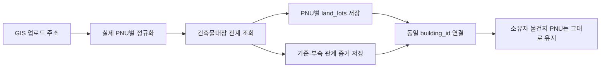

# 건축물대장 기준·부속지번 GIS 자동 연결 설계

- 상태: 구현 준비안 (코드·DB 미변경, 독립 리뷰 완료)
- 작성일: 2026-07-14
- 적용 시점: 조합 시스템관리자의 GIS 정보 업로드
- 구현 범위: `tonghari-api` 수집·연결 로직, `tonghari-web` DB migration·관리자 결과 표시
- 대체 명세: workspace `../docs/superpowers/specs/2026-04-16-building-merge-auto-detect-design.md`

## 1. 결론

건축물대장의 기준지번과 부속지번은 하나의 PNU로 병합하지 않는다.

각 실제 필지는 다음과 같이 독립적으로 유지한다.

- `land_lots`: 실제 PNU별 한 행
- `property_units.pnu`: 소유자의 실제 물건지 PNU 유지
- `property_ownerships`: 이동·비활성화하지 않음
- `building_registry_land_lot_relations`: 건축물대장 기준·부속 관계의 원천 증거
- `building_land_lots`: 기준·부속 PNU를 같은 `building_id`에 연결한 운영 projection

기존 수동 지번 병합 함수는 `property_units.pnu` 변경, 소유관계 이동·비활성화, 물건지 soft delete까지 수행하므로 자동 연결 경로에서 호출하지 않는다.

현재 `buildings`, `building_external_refs`, `building_land_lots`는 `union_id`가 없는 전역 물리 건물 모델이고 `building_land_lots.pnu`는 전역 unique이다. 이번 기능은 이 모델을 유지한다. 관계 관측과 `land_lots`는 조합별로 격리하지만, 검증된 건물 projection은 전역 물리 사실로 공유한다. 조합별로 다른 건물 매핑이 필요해지는 경우에는 `union_building_land_lots` 도입을 별도 모델 개편으로 다룬다.



## 2. 요구사항과 판정

### 2.1 Source of truth

이번 설계는 다음 근거를 함께 적용한다.

1. Obsidian의 최신 추정분담금·소유자 모델
   - 감정평가 데이터의 물건지 식별 기준은 실제 지번 주소이다.
   - 대표 PNU 재사용으로 발생한 중복은 실제 중복이 아니다.
   - 물건지 식별은 PNU 하나만이 아니라 실제 지번 주소와 동·호 정보를 함께 보존해야 한다.
2. 현재 운영 코드와 DB
   - GIS 업로드는 쉼표로 묶인 지번 셀의 첫 PNU만 저장한다.
   - 조합원 업로드는 누락된 부속 PNU를 대표 PNU로 치환한다.
   - 현재 수동 병합은 건물 연결을 넘어 물건지와 소유관계까지 변경한다.
3. 국토교통부 건축물대장정보 서비스
   - `getBrAtchJibunInfo`가 기준지번과 부속지번을 명시적으로 제공한다.
   - `getBrTitleInfo.bylotCnt`는 외필지수이므로 직접 조회 게이트로 사용할 수 있다.

### 2.2 기존 명세와의 충돌 판정

기존 `2026-04-16-building-merge-auto-detect-design.md`는 건물명이 같으면 LLM이 같은 건물로 판단하고 모든 물건지 PNU를 대표 PNU로 변경하도록 설계되어 있다. 이 방식은 다음 이유로 폐기한다.

- retired된 `user_property_units` 모델을 기준으로 한다.
- 공식 관계가 아닌 건물명·본번 유사도로 추정한다.
- 실제 물건지 PNU와 주소를 서로 다르게 만든다.
- 소유권 이동과 물건지 비활성화를 자동 수행한다.
- 현재 추정분담금의 실제 물건지 단위 요구사항과 충돌한다.

새 설계가 기존 자동병합 명세와 조합 임포트의 해당 단계를 대체한다.

## 3. 현재 문제의 정확한 경로

현재 데이터가 대표 PNU로 접히는 과정은 다음과 같다.

1. GIS 엑셀의 `749-36, 749-5` 같은 셀을 하나의 주소 문자열로 API에 전달한다.
2. 주소 파서는 문자열의 첫 지번만 읽어 `749-36` PNU를 만든다.
3. `land_lots`에는 기준 PNU 한 행만 생성되고 주소에는 여러 지번 문자열이 남는다.
4. 조합원 엑셀은 같은 셀을 지번별로 분리하므로 `749-5` 물건지를 별도로 만든다.
5. `749-5` PNU가 `land_lots`에 없으면 `resolveMergedPnu`가 주소 문자열을 검색해 `749-36`으로 치환한다.
6. 결과적으로 `property_address_jibun`은 `749-5`인데 `property_units.pnu`는 `749-36`인 행이 생긴다.

삼양동 운영 데이터에서 확인한 현재 상태는 다음과 같다.

- 쉼표로 합쳐진 기준 필지 그룹: 8개
- 해당 그룹의 부속 PNU: 14개
- DB에 존재하는 부속 `land_lots`: 0개
- 활성 `property_units` 중 `previous_pnu`가 있는 행: 228개
- 알려진 8개 그룹에서 실제 주소 PNU와 저장 PNU가 다른 행: 164개
- `previous_pnu`도 실제 주소와 일치하지 않는 사례가 있어 일괄 복원 기준으로 사용할 수 없음

이 8개/14개는 현재 쉼표 주소에서 추출한 legacy 후보 수치이며 아직 공식 API dry-run으로 확정한 관계 수는 아니다.

따라서 자동 연결은 관계 테이블만 추가하는 것으로 끝나지 않는다. GIS 입력을 실제 PNU별로 펼치고 부속 `land_lots`를 개별 생성하며, 신규 업로드에서 대표 PNU 치환을 중단해야 한다.

## 4. 설계 불변조건

자동 연결의 모든 구현은 다음 조건을 지켜야 한다.

1. 한 실제 필지에는 한 실제 PNU가 유지된다.
2. 기준지번과 부속지번은 같은 건물에 연결될 수 있지만 같은 필지가 되지는 않는다.
3. 자동 연결은 `property_units.pnu`, `previous_pnu`, `property_ownerships`를 변경하지 않는다.
4. 자동 연결은 물건지를 비활성화하거나 soft delete하지 않는다.
5. 건물명, 같은 본번, 인접 번호만으로 관계를 추정하지 않는다.
6. 공식 API가 완전하게 반환한 관계 또는 이미 저장된 공식 관계만 사용한다.
7. 부분 응답과 API 실패에서는 기존 관계를 삭제하거나 비활성화하지 않는다.
8. 수동 매핑과 기존 다른 건물 매핑은 자동으로 덮어쓰지 않는다.
9. 관계 관측과 필지 데이터는 `union_id` 범위에서 처리한다. 전역 건물 projection은 공식 근거가 완전하고 기존 매핑 충돌이 없을 때만 적용한다.
10. 동일 GIS 작업과 재실행은 멱등적이어야 한다.

## 5. 외부 API 계약

공식 서비스: [국토교통부 건축물대장정보 서비스](https://www.data.go.kr/data/15134735/openapi.do)

### 5.1 사용 API

| API | 용도 | 핵심 필드 |
| --- | --- | --- |
| `getBrTitleInfo` | 표제부와 외필지수 확인 | `mgmBldrgstPk`, `bylotCnt`, 기준 지번 필드 |
| `getBrAtchJibunInfo` | 기준·부속지번 관계 조회 | 기준 지번 필드, `atch*` 부속 지번 필드, `mgmBldrgstPk` |
| `getBrExposInfo` | canonical 건물의 전유부 조회 | `mgmBldrgstPk`, 동·호, 면적 |

`getBrAtchJibunInfo`의 요청 검색조건에는 `atchBun`, `atchJi`가 없다. 따라서 기준지번을 알면 직접 조회할 수 있지만 부속지번만 입력된 경우에는 직접 역조회할 수 없다.

### 5.2 PNU 변환

건축물대장 API의 `platGbCd`와 PNU의 토지구분 숫자는 그대로 연결되지 않는다.

| 건축물대장 `platGbCd` | 의미 | PNU 토지구분 |
| --- | --- | --- |
| `0` | 대지 | `1` |
| `1` | 산 | `2` |
| `2` | 블록 | 일반 지적 PNU 생성 불가, 검토 처리 |

기준 PNU와 부속 PNU는 다음 필드를 각각 사용해 19자리로 만든다.

- 기준: `sigunguCd + bjdongCd + platGbCd 변환값 + bun + ji`
- 부속: `atchSigunguCd + atchBjdongCd + atchPlatGbCd 변환값 + atchBun + atchJi`

19자리 숫자, 기준과 부속이 서로 다름, 법정동 코드 유효성을 검증한다.

### 5.3 공통 API 클라이언트 규칙

- HTTPS 사용
- `getBrTitleInfo`, `getBrExposInfo`, `getBrAtchJibunInfo` 모든 요청에 PNU 토지구분 `1/2`를 API `platGbCd 0/1`로 변환해 전달
- 요청 timeout 15초
- 최대 3회 재시도, exponential backoff와 jitter 적용
- timeout, 408, 429, 5xx만 재시도
- 인증키·파라미터 오류는 즉시 실패
- `items.item`의 단일 객체/배열 응답을 배열로 정규화
- `totalCount`까지 모든 페이지를 확인
- 정상 0건과 장애로 인한 빈 결과를 구분
- 반환 상태: `SUCCESS`, `EMPTY`, `PARTIAL`, `RETRYABLE_ERROR`, `PERMANENT_ERROR`

## 6. 데이터 모델

### 6.1 관계 원천 테이블

`building_registry_land_lot_relations`를 신규 생성한다. API의 기준 PNU 하나, 부속 PNU 하나, 건축물대장 관리번호 하나를 증거 한 행으로 저장하는 pair-evidence 모델이다.

group/member 2개 테이블보다 현재 요구에 단순하고, 정방향·역방향 조회와 멱등 upsert가 쉽다. `building_land_lots`는 건물 projection이라 기준·부속 관계의 원천 저장소로 재사용하지 않는다.

제안 컬럼:

| 컬럼 | 타입 | 설명 |
| --- | --- | --- |
| `id` | `uuid` | PK, `gen_random_uuid()` |
| `union_id` | `uuid` | 조합 FK |
| `base_pnu` | `varchar(19)` | 기준 PNU |
| `attached_pnu` | `varchar(19)` | 부속 PNU |
| `mgm_bldrgst_pk` | `text` | 관계를 반환한 건축물대장 관리번호 |
| `link_status` | `text` | `DISCOVERED`, `LINKED`, `CONFLICT`, `STALE_REVIEW` |
| `is_active` | `boolean` | 현재 공식 관계 여부 |
| `first_seen_at` | `timestamptz` | 최초 확인 시각 |
| `last_seen_at` | `timestamptz` | 최근 완전 조회 확인 시각 |
| `last_applied_run_started_at` | `timestamptz` | 동시 작업 순서 판정에 사용한 작업 시작 시각 |
| `last_complete_scan_at` | `timestamptz` | 같은 관리번호 범위의 전체 페이지 완료 시각 |
| `stale_miss_count` | `integer` | 연속 완전 조회 누락 횟수 |
| `stale_candidate_at` | `timestamptz` | 첫 완전 조회 누락 시각 |
| `deactivated_at` | `timestamptz` | 비활성화 시각 |
| `last_seen_sync_job_id` | `uuid` | 마지막 GIS 작업 FK |
| `metadata` | `jsonb` | 기대·관측 건수, 조회 방식, API 버전 등 |
| `created_at`, `updated_at` | `timestamptz` | 감사 시각 |

제약과 인덱스:

```text
UNIQUE (union_id, base_pnu, attached_pnu, mgm_bldrgst_pk)
CHECK (base_pnu ~ '^[0-9]{19}$')
CHECK (attached_pnu ~ '^[0-9]{19}$')
CHECK (base_pnu <> attached_pnu)
FK (base_pnu, union_id) -> land_lots (pnu, union_id)
FK (attached_pnu, union_id) -> land_lots (pnu, union_id)
INDEX (union_id, attached_pnu) WHERE is_active
INDEX (last_seen_sync_job_id)
```

같은 부속 PNU가 서로 다른 활성 기준 PNU에 연결되는 응답은 DB에서 임의로 하나를 고르지 않고 `CONFLICT`로 기록한다. `last_seen_sync_job_id`가 같은 조합의 작업인지 RPC에서 `sync_jobs.union_id = union_id`를 확인한다.

### 6.2 건물 연결 provenance

`building_land_lots`는 전역 실제 PNU→물리 건물 projection으로 계속 사용하되 다음 provenance를 추가한다.

| 컬럼 | 값 |
| --- | --- |
| `mapping_source` | `GIS_DIRECT`, `BUILDING_REGISTER_ATTACHED`, `MANUAL`, `LEGACY` |
| `last_verified_at` | 공식 관계를 마지막으로 확인한 시각 |
| `last_sync_job_id` | 관계를 투영한 GIS 작업 |

전역 수동 매핑은 시스템관리자만 만들 수 있게 제한한다. 우선순위는 `MANUAL > BUILDING_REGISTER_ATTACHED > GIS_DIRECT > LEGACY`로 간주하되, 자동 프로세스는 `MANUAL` 또는 다른 건물을 가리키는 `LEGACY`를 덮어쓰지 않고 충돌로 남긴다.

migration 시 provenance가 없는 기존 `building_land_lots`는 전부 보수적으로 `LEGACY`로 backfill한다. `note`나 `previous_building_id`만으로 수동·자동 여부를 추정하지 않는다. migration 이후의 수동 RPC는 `MANUAL`, 일반 GIS는 `GIS_DIRECT`, 공식 부속지번 projection은 `BUILDING_REGISTER_ATTACHED`를 반드시 기록한다.

### 6.3 RLS와 권한

- 신규 public 테이블에 RLS 활성화
- `anon`의 모든 권한 회수
- 쓰기와 reconcile RPC 실행은 `service_role`만 허용
- `authenticated` SELECT는 최초 구현에서 시스템관리자에게만 허용
- 기존 `building_land_lots`의 브라우저 직접 쓰기를 제거하고 전역 수동 매핑은 시스템관리자 RPC로만 허용
- 현재 RLS가 꺼진 `building_external_refs`의 소비자를 점검한 뒤 RLS를 활성화하고 `anon/authenticated` 쓰기 권한 회수
- RPC는 `SECURITY INVOKER`
- RPC의 `PUBLIC`, `anon`, `authenticated` EXECUTE 권한 회수
- FK와 역조회 인덱스를 함께 생성

## 7. GIS 업로드 처리 흐름

현재 주소별로 조회와 저장을 즉시 수행하는 단일 반복문을 다음 5단계로 분리한다.

### Phase A. `DISCOVER_PNU`

1. 업로드 셀을 실제 지번 단위로 정규화한다.
2. `749-36, 749-5`처럼 명시된 지번은 주소 접두어를 보존하면서 각각 분리한다.
3. `838-0 외 3필지`처럼 번호가 생략된 값은 기준지번과 기대 외필지수만 기록한다.
4. 각 주소를 PNU로 변환하고 PNU 기준으로 중복 제거한다.
5. 원본 셀, 정규화 주소, PNU, 발견 출처를 작업 항목에 보존한다.

이 단계부터 `land_lots.address`에는 쉼표로 합친 문자열이 아니라 해당 PNU의 단일 지번 주소만 저장한다.

### Phase B. `DISCOVER_ATTACHED_LOTS`

각 고유 PNU에 대해 다음 순서로 관계를 찾는다.

1. 기존 활성 관계를 `base_pnu`와 `attached_pnu` 양방향으로 조회한다.
2. `getBrTitleInfo`의 전체 페이지를 조회해 관리번호별 표제부 snapshot을 만든다.
3. `bylotCnt > 0`인 기준 PNU만 `getBrAtchJibunInfo`로 직접 조회한다.
4. 모든 페이지가 성공하면 `(base_pnu, attached_pnu, mgmBldrgstPk)` 증거를 만들고 중복 제거한다.
5. `mgmBldrgstPk`별 `bylotCnt`와 같은 관리번호의 distinct 부속 PNU 수를 비교한다.
6. 완전한 관계에서 발견한 기준·부속 PNU를 작업 대상에 추가한다.

완전한 표제부 snapshot에서 이전 관리번호가 사라졌거나 기존 관리번호의 `bylotCnt`가 0으로 바뀌면 해당 관리번호의 부속관계를 “완전한 0건 관측”으로 reconcile한다. 표제부가 부분응답 또는 실패이면 기존 관계의 miss count를 변경하지 않는다.

API가 새 부속 PNU를 반환하면 법정동 코드 역매핑과 지번 필드로 단일 지번 주소를 만든다. PNU와 주소가 검증되면 경계·면적·가격이 아직 없어도 최소 식별 행을 먼저 만들 수 있다. 주소를 검증하지 못하면 임의 placeholder를 만들지 않고 `UNRESOLVED_ATTACHED_PNU`로 남긴다.

발견 깊이는 1로 제한하고 PNU `Set`으로 재귀 호출과 중복 수집을 방지한다.

### Phase C. 부속 PNU만 입력된 역조회

부속지번 요청 파라미터가 없으므로 기준 PNU를 모르는 역조회는 완전성을 보장할 수 없다. `platGbCd`도 기준지번 필터이고, 기준과 부속의 법정동 코드가 다를 수 있다. 최초 구현은 무제한 법정동 sweep을 실행하지 않고 다음 안전 정책을 사용한다.

1. 저장된 활성 관계를 먼저 역조회한다.
2. 관계가 없고 표제부도 없는 PNU만 역조회 대상으로 분류한다.
3. 저장 관계가 없으면 추정 연결하지 않고 `REVERSE_LOOKUP_PENDING`으로 남긴다.
4. 기준지번 또는 형제지번이 같은 업로드에 있어 직접 관계가 확인되면 그 결과로 해소한다.

저장된 evidence가 이후 작업의 positive cache 역할을 한다. 부속 단독 입력을 신규로 역해결해야 한다면 별도 단계에서 시군구 단위 인덱스 또는 공급자 전체 데이터 캐시를 구축한다. 그 단계는 최대 페이지, API 호출 수, 실행시간, 30일 TTL, 중단·재개 checkpoint를 먼저 정의한 뒤 활성화한다.

### Phase D. `COLLECT_LAND_DATA`

명시 입력과 API 발견 PNU 모두를 대상으로 다음 데이터를 PNU별로 수집한다.

- 필지 경계
- 토지대장 면적·지목·소유자 수
- 개별공시지가
- 단일 지번 주소와 도로명 주소

`land_lots`는 `(pnu, union_id)`로 각각 upsert한다. 일부 보조 데이터가 실패해도 PNU와 단일 지번 주소가 검증됐으면 nullable 필드는 비워 두고 identity row를 저장하며, 실패 항목은 작업 결과에 남긴다.

### Phase E. `MATERIALIZE_BUILDING_LINKS`

모든 필지 저장이 끝난 뒤 완전한 공식 그룹만 한 번에 투영한다.

1. 관리번호별 관계 완전성을 확인하고 canonical `building_id`를 결정한다.
2. 관리번호가 하나이면 기준 PNU의 건물을 canonical로 선택하거나 생성한다.
3. 복수 관리번호가 있으면 관리번호별 완전 응답의 정규화된 기준·부속 PNU 집합이 모두 동일한지 확인한다.
4. 집합이 동일하고 기존 external ref가 서로 다른 내부 건물을 가리키지 않으면 기준 PNU의 canonical 건물 하나를 생성·재사용하고 모든 관리번호를 그 건물의 external ref로 연결한다.
5. 집합이 다르거나 기존 external ref가 서로 다른 내부 건물을 가리키면 자동 projection하지 않는다.
6. `mgmBldrgstPk`별 표제부·전유부를 canonical 건물에 저장한다.
7. 기준과 모든 부속 PNU의 `building_land_lots`를 같은 `building_id`로 upsert한다.
8. 관계 evidence의 `link_status`를 `LINKED`로 갱신한다.
9. 기존 매핑이 다른 건물을 가리키면 자동 재배치하지 않고 `CONFLICT`로 남긴다.
10. 필요하면 기존 `linkPropertyUnitsToBuildingUnits`에 `unionId` 인자를 추가하고 쿼리에 `.eq('union_id', unionId)`를 적용한 뒤 동일 건물의 동·호를 연결한다. PNU와 소유권은 변경하지 않는다.

신규 업로드에서는 관계 발견을 건물 저장보다 먼저 수행하므로, 부속 PNU마다 중복 `buildings`가 생성되지 않는다.

관계 upsert는 조합 범위, 건물 projection은 전역 물리 PNU 범위의 원자적 DB RPC로 처리한다. RPC는 요청 조합에 각 PNU의 `land_lots`가 존재하는지 확인한 뒤 정렬된 PNU에 transaction advisory lock을 걸고 projection한다. 웹의 `parcelActions` 병합 함수를 import하거나 복제하지 않는다.

## 8. 멱등성·부분응답·충돌 정책

### 8.1 관계 upsert

`(union_id, base_pnu, attached_pnu, mgm_bldrgst_pk)`로 upsert한다.

- `first_seen_at`은 보존
- `last_seen_at`은 `greatest(existing, excluded)`
- 같은 관계는 `is_active=true`로 재확인
- RPC 입력 `run_started_at`이 저장된 `last_applied_run_started_at`보다 과거면 상태·miss count를 변경하지 않음
- `(union_id, base_pnu, mgm_bldrgst_pk)` 범위에 transaction advisory lock 적용

### 8.2 비활성화

같은 `(union_id, base_pnu, mgm_bldrgst_pk)`의 모든 페이지가 성공한 완전 조회에서만 이번에 보이지 않은 기존 evidence를 stale 후보로 만든다.

- 부분 응답·timeout·파싱 오류에서는 비활성화 금지
- 1회 누락 즉시 비활성화하지 않음
- 완전 조회 누락마다 `stale_miss_count` 증가
- 첫 누락에서 `stale_candidate_at` 설정
- 2회 연속 완전 조회 누락이고 `stale_candidate_at` 후 7일이 지난 경우에만 비활성화
- 다시 관측되면 `stale_miss_count=0`, `stale_candidate_at=null`, `deactivated_at=null`
- 물건지나 수동 매핑이 연결된 관계는 자동 해제하지 않고 검토 전환

비활성화된 공식 evidence는 child-only positive cache에서 제외한다. 기존 전역 `building_land_lots` projection은 자동으로 되돌리지 않고 관계를 `STALE_REVIEW`로 표시해 시스템관리자 검토 대상으로 보낸다.

### 8.3 건물 충돌

다음은 자동 연결하지 않고 `CONFLICT`로 기록한다.

- 같은 부속 PNU가 여러 기준 PNU에 연결됨
- 복수 `mgmBldrgstPk`가 서로 다른 내부 `building_id`에 매핑되어 canonical 건물을 하나로 증명할 수 없음
- 기존 `MANUAL` 매핑이 다른 건물을 가리킴
- 기존 `LEGACY` 매핑과 공식 관계의 canonical 건물이 다름
- 관리번호별 외필지수와 같은 관리번호의 완전 응답 distinct 부속 수가 다름
- 블록 지번처럼 PNU를 만들 수 없음

## 9. 기존 병합과 조합원 업로드 처리

### 9.1 자동 경로에서 금지할 함수

- `mergeCurrentPnuIntoLinkedParcel`
- `mergeMultiplePnusIntoPnu`
- `mergeDuplicatePropertyUnits`
- `undoMergeForPnu`를 자동 연결의 보상 트랜잭션으로 사용하는 방식

### 9.2 수동 UI의 역할 변경

현재 “건물 매칭/지번 병합” UI는 다음처럼 분리한다.

- 건축물대장 공식 관계: 조회 전용 또는 충돌 검토 UI
- 건물 연결: PNU는 유지하고 `building_land_lots`만 수동 지정
- 실제 합필·폐지·잘못된 PNU 정정: 별도 고위험 관리 기능, 명시적 확인과 감사로그 필수

### 9.3 `resolveMergedPnu` 폐기

신규 member upload는 주소에서 만든 실제 PNU를 유지한다.

- exact `land_lots`가 없으면 대표 PNU로 치환하지 않음
- 누락 PNU를 `MISSING_LAND_LOT`로 보고하고 GIS 재수집 대상으로 등록
- 건축물 관계는 같은 건물·호실 탐색에만 사용
- 새 자동 연결 출시와 동시에 `resolveMergedPnu`를 제거하거나 feature flag를 끔. 부분실패 때 다시 대표 PNU로 접히는 기간을 허용하지 않음

## 10. 보안 선행조건

현재 웹 Server Action은 JWT를 보내지만 `POST /api/gis/sync`에는 `authMiddleware`가 적용되어 있지 않다. `authMiddleware`는 현재 JWT의 `userId`, `unionId`만 검증하고 역할은 확인하지 않는다. service role로 관계와 건물 projection을 자동 생성하기 전에 다음을 선행한다.

1. `POST /api/gis/sync`와 `GET /api/gis/status/:jobId`에 `authMiddleware` 적용
2. service-role 조회로 `user_auth_links.auth_user_id = JWT userId`를 따라 `users`를 찾음
3. `users.role = 'SYSTEM_ADMIN'`, `is_blocked IS NOT TRUE`를 확인함
4. 요청 `unionId`가 실제 조합인지 확인하고 JWT `unionId`가 `system` 또는 요청 조합인지 검증함
5. 상태 조회는 메모리 map만 신뢰하지 않고 `sync_jobs.id`, `sync_jobs.union_id`를 조회한 뒤 동일 권한을 적용함
6. 작업의 모든 발견 PNU가 해당 요청 또는 공식 관계에서 파생됐는지 감사 정보 보존

GIS 관리 화면은 현재 systemAdmin 전용이므로 최초 구현 권한은 `SYSTEM_ADMIN`으로 제한한다. 조합 관리자에게 직접 개방할 필요가 생기면 `get_user_role_in_union(union_id)`와 동등한 서버 권한 계약을 별도로 추가한다.

## 11. 작업 결과와 관리자 UI

기존 `sync_jobs.status`는 우선 `COMPLETED`, `FAILED`를 유지하고 관계 단계의 부분 성공은 `preview_data.attachedLotSync.status`로 표현한다.

```json
{
  "attachedLotSync": {
    "status": "COMPLETED",
    "relationGroupCount": 8,
    "relationCount": 14,
    "discoveredParcelCount": 14,
    "linkedParcelCount": 22,
    "alreadyLinkedCount": 0,
    "conflictCount": 0,
    "reverseLookupPendingCount": 0,
    "partialGroupCount": 0,
    "apiFailureCount": 0
  }
}
```

`PARTIAL`이어도 정상 저장된 GIS 필지를 실패 처리하지 않는다. 관리자 UI에는 완료 토스트와 함께 자동 연결, 신규 발견, 충돌, 역조회 대기, API 실패 건수를 표시한다.

구조화 로그에는 최소한 다음 필드를 남긴다.

```text
jobId, unionId, phase, scope, basePnu, attachedPnu,
mgmBldrgstPk, page, attempt, result, errorCode
```

## 12. 구현 범위와 파일

### `tonghari-api`

- `src/services/gis.service.ts`
  - 공통 건축물대장 클라이언트
  - `getBrAtchJibunInfo` 전체 페이지 조회
  - PNU↔`platGbCd` 변환과 응답 정규화
- `src/services/gis.queue.service.ts`
  - 5단계 GIS job
  - 입력 PNU dedupe, 관계 발견, 대상 확장, 최종 reconcile
- `src/services/supabase.service.ts`
  - 관계 batch upsert와 원자적 projection RPC 호출
- `src/routes/gis.ts`
  - 인증과 조합 권한 검증
- `src/types/gis.types.ts`
  - 단계별 결과, 관계, 오류 코드 타입
- `tests/`
  - API 파서·페이지·큐·멱등성 테스트

### `tonghari-web`

- `supabase/migrations/`
  - 관계 테이블, provenance, RLS, RPC
- `app/_lib/shared/type/database.types.ts`
  - DB 타입 재생성
- `app/systemAdmin/gis/page.tsx`
  - 자동 연결 결과와 충돌 요약
- `app/_lib/features/gis/actions/parcelActions.ts`
  - 수동 병합 기능 분리·격리와 provenance 기록
- `app/systemAdmin/gis/members/`
  - 대표 PNU 치환 제거에 맞춘 누락 필지 보고

## 13. 테스트 설계

### 13.1 단위 테스트

- API `platGbCd 0→PNU 1`, `1→2`, `2→검토` 변환
- PNU 토지구분 `1→API 0`, `2→API 1`을 title/expos/attached 요청 모두에 전달
- `items.item` 단일 객체와 배열 정규화
- `totalCount` 전체 페이지 순회
- `bylotCnt=0`일 때 부속 API 미호출
- `mgmBldrgstPk`별 `bylotCnt`와 distinct 부속 수 비교
- 중복 응답 pair dedupe
- API retry와 오류 분류
- 부분 응답에서 stale 비활성화 금지
- 같은 job 재실행의 upsert 멱등성

### 13.2 통합 테스트

- 기준만 입력과 기준·부속 혼합 입력의 결과 동일
- 부속만 입력은 저장된 공식 관계가 있으면 동일 결과, 관계가 없으면 안전하게 `REVERSE_LOOKUP_PENDING`
- 입력 순서가 바뀌어도 같은 결과
- 각 PNU의 `land_lots` 개별 행 유지
- canonical 내부 건물이 하나로 증명된 그룹의 모든 PNU가 같은 `building_id`에 연결
- 복수 관리번호가 서로 다른 내부 건물을 가리키면 관계만 저장하고 projection은 충돌 처리
- `property_units.pnu`, `previous_pnu`, 활성 소유권 수 불변
- 관계 테이블은 조합별 `land_lots`가 없는 PNU의 생성 차단
- 전역 건물 projection은 다른 조합의 `property_units`를 변경하지 않음
- 수동·legacy 매핑 충돌 시 자동 덮어쓰기 금지
- 동일 작업 재실행 시 relation/building/unit 중복 없음

### 13.3 삼양동 회귀 fixture

| 기준지번 | 부속지번 | 관계 수 |
| --- | --- | ---: |
| 749-36 | 749-5 | 1 |
| 760-116 | 760-48, 760-49 | 2 |
| 791-2008 | 791-2009, 791-2770, 791-3706, 791-3713 | 4 |
| 791-2012 | 791-4696 | 1 |
| 791-2121 | 839-329 | 1 |
| 791-3489 | 791-3582 | 1 |
| 791-4143 | 791-3588 | 1 |
| 836-75 | 836-77, 836-78, 836-79 | 3 |

이 표는 legacy 후보 fixture다. 공식 API dry-run이 모두 확인하면 기대 결과는 8개 관계 후보, 14개 기준·부속 pair, 22개 실제 `land_lots`이다. 내부 `buildings` 수는 `mgmBldrgstPk` cardinality와 canonical 판정 후 확정한다.

반례 fixture:

- `745-1`, `745-2`, `745-3`에 공식 관계가 없으면 세 필지를 독립 유지한다.
- 동일 건물명이나 같은 본번만으로 연결하지 않는다.
- 두 번째 페이지 timeout이면 미조회 관계를 삭제하지 않는다.
- `839-329`만 입력했을 때 기존 relation이 있으면 `791-2121`을 찾고, 없으면 `REVERSE_LOOKUP_PENDING`으로 남긴다.

## 14. 기존 삼양동 데이터 보정

자동 연결 배포와 기존 데이터 복원은 같은 작업에서 암묵적으로 실행하지 않는다.

### Backfill A. 관계와 필지

1. 공식 API dry-run으로 8개 알려진 그룹과 `외 N필지` 그룹을 검증한다.
2. 부속 PNU별 단일 주소와 최소 `land_lots`를 만든다.
3. 공식 evidence를 저장하고 canonical 내부 건물이 하나로 증명된 그룹만 같은 건물에 연결한다.
4. 기준 `land_lots.address`의 쉼표 결합 문자열을 단일 지번으로 정규화한다.
5. 이전 원본 문자열은 migration audit 결과에 보존한다.

### Backfill B. 물건지 PNU

별도 dry-run과 승인을 거쳐 처리한다.

1. `property_address_jibun`에서 실제 PNU를 다시 산출한다.
2. 공식 관계 안의 주소인지 확인한다.
3. unique 충돌, 소유자, 지분, 활성 ownership 수를 검증한다.
4. 검증된 행만 실제 PNU로 정규화한다.
5. `previous_pnu`를 정답으로 일괄 적용하지 않는다.
6. 알려진 164개 관계 mismatch와 나머지 24개 이상 징후를 분리한다.

이 backfill은 추정분담금 템플릿의 “소유자별 실제 물건지” 행을 정상화하기 위한 별도 데이터 교정이다. 관계 자동 연결 자체가 템플릿 행을 합치거나 나누지는 않는다.

## 15. 구현 단계

아래 Phase는 개발 순서다. Phase 1의 identity 보호, Phase 2의 건물 projection, 직접 쓰기 권한 회수와 기존 수동 UI 전환은 하나의 production release gate로 배포한다. 어느 하나만 먼저 운영에 반영하지 않는다.

### Phase 1. 비파괴 기반

- 인증 보강
- 관계 테이블과 RLS
- 건축물대장 API 파서·페이지 처리
- GIS 입력 PNU 정규화와 관계 발견
- `land_lots` 개별 생성
- 관계 upsert와 작업 결과 지표
- `resolveMergedPnu` 비활성화·제거
- 누락 PNU를 GIS 재수집으로 보내는 오류 계약
- 기존 destructive 수동 handler 비노출 또는 명시적 고위험 화면으로 격리

### Phase 2. 건물 projection

- `building_land_lots` provenance
- canonical building 생성·재사용 RPC
- canonical 내부 건물이 하나로 증명된 공식 그룹을 같은 `building_id`에 연결
- 안전한 시스템관리자 수동 mapping RPC와 기존 수동 UI 호출 전환
- `building_land_lots` 브라우저 직접 쓰기 권한 회수
- 충돌 UI와 관리자 결과 표시

### Phase 3. 운영 안정화

- 부속 단독 역조회가 필요할 때 범위 인덱스·TTL cache·checkpoint 추가

### Phase 4. 삼양동 backfill

- 공식 관계 dry-run
- 부속 14개 이상 필지 개별 적재
- 기존 228개 `previous_pnu` 행을 실제 주소 기준으로 분류
- 검증된 물건지만 별도 보정
- 추정분담금 템플릿 행과 권리가액 매칭 재검증

## 16. Acceptance checklist

### 요구사항

- [ ] GIS 업로드 중 건축물대장 API로 기준·부속지번을 자동 발견한다.
- [ ] 명시 입력과 API 발견 부속지번을 실제 PNU별 `land_lots`로 저장한다.
- [ ] canonical 내부 건물이 하나로 증명된 공식 그룹의 모든 PNU를 같은 `building_id`에 연결한다.
- [ ] 소유자의 물건지 PNU와 실제 지번 주소를 유지한다.
- [ ] `745-1`, `745-2`, `745-3` 같은 비관계 필지를 추정 연결하지 않는다.

### 안전성

- [ ] 자동 경로가 기존 merge 함수를 호출하지 않는다.
- [ ] `property_units`, `property_ownerships`의 행·활성 상태·PNU가 변하지 않는다.
- [ ] 수동·legacy 충돌을 덮어쓰지 않고 관리자 검토로 보낸다.
- [ ] API 부분응답에서 기존 관계를 비활성화하지 않는다.
- [ ] 관계·필지 쓰기는 인증된 조합 범위, 전역 건물 projection은 service-role RPC와 공식 근거 안에서 수행된다.

### 품질

- [ ] 전체 페이지, 단일 객체 응답, retry, timeout을 테스트한다.
- [ ] 재실행과 입력 순서 변경에도 결과가 동일하다.
- [ ] 삼양동 legacy 후보 8그룹/14 pair/22필지는 공식 API dry-run으로 확인된 항목만 fixture로 확정해 통과한다.
- [ ] 조합 관계 격리, 전역 projection, 수동 매핑 충돌 테스트가 통과한다.
- [ ] 작업 결과에서 성공·부분·충돌·역조회 대기를 구분할 수 있다.

### 완료 기준

- [ ] API·DB migration·웹 타입·관리자 UI 테스트가 모두 통과한다.
- [ ] 작업 브랜치에 최신 기본 브랜치를 merge한 뒤 회귀 테스트를 다시 통과한다.
- [ ] 신규 GIS 업로드에서 대표 PNU 치환이 더 이상 발생하지 않는다.
- [ ] 삼양동 기존 데이터 보정은 별도 dry-run 보고와 승인 후 실행한다.
