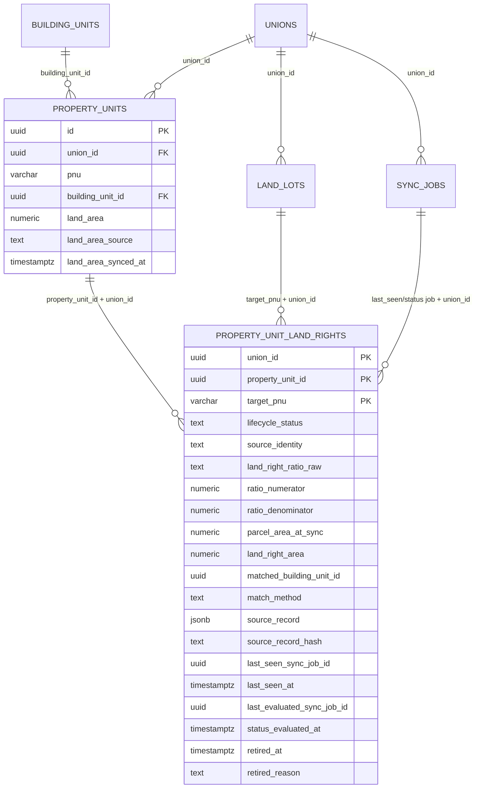
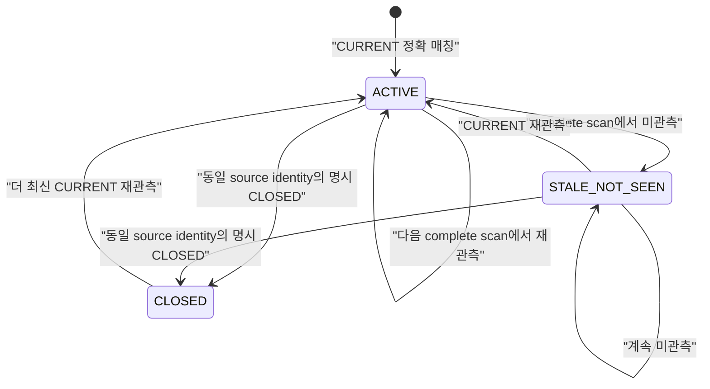
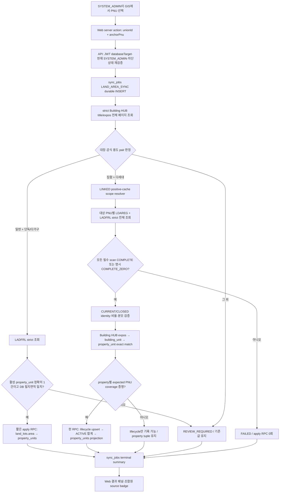

# 적용 토지면적·대지권 자동 동기화 개발 계획

- 작성일: 2026-07-23
- 상태: 구현 전 최종 설계
- API 기준선: `tonghari-api` `origin/main` `13b45d7901f2e01c03fa27e017a61f7a46748a98`
- Web 기준선: `tonghari-web` `origin/master` `7a58d9af7bd8292401d123b7c8908cde4b1bff40`
- 기준 노트:
  - `Projects/Johapon-재건축-갭-감사.md`
  - `Resources/감정평가-사정면적-대지권면적-구분.md`
  - `Projects/Johapon-건축물대장-기준지번-부속지번-자동연결.md`
- 대상 저장소: `tonghari-web`, `tonghari-api`
- 현재 권한: 설계 문서 작성만. migration 적용, API·Web 구현, 개발·운영 DB 변경, 배포는 하지 않음

## 1. 결론

신규 로그 테이블 여러 개를 만들지 않는다. 신규 테이블은 `property_unit_land_rights` 하나만 추가한다.

최종 데이터 흐름은 다음과 같다.

1. `land_lots.area`는 계속 필지 전체의 토지대장 면적으로 유지한다.
2. `property_units.land_area`는 화면·동의율·자산 계산이 읽는 **물건지 적용 토지면적**으로 유지한다.
3. 일반건축물대장이고 용도가 단독주택 또는 다가구주택으로 공식 코드까지 확정되면 `ladfrlList`의 토지대장 면적을 적용한다.
4. 집합건축물대장이고 용도가 다세대주택으로 공식 코드까지 확정되면 `ldaregList`의 대지권을 물건지와 정확 매칭해 적용한다.
5. 연립주택, 아파트, 다중주택, 비주거, 복합용도, 대장 코드 혼재는 이번 자동 적용 범위에서 제외하고 `REVIEW_REQUIRED`로 끝낸다.
6. 외부 API 오류·불완전 페이지·매칭 중복은 0건 응답으로 취급하지 않는다.
7. 수동값도 다음 명시적 관리자 동기화에서 유효한 자동값으로 덮어쓸 수 있다. 단, 자동 수집 근거가 완전하지 않으면 기존값을 유지한다.
8. 동의율 RPC와 자산 계산식은 변경하지 않는다. `property_units.land_area` 값이 바뀌면서 생기는 결과 변화만 회귀 검증한다.

`building_units`에는 대지권 컬럼을 추가하지 않는다. 원천 비율, 대상 PNU, 매칭 근거, 현재성은 신규 테이블에 모은다.

## 2. 문제 정의와 불변식

### 2.1 현재 문제

현재 `property_units.land_area` 하나가 다음 의미를 함께 떠맡고 있다.

- 필지 전체 면적
- 물건지별 대지권면적
- 관리자가 입력한 등기·명부 값
- 과거 생성 로직이 복사한 값

출처와 동기화 시각이 없으므로 같은 숫자라도 토지대장, 대지권등록부, 수동입력, 과거 미확인 중 무엇인지 알 수 없다.

이 값은 면적 동의율에서 `property_unit`당 한 번 가산된다. 공동소유자가 여러 명이어도 같은 물건지 면적을 소유자 수만큼 다시 곱하지 않는다. 따라서 잘못된 필지 전체면적이나 대지권면적은 70% 경계 판정을 바꿀 수 있다.

### 2.2 반드시 지킬 불변식

- `land_lots.area`는 필지 전체 면적이다.
- `property_units.land_area`는 이미 물건지에 적용할 면적이다.
- `property_units.land_area`에 소유지분을 한 번 더 곱하지 않는다.
- 공동소유자 수가 아니라 `property_unit.id`가 면적의 저장·가산 단위다.
- 기준 PNU와 부속 PNU를 합치거나 대표 PNU로 치환하지 않는다.
- 대지권 동기화가 `building_unit` 또는 `property_unit`을 새로 만들지 않는다.
- 0건, 오류, 불완전 응답을 서로 다른 상태로 유지한다.
- API에 단순히 보이지 않은 기존 세대는 숫자를 지우지 않는다.
- 명시적 말소·폐쇄와 단순 미관측은 다르게 처리한다.
- 외부 HTTP 호출은 DB transaction 밖에서 끝낸다.
- 검증된 현재 상태 적용만 짧은 DB transaction 한 번으로 수행한다.

## 3. 범위

### 3.1 이번 구현 범위

- `property_units` 출처·자동 동기화 시각 컬럼
- 신규 `property_unit_land_rights` 테이블 1개
- `LAND_AREA_SYNC` job type
- V-World `ladfrlList`, `ldaregList` strict adapter
- Building HUB 표제부·전유부 strict adapter와 주택 유형 분기
- 기존 확정 `LINKED` 필지 관계를 읽는 내부 scope resolver
- 정확한 동·호·층 및 building-unit/property-unit 매칭
- 원자 적용 RPC와 provenance 보호 trigger
- systemAdmin GIS의 명시 실행 UI와 결과·미매칭 표시
- 조합원 물건지의 출처 badge, 자동 동기화 시각, 수동편집 dirty-only 처리
- 개발 DB/API/Vercel 검증과 제한적 운영 canary 계획

### 3.2 비범위

- 면적 동의율 RPC 계산식 변경
- 토지 공시지가·자산가액 계산식 변경
- `buldHoCoList` 사용
- 연립주택·아파트·다중주택 자동 대지권 반영
- 신규 동(棟) 엔티티
- 건축물대장 필지 관계의 신규 생성·자동 승격
- `building_unit` 생성·보정
- 정기 스케줄, 자동 편입, worker lease
- 대지권 과거 이력, 페이지 원문, scan 원장 테이블
- 수동 보정 이력 전용 테이블
- 일반 조합관리자에게 동기화 실행 권한 부여

## 4. 리서치 근거

| 근거 | 확인 사항 | 설계 반영 |
| --- | --- | --- |
| V-World 대지권등록목록 | `ldaregList`, 최대 1,000건/page, `pageNo`, `totalCount`, `ldaQotaRate`, `clsSeCode`, 인증·한도 오류 제공 | 전 페이지 strict scan, 비율 원문 저장, 현재/말소 분리 |
| 공공데이터포털 대지권등록정보 | 집합건물의 건축물 정보와 대지권 지분비율 제공 | 다세대 집합건물 분기에만 사용 |
| 건축HUB 건축물대장정보 | 표제부·전유부·관리 PK와 대장 구분 정보 제공 | 대장 구분을 1차 분류, 용도 코드는 exact allowlist |
| 건축물대장 규칙 | 일반건축물대장과 집합건축물대장을 구분 | 단독·다가구와 다세대의 업무 분기 근거 |
| 현행 코드 | Building HUB는 단일 page/오류 축약, `ladfrlList`도 첫 행 중심, 목적 문자열 substring 분류 | 기존 helper를 적재 adapter로 재사용하지 않음 |
| 현행 DB | `land_lots.area`는 필지 전체, `property_units.land_area`는 물건지 소비값, `sync_jobs` 존재 | 신규 로그 테이블 없이 현재 상태 1개 테이블 + job 요약 |

공식 자료:

- [V-World 대지권등록목록조회](https://www.vworld.kr/dtna/dtna_apiSvcFc_s001.do?apiNum=78)
- [공공데이터포털 대지권등록정보](https://www.data.go.kr/data/15123906/openapi.do)
- [공공데이터포털 건축HUB 건축물대장정보](https://www.data.go.kr/data/15134735/openapi.do)
- [건축물대장의 기재 및 관리 등에 관한 규칙](https://www.law.go.kr/LSW/lsInfoP.do?lsiSeq=273103)
- [다가구주택은 공동주택이 아닌 단독주택의 한 종류라는 법제처 해석](https://opinion.lawmaking.go.kr/nl4li/lsItptEmp/355270)

단독·다가구에 필지 전체면적을 적용하는 것은 위 법적 분류와 현재 조합온의 `property_unit` 단위 동의율 규칙을 결합한 **이번 업무 정책**이다. 모든 부동산의 법률상 권리관계를 일반화한 선언은 아니다. 일반대장인데 같은 PNU에 활성 `property_unit`이 둘 이상이면 자동 적용하지 않는 이유도 여기에 있다.

## 5. acceptance checklist

### 5.1 설계 완료 조건

- [x] 신규 테이블을 1개로 제한했다.
- [x] `land_lots.area`와 `property_units.land_area`의 의미를 분리했다.
- [x] 기존 `land_area`를 근거 없이 수동값으로 소급 분류하지 않는다.
- [x] 단독·다가구와 다세대의 자동 수집 원천을 분리했다.
- [x] 아파트·연립·다중·비주거·혼재는 자동 반영하지 않는다.
- [x] `COMPLETE_ZERO`, `FAILED`, `INCOMPLETE`를 분리했다.
- [x] 1,000건 초과 pagination을 검증한다.
- [x] 대상 PNU와 물건지의 다대다 가능성을 모델링했다.
- [x] 미관측, 말소, 현재 행의 수명주기를 한 테이블에서 표현한다.
- [x] 수동 변경과 자동 변경의 provenance를 DB에서 보호한다.
- [x] 멀티테넌시·RLS·ACL·database target 경계를 명시했다.
- [x] systemAdmin 명시 실행과 bounded 결과를 설계했다.
- [x] 동의율·자산 계산은 비범위로 고정하고 회귀 영향만 검증한다.

### 5.2 구현 완료 조건

- [ ] 공식 Building HUB codebook에서 대장·주용도 code/name pair fixture를 고정한다.
- [ ] enum migration과 schema/RPC migration을 개발 DB에서 순서대로 적용한다.
- [ ] DB replay, ACL, trigger, RPC 동시성 테스트가 통과한다.
- [ ] API strict adapter·분류·매칭·queue 테스트가 통과한다.
- [ ] Web type-check, unit test, build가 통과한다.
- [ ] 개발 Vercel에서 systemAdmin 실행·결과·수동편집 충돌을 확인한다.
- [ ] V-World 대지권등록정보 활용신청 후 실제 응답을 검증한다.
- [ ] 동일 후보 커밋이 Web `dev` 검증을 통과한다.
- [ ] canary 전 대상 `property_units` 값을 복구 가능한 형태로 보관한다.
- [ ] canary에서 면적 동의율·자산 표시의 전후 차이를 승인한다.

## 6. 역할별 설계·리뷰 결과

| 파트 | 리서치 | 교차 설계 | 독립 리뷰 | 최종 반영 |
| --- | --- | --- | --- | --- |
| DB | 현행 schema·writer·RLS·동의율 소비 경로 분석 | 단일 현재상태 테이블, RPC, trigger 설계 | 최초 `BLOCK`: 말소/미관측, 경합, provenance, ACL 보완 요구. 개정 후 `APPROVE_WITH_CHANGES` | 수명주기, evaluation job, all-closed 보존, exact allowlist 반영 |
| API/GIS | V-World·Building HUB·queue·status 경로 분석 | strict adapter, 분류, 매칭, job 설계 | 최초 `BLOCK`: 분류 모집단, trusted multi-PNU, write barrier 보완 요구. 개정 후 `APPROVE_WITH_CHANGES` | LINKED scope, property별 coverage proof, identity 분리 반영 |
| Web/운영 | GIS 면적 표시, 조합원 DTO, 수동 writer 분석 | 별도 패널, badge, dirty-only, conflict UX 설계 | `APPROVE_WITH_CHANGES` | 수동 `synced_at=NULL`, 다세대만 자동 안내, exact PNU job scope 반영 |

최종 판정은 다음과 같다.

- 저장 source 값은 `CADASTRAL` 대신 `LADFRL`을 사용한다. 실제 API lineage가 명확하고 `LDAREG`와 대칭이기 때문이다.
- 수동 입력의 `land_area_synced_at`은 `NULL`이다. 수동 수정 시각은 기존 `updated_at`으로 표시한다.
- 대지권면적은 `ldaQotaRate` 분자를 사용한다. 분모는 같은 실행의 토지대장 면적 검증에만 사용한다.
- LDAREG 자동 범위는 다세대주택만이다. 연립·아파트는 후속 정책 승인 전까지 `REVIEW_REQUIRED`다.
- 자동 idempotency key, worker lease, 정기 재실행은 1차 범위에서 제외한다. 중복 실행의 데이터 안전성은 RPC lock·freshness로 보장한다.
- PostgreSQL enum 신규값을 같은 transaction에서 즉시 사용하는 문제 때문에 물리 migration 파일은 2개로 나눈다. 신규 업무 테이블은 여전히 1개다.

## 7. DB 스키마 변화

### 7.1 전체 관계



### 7.2 `property_units` 변경

| 컬럼·제약 | 타입·값 | 의미 |
| --- | --- | --- |
| `land_area_source` | `text NOT NULL DEFAULT 'LEGACY_UNKNOWN'` | `LEGACY_UNKNOWN`, `MANUAL`, `LADFRL`, `LDAREG` |
| `land_area_synced_at` | `timestamptz NULL` | LADFRL/LDAREG 자동 동기화 시각. 수동·기존 미확인은 NULL |
| `(id, union_id)` | unique | 신규 테이블의 tenant-safe composite FK 대상 |
| source/timestamp CHECK | constraint | 수동·미확인은 시각 NULL, 자동은 양수 면적과 시각 필수 |

기존 행은 다음처럼 migration한다.

```text
land_area             기존값 그대로
land_area_source      LEGACY_UNKNOWN
land_area_synced_at   NULL
```

영구 default는 `LEGACY_UNKNOWN`이다. 일반 writer가 `land_area`가 있는 행을 INSERT하거나 실제 숫자를 UPDATE하면 trigger가 `MANUAL`로 바꾼다. 면적 없는 신규 property를 `MANUAL`로 오표시하지 않는다.

### 7.3 신규 `property_unit_land_rights`

이 테이블은 로그가 아니라 **물건지 × 대상 PNU의 마지막 검증 상태**다. 기본키가 같으면 upsert하며 페이지·scan별 행을 계속 쌓지 않는다.

| 그룹 | 컬럼 | 설계 |
| --- | --- | --- |
| tenant·identity | `union_id`, `property_unit_id`, `target_pnu` | composite PK |
| match | `matched_building_unit_id`, `match_method` | `BUILDING_UNIT_ID` 또는 `PNU_DONG_HO` |
| provider identity | `source_identity`, `source_agbldg_sn` | `targetPnu+agbldgSn` 우선, 없으면 versioned immutable-field hash |
| ratio | `land_right_ratio_raw` | API 문자열 그대로. trim·재작성 금지 |
| ratio | `ratio_numerator`, `ratio_denominator` | `numeric(20,10)`, 둘 다 양수, 분자 ≤ 분모 |
| area | `parcel_area_at_sync` | 같은 실행에서 검증한 토지대장 면적 |
| area | `land_right_area` | DB generated `round(ratio_numerator, 4)` |
| source | `source_record` | RPC가 typed scalar로 조립한 v1 exact allowlist JSONB, 최대 8 KiB |
| source | `source_record_hash` | DB generated SHA-256 |
| lifecycle | `lifecycle_status` | `ACTIVE`, `STALE_NOT_SEEN`, `CLOSED` |
| freshness | `last_seen_sync_job_id`, `last_seen_at` | 실제 CURRENT 행을 마지막 관측한 job·시각 |
| evaluation | `last_evaluated_sync_job_id`, `status_evaluated_at` | STALE/CLOSED를 포함해 마지막 complete scan이 평가한 job·시각 |
| retirement | `retired_at`, `retired_reason` | 명시 CLOSED에만 사용 |
| timestamps | `created_at`, `updated_at` | 현재행 생성·갱신 시각 |

`source_record` v1 allowlist:

```text
pnu
agbldgSn
buldNm
buldDongNm
buldFloorNm
buldHoNm
buldRoomNm
ldaQotaRate
clsSeCode
clsSeCodeNm
relateLdEmdLiCode
lastUpdtDt
```

API가 임의 JSON을 넘기게 두지 않는다. RPC가 위 typed scalar만 받아 JSONB를 조립한다. JSONB는 원문 key 순서·공백 보존 형식이 아니므로 `ldaQotaRate` literal은 `land_right_ratio_raw`에도 별도로 그대로 저장한다.

필수 FK:

- `(property_unit_id, union_id) → property_units(id, union_id) ON DELETE CASCADE`
- `(target_pnu, union_id) → land_lots(pnu, union_id) ON DELETE RESTRICT`
- `(last_seen_sync_job_id, union_id) → sync_jobs(id, union_id)`
- `(last_evaluated_sync_job_id, union_id) → sync_jobs(id, union_id)`
- `matched_building_unit_id → building_units(id) ON DELETE SET NULL`

필수 인덱스:

- `(union_id, target_pnu, lifecycle_status)`
- `(last_seen_sync_job_id, union_id)`
- `(last_evaluated_sync_job_id, union_id)`
- 기본키가 `(union_id, property_unit_id, target_pnu)` 합산을 지원한다.

### 7.4 대지권 수명주기

Provider 상태와 DB 상태를 다른 이름으로 사용한다.

```text
Provider sourceState: CURRENT | CLOSED
DB lifecycleStatus:   ACTIVE | STALE_NOT_SEEN | CLOSED
```



투영 규칙:

- `ACTIVE`: 자동 합계 후보
- `STALE_NOT_SEEN`: API 누락 정책에 따라 기존 면적 근거를 보존하되 이번 동기화의 새 부분합 계산에는 사용하지 않는다.
- `CLOSED`: 합계에서 제외
- 어떤 property라도 기대 PNU 중 하나가 `STALE_NOT_SEEN`이거나 현재·과거 component 근거가 없으면 그 property의 기존 `land_area` tuple 전체를 유지한다.
- 모든 기대 PNU coverage가 증명되고 양수 ACTIVE 합계가 있을 때만 새 LDAREG 합계를 반영한다.
- 모든 component가 명시 CLOSED가 되어 합계가 0이어도 `land_area=0/NULL`을 자동 기록하지 않는다. 기존 숫자는 보존하고 source만 `LEGACY_UNKNOWN`, synced time은 `NULL`, outcome은 `ALL_COMPONENTS_CLOSED_REVIEW_REQUIRED`로 남긴다.

### 7.5 비율 산식

예:

```text
ldaQotaRate        181.7/15622.1
ratio_numerator    181.7000000000
ratio_denominator  15622.1000000000
land_right_area    181.7000㎡
```

대지권면적은 분자다. `land_lots.area × 분자 ÷ 분모`로 다시 비례 보정하지 않는다.

수학적으로 분모가 대상 필지면적과 같으면 두 식은 같은 값을 만들지만, 분모가 달라진 상태에서 현재 필지면적으로 재계산하면 원문 대지권 분자를 임의로 바꾸게 된다. 따라서 분모 불일치는 자동 보정이 아니라 검토 사유다.

초기 허용오차:

```text
abs(ratio_denominator - ladfrl_area)
<= max(0.1㎡, ladfrl_area × 0.00001)
```

즉 상대 오차 0.001%와 0.1㎡ 중 큰 값이다. 이 값은 개발 실호출 fixture에서 검증한 뒤 상수와 테스트를 함께 변경할 수 있으며, 환경변수로 조용히 완화하지 않는다.

### 7.6 provenance trigger

`BEFORE INSERT OR UPDATE OF land_area, land_area_source, land_area_synced_at` trigger를 둔다.

| 변경 | 결과 |
| --- | --- |
| 면적 없는 일반 INSERT | `LEGACY_UNKNOWN`, synced NULL |
| 면적 있는 일반 INSERT | `MANUAL`, synced NULL |
| 일반 writer가 면적 숫자 실제 변경 | `MANUAL`, synced NULL |
| 숫자·source·시각 모두 no-op | 기존 provenance 유지 |
| source 또는 synced time만 직접 변경 | 거부 |
| 자동 source 직접 지정 | 거부 |
| canonical RPC가 DB context에서 적용 | `LADFRL` 또는 `LDAREG`, DB-generated synced time |
| 모든 component가 exact CLOSED | 숫자는 보존, `LEGACY_UNKNOWN`, synced NULL. lifecycle을 잠근 canonical RPC에만 허용 |

자동 context는 custom GUC만 신뢰하지 않는다.

- owner `SECURITY DEFINER` RPC
- `current_user`가 함수 owner인지 확인
- transaction-local context가 현재 backend PID와 transaction ID에 일치하는지 확인
- source와 timestamp를 caller 입력으로 받지 않고 DB가 결정
- source-only 변경은 원칙적으로 거부하되, 같은 transaction에서 해당 property의 모든 component가 exact `CLOSED`임을 검증한 canonical RPC의 `LEGACY_UNKNOWN` 전환만 허용

수동 변경은 `property_unit_land_rights` 행을 삭제하지 않는다. 수동값이 현재 화면값이 되고, 이후 관리자가 다시 명시 실행한 동기화에서 모든 coverage·매칭 검증을 통과했을 때만 자동값이 다시 덮어쓴다.

현재 `property_units_admin_all` 정책이 관리자에게 폭넓은 UPDATE를 허용하므로 이 trigger는 단순 편의가 아니라 provenance 위조를 막는 DB 경계다.

### 7.7 migration 파일

논리적 schema 변화는 하나지만 PostgreSQL enum 제약 때문에 파일은 둘로 나눈다.

1. `YYYYMMDDHHMMSS_add_land_area_sync_job_type.sql`
   - `sync_job_type_enum`에 `LAND_AREA_SYNC`만 추가하고 commit
2. `YYYYMMDDHHMMSS_create_property_unit_land_rights.sql`
   - preflight
   - `property_units` 컬럼·unique·CHECK
   - 신규 테이블·FK·인덱스
   - RLS·ACL
   - scope resolver, apply RPC, provenance trigger
   - comments

Migration B preflight:

- `sync_jobs.union_id NOT NULL`
- `sync_jobs(id, union_id)` unique
- `land_lots(pnu, union_id)` PK
- `building_land_lot_positive_cache` 존재
- `pgcrypto` digest 함수의 실제 schema
- 기존 `property_units` 면적 checksum

## 8. GIS 파이프라인



## 9. 주택 유형 분기

분류는 현재 앱의 `building_type`이나 사용자 입력을 사용하지 않는다.

### 9.1 모집단

- scope 내 Building HUB 표제부 전 페이지
- 집합건축물은 전유부 전 페이지
- 현재 유효 행만 사용
- 모든 행이 같은 root 관리번호 계열인지 확인
- `regstrGbCd`, `mainPurpsCd`, `mainPurpsCdNm` 공식 pair를 확인

공식 codebook에서 확인한 pair만 frozen fixture로 허용한다. substring `includes('주택')`로 분류하지 않는다.

### 9.2 결정표

| 대장·용도 판정 | 자동 전략 | 결과 |
| --- | --- | --- |
| 전 행 `regstrGbCd=1`, 공식 단독주택 pair | `LADFRL` | exactly-one property에 필지면적 |
| 전 행 `regstrGbCd=1`, 공식 다가구주택 pair | `LADFRL` | exactly-one property에 필지면적 |
| 전 행 `regstrGbCd=2`, 공식 다세대주택 pair | `LDAREG` | 물건지×PNU 대지권 합계 |
| 연립주택·아파트·다중주택 | 없음 | `REVIEW_REQUIRED` |
| 비주거·복합용도 | 없음 | `REVIEW_REQUIRED` |
| 빈 코드·명칭, code/name 불일치 | 없음 | `REVIEW_REQUIRED` |
| root 관리번호 여러 개 | 없음 | `REVIEW_REQUIRED` |
| 일반·집합 또는 purpose pair 혼재 | 없음 | `REVIEW_REQUIRED` |
| 필수 Building HUB scan 실패·불완전 | 없음 | `FAILED` |

## 10. strict API adapter

### 10.1 공통 결과형

```ts
type StrictScan<T> =
  | { state: 'COMPLETE'; rows: T[]; totalCount: number; pagesFetched: number }
  | { state: 'COMPLETE_ZERO'; rows: []; totalCount: 0; pagesFetched: number }
  | { state: 'FAILED'; issue: ProviderIssue }
  | { state: 'INCOMPLETE'; issue: ProviderIssue };
```

`COMPLETE_ZERO`는 provider success envelope와 명시적 `totalCount=0`이 모두 있을 때만 인정한다. 빈 배열, container 누락, schema 오류는 zero가 아니다.

### 10.2 pagination

1. 첫 page의 `totalCount`를 음수 아닌 정수로 검증한다.
2. `numOfRows=1000`, `ceil(totalCount / 1000)`만큼 순차 조회한다.
3. 모든 page가 같은 `totalCount`를 반환해야 한다.
4. 중간 빈 page, 반복 page, 예상보다 짧은 중간 page, 누적 부족·초과는 `INCOMPLETE`다.
5. 1,000/1,001/2,000/2,001건 경계를 테스트한다.
6. 전체 raw row 수로 완전성을 확인한 뒤에만 dedup한다.

### 10.3 retry와 취소

- timeout, HTTP 429, 5xx만 최대 3회
- exponential backoff + jitter
- `Retry-After`가 있으면 상한 내에서 준수
- HTTP 200 provider error envelope, 401/403, 기타 4xx, JSON/schema 오류는 즉시 실패
- page loop와 retry delay 모두 같은 `AbortSignal`을 확인
- terminal job 또는 fatal error 뒤 늦은 callback은 apply RPC를 호출하지 못한다.

### 10.4 기존 inspector 경계

`gis-inspect.service.ts`는 page 1 raw 진단, continue-on-error, provider 오류 축약을 위한 도구다. 적재 adapter로 재사용하지 않는다.

공유 가능:

- endpoint 상수
- secret masking helper
- PNU parser의 검증된 순수 함수

공유 금지:

- inspector success 판정
- raw response wrapper
- page 1 고정 호출
- exception swallow
- `buldHoCoList`

## 11. multi-PNU scope

legacy `building_land_lots`는 `union_id`가 없으므로 자동 범위 근거로 사용하지 않는다.

내부 `building_land_lot_positive_cache`의 `projection_status='LINKED'` 행만 읽는 service-role 전용 resolver를 둔다.

```sql
resolve_land_area_sync_scope_v1(
  p_union_id uuid,
  p_anchor_pnu varchar
) returns jsonb
```

resolver는 다음을 반환한다.

```json
{
  "state": "RESOLVED",
  "rootBuildingIdentity": "mgmBldrgstPk...",
  "scopePnus": ["19자리"],
  "relationIds": ["uuid"],
  "propertyMembership": [],
  "scopeHash": "sha256..."
}
```

`scopeHash` 입력:

- union ID
- root building identity
- 정렬된 LINKED relation IDs
- 정렬된 expected target PNU
- property와 building-unit의 current membership

Apply RPC는 underlying relation을 안정적으로 잠근 뒤 같은 입력을 재해시한다. 값이 바뀌면 `SCOPE_CHANGED_DURING_SYNC`로 전체 rollback한다.

직접 view grant는 추가하지 않는다.

- resolver: owner `SECURITY DEFINER`, `search_path=''`, 완전수식
- `PUBLIC`, `anon`, `authenticated` execute revoke
- `service_role` execute만 허용
- PENDING, 관계 없음, cross-union, root mismatch는 `REVIEW_REQUIRED`
- resolver와 sync는 관계를 만들거나 LINKED로 승격하지 않는다.

## 12. LDAREG 파싱·identity·매칭

### 12.1 비율 parser

허용:

```text
181.7/15622.1
181.7 / 15622.1
```

거부:

- 분모 0
- 음수·0 분자
- 분자 > 분모
- 지수 표기
- 임의 문자
- overflow
- 분모와 같은 실행의 LADFRL 면적 불일치

Parser는 복사본만 trim한다. 저장 raw는 원문 그대로다.

### 12.2 source identity

1. 공식 응답의 `agbldgSn`이 비어 있지 않고 PNU 내 유일성이 확인되면 `targetPnu + agbldgSn`
2. 그 외에는 versioned immutable identity field hash

Fallback hash에는 다음과 같은 identity 필드만 포함한다.

- target PNU
- 건축물명
- 정규화 동·층·호·실

비율, `clsSeCode`, 데이터 기준일, 관측시각처럼 변할 수 있는 필드는 identity hash에 넣지 않는다.

Dedup:

- 동일 identity·동일 canonical payload: 1건으로 축약
- 동일 identity·다른 payload: 전체 conflict
- 같은 `property_unit + targetPnu`에 서로 다른 CURRENT identity가 2개 이상: 해당 key 전체 제외
- fallback hash collision: 해당 key 전체 제외
- last-write-wins 금지

Provider `sourceState=CLOSED`는 같은 source identity에만 적용한다. identity가 없으면 정확히 하나의 기존 property×PNU key가 증명될 때만 CLOSED로 전환한다. 모호하면 기존 ACTIVE를 유지하고 issue를 남긴다.

### 12.3 exact normalizer

허용 변환:

- Unicode NFKC
- 양끝 trim과 허용된 공백 제거
- 정확한 `제` 접두사 제거
- 정확한 `동`, `호` 접미사 제거
- codebook에 정의한 지하 표기만 `B`로 통일
- 숫자 segment leading zero 정규화

금지:

- `contains`, `endsWith`
- 건물명 임의 제거
- 가격이 있는 후보 우선 선택
- fuzzy score
- 다른 동의 같은 호 추론

서로 다른 원문이 같은 normalized key로 충돌하면 자동 매칭하지 않는다.

### 12.4 매칭 순서

1. LDAREG ↔ complete Building HUB 전유부의 동·층·호 exact match
2. 전유부 root identity와 scope root identity 일치
3. `registry_external_id`로 기존 `building_unit` exact match
4. 외부 ID가 없을 때만 같은 root 범위에서 normalized tuple exact match
5. `union_id + building_unit_id + is_deleted=false`인 `property_unit` 정확히 1건
6. 연결이 없을 때만 expected PNU scope + normalized tuple + `building_unit_id IS NULL` fallback
7. 각 단계 0건 또는 2건 이상은 변경하지 않음

## 13. 원자 적용 RPC

```sql
apply_property_land_area_sync_v1(
  p_union_id uuid,
  p_sync_job_id uuid,
  p_strategy text,
  p_scan_started_at timestamptz,
  p_scan_completeness text,
  p_scope_hash text,
  p_scanned_pnus varchar[],
  p_items jsonb,
  p_result_summary jsonb
) returns jsonb
```

### 13.1 write barrier

- 모든 외부 호출·분류·dedup·매칭이 끝난 뒤 호출한다.
- 필수 PNU 중 하나라도 `FAILED` 또는 `INCOMPLETE`이면 호출 0회다.
- `FAILED/INCOMPLETE`를 payload로 전달하지 않는다.
- `sync_jobs`가 `PROCESSING`, 동일 union, 동일 job type일 때만 적용한다.
- terminal job의 늦은 callback은 거부한다.

### 13.2 deterministic lock

1. `(sync_job_id, union_id)` job row
2. 정렬된 scope relation
3. 정렬된 PNU advisory transaction lock
4. `land_lots` PNU 오름차순
5. 영향 `property_units` UUID 오름차순
6. 기존 rights `(property_unit_id, target_pnu)` 오름차순

그 뒤 scope hash 재검증, freshness 검증, lifecycle 적용, projection, job terminal summary를 한 transaction에서 수행한다.

### 13.3 LADFRL

- 같은 PNU의 활성 `property_unit`이 정확히 1건이어야 한다.
- same-run LADFRL 면적과 DB `land_lots.area`가 허용오차 안에서 일치해야 한다.
- RPC는 DB `land_lots.area`를 읽어 `property_units.land_area`에 적용한다.
- source `LADFRL`, synced time은 DB clock이다.
- 신규 rights 행은 만들지 않는다.
- multi-PNU 일반건축물은 v1 `REVIEW_REQUIRED`다.

### 13.4 LDAREG

- payload key는 `(propertyUnitId, targetPnu)`이며 중복이면 전체 거부한다.
- source identity, raw parser 결과, 분모 허용오차, property scope를 DB에서 재검증한다.
- CURRENT는 `ACTIVE`, 명시 말소는 `CLOSED`, complete-not-seen은 `STALE_NOT_SEEN`으로 평가한다.
- property별 expected target PNU 전체에 current 또는 보존 가능한 prior component 근거가 있어야 한다.
- expected PNU 중 근거가 하나라도 없으면 해당 property tuple을 유지한다.
- `STALE_NOT_SEEN` component가 있으면 새 부분합을 투영하지 않는다.
- coverage가 완전하고 양수 ACTIVE 합계가 있을 때만 합계를 `LDAREG`로 적용한다.
- 모든 component가 CLOSED면 숫자를 0으로 만들지 않는다.
- `COMPLETE_ZERO`인데 기존 component가 전혀 없으면 rights 행을 새로 만들지 않고 property tuple도 유지한다.
- zero PNU와 nonzero PNU가 섞여도 같은 property의 일부 PNU 양수값만 합산하지 않는다.

### 13.5 freshness

- `p_scan_started_at > status_evaluated_at`: 평가 가능
- 동일 시각·동일 job·동일 hash: replay no-op
- 동일 시각·다른 payload: collision
- 더 오래된 scan: write 거부

STALE 평가도 `last_evaluated_sync_job_id/status_evaluated_at`을 갱신하므로 오래된 CURRENT 응답이 다시 ACTIVE로 덮지 못한다.

## 14. Job과 오류 정책

### 14.1 route

```text
POST /api/gis/land-area-sync
GET  /api/gis/land-area-sync/:jobId?unionId=...&pnu=...
GET  /api/gis/land-area-sync/latest?unionId=...&pnu=...
```

실행:

- UUID와 19자리 PNU exact 검증
- Web server와 API에서 SYSTEM_ADMIN 재검증
- `databaseTarget`은 JWT claim만 사용
- durable `sync_jobs` INSERT 성공 후에만 `202`
- queue admission 실패 시 job을 FAILED로 만들고 `503`

상태 조회·갱신:

```text
jobId + unionId + jobType=LAND_AREA_SYNC + databaseTarget
```

기존 `id`만 조건으로 쓰는 `updateSyncJobStatus()`는 새 경로에서 사용하지 않는다. GET middleware도 body만 보지 않고 query의 union scope를 검증한다.

### 14.2 상태와 outcome

| 상황 | `sync_jobs.status` | outcome | projection |
| --- | --- | --- | --- |
| 전건 적용 | `COMPLETED` | `APPLIED` | 갱신 |
| 유효 property 일부만 적용 | `COMPLETED` | `PARTIAL` | 완전한 property만 |
| 명시 COMPLETE_ZERO | `COMPLETED` | `NO_DATA` | 기존 tuple 유지, lifecycle만 STALE 가능 |
| 분류·scope·매칭 불확정 | `COMPLETED` | `REVIEW_REQUIRED` | 없음 |
| provider auth/protocol/불완전 | `FAILED` | `FAILED` | apply 0회 |
| DB RPC rollback | `FAILED` | `FAILED` | 없음 |

`sync_jobs.preview_data.landAreaSync`:

```json
{
  "schemaVersion": 1,
  "anchorPnu": "19자리",
  "scopeHash": "sha256",
  "branch": "LDAREG",
  "outcome": "PARTIAL",
  "counts": {
    "titleRows": 0,
    "exposureRows": 0,
    "landRegistryRows": 0,
    "landRightRows": 0,
    "parsedRows": 0,
    "matchedPropertyUnits": 0,
    "activeRights": 0,
    "staledRights": 0,
    "closedRights": 0,
    "updatedPropertyUnits": 0,
    "unchangedPropertyUnits": 0,
    "skippedRows": 0
  },
  "issues": [],
  "issuesTotal": 0,
  "issuesTruncated": false
}
```

제한:

- scope PNU 최대 50
- issue 최대 200
- issue message 길이 제한
- PNU, 최소 동·호, 내부 property-unit ID, issue code만 허용
- API key, JWT, 소유자명, 연락처, 전체 raw response, provider error body, stack trace 금지

### 14.3 주요 issue code

```text
LDAREG_PERMISSION_REQUIRED
PROVIDER_PROTOCOL_ERROR
PAGINATION_INCOMPLETE
BUILDING_CLASSIFICATION_CONFLICT
UNSUPPORTED_HOUSING_TYPE
SCOPE_NOT_LINKED
SCOPE_CHANGED_DURING_SYNC
RATIO_PARSE_FAILED
RATIO_DENOMINATOR_MISMATCH
LDAREG_IDENTITY_CONFLICT
UNIT_NORMALIZATION_COLLISION
PROPERTY_UNIT_NOT_FOUND
PROPERTY_UNIT_AMBIGUOUS
EXPECTED_PNU_COVERAGE_INCOMPLETE
ALL_COMPONENTS_CLOSED_REVIEW_REQUIRED
STALE_SCAN_REJECTED
```

## 15. Web·운영 UI

### 15.1 systemAdmin GIS

기존 선택 필지의 `area`는 계속 다음처럼 표시한다.

```text
필지 면적  15622.1㎡
```

이 값은 `land_lots.area`이므로 source badge를 붙이지 않는다.

별도 `적용 토지면적 동기화` 패널:

- SYSTEM_ADMIN에게만 노출
- 현재 union·PNU 표시
- `단독·다가구는 토지대장, 다세대는 대지권등록부`라는 범위 문구
- 연립·아파트·다중·비주거는 자동 반영하지 않는다는 문구
- 실행 버튼
- progress와 조회·매칭·갱신 count
- `APPLIED`, `PARTIAL`, `NO_DATA`, `REVIEW_REQUIRED`, `FAILED` 구분
- 미매칭 PNU·동·호·사유
- `issuesTruncated` 안내
- V-World 활용신청 오류 안내

query/cache key:

```text
databaseTarget + unionId + pnu
poll: 위 값 + jobId
```

PNU가 바뀌면 이전 poll을 중단하고 결과를 초기화한다. 이미 도착 중인 응답은 scope가 다르면 폐기한다. 페이지 재진입 시 정확히 같은 union·PNU의 최신 job에만 재연결한다.

### 15.2 조합원 물건지

공통 라벨:

```text
적용 토지면적 (㎡)
```

| source | badge | 시각 |
| --- | --- | --- |
| `LDAREG` | 자동 대지권등록부 | `land_area_synced_at` |
| `LADFRL` | 자동 토지대장 | `land_area_synced_at` |
| `MANUAL` | 수동 | `updated_at`을 수정 시각으로 별도 표시 가능 |
| `LEGACY_UNKNOWN` | 기존값 출처미확인 | 동기화 이력 없음 |

`MemberListTab`, `MemberEditModal`, 내 물건지 화면은 같은 용어를 사용한다. source는 ownership이나 member root가 아니라 property-unit 내부에 둔다.

구버전 응답처럼 source가 누락됐거나 알 수 없는 값이면 `MANUAL`로 추정하지 않고 `LEGACY_UNKNOWN`으로 표시한다.

Canonical property JSON:

```sql
'land_area', pu.land_area,
'land_area_source', pu.land_area_source,
'land_area_synced_at', pu.land_area_synced_at,
'updated_at', pu.updated_at
```

### 15.3 수동 편집

Client:

- 초기 `(landArea, source, syncedAt, updatedAt)` 보관
- 소수점 4자리 canonical decimal 문자열로 비교
- `19.70`과 `19.7`은 동일
- 면적 미변경이면 payload에서 `landArea` 제외
- 모든 필드 미변경이면 요청 0회
- 다른 재산 필드만 바뀌면 면적 tuple 미전송

Server:

- body key 존재와 `null`을 `hasOwnProperty`로 구분
- 현재 tuple 재조회
- 값이 같으면 provenance no-op
- 값이 실제 변경된 경우만 land area update
- trigger 결과는 `MANUAL`, synced time `NULL`
- expected `(land_area, source, synced_at, updated_at)`이 다르면 `409 LAND_AREA_EDIT_CONFLICT`
- 성공 응답은 DB 최종 tuple 반환

자동값을 조회만 하고 저장한 행이 수동값으로 바뀌어서는 안 된다.

### 15.4 Web 파일 배치

프로젝트 feature 규칙에 맞춘다.

```text
app/_lib/features/land-area-sync/
  actions/
  api/
  type/
  ui/
```

예상 변경:

- `app/systemAdmin/gis/page.tsx`
- `app/_lib/features/land-area-sync/actions/landAreaSync.ts`
- `app/_lib/features/land-area-sync/api/useLandAreaSync.ts`
- `app/_lib/features/land-area-sync/type/landAreaSync.ts`
- `app/_lib/features/land-area-sync/ui/LandAreaSyncPanel.tsx`
- `app/_lib/features/member-management/ui/LandAreaSourceBadge.tsx`
- `app/[slug]/admin/members/MemberListTab.tsx`
- `app/[slug]/admin/members/MemberEditModal.tsx`
- `app/api/members/property-financials/route.ts`
- canonical member RPC migrations
- generated DB types

## 16. 기존 writer 정리

DB trigger가 누락 writer를 방어하지만 알려진 경로도 명시 수정한다.

| writer | 변경 |
| --- | --- |
| `app/api/members/property-financials/route.ts` | dirty-only, DB compare, 409 optimistic conflict |
| `tonghari-api/src/services/member.queue.service.ts` update/import | 실제 명부 면적은 MANUAL, 값 미변경이면 land_area 제외 |
| `create_manual_pre_registered_member` 최신 함수 | `land_lots.area`를 집합 호실의 `land_area`로 복사하지 않음 |
| 신규 property 생성 경로 | 면적 없으면 LEGACY_UNKNOWN |
| 자동 sync | canonical RPC만 사용 |

특히 현재 수동 사전등록 함수가 `land_lots.area`를 property에 복사하는 경로는 다세대 호실에 필지 전체면적을 넣을 수 있으므로 자동동기화 배포 전에 제거해야 한다.

## 17. 보안·멀티테넌시

### 17.1 신규 테이블

```sql
ALTER TABLE public.property_unit_land_rights ENABLE ROW LEVEL SECURITY;
REVOKE ALL ON public.property_unit_land_rights
  FROM PUBLIC, anon, authenticated, service_role;
```

- 정책 없음: 기본 deny
- UI 직접 SELECT 없음
- owner definer RPC만 읽기·쓰기

### 17.2 RPC

- `SECURITY DEFINER`
- `SET search_path=''`
- 객체·함수 완전수식
- `PUBLIC`, `anon`, `authenticated` execute revoke
- apply/scope resolver는 `service_role` execute만
- union composite FK와 RPC 재검증
- API는 verified JWT의 `databaseTarget`만 사용
- 개발 설정 누락 시 운영 DB fallback 금지

### 17.3 개인정보와 secret

- source record에는 공개 속성 allowlist만
- 소유자 이름·연락처·주민 식별정보 저장 금지
- unmatched raw row 영구 저장 금지
- API key·domain credential·Authorization 로그 금지
- provider error body와 stack trace를 `sync_jobs`에 저장하지 않음

## 18. 구현 단계

### Phase 0 — source·fixture gate

담당: 기획/분석, API 리서치, 검증

1. V-World 대지권등록정보 활용신청 상태를 확인한다.
2. Building HUB 공식 codebook에서 허용 purpose code/name pair를 fixture로 고정한다.
3. 개인정보 없는 합성 fixture와 승인된 실호출 PNU를 준비한다.
4. 단독, 다가구, 다세대, 혼재, 1,001건 이상 fixture를 준비한다.
5. feature flag 기본값을 OFF로 정한다.

Exit:

- [ ] key 권한과 error envelope 확인
- [ ] 공식 code pair fixture review
- [ ] 테스트 PNU·기대 결과 문서화

### Phase 1 — DB foundation

담당: DB 구현, DB 리뷰, 보안 검증

1. Web 기본 브랜치를 최신화하고 전용 브랜치를 만든다.
2. enum migration A를 작성·적용한다.
3. schema/RPC migration B를 작성한다.
4. generated DB types를 갱신한다.
5. 기존 면적 checksum, RLS·ACL, trigger, lifecycle, concurrency SQL 테스트를 실행한다.

Exit:

- [ ] clean replay
- [ ] 기존 `land_area` checksum 불변
- [ ] 직접 table 접근 차단
- [ ] source 위조 차단
- [ ] 다중 PNU deadlock·freshness 테스트 통과

### Phase 2 — API adapter·pipeline

담당: API 구현, API 리뷰, fault-injection 검증

1. API `main` 최신화 후 별도 작업 브랜치를 만든다.
2. strict Building HUB/V-World adapter와 공통 request gate를 작성한다.
3. classifier, scope resolver client, ratio parser, identity, normalizer, matcher를 작성한다.
4. `LAND_AREA_SYNC` queue·route·scoped job repository를 작성한다.
5. apply RPC adapter와 terminal guard를 연결한다.
6. mock provider로 pagination·오류·partial·closed를 검증한다.

예상 API 파일:

```text
src/services/land-area-sync/adapter.ts
src/services/land-area-sync/classifier.ts
src/services/land-area-sync/identity.ts
src/services/land-area-sync/normalizer.ts
src/services/land-area-sync/matcher.ts
src/services/land-area-sync/repository.ts
src/services/land-area-sync/service.ts
src/services/land-area-sync/queue.ts
src/services/vworld-attr-request-gate.ts
src/types/land-area-sync.types.ts
src/routes/gis.ts
src/middleware/gis-system-admin.ts
```

Exit:

- [ ] 필수 scan 하나 실패 시 RPC 호출 0
- [ ] fuzzy match·신규 unit 생성 0
- [ ] 모든 job query/update가 ID+union+type 조건
- [ ] preview와 로그 secret/PII 0

### Phase 3 — Web UI·manual writer

담당: Web 구현, UX 리뷰, 브라우저 검증

1. systemAdmin 패널·server action·polling을 작성한다.
2. member DTO/RPC에 source·synced time을 추가한다.
3. source badge와 공통 라벨을 적용한다.
4. `MemberEditModal`을 dirty-only로 바꾼다.
5. 수동 save의 optimistic conflict를 추가한다.
6. 기존 land-area writer를 정리한다.

Exit:

- [ ] 필지 면적과 적용 토지면적 UI 혼동 0
- [ ] 자동값 조회 후 저장으로 MANUAL 전환 0
- [ ] PNU 전환 후 이전 job 표시 0
- [ ] SYSTEM_ADMIN 외 실행 0

### Phase 4 — dev 통합 검증

담당: 검증, 리뷰, Arbitrator

1. 개발 Supabase에 migration을 적용한다.
2. API mock 통합 테스트를 실행한다.
3. 실제 활용신청이 끝났으면 개발 DB에서 live call을 실행한다.
4. Web 후보를 `dev`에 merge/push하고 개발 Vercel에 배포한다.
5. 브라우저에서 실행·poll·result·badge·manual conflict를 검증한다.
6. 면적 동의율과 자산 표시를 read-only 전후 비교한다.

Exit:

- [ ] DB/API/Web exact 후보 SHA 기록
- [ ] 개발 DB 이외 write 0
- [ ] 자동 테스트·브라우저 검증 PASS
- [ ] 영향 보고서 승인

### Phase 5 — canary·승격

담당: Release, 운영 검증, 최종 승인자

1. 대상 조합·PNU의 기존 property tuple을 승인된 보안 위치에 export한다.
2. feature flag를 한 조합의 승인 PNU에만 연다.
3. 단독·다가구 각 1건, 다세대 소규모 1건부터 실행한다.
4. source record, matched count, 기존값 유지, 동의율 변화를 검토한다.
5. blocker 0이면 같은 후보를 기본 브랜치로 승격한다.

Web은 반드시 동일 후보를 `dev`에서 먼저 검증한 뒤 `master`로 승격한다. dev 검증 후 코드가 바뀌면 처음부터 반복한다.

## 19. 테스트 계획

### 19.1 DB

- migration 전후 `property_units.land_area` checksum
- 기존값 전부 `LEGACY_UNKNOWN`
- non-null 일반 INSERT/UPDATE → MANUAL
- 다른 컬럼 update와 land tuple no-op은 provenance 유지
- source-only·timestamp-only 위조 차단
- auto context 외 LADFRL/LDAREG 차단
- tenant composite FK 교차 입력 차단
- raw 원문 보존, generated area/hash
- ACTIVE → STALE → ACTIVE
- ACTIVE/STALE → CLOSED
- all CLOSED일 때 숫자 0 자동 적용 금지
- 오래된 scan이 최신 evaluation을 덮지 못함
- 중복 `(propertyUnitId,targetPnu)` 전체 rollback
- PNU 역순 동시 실행 deadlock 없음
- table/RPC ACL negative test

### 19.2 API

- 1,000/1,001/2,000/2,001 pagination
- `totalCount` 누락·변경, 반복·짧은 중간 page
- HTTP 200 error envelope
- timeout/429/5xx retry, 401/403 no retry
- mixed register/root/purpose 차단
- 단독·다가구·다세대 exact pair
- 아파트·연립·다중 REVIEW_REQUIRED
- LINKED scope만 허용
- PENDING·cross-union·scopeHash 변경 차단
- ratio 공백·소수·0·음수·overflow·분모 불일치
- stable identity·fallback collision·conflicting duplicate
- B동·지하·leading zero·normalizer collision
- fuzzy matcher가 호출되지 않음
- no building-unit/property-unit INSERT
- multi-PNU 필수 page 실패 시 apply 0
- COMPLETE_ZERO lifecycle-only, property tuple 불변
- per-property expected PNU coverage 불완전 시 부분합 미적용
- terminal 이후 늦은 callback 차단

### 19.3 Web

- 기존 필지 면적에 source badge 없음
- systemAdmin만 실행·상태 조회
- PNU별 latest job exact scope
- processing poll과 terminal stop
- PNU 전환 뒤 stale result 폐기
- APPLIED/PARTIAL/NO_DATA/REVIEW_REQUIRED/FAILED 문구
- issue 200건 truncation
- 활용신청 필요 메시지
- 네 source badge
- `19.70 → 19.7` no-op
- 다른 필드만 수정 시 landArea 미전송
- 실제 수동 변경 → MANUAL, synced NULL
- 동시 자동 sync 뒤 stale 수동 저장 409
- 공동소유자 2명이 같은 property 면적을 다시 합산하지 않음
- keyboard focus와 `aria-live`

### 19.4 영향 회귀

계산식은 바꾸지 않지만 다음 결과의 전후 snapshot을 비교한다.

- `get_owner_consent_rate` 계열 면적 분모·분자
- 공유 property가 한 번만 가산되는지
- 과소필지 분류
- 내 물건지의 토지 공시가격 표시
- 조합원 목록의 총 적용 토지면적

차이는 자동 적재된 `property_units.land_area`로 설명 가능해야 한다. 예상하지 못한 property 수 변화나 ownership 변화는 0이어야 한다.

## 20. 롤백·장애 대응

### 운영 적재 전

- feature flag OFF
- RPC·trigger·신규 테이블 제거 가능
- property source 컬럼 제거 가능
- enum 값은 삭제하지 않고 미사용으로 남김

### 운영 적재 후

- feature flag를 즉시 OFF
- 정기 자동 실행이 없으므로 추가 확산 중지
- 신규 테이블과 provenance 컬럼은 drop하지 않고 forward-fix
- 잘못 투영된 숫자는 canary 전 export와 job 근거를 검토한 뒤 승인된 수동 경로로 복구
- 별도 승인 없이 전체 `land_area`를 일괄 원복하지 않음

### 오류 처리

| 오류 | 처리 |
| --- | --- |
| V-World key/활용권한 | job FAILED, `LDAREG_PERMISSION_REQUIRED`, 활용신청 안내 |
| page 중간 실패 | job FAILED, apply 0 |
| 분수 parser 실패 | 해당 row 제외, 다른 property가 완전할 때만 PARTIAL |
| 분모 불일치 | 해당 row 제외, issue |
| 동·호 중복 | 해당 key 제외, 기존값 유지 |
| scope 변경 | transaction rollback |
| DB race/freshness | 늦은 job 거부 |
| complete zero | lifecycle STALE 가능, property tuple 유지 |
| 명시 closed | exact identity만 CLOSED, 불명확하면 기존 유지 |

## 21. 왜 로그 테이블을 더 만들지 않는가

초기 제안의 scan/page/observation/override 테이블은 완전한 외부 수집 원장과 수동 이력을 만들기에는 유리하지만, 현재 요구에는 운영 복잡도가 크다.

이번 최소안의 책임 분리는 다음과 같다.

| 저장 위치 | 남기는 것 | 남기지 않는 것 |
| --- | --- | --- |
| `sync_jobs` | 작업 상태, bounded count·issue·scope hash | 전체 페이지 원문, 무제한 미매칭 |
| `property_unit_land_rights` | unit×PNU 마지막 검증값, 원천 allowlist, lifecycle | 매 실행별 이력 |
| `property_units` | 화면·계산용 현재 면적과 source | 대지권 분수·대상 PNU 상세 |

`ACTIVE/STALE/CLOSED`와 evaluation job 컬럼은 로그가 아니라 현재값을 안전하게 유지·제외하기 위한 상태다. 이 컬럼까지 없애면 API 누락과 명시 말소를 구분할 수 없어 잘못된 면적을 계속 합산하게 된다.

## 22. 최종 완료 기준

다음이 모두 충족되어야 구현 완료다.

- [ ] 신규 업무 테이블은 `property_unit_land_rights` 하나다.
- [ ] 일반+단독/다가구, 집합+다세대 외 자동 적용이 0건이다.
- [ ] LDAREG 모든 필수 page가 complete일 때만 lifecycle/apply가 시작된다.
- [ ] property별 expected PNU coverage 없이 부분합을 쓰지 않는다.
- [ ] 미관측은 기존 숫자를 유지하고, exact closed만 합계에서 제외한다.
- [ ] all closed도 숫자를 0으로 자동 변경하지 않는다.
- [ ] 수동 변경은 MANUAL, 자동 변경은 LADFRL/LDAREG로만 표시된다.
- [ ] source-only 위조가 DB에서 차단된다.
- [ ] systemAdmin 외 실행·결과 조회가 차단된다.
- [ ] 개발 DB/API/Vercel 검증과 live V-World 권한 확인이 끝난다.
- [ ] 동의율·자산·과소필지 결과의 예상 변화가 승인된다.
- [ ] 같은 Web 후보 SHA가 dev gate를 통과한 뒤 master로 승격된다.
