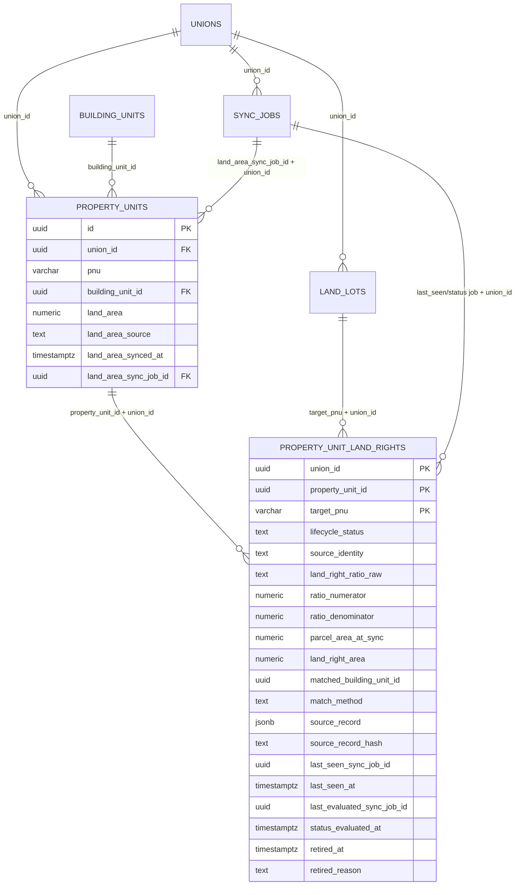
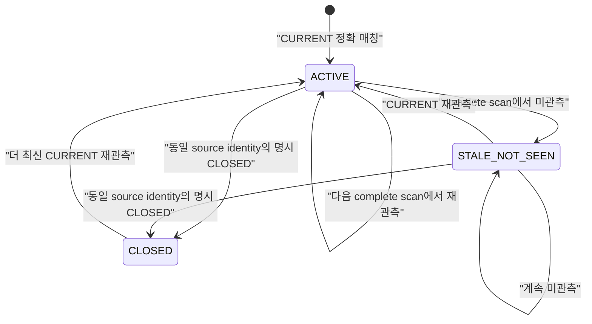
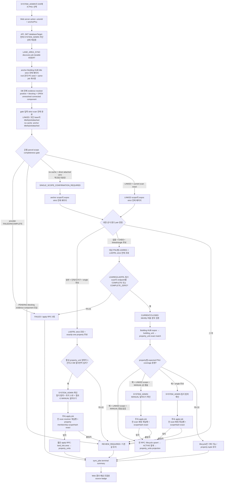

# 대지권면적 자동 동기화 개발 계획

- 작성일: 2026-07-23
- 상태: dev-first 구현·검증 중 · 2026-07-24 Phase 0 실측 계약 반영
- API 기준선: `tonghari-api` `origin/main` `6dcd8d268de25521c38e6aa412289288d7466193`
- Web 기준선: `tonghari-web` `origin/master` `53b2e2a8e236f991c63e9bf0d3109fa9a7c405d6`
- 기준 노트:
  - `Projects/Johapon-재건축-갭-감사.md`
  - `Resources/감정평가-사정면적-대지권면적-구분.md`
  - `Projects/Johapon-건축물대장-기준지번-부속지번-자동연결.md`
- 대상 저장소: `tonghari-web`, `tonghari-api`
- 현재 권한: API·Web 전용 브랜치 구현과 로컬 검증, 신규 migration 작성 및
  `tonghari_dev` 선적용 검증까지 승인. 운영 DB 적용·운영 배포는 별도 승인 전 수행하지 않음

## 1. 결론

신규 로그 테이블 여러 개를 만들지 않는다. 신규 테이블은 `property_unit_land_rights` 하나만 추가한다.

최종 데이터 흐름은 다음과 같다.

1. `land_lots.area`는 계속 필지 전체의 토지대장 면적으로 유지한다.
2. `property_units.land_area`는 화면·동의율·자산 계산이 읽는 조합온의 통합 **대지권면적**으로 유지한다.
3. 일반건축물대장이고 용도가 단독주택 또는 다가구주택으로 공식 코드까지 확정되면 `ladfrlList`의 토지대장 면적을 후보로 만든다. no-cache single scope와 토지 소유를 SYSTEM_ADMIN이 현재 hash에 대해 확인한 뒤 적용한다.
4. 집합건축물대장이고 용도가 다세대주택으로 공식 코드까지 확정되면 `ldaregList`의 대지권을 물건지와 정확 매칭해 적용한다. 확정 LINKED scope는 바로 진행하고 no-cache single scope는 관리자 확인을 요구한다.
5. 연립주택, 아파트, 다중주택, 비주거, 복합용도, 대장 코드 혼재는 이번 자동 적용 범위에서 제외하고 `REVIEW_REQUIRED`로 끝낸다.
6. 외부 API 오류·불완전 페이지·매칭 중복은 0건 응답으로 취급하지 않는다.
7. 수동값도 다음 명시적 관리자 동기화에서 유효한 자동값으로 덮어쓸 수 있다. 단, 자동 수집 근거가 완전해야 하고 값이 달라지는 MANUAL 덮어쓰기는 별도 확인을 요구한다.
8. 동의율 RPC와 자산 계산식은 변경하지 않는다. `property_units.land_area` 값이 바뀌면서 생기는 결과 변화만 회귀 검증한다.
9. 모든 주택 유형은 분류 전에 기준·부속지번 완전성 gate를 통과해야 한다. positive-cache 관계 부재, 자체 표제부 존재, Phase 0에서 확정한 원천의 `bylotCnt=0`, anchor 기준 attached 0건 중 어느 조합도 “다른 건물의 부속 PNU가 아님”을 증명하지 못한다.
10. 운영 DB에는 사용자 명시 승인 후 Migration A와 B를 순서대로 적용·검증하고, 그 뒤에만 API를 feature flag OFF 상태로 배포한다.
11. v1은 공급자 전체 역조회 인덱스를 만들지 않는다. no-cache 단일 PNU 후보는 SYSTEM_ADMIN이 현재 scope hash에 대해 필지 범위를 확인해야 하며, LADFRL은 토지 소유 포함 여부까지 확인해야 apply할 수 있다.

`building_units`에는 대지권 컬럼을 추가하지 않는다. 원천 비율, 대상 PNU, 매칭 근거, 현재성은 신규 테이블에 모은다.

용어 경계: 법령상 `대지권`·`대지사용권`은 구분소유권이 있는 집합건물 문맥의 용어다. 이 문서와 조합온 화면의 `대지권면적`은 `property_units.land_area`에 대한 통합 업무 라벨이며, 모든 단독·다가구에 등기상 대지권이 존재한다는 뜻은 아니다. 집합 다세대는 대지권등록부 원천을, 단독·다가구는 토지 소유 확인을 거친 토지대장 원천을 사용하고 source badge로 둘을 구분한다.

## 2. 문제 정의와 불변식

### 2.1 현재 문제

현재 `property_units.land_area` 하나가 다음 의미를 함께 떠맡고 있다.

- 필지 전체 면적
- 물건지별 대지권면적
- 관리자가 입력한 등기·명부 값
- 과거 생성 로직이 복사한 값

출처와 동기화 시각이 없으므로 같은 숫자라도 토지대장, 대지권등록부, 수동입력, 과거 미확인 중 무엇인지 알 수 없다.

이 값은 면적 동의율에서 `property_unit`당 한 번 가산된다. 공동소유자가 여러 명이어도 같은 물건지 면적을 소유자 수만큼 다시 곱하지 않는다. 따라서 잘못된 필지 전체면적이나 대지권면적은 70% 경계 판정을 바꿀 수 있다.

### 2.2 반드시 지킬 불변식

- `land_lots.area`는 필지 전체 면적이다.
- `property_units.land_area`는 이미 물건지 단위로 확정된 면적이다.
- `property_units.land_area`에 소유지분을 한 번 더 곱하지 않는다.
- 공동소유자 수가 아니라 `property_unit.id`가 면적의 저장·가산 단위다.
- 기준 PNU와 부속 PNU를 합치거나 대표 PNU로 치환하지 않는다.
- 다만 같은 건물의 LDAREG 응답이 각 scope PNU에서 `pnu`만 바뀐 채 반복되는 경우에는
  PNU별 provenance component를 모두 보존하고, target PNU에 독립적인 canonical source
  identity별 분자를 물건지 합계에 정확히 한 번만 가산한다.
- 대지권 동기화가 `building_unit` 또는 `property_unit`을 새로 만들지 않는다.
- 0건, 오류, 불완전 응답을 서로 다른 상태로 유지한다.
- API에 단순히 보이지 않은 기존 세대는 숫자를 지우지 않는다.
- 명시적 말소·폐쇄와 단순 미관측은 다르게 처리한다.
- positive-cache VIEW에 행이 없다는 사실을 단일 PNU의 증거로 사용하지 않는다.
- `getBrAtchJibunInfo`는 부속지번 역검색 조건이 없으므로 anchor 기준 `ATTACHED_COMPLETE_ZERO`를 역조회 완전성으로 해석하지 않는다.
- `bylotCnt`는 관계 역조회 원천이 아니라 같은 관리 PK의 외필지 수 교차검증 신호다. resolved 값이 없거나 원천끼리 충돌하면 명시적 0으로 축약하지 않고 `REVIEW_REQUIRED`로 둔다.
- positive-cache VIEW는 적용 가능한 positive evidence일 뿐이다. 원천 relation·manual override의 review/conflict/stale 상태와 OPEN unresolved evidence를 별도 차단 근거로 읽는다.
- 일반건축물도 same-run Building HUB 기준·부속지번 조회가 완전하고 관리자 확인이 현재 scope에 결합될 때만 LADFRL 적용 후보가 된다.
- 현재 모델에 `ownership_scope`가 없으므로 단독·다가구의 토지 소유 포함 여부를 자동 추론하지 않는다.
- 외부 HTTP 호출은 DB transaction 밖에서 끝낸다.
- 검증된 현재 상태 적용만 짧은 DB transaction 한 번으로 수행한다.

## 3. 범위

### 3.1 이번 구현 범위

- `property_units` 출처·자동 동기화 시각 컬럼
- 신규 `property_unit_land_rights` 테이블 1개
- `LAND_AREA_SYNC` job type
- V-World `ladfrlList`, `ldaregList` strict adapter
- Building HUB 표제부 `getBrTitleInfo`(`bylotCnt` 1차 원천)·전유부·부속지번 `getBrAtchJibunInfo` strict adapter와 주택 유형 분기
- Phase 0 실호출에서 표제부 `bylotCnt`가 누락·불안정하다고 확인된 경우에만 기본개요 `getBrBasisOulnInfo` 전 페이지 strict fallback
- `building_land_lot_positive_cache` VIEW의 `PENDING` 차단·`LINKED` 적용 범위를 읽는 내부 scope resolver
- 원천 relation·manual override·unresolved ledger의 blocking evidence resolver
- 모든 지원 주택 유형에 공통인 기준·부속지번 완전성 gate
- no-cache 단일 PNU의 scope 확인과 LADFRL 토지 소유 확인을 위한 2단계 job
- 정확한 동·호·층 및 building-unit/property-unit 매칭
- 원자 적용 RPC와 provenance 보호 trigger
- systemAdmin GIS의 명시 실행 UI와 결과·미매칭 표시
- 조합원 물건지의 출처 badge, 자동 동기화 시각, 수동편집 dirty-only 처리
- 조합원 화면의 `대지권면적`과 `필지 전체면적` 라벨·원천 분리
- 개발 DB/API/Vercel 검증, 승인된 운영 migration 적용, 제한적 운영 canary 계획

### 3.2 비범위

- 면적 동의율 RPC 계산식 변경
- 토지 공시지가·자산가액 계산식 변경
- `buldHoCoList` 사용
- 연립주택·아파트·다중주택 자동 대지권 반영
- 신규 동(棟) 엔티티
- 건축물대장 필지 관계의 신규 생성·자동 승격
- `building_unit` 생성·보정
- 정기 스케줄, 자동 편입, worker lease
- 시군구 전수 sweep·공급자 전체 데이터 cache·완전한 역조회 index
- 대지권 과거 이력, 페이지 원문, scan 원장 테이블
- 수동 보정 이력 전용 테이블
- 일반 조합관리자에게 동기화 실행 권한 부여
- `ownership_scope` 컬럼·소유대상 엔티티 신설

## 4. 리서치 근거

| 근거 | 확인 사항 | 설계 반영 |
| --- | --- | --- |
| V-World 대지권등록목록 | `ldaregList`, 최대 1,000건/page, `pageNo`, `totalCount`, `ldaQotaRate`, `clsSeCode`, 인증·한도 오류 제공 | 전 페이지 strict scan, 비율 원문 저장, 현재/말소 분리 |
| 공공데이터포털 대지권등록정보 | 집합건물의 건축물 정보와 대지권 지분비율 제공 | 다세대 집합건물 분기에만 사용 |
| 건축HUB 건축물대장정보 | 작성 시점 관찰(2026-07-10 Swagger)로는 `getBrTitleInfo` 78개 필드와 `getBrBasisOulnInfo` 32개 필드에 문자열 `bylotCnt`가 있고 `getBrAtchJibunInfo` 34개 필드에는 없다고 봤으나, 표제부 존재는 아래 미러와 상충하는 **미확정 관찰**이다 | title을 `bylotCnt` 1차 원천 후보로 두되 원천 확정은 Phase 0 실호출에 위임. 동일 관리 PK의 basis는 Phase 0 교차검증 및 조건부 fallback에만 사용. attached `atch*`는 same-run outgoing 기준→부속 관계 교차검증이며 역관계 부재는 증명하지 않음 |
| 건축물대장 규칙 | 일반건축물대장과 집합건축물대장을 구분 | 단독·다가구와 다세대의 업무 분기 근거 |
| 현행 API | `e1e7ba7`부터 `gis-inspect.service.ts`가 main에 있으나 page 1 raw 진단·continue-on-error 계약이고, 적재용 strict adapter는 없음 | 검증된 순수 helper만 공용 모듈로 추출하고 inspector orchestration은 재사용하지 않음 |
| 현행 DB | `land_lots.area`는 필지 전체, `property_units.land_area`는 물건지 소비값, `sync_jobs` 존재. `building_land_lot_positive_cache`는 `security_invoker` VIEW이며 `PENDING`과 `LINKED`만 포함 | 신규 로그 테이블 없이 현재 상태 1개 테이블 + job 요약. VIEW는 positive evidence로만 쓰고, 숨겨진 review/conflict/stale/OPEN evidence는 원천 ledger에서 별도 차단 |
| 기존 auto-link 설계 | `getBrAtchJibunInfo`에는 부속지번 검색조건이 없어 부속-only anchor를 직접 역조회할 수 없음 | no-cache direct-zero를 단일 PNU로 자동 확정하지 않고 관리자 scope 확인 또는 후속 reverse index를 요구 |

공식 자료:

- [V-World 대지권등록목록조회](https://www.vworld.kr/dtna/dtna_apiSvcFc_s001.do?apiNum=78)
- [공공데이터포털 대지권등록정보](https://www.data.go.kr/data/15123906/openapi.do)
- [공공데이터포털 건축HUB 건축물대장정보](https://www.data.go.kr/data/15134735/openapi.do)
- [건축물대장의 기재 및 관리 등에 관한 규칙](https://www.law.go.kr/LSW/lsInfoP.do?lsiSeq=273103)
- [다가구주택은 공동주택이 아닌 단독주택의 한 종류라는 법제처 해석](https://opinion.lawmaking.go.kr/nl4li/lsItptEmp/355270)

보조 명세 미러인 [PublicDataReader 건축물대장 가이드](https://github.com/WooilJeong/PublicDataReader/blob/main/assets/docs/portal/BuildingLedger.md)는 2026-07-23 재확인 기준 **기본개요에만** `bylotCnt`(외필지수)를 기재하고 표제부 출력 명세에는 기재하지 않는다. 즉 표제부 `bylotCnt` 존재는 원천 간 상충이 있는 검증 대상 관찰이며 확정 사실이 아니다. Phase 0 실측에서 표제부에 필드가 없다고 판명되면 `TITLE_WITH_BASIS_FALLBACK`이 기대 정책이 되고 사실상 basis가 1차 원천으로 동작한다(§10.4 계약은 이 경우에도 관리 PK 단위로 그대로 성립한다). Swagger 속성 존재가 실응답의 값 존재·형식·정합성을 보장하지도 않으므로, 최종 원천 계약은 Phase 0의 승인된 실호출 fixture로 고정한다.

단독·다가구에 필지 전체면적을 적용하는 것은 위 법적 분류와 현재 조합온의 `property_unit` 단위 동의율 규칙을 결합한 **이번 업무 정책**이다. 모든 부동산의 법률상 권리관계를 일반화한 선언은 아니다. 일반대장인데 같은 PNU에 활성 `property_unit`이 둘 이상이면 자동 적용하지 않는 이유도 여기에 있다.

### 4.1 잔여 업무 리스크 — `ownership_scope`

현재 `property_ownerships`에는 `ownership_type`, `land_ownership_ratio`, `building_ownership_ratio`는 있지만 소유대상을 `LAND_ONLY`, `BUILDING_ONLY`, `LAND_AND_BUILDING`, `UNKNOWN`으로 구분하는 `ownership_scope`가 없다. 별도 scope 모델 추가는 이번 범위가 아니므로, 단독·다가구 LADFRL 자동값은 “해당 물건지 소유자가 토지 소유를 포함한다”는 가정을 DB만으로 증명할 수 없다.

- 지분율 100%는 보조 신호일 뿐 토지 소유 증빙의 대체물이 아니다.
- 운영 canary에서는 활성 property·ownership이 각 1건이고 토지·건물 지분율이 명시적 100%인 후보만 고른다.
- 관리자가 등기·대장 또는 승인된 내부 근거로 토지 소유 포함 여부를 확인한다.
- 확인할 수 없거나 기존 MANUAL 값과 충돌하면 운영 실행 대상에서 제외하고 `REVIEW_REQUIRED`로 유지한다.
- 이 수동 확인 gate는 `ownership_scope` 또는 동등한 검증 모델이 생기기 전까지 LADFRL 운영 확대에도 유지한다.
- 확인은 canary 메모로 끝내지 않는다. discovery job의 정렬된 `propertyUnitIds`/membership hash와 `scopeHash`를 대상으로 한 확인자·DB 시각·비식별 근거 종류/참조를 후속 apply job의 `sync_jobs.preview_data`에 불변 입력으로 저장한다. LADFRL membership은 정확히 1건이고 LDAREG는 여러 물건지일 수 있다.
- 현재 scope와 확인 scope가 다르거나 토지 소유 확인이 없으면 apply RPC를 호출하지 않는다.

## 5. acceptance checklist

### 5.1 설계 완료 조건

- [x] 신규 테이블을 1개로 제한했다.
- [x] `land_lots.area`와 `property_units.land_area`의 의미를 분리했다.
- [x] 기존 `land_area`를 근거 없이 수동값으로 소급 분류하지 않는다.
- [x] 단독·다가구와 다세대의 자동 수집 원천을 분리했다.
- [x] 아파트·연립·다중·비주거·혼재는 자동 반영하지 않는다.
- [x] `COMPLETE_ZERO`, `FAILED`, `INCOMPLETE`를 분리했다.
- [x] 1,000건 초과 pagination을 검증한다.
- [x] 대상 PNU와 물건지의 다대다 가능성을 모델링했다.
- [x] 미관측, 말소, 현재 행의 수명주기를 한 테이블에서 표현한다.
- [x] 수동 변경과 자동 변경의 provenance를 DB에서 보호한다.
- [x] 멀티테넌시·RLS·ACL·database target 경계를 명시했다.
- [x] systemAdmin 명시 실행과 bounded 결과를 설계했다.
- [x] 동의율·자산 계산은 비범위로 고정하고 회귀 영향만 검증한다.
- [x] 부속-only anchor 역조회 한계를 반영해 no-cache direct-zero를 단일 PNU로 자동 증명하지 않는다.
- [x] positive-cache 밖의 review/conflict/stale/OPEN evidence를 별도 blocking gate로 반영했다.
- [x] `ownership_scope` 부재를 잔여 high 리스크로 명시하고 LADFRL 수동 확인 gate를 둔다.
- [x] 운영 Migration A/B의 명시 승인·적용·검증·배포 순서를 분리했다.
- [x] `land_area`와 `land_lot_area`의 화면 라벨·fallback 경계를 분리했다.
- [x] `bylotCnt`의 1차 원천을 `getBrTitleInfo`로 명시하고 기본개요는 Phase 0 판정 뒤에만 추가하는 fallback으로 제한했다.
- [x] `bylotCnt` 가용성·교차검증과 부속-only anchor 역조회 한계를 서로 다른 증거로 분리했다.

### 5.2 구현 완료 조건

- [ ] 공식 Building HUB codebook에서 대장·주용도 code/name pair fixture를 고정한다.
- [ ] enum migration과 schema/RPC migration을 개발 DB에서 순서대로 적용한다.
- [ ] DB replay, ACL, trigger, RPC 동시성 테스트가 통과한다.
- [ ] API strict adapter·분류·매칭·queue 테스트가 통과한다.
- [ ] Web type-check, unit test, build가 통과한다.
- [ ] 개발 Vercel에서 systemAdmin 실행·결과·수동편집 충돌을 확인한다.
- [ ] V-World 대지권등록정보 활용신청 후 실제 응답을 검증한다.
- [ ] 같은 관리 PK의 title·basis·attached 실응답으로 `bylotCnt` 존재·형식·일치·distinct attached PNU 의미를 검증하고 production 원천 계약을 고정한다.
- [ ] 동일 후보 커밋이 Web `dev` 검증을 통과한다.
- [ ] canary 전 대상 `property_units` 값을 복구 가능한 형태로 보관한다.
- [ ] 운영 project ref와 Migration A/B hash를 제시해 사용자 명시 승인을 받는다.
- [ ] 운영 Migration A commit·enum 검증 후 Migration B를 적용하고 schema·ACL·checksum을 검증한다.
- [ ] 단독·다가구 canary에서 토지 소유 포함 여부를 관리자가 확인한다.
- [ ] 모든 LADFRL 운영 apply가 현재 1건의 property membership+scopeHash에 묶인 필지 범위·토지 소유 확인을 요구한다.
- [ ] canary에서 면적 동의율·자산 표시의 전후 차이를 승인한다.

## 6. 역할별 설계·리뷰 결과

| 파트 | 리서치 | 교차 설계 | 독립 리뷰 | 최종 반영 |
| --- | --- | --- | --- | --- |
| DB | 현행 schema·writer·RLS·동의율 소비 경로 분석 | 단일 현재상태 테이블, RPC, trigger 설계 | 최초 `BLOCK` 뒤 운영 A/B·VIEW·confirmation lineage 재검토, 최종 `APPROVE` | 수명주기, 단일 transaction B, manifest, DB-before-API, immutable confirmation·job FK 반영 |
| API/GIS | V-World·Building HUB·queue·status 경로 분석 | strict adapter, 분류, 매칭, job 설계 | 역조회·blocking evidence·hash 책임 `BLOCK` 뒤 재검토, 문구 수정 후 최종 승인 | 전체 base scan, connected component, endpoint별 zero, HTTPS, discovery/confirmation 반영 |
| Web/운영 | GIS 면적 표시, 조합원 DTO, 수동 writer 분석 | 별도 패널, badge, dirty-only, conflict UX 설계 | ownership write gate·다물건·audit 보완 뒤 최종 `APPROVE` | source/job lineage, MANUAL 덮어쓰기 확인, completeness/XLSX, dirty-only audit 반영 |

최종 판정은 다음과 같다.

- 저장 source 값은 `CADASTRAL` 대신 `LADFRL`을 사용한다. 실제 API lineage가 명확하고 `LDAREG`와 대칭이기 때문이다.
- 수동 입력의 `land_area_synced_at`은 `NULL`이다. 수동 수정 시각은 기존 `updated_at`으로 표시한다.
- 대지권면적은 `ldaQotaRate` 분자를 사용한다. 분모는 같은 실행의 토지대장 면적 검증에만 사용한다.
- LDAREG 자동 범위는 다세대주택만이다. 연립·아파트는 후속 정책 승인 전까지 `REVIEW_REQUIRED`다.
- 자동 idempotency key, worker lease, 정기 재실행은 1차 범위에서 제외한다. 중복 실행의 데이터 안전성은 RPC lock·freshness로 보장한다.
- PostgreSQL enum 신규값을 같은 transaction에서 즉시 사용하는 문제 때문에 물리 migration 파일은 2개로 나눈다. 신규 업무 테이블은 여전히 1개다.

## 7. DB 스키마 변화

### 7.1 전체 관계



### 7.2 `property_units` 변경

| 컬럼·제약 | 타입·값 | 의미 |
| --- | --- | --- |
| `land_area_source` | `text NOT NULL DEFAULT 'LEGACY_UNKNOWN'` | `LEGACY_UNKNOWN`, `MANUAL`, `LADFRL`, `LDAREG` |
| `land_area_synced_at` | `timestamptz NULL` | LADFRL/LDAREG 자동 동기화 시각. 수동·기존 미확인은 NULL |
| `land_area_sync_job_id` | `uuid NULL` | 마지막 자동 투영 job. 수동·기존 미확인은 NULL, `(job_id, union_id) → sync_jobs(id, union_id) ON DELETE RESTRICT` |
| `(id, union_id)` | unique | 신규 테이블의 tenant-safe composite FK 대상 |
| source/timestamp/job CHECK | constraint | 수동·미확인은 시각·job NULL, 자동은 양수 면적·시각·job 필수 |

기존 행은 다음처럼 migration한다.

```text
land_area             기존값 그대로
land_area_source      LEGACY_UNKNOWN
land_area_synced_at   NULL
land_area_sync_job_id NULL
```

영구 default는 `LEGACY_UNKNOWN`이다. 일반 writer가 `land_area`가 있는 행을 INSERT하거나 실제 숫자를 UPDATE하면 trigger가 `MANUAL`로 바꾼다. 면적 없는 신규 property를 `MANUAL`로 오표시하지 않는다.

### 7.3 신규 `property_unit_land_rights`

이 테이블은 로그가 아니라 **물건지 × 대상 PNU의 마지막 검증 상태**다. 기본키가 같으면 upsert하며 페이지·scan별 행을 계속 쌓지 않는다.

| 그룹 | 컬럼 | 설계 |
| --- | --- | --- |
| tenant·identity | `union_id`, `property_unit_id`, `target_pnu` | composite PK |
| match | `matched_building_unit_id`, `match_method` | `BUILDING_UNIT_ID` 또는 `PNU_DONG_HO` |
| provider identity | `source_identity`, `source_agbldg_sn` | `targetPnu+agbldgSn` 우선, 없으면 versioned immutable-field hash |
| ratio | `land_right_ratio_raw` | API 문자열 그대로. trim·재작성 금지 |
| ratio | `ratio_numerator`, `ratio_denominator` | `numeric(20,10)`, 둘 다 양수, 분자 ≤ 분모 |
| area | `parcel_area_at_sync` | 같은 실행에서 검증한 토지대장 면적 |
| area | `land_right_area` | DB generated `round(ratio_numerator, 4)` |
| source | `source_record` | RPC가 typed scalar로 조립한 v1 exact allowlist JSONB, 최대 8 KiB |
| source | `source_record_hash` | DB generated SHA-256 |
| lifecycle | `lifecycle_status` | `ACTIVE`, `STALE_NOT_SEEN`, `CLOSED` |
| freshness | `last_seen_sync_job_id`, `last_seen_at` | 실제 CURRENT 행을 마지막 관측한 job·시각 |
| evaluation | `last_evaluated_sync_job_id`, `status_evaluated_at` | STALE/CLOSED를 포함해 마지막 complete scan이 평가한 job·시각 |
| retirement | `retired_at`, `retired_reason` | 명시 CLOSED에만 사용 |
| timestamps | `created_at`, `updated_at` | 현재행 생성·갱신 시각 |

`source_record` v1 allowlist:

```text
pnu
agbldgSn
buldNm
buldDongNm
buldFloorNm
buldHoNm
buldRoomNm
ldaQotaRate
clsSeCode
clsSeCodeNm
relateLdEmdLiCode
lastUpdtDt
```

API가 임의 JSON을 넘기게 두지 않는다. RPC가 위 typed scalar만 받아 JSONB를 조립한다. JSONB는 원문 key 순서·공백 보존 형식이 아니므로 `ldaQotaRate` literal은 `land_right_ratio_raw`에도 별도로 그대로 저장한다.

필수 FK:

- `(property_unit_id, union_id) → property_units(id, union_id) ON DELETE CASCADE`
- `(target_pnu, union_id) → land_lots(pnu, union_id) ON DELETE RESTRICT`
- `(last_seen_sync_job_id, union_id) → sync_jobs(id, union_id)`
- `(last_evaluated_sync_job_id, union_id) → sync_jobs(id, union_id)`
- `matched_building_unit_id → building_units(id) ON DELETE SET NULL`

필수 인덱스:

- `(union_id, target_pnu, lifecycle_status)`
- `(last_seen_sync_job_id, union_id)`
- `(last_evaluated_sync_job_id, union_id)`
- 기본키가 `(union_id, property_unit_id, target_pnu)` 합산을 지원한다.

### 7.4 대지권 수명주기

Provider 상태와 DB 상태를 다른 이름으로 사용한다.

```text
Provider sourceState: CURRENT | CLOSED
DB lifecycleStatus:   ACTIVE | STALE_NOT_SEEN | CLOSED
```



투영 규칙:

- `ACTIVE`: 자동 합계 후보
- `STALE_NOT_SEEN`: API 누락 정책에 따라 기존 면적 근거를 보존하되 이번 동기화의 새 부분합 계산에는 사용하지 않는다.
- `CLOSED`: 합계에서 제외
- 어떤 property라도 기대 PNU 중 하나가 `STALE_NOT_SEEN`이거나 현재·과거 component 근거가 없으면 그 property의 기존 `land_area` tuple 전체를 유지한다.
- 모든 기대 PNU coverage가 증명되고 양수 ACTIVE 합계가 있을 때만 새 LDAREG 합계를 반영한다.
- 모든 component가 명시 CLOSED가 되어 합계가 0이어도 `land_area=0/NULL`을 자동 기록하지 않는다. 기존 숫자는 보존하고 source만 `LEGACY_UNKNOWN`, synced time은 `NULL`, outcome은 `ALL_COMPONENTS_CLOSED_REVIEW_REQUIRED`로 남긴다.

### 7.5 비율 산식

예:

```text
ldaQotaRate        181.7/15622.1
ratio_numerator    181.7000000000
ratio_denominator  15622.1000000000
land_right_area    181.7000㎡
```

대지권면적은 분자다. `land_lots.area × 분자 ÷ 분모`로 다시 비례 보정하지 않는다.

수학적으로 분모가 대상 필지면적과 같으면 두 식은 같은 값을 만들지만, 분모가 달라진 상태에서 현재 필지면적으로 재계산하면 원문 대지권 분자를 임의로 바꾸게 된다. 따라서 분모 불일치는 자동 보정이 아니라 검토 사유다.

초기 허용오차:

```text
scope_ladfrl_area = sum(
  same-run 각 resolved scope PNU의 exactly-one distinct positive LADFRL area
)

abs(ratio_denominator - scope_ladfrl_area)
<= max(0.1㎡, scope_ladfrl_area × 0.00001)
```

즉 상대 오차 0.001%와 0.1㎡ 중 큰 값이다. 이 값은 개발 실호출 fixture에서 검증한 뒤 상수와 테스트를 함께 변경할 수 있으며, 환경변수로 조용히 완화하지 않는다.

단일 PNU에서는 scope 합계가 그 PNU 면적과 같다. multi-PNU에서는 개별 PNU 면적 중
하나와의 OR 비교를 허용하지 않고, 정렬된 전체 PNU 면적 합계만 분모 기준으로 사용한다.
LDAREG 분모를 검증할 때는 모든 PNU가 같은 실행의 LADFRL 응답에서 정확히 하나의
distinct 양수면적을 가져야 한다. 누락, 0, 음수, 다른 PNU 혼입, 서로 다른 면적 반복 중
하나라도 있으면 provider protocol을 확정할 수 없으므로 전체 job을 `FAILED`로 닫고
apply RPC는 0회다. 별도 LADFRL 단일-PNU branch의 `LADFRL_COMPLETE_ZERO`는 이
positive-only helper를 사용하지 않고 `COMPLETED + NO_DATA`로 기존 tuple을 유지한다.

2026-07-24 승인된 비식별 실호출에서는 기준/부속 면적이 각각 `177.6㎡`, `187㎡`였고
LDAREG 분모는 그 합계인 `364.6㎡`와 일치했다. 이 fixture의 대지권 분자 `24.6㎡`는
scope PNU 수와 무관하게 한 번만 투영한다.

### 7.6 provenance trigger

`BEFORE INSERT OR UPDATE OF land_area, land_area_source, land_area_synced_at, land_area_sync_job_id` trigger를 둔다.

| 변경 | 결과 |
| --- | --- |
| 면적 없는 일반 INSERT | `LEGACY_UNKNOWN`, synced/job NULL |
| 면적 있는 일반 INSERT | `MANUAL`, synced/job NULL |
| 일반 writer가 면적 숫자 실제 변경 | `MANUAL`, synced/job NULL |
| 숫자·source·시각·job 모두 no-op | 기존 provenance 유지 |
| source, synced time 또는 sync job만 직접 변경 | 거부 |
| 자동 source 직접 지정 | 거부 |
| canonical RPC가 DB context에서 적용 | `LADFRL` 또는 `LDAREG`, DB-generated synced time과 현재 job ID |
| 모든 component가 exact CLOSED | 숫자는 보존, `LEGACY_UNKNOWN`, synced/job NULL. lifecycle을 잠근 canonical RPC에만 허용 |

자동 context는 custom GUC만 신뢰하지 않는다.

- owner `SECURITY DEFINER` RPC
- `current_user`가 함수 owner인지 확인
- transaction-local context가 현재 backend PID와 transaction ID에 일치하는지 확인
- source·timestamp·job ID를 caller 임의값으로 받지 않고 잠근 `sync_jobs` 행에서 DB가 결정
- source-only 변경은 원칙적으로 거부하되, 같은 transaction에서 해당 property의 모든 component가 exact `CLOSED`임을 검증한 canonical RPC의 `LEGACY_UNKNOWN` 전환만 허용

수동 변경은 `property_unit_land_rights` 행을 삭제하지 않는다. 수동값이 현재 화면값이 되고, 이후 관리자가 다시 명시 실행한 동기화에서 모든 coverage·매칭 검증을 통과했을 때만 자동값이 다시 덮어쓴다.

현재 `property_units_admin_all` 정책이 관리자에게 폭넓은 UPDATE를 허용하므로 이 trigger는 단순 편의가 아니라 provenance 위조를 막는 DB 경계다.

### 7.7 migration 파일

논리적 schema 변화는 하나지만 PostgreSQL enum 제약 때문에 파일은 둘로 나눈다.

신규 파일은 `tonghari-web`에서 `supabase migration new <name>`으로 생성한 14자리 timestamp 파일만 사용한다. 기존 3자리 migration은 frozen legacy이므로 새 번호를 만들지 않는다. 구현 착수 전에 workspace의 진부화된 `091/092` 규칙과 repo `CLAUDE.md`의 적용 지침을 현행 manifest·승인 runbook과 정렬한다. gitignored 로컬 `create-migration` 가이드는 팀 source of truth로 사용하지 않는다.

1. `YYYYMMDDHHMMSS_add_land_area_sync_job_type.sql`
   - `sync_job_type_enum`에 `LAND_AREA_SYNC`만 추가하고 commit
2. `YYYYMMDDHHMMSS_create_property_unit_land_rights.sql`
   - 파일 전체를 명시적 `BEGIN`/`COMMIT` 한 transaction으로 실행
   - `CREATE INDEX CONCURRENTLY` 등 transaction 밖에서만 가능한 DDL 금지
   - preflight
   - `property_units` 컬럼·unique·CHECK
   - 신규 테이블·FK·인덱스
   - RLS·ACL
   - scope resolver, confirmation-job admission RPC, apply RPC, provenance trigger, LAND_AREA_SYNC job snapshot immutability guard
   - comments

Migration B preflight:

- `sync_jobs.union_id NOT NULL`
- `sync_jobs(id, union_id)` unique
- `land_lots(pnu, union_id)` PK
- `building_registry_land_lot_relations`, `building_land_lot_manual_overrides`, 두 unresolved observation 테이블과 현재 status CHECK 계약
- `building_land_lot_positive_cache`가 `relkind='v'`인 VIEW로 존재
- `pg_class.reloptions`의 `security_invoker=true`, migration history, 정규화한 `pg_get_viewdef` 또는 승인된 definition hash가 API/manual evidence의 `PENDING`, `LINKED` predicate와 일치
- `pgcrypto` digest 함수의 실제 schema
- 기존 `property_units`의 row count, `land_area IS NULL` count, `(union_id,id,land_area)` 정렬 canonical SHA-256

운영 A/B preflight 상태표:

| migration history | catalog 상태 | 처리 |
| --- | --- | --- |
| A 없음 | enum 없음 | 승인된 A 적용 가능 |
| A 있음 | enum 있음 | A 파일 hash가 승인본과 같을 때만 B resume 가능 |
| A 없음 | enum 있음 | drift, 자동 진행 금지 |
| A 있음 | enum 없음 | drift, 자동 진행 금지 |
| B 없음 | B 객체 없음 | A 검증 후 승인된 B 적용 가능 |
| B 있음 | B 객체·정의 exact 일치 | 재적용하지 않고 사후 검증만 수행 |
| B history와 B 객체·정의가 부분 불일치 | 부분 drift, 자동 재시도 금지. catalog 재감사와 별도 사용자 승인 필요 |

운영 데이터에 실제 `PENDING` 또는 `LINKED` 행이 없을 수 있으므로 VIEW 계약을 row count로 판정하지 않는다. predicate 동작은 격리 DB fixture로 검증하고, 운영에서는 catalog·정의 hash로 확인한다.

## 8. GIS 파이프라인



## 9. 주택 유형 분기

분류는 현재 앱의 `building_type`이나 사용자 입력을 사용하지 않는다.

### 9.1 모집단

분류 전에 scope gate 입력 모집단을 먼저 완성한다.

1. anchor PNU의 Building HUB 표제부 전 페이지로 root 관리 PK seed를 얻는다.
2. positive-cache VIEW의 anchor 기준·부속 양방향 `PENDING`·`LINKED`, 원천 relation·manual override의 review/conflict/stale, 관련 OPEN unresolved evidence로 bounded connected component를 계산한다.
3. scan 대상은 `LINKED` component의 모든 distinct `base_pnu`, no-cache component는 anchor 하나로 고정한다.
4. 모든 scan 대상의 Building HUB 표제부와 `getBrAtchJibunInfo`를 전 페이지 조회한다. anchor 표제부는 1단계의 동일 job strict 결과를 재사용하고 나머지 base만 추가 조회한다. Phase 0에서 `TITLE_WITH_BASIS_FALLBACK`으로 확정한 경우에만 §10.4 조건에 해당하는 관리 PK의 기본개요 전 페이지 fallback을 같은 단계에서 완료한다.
5. 관리 PK별 resolved `bylotCnt`의 원천·값, distinct attached PNU 수, root 관리번호와 기준·부속 edge를 교차검증한다.

그 뒤 `LINKED_SCOPE_RESOLVED` 또는 관리자 확인 대기 중인 single candidate를 분류 모집단으로 사용한다. single candidate는 분류·preview만 허용하고 확인 전 projection은 금지한다.

- gate 전에 검증을 마친 scope 내 Building HUB 표제부 전 페이지
- 집합건축물은 scope 내 전유부 전 페이지
- 현재 유효 행만 사용
- 모든 행이 같은 root 관리번호 계열인지 확인
- `regstrGbCd`, `mainPurpsCd`, `mainPurpsCdNm` 공식 pair를 확인

공식 codebook에서 확인한 pair만 frozen fixture로 허용한다. substring `includes('주택')`로 분류하지 않는다.

### 9.2 결정표

| 대장·용도 판정 | 자동 전략 | 결과 |
| --- | --- | --- |
| `SINGLE_SCOPE_CONFIRMATION_REQUIRED`, 전 행 `regstrGbCd=1`, 공식 단독/다가구 pair | `LADFRL` preview | 필지 범위+토지 소유 확인 전 projection 0 |
| `SINGLE_PNU_CONFIRMED`, 전 행 `regstrGbCd=1`, 공식 단독/다가구 pair | `LADFRL` | exactly-one property에 필지면적 |
| `SINGLE_SCOPE_CONFIRMATION_REQUIRED`, 전 행 `regstrGbCd=2`, 공식 다세대 pair | `LDAREG` preview | 필지 범위 확인 전 projection 0 |
| `SINGLE_PNU_CONFIRMED` 또는 `LINKED_SCOPE_RESOLVED`, 전 행 `regstrGbCd=2`, 공식 다세대 pair | `LDAREG` | 물건지×PNU 대지권 합계 |
| 일반 단독·다가구인데 multi-PNU, PENDING, blocking evidence, 단일 scope 미확인 | 없음 | `REVIEW_REQUIRED` |
| cache 없음인데 attached row 존재, cache와 scan 모순 | 없음 | 관계를 만들지 않고 `REVIEW_REQUIRED` |
| `bylotCnt` 원천 미확정·값 누락/invalid·title/basis 모호 | 없음 | `REVIEW_REQUIRED` |
| 같은 관리 PK의 title/basis 유효값 불일치 | 없음 | `REVIEW_REQUIRED` |
| resolved `bylotCnt`와 distinct attached PNU 수 불일치 | 없음 | `REVIEW_REQUIRED` |
| 연립주택·아파트·다중주택 | 없음 | `REVIEW_REQUIRED` |
| 비주거·복합용도 | 없음 | `REVIEW_REQUIRED` |
| 빈 코드·명칭, code/name 불일치 | 없음 | `REVIEW_REQUIRED` |
| root 관리번호 여러 개 | 없음 | `REVIEW_REQUIRED` |
| 일반·집합 또는 purpose pair 혼재 | 없음 | `REVIEW_REQUIRED` |
| 필수 Building HUB scan 실패·불완전 | 없음 | `FAILED` |

## 10. strict API adapter

### 10.1 공통 결과형

```ts
type StrictScan<T> =
  | { state: 'COMPLETE'; rows: T[]; totalCount: number; pagesFetched: number }
  | { state: 'COMPLETE_ZERO'; rows: []; totalCount: 0; pagesFetched: number }
  | { state: 'FAILED'; issue: ProviderIssue }
  | { state: 'INCOMPLETE'; issue: ProviderIssue };
```

`COMPLETE_ZERO`는 provider success envelope와 명시적 `totalCount=0`이 모두 있을 때만 인정한다. 빈 배열, container 누락, schema 오류는 zero가 아니다.

### 10.2 pagination

1. 첫 page의 `totalCount`를 음수 아닌 정수로 검증한다.
2. `numOfRows=1000`, `ceil(totalCount / 1000)`만큼 순차 조회한다.
3. 모든 page가 같은 `totalCount`를 반환해야 한다.
4. 중간 빈 page, 반복 page, 예상보다 짧은 중간 page, 누적 부족·초과는 `INCOMPLETE`다.
5. 1,000/1,001/2,000/2,001건 경계를 테스트한다.
6. 전체 raw row 수로 완전성을 확인한 뒤에만 dedup한다.

### 10.3 retry와 취소

- 모든 Building HUB strict endpoint는 `https://apis.data.go.kr/...`를 사용한다. 현행 inspector의 `http://` base URL은 공유하지 않는다.
- timeout, HTTP 429, 5xx만 최대 3회
- exponential backoff + jitter
- `Retry-After`가 있으면 상한 내에서 준수
- HTTP 200 provider error envelope, 401/403, 기타 4xx, JSON/schema 오류는 즉시 실패
- page loop와 retry delay 모두 같은 `AbortSignal`을 확인
- terminal job 또는 fatal error 뒤 늦은 callback은 apply RPC를 호출하지 못한다.

### 10.4 `bylotCnt` 원천 계약

공식 Swagger의 field 존재와 운영 응답의 안정성을 분리한다.

- Building HUB의 `mgmBldrgstPk`, `mgmUpBldrgstPk`는 JSON string 또는 number를 받을 수
  있다. number는 0 이상의 safe integer만, string은 trim 뒤 ASCII digit만 허용하고
  leading zero를 제거한 canonical string으로 비교한다. unsafe number, 음수, 소수,
  빈 문자열, digit 이외 문자가 있는 문자열은 fail-closed한다.
- 위 PK 계약은 title, basis, attached, expos와 Phase 0 capture에 동일하게 적용한다.
  `mgmBldrgstPk`는 필수이고, optional `mgmUpBldrgstPk`는 누락/null/빈 문자열만
  absent로 허용한다. invalid 값을 self-PK fallback이나 문자열 강제 변환으로 숨기지 않는다.
- basis의 title root row는 `mgmBldrgstPk`가 title root와 exact 일치하면 closure에
  포함된다. 이 row의 별도 `mgmUpBldrgstPk`는 상위 집계 lineage일 수 있으므로
  root self-PK를 강제하지 않는다. 반면 title root가 아닌 basis/expos child는
  `mgmUpBldrgstPk`가 title root 중 하나와 exact 일치해야 한다.
- 2026-07-10 공식 Swagger에서 `getBrTitleInfo`의 78개 item field와 `getBrBasisOulnInfo`의 32개 item field에는 문자열 `bylotCnt`가 있고, `getBrAtchJibunInfo`의 34개 item field에는 없다.
- production 1차 원천은 이미 분류에 필수인 `getBrTitleInfo` strict 전체 페이지다. title scan이 `COMPLETE`일 때 각 row의 `mgmBldrgstPk`, raw `bylotCnt`, 정규화 값을 함께 유지하며 PNU의 첫 row를 대표값으로 사용하지 않는다.
- parser는 Phase 0에서 고정한 실제 JSON 표현을 입력으로 받아 공백을 제거한 0 이상의 safe integer만 허용한다. 빈 값, null, 음수, 소수, 비숫자, overflow는 0으로 변환하지 않는다.
- title row는 exact `mgmBldrgstPk`별로 먼저 reduce한다. 모든 row가 유효하고 같은 정규화 값이면 동일값 반복을 허용한다. 서로 다른 유효값, 또는 유효값과 누락·null·invalid가 섞이면 `BYLOT_COUNT_SOURCE_CONFLICT`, `REVIEW_REQUIRED`이며 basis로 덮지 않는다.
- Phase 0은 production 정책을 `TITLE_ONLY` 또는 `TITLE_WITH_BASIS_FALLBACK` 중 하나로 고정한다. 결정은 검토 가능한 source fixture/상수로 versioning하고 환경변수로 조용히 바꾸지 않는다. 기본값은 `TITLE_ONLY`이며 코드가 실호출 근거 없이 basis fallback을 자동 활성화하지 않는다.
- `TITLE_ONLY`에서 특정 관리 PK의 title row는 있으나 유효값이 0개면 `BYLOT_COUNT_UNAVAILABLE`이며 basis 호출은 0회다.
- `TITLE_WITH_BASIS_FALLBACK`은 title scan 자체가 `COMPLETE`이고, 특정 관리 PK의 title row에 유효값이 0개이며 누락·null·invalid만 있는 경우에만 사용한다. 한 PNU에서 해당 PK가 하나라도 있으면 `getBrBasisOulnInfo` strict 전체 페이지를 정확히 1회 호출한다. title scan `FAILED/INCOMPLETE`를 basis로 대체하지 않는다.
- fallback은 같은 `mgmBldrgstPk`의 유효 row 정확히 1건만 허용한다. PNU 첫 row, 다른 관리 PK, `mgmUpBldrgstPk` 추정 join, 0건 또는 2건 이상을 값으로 채택하지 않는다.
- fallback scan을 호출하면 유효 title 값이 있는 다른 관리 PK도 방어적으로 교차검증한다. exact-PK basis 유효값 1건이면 비교하고 불일치는 `BYLOT_COUNT_SOURCE_CONFLICT`, `REVIEW_REQUIRED`다. exact-PK basis 유효값이 관측되지 않으면 title resolved 값은 유지하되 `CROSS_CHECK_NOT_AVAILABLE`로 남기고, 유효 basis 값이 복수면 conflict다. 호출한 basis scan이 `FAILED/INCOMPLETE`이면 필수 fallback 실패이므로 job `FAILED`, apply 0이다.
- 최종 resolved evidence는 `{ mgmBldrgstPk, source: 'TITLE' | 'BASIS_FALLBACK', rawValue, count }`다. 어느 원천에서도 유효값을 확정하지 못하면 `BYLOT_COUNT_UNAVAILABLE`, `REVIEW_REQUIRED`, apply 0이다.
- expected 관리 PK 집합은 gate 입력으로 채택된 title row와 attached row의 `mgmBldrgstPk` 합집합이다. attached에만 있는 orphan PK나 resolved evidence가 없는 expected PK는 `BYLOT_COUNT_UNAVAILABLE`, `REVIEW_REQUIRED`, apply 0이다.
- resolved `bylotCnt=0`은 같은 관리 PK의 outgoing 외필지 교차검증일 뿐 부속-only anchor의 역관계 부재를 증명하지 않는다.

### 10.5 `getBrAtchJibunInfo` 계약

- land-area sync는 auto-link 파이프라인의 API 호출 최적화보다 엄격하게 동작하며 resolved `bylotCnt=0`이어도 attached endpoint를 조회한다.
- 모든 page의 provider envelope, `totalCount`, page count를 검증한다.
- 기준 PNU는 `sigunguCd + bjdongCd + platGbCd + bun + ji`, 부속 PNU는 `atchSigunguCd + atchBjdongCd + atchPlatGbCd + atchBun + atchJi`로 만든다.
- Building HUB `platGbCd 0/1`은 PNU 토지구분 `1/2`로 명시 변환한다.
- self relation, 중복 pair, 블록 지번, PNU 변환 실패를 zero로 축약하지 않는다.
- endpoint에는 `atchBun/atchJi` 검색조건이 없으므로 anchor 기준 조회는 부속-only anchor의 역조회가 아니다.
- `LINKED` component에서는 resolver가 별도 반환한 `linkedBasePnus`의 모든 distinct
  `base_pnu`만 title/bylot/attached strict 전 페이지 조회하고 결과를 합친다.
  `linkedPnus`는 branch의 전체 base∪attached scope로 유지한다. anchor가 attached PNU여도
  cached base와 sibling 전체를 검사하며 base 하나라도 실패·불완전하면 전체 `FAILED`다.
- attached-only PNU의 title/basis `COMPLETE_ZERO`를 base 분류 입력에 섞지 않는다. complete
  attached pair의 base∪attached 집합이 full `linkedPnus`와 exact 같고 `linkedBasePnus`가
  observed base 집합과 같을 때만 LINKED를 계속한다.
- no-cache component만 anchor를 직접 조회하며, 그 zero는 아래 관리자 확인 후보 이상으로 승격하지 않는다.
- resolved `bylotCnt=0 + ATTACHED_COMPLETE_ZERO + blocking evidence 없음`은 관리자 확인 가능한 single candidate일 뿐 단일 PNU 증명이 아니다.
- resolved `bylotCnt=0 + attached row 또는 기존 PENDING/LINKED evidence`는 conflict다.
- resolved `bylotCnt>0`이면 같은 관리 PK의 distinct attached PNU 수와 정확히 일치해야 한다.
- source resolution 뒤에도 값이 unavailable·invalid·ambiguous이면 attached가 complete여도 `REVIEW_REQUIRED`다.
- resolved `bylotCnt`와 같은 관리번호의 distinct attached PNU 수가 다르면 `BYLOT_ATTACHED_COUNT_MISMATCH`와 `REVIEW_REQUIRED`다.

### 10.6 기존 inspector 경계

API 기준선 `e1e7ba7`에는 `gis-inspect.service.ts`가 병합되어 있다. 이 서비스는 page 1 raw 진단, continue-on-error, provider 오류 축약을 위한 도구이므로 적재 adapter로 재사용하지 않는다.

검증 후 별도 공용 모듈로 추출 가능한 순수 요소:

- endpoint 정의. 현재 inspector 안의 상수는 file-local이므로 그대로 import하지 않는다.
- secret masking helper
- PNU parser의 검증된 순수 함수

추출한 모듈은 inspector와 land-area adapter가 함께 import하고 기존 inspector 테스트와 신규 strict adapter 테스트를 모두 통과해야 한다.

공유 금지:

- inspector success 판정
- raw response wrapper
- page 1 고정 호출
- exception swallow
- `buldHoCoList`

### 10.7 endpoint별 zero 의미

공통 adapter의 `COMPLETE_ZERO`를 job outcome 하나로 합치지 않는다.

| endpoint zero | 의미 | 처리 |
| --- | --- | --- |
| `ATTACHED_COMPLETE_ZERO` | 각 조회 대상 base PNU에서 나가는 부속 row 0건. no-cache는 anchor 기준 | scope evidence일 뿐 `NO_DATA` 아님. 역조회 완전성도 아님 |
| `BASIS_COMPLETE_ZERO` | fallback이 호출됐지만 기본개요 row 0건 | 외필지 0이 아님. `BYLOT_COUNT_UNAVAILABLE`, `REVIEW_REQUIRED`, apply 0 |
| `LDAREG_COMPLETE_ZERO` | 해당 target PNU의 대지권 row 0건 | 기존 component lifecycle 평가, 조건 충족 시 `NO_DATA` |
| `LADFRL_COMPLETE_ZERO` | 토지대장 면적 row 0건 | 기존 tuple 유지, `NO_DATA` |
| `TITLE_COMPLETE_ZERO` | 분류할 표제부 없음 | `REVIEW_REQUIRED`, apply 0 |
| `EXPOS_COMPLETE_ZERO` | 집합건물 매칭 전유부 없음 | `REVIEW_REQUIRED`, apply 0 |

## 11. 공통 parcel-scope completeness gate

legacy `building_land_lots`는 `union_id`가 없으므로 자동 범위 근거로 사용하지 않는다.

`building_land_lot_positive_cache`는 테이블이 아니라 `security_invoker` VIEW이며 API relation과 manual override의 `PENDING`, `LINKED`만 포함한다. 따라서 positive evidence를 얻는 데만 사용하고 “VIEW 무행=차단 증거 없음”으로 해석하지 않는다.

service-role 전용 DB resolver는 다음 원천을 함께 읽는다.

- positive-cache VIEW의 `PENDING`, `LINKED`
- `building_registry_land_lot_relations`의 `REVIEW_REQUIRED`, `CONFLICT`, `STALE_REVIEW`, `STALE_CANDIDATE`
- `building_land_lot_manual_overrides`의 ACTIVE review/conflict/stale와 `CONTRADICTED`
- `building_registry_land_lot_unresolved_observations`의 관련 `OPEN`
- `building_source_unresolved_observations`의 관련 PNU·building-register source `OPEN`

anchor의 base/attached 양방향 edge와 title에서 얻은 root 관리번호로 connected component를 계산한다. sibling과 전이 edge를 모두 포함하되 PNU 50개를 넘으면 추정 절단하지 않고 `REVIEW_REQUIRED`다.

```sql
resolve_land_area_sync_scope_v1(
  p_union_id uuid,
  p_anchor_pnu varchar,
  p_root_mgm_bldrgst_pks text[]
) returns jsonb
```

resolver는 다음을 반환한다.

```json
{
  "dbState": "NO_EVIDENCE | PENDING | LINKED | BLOCKING_EVIDENCE",
  "rootBuildingIdentities": ["mgmBldrgstPk..."],
  "componentPnus": ["19자리"],
  "linkedPnus": ["19자리"],
  "linkedEvidenceKeys": ["SOURCE_KIND:uuid"],
  "pendingEvidenceKeys": ["SOURCE_KIND:uuid"],
  "blockingEvidence": [
    { "sourceKind": "API_RELATION", "sourceId": "uuid", "state": "CONFLICT", "reasonCode": "..." }
  ],
  "openUnresolvedEvidenceKeys": ["SOURCE_KIND:uuid"],
  "componentTruncated": false,
  "propertyMembership": [],
  "dbScopeHash": "sha256..."
}
```

API의 `resolveParcelScopeCompleteness()`는 DB resolver가 scan 대상을 확정한 뒤 LINKED의 모든 distinct base PNU 또는 no-cache anchor에 대한 same-run title, resolved `bylotCnt`, 필요 시 basis fallback, attached strict scan을 전부 완료하고 다음 중 하나만 반환한다.

```text
SINGLE_SCOPE_CONFIRMATION_REQUIRED
SINGLE_PNU_CONFIRMED
LINKED_SCOPE_RESOLVED
REVIEW_REQUIRED
FAILED
```

판정 규칙:

- 여러 조건이 동시에 발생하면 필수 provider `FAILED/INCOMPLETE → FAILED`가 blocking evidence의 `REVIEW_REQUIRED`보다 우선하고, confirmation 후보는 두 종류의 차단 조건이 모두 없을 때만 발급한다.
- `PENDING`, blocking evidence, OPEN unresolved가 하나라도 있으면 `REVIEW_REQUIRED`다.
- title scan이 `FAILED/INCOMPLETE`이면 basis로 대체하지 않고 `FAILED`이며 apply RPC는 0회다.
- Phase 0에서 선택된 basis fallback을 호출한 뒤 scan이 `FAILED/INCOMPLETE`이면 `FAILED`이며 apply RPC는 0회다.
- attached scan이 `FAILED/INCOMPLETE`이면 `FAILED`이며 apply RPC는 0회다.
- title·attached에서 얻은 expected 관리 PK 중 resolved `bylotEvidence`가 하나라도 없으면 `BYLOT_COUNT_UNAVAILABLE`, `REVIEW_REQUIRED`이며 apply RPC는 0회다.
- resolved `bylotCnt`가 unavailable·invalid·ambiguous이거나 title/basis 유효값이 충돌하면 `REVIEW_REQUIRED`이며 apply RPC는 0회다.
- cache와 blocking evidence가 없고 attached가 `ATTACHED_COMPLETE_ZERO`, 관리 PK별 resolved `bylotCnt=0`, root 모순이 없어도 `SINGLE_SCOPE_CONFIRMATION_REQUIRED`다. 자체 title과 bylot 0은 다른 건물의 부속이 아님을 증명하지 않는다.
- `SINGLE_PNU_CONFIRMED`는 SYSTEM_ADMIN 확인 뒤 후속 job이 전체 resolver·외부 scan을 다시 실행하고 동일한 정렬 property membership+scopeHash를 얻었을 때만 발급한다.
- cache가 없는데 attached row가 있으면 관계를 만들거나 승격하지 않고 `REVIEW_REQUIRED`다.
- bounded component 전체에서 LINKED PNU와 complete attached scan이 exact 일치하고 blocking evidence가 없을 때만 `LINKED_SCOPE_RESOLVED`다.
- resolved `bylotCnt`, attached distinct count, cache PNU, root identity가 모순되면 `REVIEW_REQUIRED`다.
- 일반건축물에서 `LINKED_SCOPE_RESOLVED`가 여러 PNU이면 v1 LADFRL을 적용하지 않는다.

hash 책임을 다음처럼 분리한다.

- `dbScopeHash`: union ID, root identity, 정렬된 component PNU, 모든 positive/blocking/unresolved evidence key·상태, property/building-unit membership
- `externalScopeDigest`: same-run title, 호출된 경우 basis fallback, attached의 endpoint·completeness·`totalCount`·정렬 canonical identity rows와 expected 관리 PK 집합, `bylotCnt` source policy·exact 관리 PK·source·정규화 count·cross-check state. 요청시각·secret·provider raw body는 제외
- `scopeHash`: strategy, 정렬된 candidate property IDs/membership hash, 현재 land tuple 집합, 제안 면적·정렬 component/match digest, `dbScopeHash`, `externalScopeDigest`를 합친 versioned SHA-256

LDAREG snapshot은 다음 근거를 추가로 고정한다.

- `ladfrlAreaEvidence.version = land-area-sync.ladfrl-scope.v1`
- 정렬된 모든 `{pnu, area}`와 exact decimal `totalArea`
- `replicationEvidence.version = land-area-sync.ldareg-replication.v2`
- `canonicalSourcePnu`: scanned set에 포함된 base PNU 중 정렬 첫 값
- 정렬된 `comparedPnus`, `exactReplica=true`, canonical multiset의 `rowCount`와
  `rowMultisetDigest`

`rowMultisetDigest`는 query-dependent `pnu`만 제외하고 canonical logical identity,
parsed ratio, CURRENT/CLOSED와 ambiguity, 정규화 unit tuple, 공개 source allowlist를
중복 개수까지 보존해 계산한다. 모든 PNU의 multiset이 exact 동일할 때만 snapshot을
고정한다. `exactReplica` boolean만 신뢰하지 않고 compared PNU set, count, digest를 함께
검증한다. 모든 PNU가 `LDAREG_COMPLETE_ZERO`인 경우에만 `rowCount=0`을 허용한다.

API는 apply 직전에 DB/external/combined hash, strategy, scanned PNU, property membership을 모두 `PROCESSING` job의 `preview_data.landAreaSync.scopeSnapshot` 안에 compare-and-set으로 한 번 고정한다. discovery terminal snapshot도 confirmation 전에 같은 형태로 고정한다. Migration B의 job guard는 LAND_AREA_SYNC 행에서 한 번 채워진 `schemaVersion`, `anchorPnu`, `branch`, `sourceDiscoveryJobId`, `scopeSnapshot`, `confirmation`의 제거·수정·교체를 거부한다. 다른 job type의 기존 preview update에는 개입하지 않는다. Apply RPC는 apply job과 원본 discovery job을 함께 잠그고 두 행이 같은 union·anchor PNU·job type인지, 원본이 terminal discovery인지, discovery의 정렬 property membership·scope hash와 confirmation이 일치하는지 확인한다. 그 뒤 전달된 digest를 고정 snapshot과 대조하고 DB evidence와 membership만 다시 해시한다. DB는 외부 API digest를 재계산할 수 없으므로 이를 API 신뢰 경계의 불변 snapshot으로 취급한다. DB hash가 바뀌거나 lineage·job snapshot과 인자가 다르면 `SCOPE_CHANGED_DURING_SYNC`로 전체 rollback한다.

직접 view grant는 추가하지 않는다.

- resolver: owner `SECURITY DEFINER`, `search_path=''`, 완전수식
- `PUBLIC`, `anon`, `authenticated` execute revoke
- `service_role` execute만 허용
- PENDING, blocking evidence, OPEN unresolved, cross-union, root mismatch는 `REVIEW_REQUIRED`
- 관계 없음과 same-run `ATTACHED_COMPLETE_ZERO`를 결합해도 자동 단독 판정은 하지 않음
- resolver와 sync는 관계를 만들거나 LINKED로 승격하지 않는다.

## 12. LDAREG 파싱·identity·매칭

### 12.1 비율 parser

허용:

```text
181.7/15622.1
181.7 / 15622.1
```

거부:

- 분모 0
- 음수·0 분자
- 분자 > 분모
- 지수 표기
- 임의 문자
- overflow
- 분모와 같은 실행의 전체 resolved scope PNU LADFRL 양수면적 합계 불일치

Parser는 복사본만 trim한다. 저장 raw는 원문 그대로다.

### 12.2 source identity

canonical v2 identity는 target PNU에 독립적이다.

1. 공식 응답의 `agbldgSn`이 비어 있지 않고 PNU 내 유일성이 확인되면
   `rootIdentity + agbldgSn`의 versioned identity
2. 그 외에는 `rootIdentity + immutable unit tuple`의 versioned fallback hash

Fallback hash에는 다음과 같은 identity 필드만 포함한다.

- canonical root identity
- 건축물명
- 정규화 동·층·호·실

비율, `clsSeCode`, 데이터 기준일, 관측시각처럼 변할 수 있는 필드는 identity hash에 넣지 않는다.

Dedup:

- 동일 identity·동일 canonical payload: 1건으로 축약
- 동일 identity·다른 payload: 전체 conflict
- 같은 `property_unit + targetPnu`에 서로 다른 CURRENT identity가 2개 이상: 해당 key 전체 제외
- fallback hash collision: 해당 key 전체 제외
- last-write-wins 금지

Provider `sourceState=CLOSED`는 같은 source identity에만 적용한다. identity가 없으면 정확히 하나의 기존 property×PNU key가 증명될 때만 CLOSED로 전환한다. 모호하면 기존 ACTIVE를 유지하고 issue를 남긴다.

### 12.2.1 multi-PNU LDAREG replica 계약

2026-07-24 비식별 실호출에서 기준/부속 PNU는 각각 LDAREG 13행을 반환했고,
canonical identity 13/13과 ratio 9/9가 완전히 같았다. query PNU별 응답 `pnu`만 달랐다.
따라서 이 응답을 PNU별 독립 권리로 합산하면 double count다.

- 각 resolved scope PNU의 LDAREG와 expos는 계속 strict 조회한다. expos는 PNU별 replica를
  요구하지 않는다.
- query 응답의 `row.pnu`는 해당 query PNU와 exact 일치해야 한다.
- `pnu`만 제외한 canonical LDAREG logical row **multiset**은 모든 PNU에서 exact
  동일해야 한다. 중복 개수, 상태, ambiguity, canonical ratio, unit/match 필드,
  `lastUpdtDt` 등 공개 allowlist의 차이도 불일치다.
- resolver의 `linkedBasePnus` 중 정렬 첫 base PNU가 strict COMPLETE nonzero expos
  dataset을 가져야 한다. base 후보가 여러 개면 canonical expos multiset이 서로 같아야 한다.
- canonical base의 LDAREG+expos로 unit/property match를 한 번 수행하고, exact LDAREG
  multiset의 대응 raw row를 사용해 같은 logical component를 모든 target PNU에 복제한다.
  attached PNU의 expos `COMPLETE_ZERO`는 이 경로에서 정상이다.
- exact replica이면 `(propertyUnitId, targetPnu)`별 component와 각
  `sourceRecord.pnu`를 모두 보존하되 같은 logical row에는 target PNU 비의존
  source identity v2를 부여한다.
- property의 새 면적 합계는 CURRENT component를 `sourceIdentity`별 정확히 한 번만
  더한다. PNU별 component 수만큼 분자를 다시 더하지 않는다.
- 일부 overlap, 누락, ratio/state 불일치, canonical base match 실패, zero/nonzero 혼합이면 전체
  `LDAREG_IDENTITY_CONFLICT`, `REVIEW_REQUIRED`, apply RPC 0회다.
- 모든 PNU가 strict `LDAREG_COMPLETE_ZERO`일 때만 empty replica를 허용한다. 이때 기존
  rights lifecycle만 `STALE_NOT_SEEN`으로 평가할 수 있고 property tuple은 유지한다.

### 12.3 exact normalizer

허용 변환:

- Unicode NFKC
- 양끝 trim과 허용된 공백 제거
- 정확한 `제` 접두사 제거
- 정확한 `동`, `호` 접미사 제거
- codebook에 정의한 지하 표기만 `B`로 통일
- 숫자 segment leading zero 정규화
- `ldaregList.buldDongNm="0000"`은 실제 동명이 없는 단일 동 응답의 sentinel로만
  빈 동과 동일하게 취급
- EXPOS의 안전한 정수 `flrNo`와 LDAREG의 숫자 문자열 `buldFloorNm`을 같은 층
  segment로 정규화

금지:

- `contains`, `endsWith`
- 건물명 임의 제거
- `buldNm`을 `buldDongNm` 대체값으로 사용
- 가격이 있는 후보 우선 선택
- fuzzy score
- 다른 동의 같은 호 추론

서로 다른 원문이 같은 normalized key로 충돌하면 자동 매칭하지 않는다.

동명이 양쪽 모두 공백/누락 또는 위 `0000` sentinel인 단일 동 실응답에서는
`층+호` exact tuple을 완전한 unit identity로 허용한다. 한쪽에 실동명이 있거나
같은 root에서 동일 `층+호`가 중복되면 이 축약형을 사용하지 않고
`LDAREG_IDENTITY_CONFLICT`로 차단한다.

### 12.4 매칭 순서

1. LDAREG ↔ complete Building HUB 전유부의 동·층·호 exact match. 양쪽 동명이
   모두 absent/sentinel이고 같은 root에서 유일할 때만 층·호 exact match 허용
2. 전유부 root identity와 scope root identity 일치
3. `registry_external_id`로 기존 `building_unit` exact match
4. 외부 ID가 없을 때만 같은 root 범위에서 normalized tuple exact match
5. `union_id + building_unit_id + is_deleted=false`인 `property_unit` 정확히 1건
6. 연결이 없을 때만 expected PNU scope + normalized tuple + `building_unit_id IS NULL` fallback
7. 각 단계 0건 또는 2건 이상은 변경하지 않음

## 13. 원자 적용 RPC

```sql
apply_property_land_area_sync_v1(
  p_union_id uuid,
  p_sync_job_id uuid,
  p_strategy text,
  p_scan_started_at timestamptz,
  p_scan_completeness text,
  p_db_scope_hash text,
  p_external_scope_digest text,
  p_scope_hash text,
  p_scanned_pnus varchar[],
  p_items jsonb,
  p_result_summary jsonb
) returns jsonb
```

### 13.1 write barrier

- 모든 외부 호출·분류·dedup·매칭이 끝난 뒤 호출한다.
- 필수 PNU 중 하나라도 `FAILED` 또는 `INCOMPLETE`이면 호출 0회다.
- `FAILED/INCOMPLETE`를 payload로 전달하지 않는다.
- `sync_jobs`가 `PROCESSING`, 동일 union, 동일 job type일 때만 적용한다.
- 전달된 DB/external/combined hash가 잠긴 job의 immutable `scopeSnapshot`과 exact 일치해야 한다.
- terminal job의 늦은 callback은 거부한다.

### 13.2 deterministic lock

1. `(sync_job_id, union_id)` job row
2. 정렬된 scope relation
3. 정렬된 PNU advisory transaction lock
4. `land_lots` PNU 오름차순
5. 영향 `property_units` UUID 오름차순
6. 기존 rights `(property_unit_id, target_pnu)` 오름차순

그 뒤 job의 external snapshot 대조, DB scope hash 재검증, freshness 검증, lifecycle 적용, projection, job terminal summary를 한 transaction에서 수행한다.

### 13.3 LADFRL

- API parcel-scope gate가 후속 apply job에서 `SINGLE_PNU_CONFIRMED`를 반환해야 한다.
- positive-cache `PENDING`, blocking evidence, OPEN unresolved는 0건이어야 하고 same-run attached scan은 `ATTACHED_COMPLETE_ZERO`여야 한다.
- resolved `bylotCnt` source·관리 PK·값, attached scan, connected component, root identity의 모순이 없어야 한다.
- discovery job의 exact 1건 property membership+scopeHash에 대해 SYSTEM_ADMIN이 필지 범위와 토지 소유 포함을 각각 확인해야 한다.
- 기존 source가 `MANUAL`이고 면적이 달라지면 별도 `overwriteManualConfirmed=true`가 필요하다.
- 확인자 ID는 서버 세션, 확인 시각은 DB clock으로 만들고 비식별 근거 종류·내부 참조만 job에 저장한다.
- 확인이 없거나 확인 대상·재실행 scope가 다르면 기존값을 유지하고 `REVIEW_REQUIRED`, apply RPC 0회다.
- 같은 PNU의 활성 `property_unit`이 정확히 1건이어야 한다.
- same-run LADFRL 면적과 DB `land_lots.area`가 허용오차 안에서 일치해야 한다.
- RPC는 DB `land_lots.area`를 읽어 `property_units.land_area`에 적용한다.
- source `LADFRL`, synced time은 DB clock이다.
- 신규 rights 행은 만들지 않는다.
- multi-PNU 일반건축물은 v1 `REVIEW_REQUIRED`다.
- 이 확인 gate는 canary뿐 아니라 모든 LADFRL 운영 apply에 적용한다.

### 13.4 LDAREG

- payload key는 `(propertyUnitId, targetPnu)`이며 중복이면 전체 거부한다.
- exact replica의 같은 source identity는 모든 expected target PNU에 정확히 1개씩
  존재해야 하며, `sourceRecord.pnu`를 제외한 logical payload가 같아야 한다.
- PNU별 rights provenance와 lifecycle 평가는 모두 유지하지만, property projection은
  CURRENT `sourceIdentity`별 분자를 한 번만 합산한다.
- `LINKED_SCOPE_RESOLVED`는 확인 없이 진행할 수 있지만 no-cache single candidate는 현재 scope에 대한 SYSTEM_ADMIN 확인 후 `SINGLE_PNU_CONFIRMED`가 되어야 한다.
- scope 유형과 무관하게 기존 source가 `MANUAL`이고 신규 합계가 다르면 `MANUAL_OVERWRITE_CONFIRMATION_REQUIRED`로 discovery를 끝내고, 명시 확인을 담은 새 apply job에서만 덮어쓴다.
- source identity, raw parser 결과, 분모 허용오차, property scope를 DB에서 재검증한다.
- CURRENT는 `ACTIVE`, 명시 말소는 `CLOSED`, complete-not-seen은 `STALE_NOT_SEEN`으로 평가한다.
- property별 expected target PNU 전체에 current 또는 보존 가능한 prior component 근거가 있어야 한다.
- expected PNU 중 근거가 하나라도 없으면 해당 property tuple을 유지한다.
- `STALE_NOT_SEEN` component가 있으면 새 부분합을 투영하지 않는다.
- coverage가 완전하고 양수 ACTIVE 합계가 있을 때만 합계를 `LDAREG`로 적용한다.
- 모든 component가 CLOSED면 숫자를 0으로 만들지 않는다.
- `LDAREG_COMPLETE_ZERO`인데 기존 component가 전혀 없으면 rights 행을 새로 만들지 않고 property tuple도 유지한다.
- zero PNU와 nonzero PNU가 섞이거나 replica multiset/property match가 다르면 같은
  property의 일부 PNU 양수값만 합산하지 않고 job 전체를 차단한다.

### 13.5 freshness

- `p_scan_started_at > status_evaluated_at`: 평가 가능
- 동일 시각·동일 job·동일 hash: replay no-op
- 동일 시각·다른 payload: collision
- 더 오래된 scan: write 거부

STALE 평가도 `last_evaluated_sync_job_id/status_evaluated_at`을 갱신하므로 오래된 CURRENT 응답이 다시 ACTIVE로 덮지 못한다.

## 14. Job과 오류 정책

### 14.1 route

confirmation job은 API의 임의 INSERT가 아니라 canonical DB admission RPC로 만든다.

```sql
create_land_area_sync_confirmation_job_v1(
  p_union_id uuid,
  p_discovery_job_id uuid,
  p_actor_user_id varchar,
  p_expected_scope_hash text,
  p_property_unit_ids uuid[],
  p_parcel_scope_confirmed boolean,
  p_land_ownership_confirmed boolean,
  p_overwrite_manual_confirmed boolean,
  p_parcel_scope_evidence_kind text,
  p_parcel_scope_evidence_ref text,
  p_land_ownership_evidence_kind text,
  p_land_ownership_evidence_ref text
) returns uuid
```

RPC는 actor의 현재 SYSTEM_ADMIN 상태와 discovery의 union·PNU·type·terminal 상태를 재검증하고, 정렬된 확인 대상 hash/property membership을 discovery snapshot에서 복사한다. LADFRL 배열은 정확히 1건, LDAREG는 discovery와 exact 일치하는 전체 대상 집합이어야 한다. `confirmed_at` 인자는 받지 않고 DB transaction clock을 사용한다.

```text
POST /api/gis/land-area-sync
POST /api/gis/land-area-sync/:discoveryJobId/confirm
GET  /api/gis/land-area-sync/:jobId?unionId=...&pnu=...
GET  /api/gis/land-area-sync/latest?unionId=...&pnu=...
```

실행:

- UUID와 19자리 PNU exact 검증
- Web server와 API에서 SYSTEM_ADMIN 재검증
- `databaseTarget`은 JWT claim만 사용
- durable `sync_jobs` INSERT 성공 후에만 `202`
- queue admission 실패 시 job을 FAILED로 만들고 `503`

전역 실행 gate:

- 서버 권위 환경변수는 `LAND_AREA_SYNC_ENABLED`다. 정확한 소문자 `true`만 ON이며, 누락·빈 값·`false`·대소문자 차이·공백·다른 truthy 표현은 모두 OFF로 해석한다.
- discovery와 confirmation POST는 `authMiddleware -> gisSystemAdminMiddleware -> landAreaSyncEnabledMiddleware -> handler` 순서로 실행한다. OFF이면 handler와 DB write에 진입하지 않고 `503 LAND_AREA_SYNC_DISABLED`와 `대지권면적 동기화는 현재 비활성화되어 있습니다.`를 반환한다.
- discovery queue의 durable INSERT 전과 confirmation apply job의 memory admission 전에도 같은 gate를 재검증한다. GET latest/job 조회는 OFF 상태에서도 유지한다.
- `/health`는 비밀이 아닌 `features.landAreaSyncEnabled`를 반환한다. 운영 후보와 최종 컨테이너의 deploy health gate는 이 값이 `false`인지 검증한다.
- 이 전역 boolean은 emergency OFF 경계일 뿐 조합·PNU canary allowlist가 아니다. 승인된 조합·PNU만 여는 별도 서버/DB gate가 구현·검증되기 전에는 운영에서 `true`로 전환하지 않는다.

confirmation route:

- terminal discovery job이 같은 `unionId+anchorPnu+LAND_AREA_SYNC`이고 `SINGLE_SCOPE_CONFIRMATION_REQUIRED` 또는 `MANUAL_OVERWRITE_CONFIRMATION_REQUIRED`인지 확인
- body의 `expectedScopeHash`, 정렬된 `propertyUnitIds`, 필지 범위 확인, LADFRL이면 토지 소유 확인, 필요 시 MANUAL 덮어쓰기 확인을 exact 검증
- 확인자와 확인 시각은 body에서 받지 않는다. API는 현재 SYSTEM_ADMIN ID만 confirmation-job admission RPC에 전달하고, RPC가 사용자·조합·discovery lineage를 검증한 뒤 `confirmedAt=pg_catalog.transaction_timestamp()`로 새 job을 생성
- 근거는 allowlist 종류와 최대 200자의 비식별 내부 참조만 허용하며 원문 문서·소유자 정보는 저장하지 않음
- 기존 terminal job을 되살리지 않고 `sourceDiscoveryJobId`를 가진 새 PROCESSING apply job을 생성
- 후속 job에서 title, 선택된 경우 basis fallback, attached, resolver와 해당 전략의 모든 scan·매칭을 다시 실행
- 재실행 property membership+scopeHash가 discovery와 다르면 `REVIEW_REQUIRED`, apply 0

상태 조회·갱신:

```text
jobId + unionId + jobType=LAND_AREA_SYNC + databaseTarget
```

기존 `id`만 조건으로 쓰는 `updateSyncJobStatus()`는 새 경로에서 사용하지 않는다. GET middleware도 body만 보지 않고 query의 union scope를 검증한다.

### 14.2 상태와 outcome

| 상황 | `sync_jobs.status` | outcome | projection |
| --- | --- | --- | --- |
| 전건 적용 | `COMPLETED` | `APPLIED` | 갱신 |
| 유효 property 일부만 적용 | `COMPLETED` | `PARTIAL` | 완전한 property만 |
| `LDAREG_COMPLETE_ZERO` 또는 `LADFRL_COMPLETE_ZERO` | `COMPLETED` | `NO_DATA` | 기존 tuple 유지, LDAREG lifecycle만 STALE 가능 |
| `ATTACHED_COMPLETE_ZERO` | 계속 진행 | outcome 아님 | single scope 확인 후보 근거 |
| `BASIS_COMPLETE_ZERO` | `COMPLETED` | `REVIEW_REQUIRED` | `bylotCnt` fallback 불가, 기존값 유지 |
| `TITLE/EXPOS_COMPLETE_ZERO` | `COMPLETED` | `REVIEW_REQUIRED` | 없음 |
| single scope 관리자 확인 필요 | `COMPLETED` | `REVIEW_REQUIRED` | confirmation용 preview만 |
| 기존 MANUAL 값과 다른 자동값 | `COMPLETED` | `REVIEW_REQUIRED` | 덮어쓰기 confirmation용 preview만 |
| 분류·scope·매칭 불확정 | `COMPLETED` | `REVIEW_REQUIRED` | 없음 |
| provider auth/protocol/불완전 | `FAILED` | `FAILED` | apply 0회 |
| DB RPC rollback | `FAILED` | `FAILED` | 없음 |

`sync_jobs.preview_data.landAreaSync`:

```json
{
  "schemaVersion": 2,
  "anchorPnu": "19자리",
  "sourceDiscoveryJobId": "uuid-or-null",
  "scopeState": "SINGLE_SCOPE_CONFIRMATION_REQUIRED | SINGLE_PNU_CONFIRMED | LINKED_SCOPE_RESOLVED | MANUAL_OVERWRITE_CONFIRMATION_REQUIRED | REVIEW_REQUIRED | FAILED",
  "scopeEvidence": {
    "attachedRows": 0,
    "distinctAttachedPnuCount": 0,
    "linkedRelationCount": 0,
    "pendingRelationCount": 0,
    "blockingEvidenceCount": 0,
    "openUnresolvedCount": 0,
    "componentPnuCount": 1
  },
  "scopeSnapshot": {
    "frozenAt": "DB timestamptz",
    "strategy": "LADFRL",
    "scannedPnus": ["19자리"],
    "bylotSourcePolicy": "TITLE_ONLY | TITLE_WITH_BASIS_FALLBACK",
    "bylotEvidence": [
      {
        "mgmBldrgstPk": "관리PK",
        "source": "TITLE | BASIS_FALLBACK | null",
        "rawValue": "0-or-null",
        "count": 0,
        "crossCheckState": "TITLE_ONLY | FALLBACK_RESOLVED | MATCHED | CROSS_CHECK_NOT_AVAILABLE | UNAVAILABLE | CONFLICT"
      }
    ],
    "dbScopeHash": "sha256",
    "externalScopeDigest": "sha256",
    "scopeHash": "sha256",
    "candidatePropertyUnitIds": ["uuid"],
    "propertyMembershipHash": "sha256",
    "currentLandTuples": [{ "propertyUnitId": "uuid", "landArea": "19.7", "source": "MANUAL" }],
    "proposedLandAreas": [{ "propertyUnitId": "uuid", "landArea": "21.3" }],
    "projectionInputDigest": "sha256",
    "canonicalVersion": 1
  },
  "confirmation": {
    "confirmedByUserId": "server-derived varchar",
    "confirmedAt": "DB timestamptz",
    "sourceDiscoveryJobId": "uuid",
    "confirmedDiscoveryScopeHash": "sha256",
    "confirmedPropertyUnitIds": ["uuid"],
    "confirmedPropertyMembershipHash": "sha256",
    "parcelScopeConfirmed": true,
    "landOwnershipConfirmed": true,
    "overwriteManualConfirmed": false,
    "parcelScopeEvidenceKind": "BUILDING_REGISTER_COPY",
    "parcelScopeEvidenceRef": "비식별 내부 참조",
    "landOwnershipEvidenceKind": "LAND_REGISTER_OR_REGISTRY",
    "landOwnershipEvidenceRef": "비식별 내부 참조"
  },
  "branch": "LADFRL",
  "outcome": "PARTIAL",
  "counts": {
    "titleRows": 0,
    "basisRows": 0,
    "attachedRows": 0,
    "exposureRows": 0,
    "landRegistryRows": 0,
    "landRightRows": 0,
    "parsedRows": 0,
    "matchedPropertyUnits": 0,
    "activeRights": 0,
    "staledRights": 0,
    "closedRights": 0,
    "updatedPropertyUnits": 0,
    "unchangedPropertyUnits": 0,
    "skippedRows": 0
  },
  "issues": [],
  "issuesTotal": 0,
  "issuesTruncated": false
}
```

`scopeSnapshot.bylotEvidence`는 expected 관리 PK를 모두 포함하는 `mgmBldrgstPk` 오름차순 bounded 배열이며 `scopeSnapshot`과 함께 CAS·trigger 보호를 받는다. `TITLE_ONLY`는 basis 미호출 title 정상값, `FALLBACK_RESOLVED`는 title 유효값 없이 basis로 확정, `MATCHED`는 호출된 basis와 title 유효값 일치, `CROSS_CHECK_NOT_AVAILABLE`은 다른 PK 때문에 basis를 호출했지만 현재 title-valid PK의 basis 유효값은 관측되지 않은 상태다. 값을 확정하지 못한 PK도 `source/rawValue/count=null`, `crossCheckState=UNAVAILABLE|CONFLICT`로 남기며 첫 row나 0으로 축약하지 않는다.

discovery job과 확인이 필요 없는 LINKED apply job의 `confirmation`은 `null`이다. single LDAREG 확인은 필지 범위 필드만 요구하고 토지 소유 필드는 `null`, LADFRL은 필지 범위·토지 소유를 모두 요구한다. LINKED LDAREG의 MANUAL 충돌은 다른 confirmation과 동일하게 필지 범위 확인·근거를 요구하고, 거기에 `overwriteManualConfirmed`를 추가로 요구한다(admission RPC [5.2]가 모든 confirmation 상태에서 `parcelScopeConfirmed`와 필지 범위 근거를 무조건 검증한다 — 구현이 권위). `sourceDiscoveryJobId`, `scopeSnapshot`, `confirmation`은 최초 CAS 뒤 수정할 수 없고 terminal 결과는 별도 `outcome/counts/issues` 필드에만 기록한다.

제한:

- scope PNU 최대 50
- issue 최대 200
- issue message 길이 제한
- PNU, 최소 동·호, 내부 property-unit ID, issue code만 허용
- API key, JWT, 소유자명, 연락처, 전체 raw response, provider error body, stack trace 금지

### 14.3 주요 issue code

```text
LDAREG_PERMISSION_REQUIRED
PROVIDER_PROTOCOL_ERROR
PAGINATION_INCOMPLETE
BUILDING_CLASSIFICATION_CONFLICT
UNSUPPORTED_HOUSING_TYPE
SCOPE_NOT_LINKED
SCOPE_PENDING
SCOPE_REVERSE_LOOKUP_UNPROVEN
SCOPE_BLOCKING_EVIDENCE
SCOPE_COMPONENT_TOO_LARGE
ATTACHED_SCAN_INCOMPLETE
ATTACHED_PNU_INVALID
BYLOT_COUNT_UNAVAILABLE
BYLOT_COUNT_SOURCE_CONFLICT
BYLOT_ATTACHED_COUNT_MISMATCH
SCOPE_CACHE_SCAN_CONFLICT
MULTI_PNU_GENERAL_BUILDING
LAND_OWNERSHIP_UNCONFIRMED
LAND_SCOPE_CONFIRMATION_MISMATCH
MANUAL_OVERWRITE_UNCONFIRMED
MANUAL_OVERWRITE_CONFIRMATION_REQUIRED
SCOPE_CHANGED_DURING_SYNC
RATIO_PARSE_FAILED
RATIO_DENOMINATOR_MISMATCH
LDAREG_IDENTITY_CONFLICT
UNIT_NORMALIZATION_COLLISION
PROPERTY_UNIT_NOT_FOUND
PROPERTY_UNIT_AMBIGUOUS
EXPECTED_PNU_COVERAGE_INCOMPLETE
ALL_COMPONENTS_CLOSED_REVIEW_REQUIRED
STALE_SCAN_REJECTED
```

## 15. Web·운영 UI

### 15.1 systemAdmin GIS

기존 선택 필지의 `area`는 계속 다음처럼 표시한다.

```text
필지 면적  15622.1㎡
```

이 값은 `land_lots.area`이므로 source badge를 붙이지 않는다.

별도 `대지권면적 동기화` 패널:

- SYSTEM_ADMIN에게만 노출
- 현재 union·PNU 표시
- `단독·다가구는 토지대장, 다세대는 대지권등록부`라는 범위 문구
- 연립·아파트·다중·비주거는 자동 반영하지 않는다는 문구
- scope state, immutable `scopeSnapshot.bylotEvidence`의 관리 PK별 값·원천(`TITLE`/`BASIS_FALLBACK`)·교차검증 상태, component·attached PNU 수, PENDING/LINKED/blocking/OPEN unresolved 수
- 실행 버튼
- progress와 조회·매칭·갱신 count
- `APPLIED`, `PARTIAL`, `NO_DATA`, `REVIEW_REQUIRED`, `FAILED` 구분
- 미매칭 PNU·동·호·사유
- `issuesTruncated` 안내
- V-World 활용신청 오류 안내
- `SINGLE_SCOPE_CONFIRMATION_REQUIRED`이면 discovery job의 candidate property 집합·기존값/예정값·membership hash·scope hash를 표시
- single 다세대는 필지 범위 확인, 단독·다가구는 필지 범위+토지 소유 확인, MANUAL 값 충돌 시 덮어쓰기 확인을 받은 뒤 후속 apply job 생성
- LINKED LDAREG도 기존 MANUAL 값과 제안값이 다르면 해당 property 목록·값 차이를 표시하고 덮어쓰기 확인 전에는 apply하지 않음
- 확인 근거는 allowlist 종류와 비식별 내부 참조만 입력하고 raw 등기 문서·소유자 정보는 받지 않음

Web 기준선 `81dc8227`에는 raw 진단용 `/systemAdmin/gis/inspector`가 이미 있다. 이 화면과 `inspectGis` server action은 DB 저장이 없는 page-1 진단 계약이므로 동기화 실행·polling·job 상태의 기반으로 재사용하지 않는다. 동기화 패널은 선택 필지의 운영 화면에 별도 feature로 두고, 순수 표시 컴포넌트만 계약이 맞을 때 공유한다.

query/cache key:

```text
databaseTarget + unionId + pnu
poll: 위 값 + jobId
```

PNU가 바뀌면 이전 poll을 중단하고 결과를 초기화한다. 이미 도착 중인 응답은 scope가 다르면 폐기한다. 페이지 재진입 시 정확히 같은 union·PNU의 최신 job에만 재연결한다.

### 15.2 조합원 물건지

공통 라벨:

```text
대지권면적 (㎡)
```

| source | badge | 시각 |
| --- | --- | --- |
| `LDAREG` | 자동 대지권등록부 | `land_area_synced_at` |
| `LADFRL` | 자동 토지대장 | `land_area_synced_at` |
| `MANUAL` | 수동 | `updated_at`을 수정 시각으로 별도 표시 가능 |
| `LEGACY_UNKNOWN` | 기존값 출처미확인 | 동기화 이력 없음 |

`MemberListTab`, `MemberEditModal`, 내 물건지 화면은 같은 용어를 사용한다. source는 ownership이나 member root가 아니라 property-unit 내부에 둔다.
자동 source는 systemAdmin에서 `land_area_sync_job_id`로 해당 job을 추적할 수 있게 하되 일반 조합원 화면에는 내부 job ID를 노출하지 않는다.
`대지권면적`은 조합온의 통합 화면 라벨이다. 법령상 집합건물 대지권과 단독·다가구의 토지 소유를 같은 법적 권리로 간주하지 않으며, `LDAREG`·`LADFRL` source badge로 원천을 명시한다.

기존 두 면적 컬럼은 같은 값의 중복 표시가 아니다. 원천과 라벨을 다음처럼 고정한다.

| 화면 필드 | 원천 | 라벨 | fallback |
| --- | --- | --- | --- |
| `land_area` | `property_units.land_area` | `대지권면적` | 없음 |
| 기존 `total_land_area` AG Grid column | `land_lot_area = land_lots.area` | `필지 전체면적` | 없음. 값이 없으면 `-` |

기존 `total_land_area`는 DB의 회원 aggregate가 아니라 화면 column ID다. 구현 시 혼동을 줄이기 위해 `parcel_area`로 바꾸고 AG Grid saved-state key도 올린다. `land_lot_area`가 없을 때 `land_area ÷ land_ownership_ratio`로 역산하는 기존 fallback은 제거한다. 호환성 때문에 잠시 유지해야 한다면 같은 숫자를 `필지면적(추정)`으로 명시하고 원천값과 구분한다.

`MemberEditModal`에서는 같은 `pu.land_area`를 건물 정보의 `대지권면적`과 토지 정보의 `소유면적`으로 중복 노출하지 않는다. 토지 정보의 `대지권면적` 한 곳으로 통합하고 source badge·동기화 시각을 함께 표시한다.

도움말은 source에 따라 바꾼다.

- 자동값: `공공 원천에서 자동 수집된 대지권면적입니다. 수동으로 변경하면 출처가 '수동'으로 전환됩니다.`
- 수동·출처미확인: `단독·다가구는 토지대장, 다세대는 대지권등록부 또는 등기자료를 확인해 입력하세요.`

숫자 검증 오류, audit diff label, Excel(XLSX) export header도 모두 `대지권면적`을 사용한다.

현재 내보내기는 CSV가 아니라 Excel(XLSX)이므로 구현 용어도 `Excel(XLSX) export`로 고친다. 조합원 한 행에 물건지가 여러 개인 경우의 계약은 다음과 같다.

- 화면 cell은 각 property를 주소 또는 stable 식별자와 면적의 줄바꿈 목록으로 표시하고 마지막에 합계를 표시한다.
- `대지권면적` 정렬·숫자 필터 key는 삭제되지 않은 property별 `land_area`의 합이다.
- `필지 전체면적` 정렬·숫자 필터 key는 동일 `(union_id,pnu)`를 한 번만 센 `land_lot_area` 합이다.
- Excel 한 회원 행을 유지하고 각 cell에는 화면과 같은 주소/PNU별 줄바꿈 목록과 합계를 내보낸다. AG Grid의 첫 property `getCellValue()`를 그대로 사용하지 않는다.
- 모든 대상 값이 finite·0 이상이고 누락이 없을 때만 `COMPLETE` 확정 합계와 numeric sort/filter key를 만든다.
- 일부만 값이 있으면 알려진 항목은 표시하되 `일부 값 미확인`을 붙이고 sort/filter key는 `null`, 전부 누락이면 `-`와 `null`을 사용한다.
- 같은 PNU에서 서로 다른 canonical `land_lot_area`가 나오거나 NaN·무한대·음수 등 비정상 값이 있으면 `REVIEW_REQUIRED`로 표시하고 확정 합계·numeric key를 만들지 않는다.
- 화면·정렬·필터·Excel은 하나의 completeness evaluator 결과를 공유한다.
- 서로 다른 PNU 2건, 같은 PNU의 property 2건, 일부/전부 누락, 같은 PNU 면적 충돌, 비정상 값 fixture로 표시·합산·중복제거를 검증한다.

구버전 응답처럼 source가 누락됐거나 알 수 없는 값이면 `MANUAL`로 추정하지 않고 `LEGACY_UNKNOWN`으로 표시한다.

Canonical property JSON:

```sql
'land_area', pu.land_area,
'land_area_source', pu.land_area_source,
'land_area_synced_at', pu.land_area_synced_at,
'land_area_sync_job_id', pu.land_area_sync_job_id,
'updated_at', pu.updated_at
```

### 15.3 수동 편집

Client:

- 초기 `(landArea, source, syncedAt, syncJobId, updatedAt)` 보관
- 소수점 4자리 canonical decimal 문자열로 비교
- `19.70`과 `19.7`은 동일
- 면적 미변경이면 payload에서 `landArea` 제외
- 모든 필드 미변경이면 요청 0회
- 다른 재산 필드만 바뀌면 면적 tuple 미전송

Server:

- body key 존재와 `null`을 `hasOwnProperty`로 구분
- 현재 tuple 재조회
- 값이 같으면 provenance no-op
- 값이 실제 변경된 경우만 land area update
- trigger 결과는 `MANUAL`, synced time `NULL`
- trigger 결과의 `land_area_sync_job_id`도 `NULL`
- expected `(land_area, source, synced_at, sync_job_id, updated_at)`이 다르면 `409 LAND_AREA_EDIT_CONFLICT`
- 성공 응답은 DB 최종 tuple 반환

audit:

- 면적 canonical 값이 같으면 access-log `diffs`에도 `land_area`를 넣지 않는다.
- 실제 수동 변경이면 `대지권면적 before→after`, `source 기존값→MANUAL`, `synced_at 기존값→NULL`, `sync_job_id 기존값→NULL`을 한 이벤트에 기록하되 각 필드는 canonical `before != after`일 때만 diff에 넣는다.
- 자동 변경은 client access log를 만들지 않고 `property_units.land_area_sync_job_id`와 해당 `sync_jobs` 결과로 추적한다.
- 다른 재산 필드만 바뀐 저장에는 면적·source·synced/job diff가 없어야 한다.

자동값을 조회만 하고 저장한 행이 수동값으로 바뀌어서는 안 된다.

### 15.4 Web 파일 배치

프로젝트 feature 규칙에 맞춘다.

```text
app/_lib/features/land-area-sync/
  actions/
  api/
  type/
  ui/
```

예상 변경:

- `app/systemAdmin/gis/page.tsx`
- `app/_lib/features/land-area-sync/actions/landAreaSync.ts`
- `app/_lib/features/land-area-sync/api/useLandAreaSync.ts`
- `app/_lib/features/land-area-sync/type/landAreaSync.ts`
- `app/_lib/features/land-area-sync/ui/LandAreaSyncPanel.tsx`
- `app/_lib/features/member-management/ui/LandAreaSourceBadge.tsx`
- `app/[slug]/admin/members/MemberListTab.tsx`
- `app/[slug]/admin/members/MemberEditModal.tsx`
- `app/api/members/property-financials/route.ts`
- canonical member RPC migrations
- generated DB types

## 16. 기존 writer 정리

DB trigger가 누락 writer를 방어하지만 알려진 경로도 명시 수정한다.

| writer | 변경 |
| --- | --- |
| `app/api/members/property-financials/route.ts` | dirty-only, DB compare, 409 optimistic conflict |
| `tonghari-api/src/services/member.queue.service.ts` update/import | 실제 명부 면적은 MANUAL, 값 미변경이면 land_area 제외 |
| `create_manual_pre_registered_member` 최신 함수 | `land_lots.area`를 집합 호실의 `land_area`로 복사하지 않음 |
| 신규 property 생성 경로 | 면적 없으면 LEGACY_UNKNOWN |
| 자동 sync | canonical RPC만 사용 |

특히 현재 수동 사전등록 함수가 `land_lots.area`를 property에 복사하는 경로는 다세대 호실에 필지 전체면적을 넣을 수 있으므로 자동동기화 배포 전에 제거해야 한다.

## 17. 보안·멀티테넌시

### 17.1 신규 테이블

```sql
ALTER TABLE public.property_unit_land_rights ENABLE ROW LEVEL SECURITY;
REVOKE ALL ON public.property_unit_land_rights
  FROM PUBLIC, anon, authenticated, service_role;
```

- 정책 없음: 기본 deny
- UI 직접 SELECT 없음
- owner definer RPC만 읽기·쓰기

### 17.2 RPC

- `SECURITY DEFINER`
- `SET search_path=''`
- 객체·함수 완전수식
- `PUBLIC`, `anon`, `authenticated` execute revoke
- apply/scope resolver는 `service_role` execute만
- union composite FK와 RPC 재검증
- API는 verified JWT의 `databaseTarget`만 사용
- 개발 설정 누락 시 운영 DB fallback 금지

빈 `search_path`는 최근 W1/W2 sealed RPC와 Supabase 보안 권고에 맞춘 의도적 선택이다. workspace의 legacy 규칙인 `'public','pg_catalog'`와 다르지만, 이 설계에서는 `public.*`, `pg_catalog.*`, 실제 확인한 `extensions.digest` 등 모든 객체와 함수를 완전수식한다.

### 17.3 개인정보와 secret

- source record에는 공개 속성 allowlist만
- 소유자 이름·연락처·주민 식별정보 저장 금지
- unmatched raw row 영구 저장 금지
- API key·domain credential·Authorization 로그 금지
- provider error body와 stack trace를 `sync_jobs`에 저장하지 않음

## 18. 구현 단계

### Phase 0 — source·fixture gate

담당: 기획/분석, API 리서치, 검증

1. V-World 대지권등록정보 활용신청 상태를 확인한다.
2. Building HUB 공식 codebook의 허용 purpose code/name pair와 2026-07-10 Swagger의 title/basis/attached item field 목록·hash를 fixture로 고정한다.
3. 승인된 `bylotCnt=0`과 `bylotCnt>0` PNU에서 `getBrTitleInfo`, `getBrBasisOulnInfo`, `getBrAtchJibunInfo`를 전 페이지 실호출해 권한·success/error envelope·pagination을 확인한다.
4. 동일 `mgmBldrgstPk`의 title/basis 필드 존재·실제 JSON 타입·null/누락 여부·값 일치와 `bylotCnt`가 same-PK distinct attached PNU 수를 뜻하는지 확인한다.
5. 실측 결과로 production 정책을 `TITLE_ONLY` 또는 `TITLE_WITH_BASIS_FALLBACK`으로 고정한다. 하나라도 미확정이면 Phase 2로 진입하지 않는다.
6. `getBrAtchJibunInfo`의 PNU 토지구분 변환과 부속지번 역검색 부재를 재확인한다.
7. 개인정보 없는 합성 fixture와 승인된 실호출 PNU를 준비한다.
8. 단독, 다가구, 다세대, 혼재, 1,001건 이상 fixture를 준비한다.
9. resolved `bylotCnt=0 + ATTACHED_COMPLETE_ZERO`, resolved `bylotCnt=0 + 기존 positive evidence`, cache 없음+attached row, LINKED multi-PNU와 title 동일값 반복·valid+missing/invalid·fallback 0/1/복수·attached orphan-PK fixture를 준비한다.
10. 다른 기준지번의 부속 PNU이면서 자체 title·resolved `bylotCnt=0`·anchor 기준 attached zero인 reverse-only fixture를 준비한다.
11. PENDING, REVIEW_REQUIRED, CONFLICT, STALE_REVIEW/STALE_CANDIDATE, OPEN unresolved와 `attached anchor+cached base+sibling`, transitive component fixture를 준비한다.
12. 단독·다가구 토지 소유와 single parcel scope를 확인할 비식별 근거 allowlist·승인자를 정한다.
13. 모든 Building HUB strict URL이 HTTPS인지 fixture에서 고정하고 feature flag 기본값을 OFF로 정한다.
14. LINKED fixture에서 모든 scope PNU의 LADFRL exactly-one positive 면적과 합계,
    LDAREG canonical multiset replica, identity별 1회 projection을 실측한다.

2026-07-24 보호된 읽기 전용 실행 `30103580545`(artifact `8600716313`)은 DB/queue
writer 없이 다음 실응답 계약을 확인했다.

- ZERO 표본: title/basis `bylotCnt=0`, attached 0, LADFRL `161㎡`.
  이 주택유형에서 LDAREG schema 실패는 원문 관찰로 남기되 적용 대상이 아니므로
  Phase 0 gate의 `SCAN_FAILED`로 승격하지 않는다.
- POSITIVE 표본: title/basis `bylotCnt=1`, attached 1, scope LADFRL
  `69 + 102 = 171㎡`, LDAREG 8행(유효 비율 7, 비율 미적용 placeholder 1)이며
  기준/부속 PNU canonical multiset이 exact replica였다.
- POSITIVE 표본의 EXPOS 7호와 LDAREG 유효 7호는 exact 대응했다. EXPOS는 동명
  공백과 숫자 `flrNo`, LDAREG는 `buldDongNm="0000"`과 문자열 층을 사용했다.
  `buldNm`은 건물명이므로 동 identity alias에서 제외한다.
- basis title root의 `mgmBldrgstPk`는 title과 일치했지만 별도
  `mgmUpBldrgstPk`가 존재했다. 위 §10.4 closure 계약은 이 관찰을 반영한다.

이 실행 자체는 구 capture schema의 잘못된 unit/root 판정 때문에 FAIL이었다.
교정 schema의 동일 보호 환경 재실행이 PASS하기 전에는 dev apply를 열지 않는다.

Exit:

- [ ] key 권한과 error envelope 확인
- [ ] 공식 code pair fixture review
- [ ] 공식 Swagger 수정일·operation별 item field 목록·schema hash 고정
- [ ] 0·0 초과 실응답에서 title/basis `bylotCnt`의 타입·exact PK 값 일치와 attached count 의미 확인
- [ ] `TITLE_ONLY` 또는 `TITLE_WITH_BASIS_FALLBACK` 정책과 fallback 실패 처리를 문서화
- [ ] 원천 정책 미확정 시 Phase 2 진입 금지
- [ ] no-cache reverse-only anchor가 자동 single로 분류되지 않음
- [ ] blocking evidence와 connected component의 기대 상태 검증
- [ ] single scope 확인 없이는 LADFRL/LDAREG single apply를 열지 않음
- [ ] 테스트 PNU·기대 결과 문서화
- [x] 미아7 대표 ZERO/POSITIVE의 title/basis/attached/LADFRL/LDAREG 실응답 계약 확인
- [x] 단일 동 `FLOOR_HO` exact identity와 basis root 상위 lineage 계약을 테스트로 고정
- [ ] 교정된 artifact schema로 보호 환경 Phase 0 재실행 PASS
- [x] 비식별 실호출에서 기준/부속 LDAREG 13/13 exact replica와 ratio 9/9 일치 확인
- [x] 비식별 실호출에서 LADFRL `177.6 + 187 = 364.6` 및 LDAREG 분모 일치 확인

### Phase 1 — DB foundation

담당: DB 구현, DB 리뷰, 보안 검증

1. Web 기본 브랜치를 최신화하고 전용 브랜치를 만든다.
2. workspace migration 규칙과 repo `CLAUDE.md` 적용 지침을 14자리 timestamp·frozen legacy·승인 runbook으로 정렬한다.
3. `supabase migration new`로 enum migration A와 schema/RPC migration B 파일을 생성한다.
4. `npm run db:manifest:generate`를 실행하고 신규 두 migration 외 manifest diff가 없는지 exact review한 뒤 `npm run db:manifest:verify`를 실행한다.
5. A와 B를 같은 transaction으로 합치지 않고 로컬 또는 격리 DB에서 순서대로 replay한다. B 자체는 명시적 단일 transaction이며 이 Phase에서는 개발·운영 원격 DB에 적용하지 않는다.
6. generated DB types를 갱신한다.
7. 기존 면적 canonical checksum, VIEW preflight, RLS·ACL, trigger, lifecycle, concurrency SQL 테스트를 실행한다.

Exit:

- [ ] clean replay
- [ ] 신규 migration이 모두 14자리 timestamp이고 manifest verify 통과
- [ ] manifest generate diff가 승인된 A/B 파일과 기대 metadata 변화로만 구성
- [ ] Migration A commit 뒤에만 B가 실행됨
- [ ] Migration B 중간 실패 시 객체가 부분 commit되지 않음
- [ ] positive cache가 일반 relation이 아니라 `security_invoker` VIEW임을 검증
- [ ] 기존 `land_area` checksum 불변
- [ ] 직접 table 접근 차단
- [ ] source 위조 차단
- [ ] 다중 PNU deadlock·freshness 테스트 통과

### Phase 2 — API adapter·pipeline

담당: API 구현, API 리뷰, fault-injection 검증

1. API `main` 최신화 후 별도 작업 브랜치를 만든다.
2. inspector의 PNU·masking·endpoint 순수 요소를 공용 모듈로 추출하고 inspector 회귀 테스트를 유지한다.
3. typed `getBrTitleInfo`(`bylotCnt` 1차), `getBrAtchJibunInfo`, `getBrExposInfo`, V-World strict adapter와 공통 request gate를 작성한다. Phase 0 정책이 `TITLE_WITH_BASIS_FALLBACK`일 때만 `getBrBasisOulnInfo` strict 전 페이지 adapter를 추가하고 모든 Building HUB URL을 HTTPS로 고정한다.
4. positive·blocking·OPEN evidence와 bounded connected component를 읽는 DB resolver client를 작성하고, resolver가 정한 모든 base PNU의 title/bylot/attached scan을 완료한 뒤에만 실행되는 `resolveParcelScopeCompleteness` gate를 작성한다.
5. title∪attached expected 관리 PK coverage를 강제하는 exact-PK `bylotCnt` reducer·resolver와 immutable source provenance, classifier, ratio parser, identity, normalizer, matcher를 작성한다.
6. discovery/confirmation `LAND_AREA_SYNC` queue·route·scoped job repository를 작성한다.
7. immutable scope snapshot CAS, apply RPC adapter와 terminal guard를 연결한다.
8. mock provider로 title primary·조건부 basis fallback·source conflict/unavailable, pagination·오류·partial·closed·reverse-only·single/multi-PNU를 검증한다.

예상 API 파일:

```text
src/services/land-area-sync/adapter.ts
src/services/land-area-sync/bylot.ts
src/services/land-area-sync/classifier.ts
src/services/land-area-sync/identity.ts
src/services/land-area-sync/normalizer.ts
src/services/land-area-sync/matcher.ts
src/services/land-area-sync/scope.ts
src/services/land-area-sync/repository.ts
src/services/land-area-sync/service.ts
src/services/land-area-sync/queue.ts
src/services/vworld-attr-request-gate.ts
src/types/land-area-sync.types.ts
src/routes/gis.ts
src/middleware/gis-system-admin.ts
```

Exit:

- [ ] 필수 scan 하나 실패 시 RPC 호출 0
- [ ] 단독·다가구도 공통 scope gate를 통과
- [ ] no-cache reverse-only anchor, PENDING/blocking/OPEN, 무확인, cache/scan 모순에서 RPC 호출 0
- [ ] LINKED component의 모든 non-anchor base title/bylot/attached scan이 gate 전에 끝나며 orphan expected PK·non-anchor mismatch에서 RPC 호출 0
- [ ] 확인 뒤 property membership·scopeHash가 바뀌면 RPC 호출 0
- [ ] DB hash는 RPC가 재검증하고 external digest는 immutable job snapshot과 대조
- [ ] attached 필수 page 실패·불완전 시 apply 0
- [ ] title 실패를 basis로 대체하지 않고, 선택된 fallback 실패 시 FAILED·source unavailable/conflict 시 REVIEW_REQUIRED·apply 0
- [ ] resolved `bylotCnt` source·exact PK·정규화 값이 preview와 external digest에 포함
- [ ] 모든 Building HUB strict request가 HTTPS
- [ ] fuzzy match·신규 unit 생성 0
- [ ] 모든 job query/update가 ID+union+type 조건
- [ ] preview와 로그 secret/PII 0

### Phase 3 — Web UI·manual writer

담당: Web 구현, UX 리뷰, 브라우저 검증

1. systemAdmin discovery·confirmation 패널, server action, polling을 작성한다.
2. member DTO/RPC에 source·synced time·last sync job ID를 추가한다.
3. `land_area=대지권면적`, `land_lot_area=필지 전체면적` 라벨과 source badge를 적용한다.
4. `total_land_area` 화면 colId와 역산 fallback을 제거하고 AG Grid saved-state key를 갱신한다.
5. `MemberEditModal`의 중복 면적 행·수동 전용 도움말·dirty-only audit와 Excel(XLSX) 고정 문구를 정리한다.
6. 다물건 화면·정렬·필터·Excel의 property/PNU 합산 계약을 구현한다.
7. `MemberEditModal`을 dirty-only로 바꾼다.
8. 수동 save의 optimistic conflict를 추가한다.
9. 기존 land-area writer를 정리한다.

Exit:

- [ ] 필지 면적과 대지권면적 UI 혼동 0
- [ ] 같은 `land_area`를 대지권면적·소유면적으로 중복 표시 0
- [ ] `land_lot_area` 누락 시 역산값을 확정 필지면적으로 표시 0
- [ ] 다른 필드만 수정한 audit에 land tuple diff 0
- [ ] 다물건 화면·필터·정렬·Excel 값 정합
- [ ] single scope/ownership 확인 없거나 scope 변경 시 apply 0
- [ ] 자동값 조회 후 저장으로 MANUAL 전환 0
- [ ] PNU 전환 후 이전 job 표시 0
- [ ] SYSTEM_ADMIN 외 실행 0

### Phase 4 — dev 통합 검증

담당: 검증, 리뷰, Arbitrator

1. 개발 Supabase에 Migration A만 적용하고 commit·enum·history를 검증한다.
2. 개발 Supabase에 단일 transaction Migration B를 적용하고 schema·VIEW·RPC·trigger·RLS·ACL·checksum을 검증한다.
3. 신규 API/Web 배포 전에 개발/clone의 격리 fixture에서 현재 릴리스 API/Web SHA로 기존 writer 실제 회귀와 RPC signature 하위호환 smoke를 실행한다.
4. API mock 통합 테스트를 실행한다.
5. 실제 활용신청이 끝났으면 개발 DB에서 live call을 실행한다.
6. Web 후보를 `dev`에 merge/push하고 개발 Vercel에 배포한다.
7. 브라우저에서 discovery→확인→후속 job, poll·result·scope evidence·badge·manual conflict를 검증한다.
8. 면적 동의율과 자산 표시를 read-only 전후 비교한다.

Exit:

- [ ] DB/API/Web exact 후보 SHA 기록
- [ ] 개발 DB 이외 write 0
- [ ] 자동 테스트·브라우저 검증 PASS
- [ ] 영향 보고서 승인

### Phase 5 — canary·승격

담당: Release, 운영 검증, 최종 승인자

1. DB/API/Web 후보 SHA와 Migration A/B 파일 SHA-256을 고정하고 feature flag를 OFF로 유지한다.
2. 운영 project ref, migration history parity, 현재 enum, Migration B 의존 객체, 기존 `land_area` checksum을 read-only preflight한다.
3. 대상 조합·PNU의 기존 property tuple을 승인된 보안 위치에 export한다.
4. 대상 운영 project ref와 정확한 A/B 파일·hash·복구 계획을 제시해 사용자 명시 승인을 받는다.
5. 운영 Supabase에 Migration A만 적용하고 transaction commit, `LAND_AREA_SYNC` enum, migration history를 확인한다.
6. 단일 transaction Migration B를 적용하고 신규 컬럼·테이블·VIEW resolver·RPC·trigger·RLS·ACL과 기존 `land_area` canonical checksum 불변을 확인한다.
7. 새 운영 DB에서는 아직 배포하지 않은 기존 운영 API/Web SHA 기준 catalog·RPC signature와 read-only 호출 smoke만 실행한다. writer 하위호환은 Phase 4의 동일 migration/기존 SHA 개발·clone 증거를 승격 근거로 사용한다.
8. A 성공 후 B가 실패하거나 history/catalog drift가 보이면 enum은 미사용으로 남기고 API를 배포하지 않으며 자동 재시도하지 않는다.
9. 두 migration과 기존 앱 호환성 검증 후에만 API를 feature flag OFF 상태로 승격·배포하고 신규 API no-write smoke를 실행한다.
10. Web은 dev 검증을 통과한 동일 후보를 master·운영으로 승격한다.
11. 단독·다가구 각 1건과 다세대 소규모 1건을 canary로 고른다. 단독·다가구는 활성 property·ownership 각 1건, 토지·건물 지분율 명시적 100%, 현재 scope hash에 묶인 필지 범위·토지 소유 포함 확인을 요구한다.
12. canary 대상과 실행 범위를 다시 승인한 뒤 feature flag를 한 조합의 승인 PNU에만 열어 실행한다.
13. source record, scope evidence, matched count, 기존값 유지, 동의율·자산·70% 경계 판정 변화를 검토한다.
14. blocker 0일 때만 같은 후보와 gate를 유지한 채 범위를 확대한다.

Web은 반드시 동일 후보를 `dev`에서 먼저 검증한 뒤 `master`로 승격한다. dev 검증 후 코드가 바뀌면 처음부터 반복한다.

## 19. 테스트 계획

### 19.1 DB

- migration 전후 `property_units.land_area` checksum
- Migration A 단독 commit 뒤 B 적용 성공, A 성공·B 실패 시 enum 미사용·API 미배포
- 운영 A/B history·catalog 상태표의 정상·resume·drift 조합
- Migration B fault injection 시 단일 transaction 전체 rollback
- `building_land_lot_positive_cache`의 `relkind='v'`, `security_invoker=true`, definition hash를 catalog로 preflight
- 격리 fixture에서 VIEW의 API/manual `PENDING`·`LINKED` predicate 검증
- `property_units` row count·NULL count·정렬 canonical SHA-256 전후 일치
- 기존값 전부 `LEGACY_UNKNOWN`
- non-null 일반 INSERT/UPDATE → MANUAL
- 다른 컬럼 update와 land tuple no-op은 provenance 유지
- source-only·timestamp-only·job-only 위조 차단
- 자동 property가 참조하는 LAND_AREA_SYNC job 삭제 `ON DELETE RESTRICT`
- auto context 외 LADFRL/LDAREG 차단
- tenant composite FK 교차 입력 차단
- raw 원문 보존, generated area/hash
- ACTIVE → STALE → ACTIVE
- ACTIVE/STALE → CLOSED
- all CLOSED일 때 숫자 0 자동 적용 금지
- 오래된 scan이 최신 evaluation을 덮지 못함
- 중복 `(propertyUnitId,targetPnu)` 전체 rollback
- PNU 역순 동시 실행 deadlock 없음
- scope resolver가 base/attached 양방향·sibling·transitive component를 읽고 `PENDING`과 blocking/OPEN evidence를 차단
- REVIEW_REQUIRED/CONFLICT/STALE_REVIEW/STALE_CANDIDATE와 관련 OPEN unresolved fixture에서 apply 0
- VIEW 무행과 `ATTACHED_COMPLETE_ZERO`를 결합해도 자동 single을 반환하지 않음
- immutable external digest 불일치 또는 DB relation·property membership 변경 시 전체 rollback
- LAND_AREA_SYNC job의 schema/anchor/branch/sourceDiscoveryJobId/scopeSnapshot/confirmation 제거·교체·변조 차단
- 다른 조합·PNU·job type discovery 참조와 discovery scope/property 위조 차단
- confirmation admission의 `confirmedAt` DB clock 강제와 caller timestamp 거부
- LAND_AREA_SYNC 이외 job type의 기존 preview update 회귀 없음
- table/VIEW direct SELECT와 RPC execute ACL negative test
- `pg_proc.proconfig`의 빈 search path, 승인된 owner, 완전수식 정적 검사

### 19.2 API

- 1,000/1,001/2,000/2,001 pagination
- `totalCount` 누락·변경, 반복·짧은 중간 page
- HTTP 200 error envelope
- timeout/429/5xx retry, 401/403 no retry
- mixed register/root/purpose 차단
- 단독·다가구·다세대 exact pair
- 아파트·연립·다중 REVIEW_REQUIRED
- 모든 Building HUB strict endpoint가 HTTPS이며 inspector HTTP 상수를 재사용하지 않음
- title `bylotCnt`의 `"0"`·`" 0 "`·0 초과와 null·누락·음수·소수·비숫자·overflow parser
- 같은 `mgmBldrgstPk`의 동일 valid 반복 허용, valid+null, valid+invalid, 복수 distinct valid는 conflict
- `TITLE_ONLY + title 유효값 0개 → basis 호출 0·UNAVAILABLE`, fallback 정책+title 유효값 0개 → PNU별 basis 1회·`FALLBACK_RESOLVED`
- title primary 정상, title 값 누락+동일 PK basis 1건 fallback, fallback이 다른 PK의 title과 MATCHED/CONFLICT, basis 0건·복수·invalid·FAILED/INCOMPLETE
- fallback이 다른 PK 때문에 호출됐지만 title-valid PK의 basis row가 없으면 `CROSS_CHECK_NOT_AVAILABLE`이고 title resolved 값 유지
- title endpoint `FAILED/INCOMPLETE → basis 호출 0`, 다른 PK·PNU 첫 행 오결합 차단
- attached에만 존재하는 orphan 관리 PK와 expected PK coverage 누락은 `BYLOT_COUNT_UNAVAILABLE`·적용 0
- LINKED non-anchor base의 title/bylot/attached scan을 gate 전에 완료하고 non-anchor mismatch이면 gate가 `REVIEW_REQUIRED`·적용 0
- 부속-only anchor + 자체 title + resolved `bylotCnt=0` + `ATTACHED_COMPLETE_ZERO`가 `SINGLE_SCOPE_CONFIRMATION_REQUIRED`
- 관리자 확인이 없으면 no-cache single LADFRL/LDAREG 적용 0
- 확인 property membership/scopeHash mismatch와 MANUAL overwrite 미확인에서 적용 0
- LINKED LDAREG도 기존 MANUAL 값과 다르면 confirmation 전 적용 0
- resolved `bylotCnt=0 + attached row`, positive cache evidence, PENDING/blocking/OPEN은 적용 0
- resolved `bylotCnt>0`과 attached distinct count의 조합, unavailable/source conflict는 `REVIEW_REQUIRED`·적용 0
- cache 없음+attached row는 관계 생성·승격 없이 REVIEW_REQUIRED
- LINKED PNU와 complete attached rows가 exact 일치할 때만 `LINKED_SCOPE_RESOLVED`
- attached PNU anchor에서도 cached component의 모든 distinct base PNU·sibling을 조회하고 하나의 page 실패 시 apply 0
- no-cache LDAREG 2개 이상 property membership 확인 후 membership 증감 시 재확인
- 일반 단독·다가구의 resolved multi-PNU는 REVIEW_REQUIRED, 집합 다세대의 verified LINKED scope만 계속 진행
- PENDING·cross-union·scopeHash 변경 차단
- ratio 공백·소수·0·음수·overflow·분모 불일치
- scope LADFRL exactly-one positive, `177.6 + 187 = 364.6`, 개별 PNU OR 금지
- LDAREG exact replica는 모든 PNU provenance를 유지하면서 `sourceIdentity`별 분자 1회 합산
- LDAREG 일부 overlap·누락·ratio/state/property match 변조와 zero/nonzero 혼합 시 apply 0
- stable identity·fallback collision·conflicting duplicate
- B동·지하·leading zero·normalizer collision
- fuzzy matcher가 호출되지 않음
- no building-unit/property-unit INSERT
- multi-PNU 필수 page 실패 시 apply 0
- `ATTACHED_COMPLETE_ZERO`, `BASIS_COMPLETE_ZERO`, `LDAREG_COMPLETE_ZERO`, `LADFRL_COMPLETE_ZERO`, `TITLE/EXPOS_COMPLETE_ZERO` outcome 분리
- per-property expected PNU coverage 불완전 시 부분합 미적용
- terminal 이후 늦은 callback 차단

### 19.3 Web

- 기존 필지 면적에 source badge 없음
- `land_area`는 `대지권면적`, `land_lot_area`는 `필지 전체면적`으로 구분
- `land_lot_area` 누락 시 `land_area ÷ land_ownership_ratio` 역산값을 확정 필지면적으로 표시하지 않음
- `total_land_area` → `parcel_area` colId 변경 뒤 이전 AG Grid saved state를 안전하게 무효화
- `MemberEditModal`에서 같은 `land_area`를 대지권면적·소유면적으로 중복 표시하지 않음
- source별 자동수집·수동입력 도움말과 audit/export header가 같은 용어를 사용
- single scope 확인 UI가 discovery의 정렬 property membership·scopeHash를 후속 job에 전달하고 변경 시 재확인
- systemAdmin만 실행·상태 조회
- PNU별 latest job exact scope
- processing poll과 terminal stop
- PNU 전환 뒤 stale result 폐기
- APPLIED/PARTIAL/NO_DATA/REVIEW_REQUIRED/FAILED 문구
- issue 200건 truncation
- 활용신청 필요 메시지
- 네 source badge
- `19.70 → 19.7` no-op
- 다른 필드만 수정 시 landArea 미전송
- 실제 수동 변경 → MANUAL, synced NULL
- 면적 미변경 audit diff 없음, 실제 변경 시 source/synced/job 전환을 함께 기록
- 자동 변경은 `land_area_sync_job_id`로 추적
- 서로 다른/동일 PNU, 일부·전부 누락, 같은 PNU 면적 충돌, 비정상 값의 화면·필터·정렬·Excel completeness 정합
- 동시 자동 sync 뒤 stale 수동 저장 409
- 공동소유자 2명이 같은 property 면적을 다시 합산하지 않음
- keyboard focus와 `aria-live`

### 19.4 영향 회귀

계산식은 바꾸지 않지만 다음 결과의 전후 snapshot을 비교한다.

- `get_owner_consent_rate` 계열 면적 분모·분자
- 공유 property가 한 번만 가산되는지
- 과소필지 분류
- 내 물건지의 토지 공시가격 표시
- 조합원 목록의 대지권면적 합계
- 조합원 목록의 필지 전체면적 표시

차이는 자동 적재된 `property_units.land_area`로 설명 가능해야 한다. 예상하지 못한 property 수 변화나 ownership 변화는 0이어야 한다.
단독·다가구 canary는 DB 값만으로 토지 소유 포함을 추정하지 않고, 승인자가 확인한 근거와 대상 property를 영향 보고서에 함께 남긴다.

## 20. 롤백·장애 대응

### 운영 적재 전

- `LAND_AREA_SYNC_ENABLED=false` 또는 환경변수 누락으로 전역 feature flag OFF. 다른 값은 ON으로 간주하지 않는다.
- 운영 deploy workflow는 EC2 `.env`에 해당 항목이 없어도 기본 OFF로 허용한다. 항목이 있으면 정확히 한 줄 `LAND_AREA_SYNC_ENABLED=false`만 허용하고, 후보·최종 컨테이너 `/health`에서 실제 OFF를 재검증한다.
- 조합·PNU canary allowlist가 별도 구현·승인되기 전에는 전역 flag를 ON으로 바꾸지 않는다.
- Migration A만 적용된 상태에서는 enum을 미사용으로 남기고 Migration B 검증 전 API를 배포하지 않음
- Migration B 적용·검증 실패 시 feature flag OFF와 기존 API를 유지하고 forward-fix 또는 승인된 B 재적용
- enum 값은 삭제하지 않고 미사용으로 남김
- Migration B가 history에 기록된 뒤에는 canary 전이라도 RPC·trigger·테이블·컬럼을 수동 DROP하지 않음
- DB 객체 제거가 꼭 필요하면 clone에서 검증한 별도 inverse migration, history/catalog 정합성 검토, 사용자 명시 승인을 거침

### 운영 적재 후

- feature flag를 즉시 OFF
- 정기 자동 실행이 없으므로 추가 확산 중지
- 신규 테이블과 provenance 컬럼은 drop하지 않고 forward-fix
- 잘못 투영된 숫자는 canary 전 export와 job 근거를 검토한 뒤 승인된 수동 경로로 복구
- 별도 승인 없이 전체 `land_area`를 일괄 원복하지 않음

### 오류 처리

| 오류 | 처리 |
| --- | --- |
| V-World key/활용권한 | job FAILED, `LDAREG_PERMISSION_REQUIRED`, 활용신청 안내 |
| page 중간 실패 | job FAILED, apply 0 |
| attached endpoint 실패·불완전 | job FAILED, `ATTACHED_SCAN_INCOMPLETE`, apply 0 |
| title scan 실패·불완전 | job FAILED, basis 대체 금지, apply 0 |
| 선택된 basis fallback 실패·불완전 | job FAILED, apply 0 |
| `bylotCnt` 유효값 미확정 | `REVIEW_REQUIRED`, `BYLOT_COUNT_UNAVAILABLE`, apply 0 |
| 같은 관리 PK의 title/basis 또는 복수 row 값 충돌 | `REVIEW_REQUIRED`, `BYLOT_COUNT_SOURCE_CONFLICT`, apply 0 |
| no-cache 부속-only anchor 역조회 미완료 | `REVIEW_REQUIRED`, `SCOPE_REVERSE_LOOKUP_UNPROVEN`, 관리자 scope 확인 전 apply 0 |
| active review/conflict/stale 또는 OPEN unresolved | `REVIEW_REQUIRED`, `SCOPE_BLOCKING_EVIDENCE`, apply 0 |
| connected component 50 PNU 초과 | `REVIEW_REQUIRED`, `SCOPE_COMPONENT_TOO_LARGE`, 추정 절단 금지 |
| resolved `bylotCnt`·attached count·cache PNU 모순 | `REVIEW_REQUIRED`, `BYLOT_ATTACHED_COUNT_MISMATCH`, 관계 변경·apply 0 |
| PENDING 또는 single scope 미확인 | `REVIEW_REQUIRED`, 기존값 유지 |
| 확인 property·scope hash 불일치 | `REVIEW_REQUIRED`, `LAND_SCOPE_CONFIRMATION_MISMATCH`, apply 0 |
| LADFRL 토지 소유 미확인 | `REVIEW_REQUIRED`, `LAND_OWNERSHIP_UNCONFIRMED`, apply 0 |
| cache 없음+attached row | `REVIEW_REQUIRED`, 관계 생성·승격 금지 |
| attached PNU 변환 실패·블록 지번 | `REVIEW_REQUIRED`, zero로 축약 금지 |
| 분수 parser 실패 | `REVIEW_REQUIRED`, 전체 apply 0 |
| LDAREG 분모용 scope LADFRL 누락·0·상충 | `FAILED`, `PROVIDER_PROTOCOL_ERROR`, 전체 apply 0 |
| 분모 불일치 또는 개별 PNU 면적 OR만 일치 | `REVIEW_REQUIRED`, 전체 apply 0 |
| LDAREG replica 일부 overlap·상태/비율/match 불일치 | `LDAREG_IDENTITY_CONFLICT`, 전체 apply 0 |
| 동·호 중복 | 해당 key 제외, 기존값 유지 |
| scope 변경 | transaction rollback |
| DB race/freshness | 늦은 job 거부 |
| `ATTACHED_COMPLETE_ZERO` | scope 후보 근거만 남기고 `NO_DATA`로 처리하지 않음 |
| `BASIS_COMPLETE_ZERO` | 외필지 0으로 해석하지 않고 `BYLOT_COUNT_UNAVAILABLE`, `REVIEW_REQUIRED` |
| `LDAREG_COMPLETE_ZERO` | lifecycle STALE 가능, property tuple 유지 |
| `LADFRL_COMPLETE_ZERO` | property tuple 유지, `NO_DATA` |
| `TITLE/EXPOS_COMPLETE_ZERO` | 분류·매칭 불가, `REVIEW_REQUIRED` |
| 명시 closed | exact identity만 CLOSED, 불명확하면 기존 유지 |

## 21. 왜 로그 테이블을 더 만들지 않는가

초기 제안의 scan/page/observation/override 테이블은 완전한 외부 수집 원장과 수동 이력을 만들기에는 유리하지만, 현재 요구에는 운영 복잡도가 크다.

이번 최소안의 책임 분리는 다음과 같다.

| 저장 위치 | 남기는 것 | 남기지 않는 것 |
| --- | --- | --- |
| `sync_jobs` | 작업 상태, bounded count·issue·scope hash, single scope/ownership 확인 | 전체 페이지 원문, 무제한 미매칭, 원문 등기 문서 |
| `property_unit_land_rights` | unit×PNU 마지막 검증값, 원천 allowlist, lifecycle | 매 실행별 이력 |
| `property_units` | 화면·계산용 현재 면적과 source·마지막 sync job | 대지권 분수·대상 PNU 상세 |

`ACTIVE/STALE/CLOSED`와 evaluation job 컬럼은 로그가 아니라 현재값을 안전하게 유지·제외하기 위한 상태다. 이 컬럼까지 없애면 API 누락과 명시 말소를 구분할 수 없어 잘못된 면적을 계속 합산하게 된다.

## 22. 최종 완료 기준

다음이 모두 충족되어야 구현 완료다.

- [ ] 신규 업무 테이블은 `property_unit_land_rights` 하나다.
- [ ] 일반+단독/다가구, 집합+다세대 외 자동 적용이 0건이다.
- [ ] 모든 지원 유형이 공통 parcel-scope completeness gate를 먼저 통과한다.
- [ ] Phase 0 실호출로 `TITLE_ONLY` 또는 `TITLE_WITH_BASIS_FALLBACK` 정책, 실제 타입, exact-PK 결합과 fallback 실패 처리를 고정한다.
- [ ] title `bylotCnt`가 1차이고 basis는 선택된 경우에만 exact-PK strict fallback이며 title 실패를 대체하지 않는다.
- [ ] 관리 PK별 title reducer는 동일 valid 반복만 허용하고 valid+missing/invalid·복수 distinct valid를 conflict로 차단한다.
- [ ] title∪attached expected 관리 PK가 모두 resolved evidence를 가지며 LINKED 전체 base scan이 gate 전에 끝난다.
- [ ] `bylotCnt` unavailable/source conflict와 호출된 fallback 실패·불완전에서 apply RPC가 0회다.
- [ ] resolved `bylotCnt` source·관리 PK·정규화 값이 preview와 immutable external digest에 포함된다.
- [ ] resolved `bylotCnt=0`, positive-cache 무행 중 어느 하나도 단독으로 단일 PNU 증거가 되지 않는다.
- [ ] no-cache 부속-only anchor는 자체 title·resolved `bylotCnt=0`·`ATTACHED_COMPLETE_ZERO`여도 자동 single이 되지 않는다.
- [ ] `SINGLE_PNU_CONFIRMED`는 관리자 확인 뒤 후속 job의 동일 property membership·scopeHash에서만 발급된다.
- [ ] PENDING, review/conflict/stale/OPEN evidence, attached 실패·불완전, cache/scan 모순에서 apply RPC가 0회다.
- [ ] resolver가 root의 bounded connected component와 sibling PNU를 검사하고 overflow를 추정 절단하지 않는다.
- [ ] LINKED scope는 anchor 역할과 무관하게 모든 distinct base PNU를 strict 조회한다.
- [ ] 일반 단독·다가구의 multi-PNU는 v1에서 `REVIEW_REQUIRED`다.
- [ ] 모든 LADFRL apply가 필지 범위·토지 소유 확인을 요구하고, no-cache single LDAREG도 필지 범위 확인을 요구한다.
- [ ] attached/basis zero와 LDAREG/LADFRL/title/expos zero가 서로 다른 outcome으로 처리된다.
- [ ] 모든 resolved scope PNU의 LADFRL exactly-one positive map과 합계가 snapshot에
  고정되고 누락·0·상충에서 apply RPC가 0회다.
- [ ] LDAREG cross-PNU multiset과 최종 match가 exact replica일 때만 PNU별 provenance를
  유지하고 source identity별 분자를 한 번 투영한다.
- [ ] replica 일부 overlap·누락·ratio/state/match 변조와 zero/nonzero 혼합에서 apply
  RPC가 0회다.
- [ ] DB scope hash 재검증과 immutable external digest 대조의 책임이 RPC 계약과 일치한다.
- [ ] discovery/apply의 strategy·scanned PNU·property membership·세 hash와 confirmation lineage가 DB guard로 불변이다.
- [ ] 모든 Building HUB strict endpoint가 HTTPS다.
- [ ] issue code가 문서·타입·테스트·UI에서 동일하다.
- [ ] LDAREG 모든 필수 page가 complete일 때만 lifecycle/apply가 시작된다.
- [ ] property별 expected PNU coverage 없이 부분합을 쓰지 않는다.
- [ ] 미관측은 기존 숫자를 유지하고, exact closed만 합계에서 제외한다.
- [ ] all closed도 숫자를 0으로 자동 변경하지 않는다.
- [ ] 수동 변경은 MANUAL, 자동 변경은 LADFRL/LDAREG로만 표시된다.
- [ ] 자동 변경은 `land_area_sync_job_id`로 추적되고 수동 변경 시 job ID가 NULL로 전환된다.
- [ ] 자동값을 참조하는 sync job은 삭제할 수 없고 confirmation lineage는 discovery job까지 DB에서 검증된다.
- [ ] source-only 위조가 DB에서 차단된다.
- [ ] systemAdmin 외 실행·결과 조회가 차단된다.
- [ ] `대지권면적`과 `필지 전체면적`의 라벨·원천·fallback이 UI·audit·export에서 일관된다.
- [ ] 같은 `land_area`가 MemberEditModal에서 두 의미로 중복 표시되지 않는다.
- [ ] 다물건 화면·필터·정렬·Excel(XLSX)이 property 합계와 PNU 중복제거 계약을 지킨다.
- [ ] 면적 미변경 audit에는 land tuple diff가 없고 실제 수동 변경에는 provenance 전환이 함께 기록된다.
- [ ] MANUAL 값과 다른 LADFRL/LDAREG 투영은 strategy와 무관하게 명시 덮어쓰기 확인을 요구한다.
- [ ] 개발 DB/API/Vercel 검증과 live V-World 권한 확인이 끝난다.
- [ ] 운영 Migration A/B를 사용자 명시 승인 아래 순서대로 적용·검증한 뒤에만 API를 배포한다.
- [ ] 단독·다가구 canary와 이후 모든 LADFRL 실행에서 토지 소유 포함 여부를 현재 scope 근거와 함께 확인한다.
- [ ] 동의율·자산·과소필지 결과의 예상 변화가 승인된다.
- [ ] 같은 Web 후보 SHA가 dev gate를 통과한 뒤 master로 승격된다.
